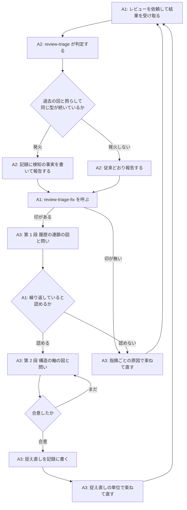

# レビュー指摘の繰り返しを検知して俯瞰する工程 - Plan

## Goal Capsule

- **目的**: `review-triage` と `review-triage-fix` に「同じ型の指摘が続いていることの検知」と「図を使った俯瞰による問題の捉え直し」の工程を足し、レビューと修正の繰り返しがどの記録でも 5 回以内で収束するようにする。
- **製品面の正本**: この文書。上流レビュアへの依頼文の変更、全量レビューと増分レビューの使い分けの運用、原因の種類を分類する語彙は、この計画の対象ではない (Scope Boundaries を参照)。
- **未解決の障害**: 無し。

---

## Product Contract

### Summary

`review-triage` が判定の報告時に「修正が次の指摘を生む連鎖」に入ったことを検知して記録に印を残す。`review-triage-fix` はその印を見たら、原因を束ねる前に 2 段の図 (履歴の連鎖、次に構造の軸) を人間に見せ、問いだけを投げて確認し、合意した捉え直しを記録に書いてから、その単位で直す。

### Problem Frame

トリアージ記録 6 件のうち 5 件は 3〜5 回で収束したが、1 件 (`docs/review-triage/fix-triagecheck-explicit-path-must-exist.yaml`) は 17 回かかった。この記録では、回 7 の全量レビューで「経路によって契約が違う」という型に名前が付いたにもかかわらず、回 14 まで同じ型の指摘が続いた。修正のたびに「規則 × 経路 × フラグ」の表の空いたマスを 1 つ埋め、レビューは次の空いたマスを見つけた。修正の単位が「表そのもの」に変わったのは回 14 で、そこで型は止まった。

つまり、型に名前を付けることと、修正の単位を捉え直すことは別の作業で、前者だけでは収束しない。捉え直しが起きたのは、人間が図で関係を確認していく対話の中で、Claude が自分から新しい形に気づいたときだった。

既存の規範には「採択が同じファイルの同じ関数を指す回が 2 回続いたら、次の修正の前に表を書く」という規則が `review-triage/skills/review-triage/references/record-schema.md` にある。しかし、この規則はどのスキルのどの手順が発火させるかを持たず、記録にも残らないため、人間が気づかなければ働かない。

### Key Decisions

- **検知は `review-triage` が報告時にスキルの読みで判断する** (session-settled: user-directed — chosen over 記録からの機械検出・回数の固定・人間の判断: 「修正由来」という型はファイルと行の一致では捕まらず、回数の固定では誤検知が多い)。Governs R1, R2, R3.
- **発火の根拠は「修正由来の指摘が 2 回連続」を主、「同じ場所への採択が 2 回連続」を補助にする** (session-settled: user-approved — chosen over 主の条件だけ・補助だけ・原因の種類の分類を加える: 長引いた記録で実際に起きたのは修正が次の指摘を生む連鎖で、補助は読みが外れたときの下限の網)。Governs R2.
- **検知は `review-triage`、俯瞰は `review-triage-fix` の冒頭が受け持つ** (session-settled: user-directed — chosen over 両方を triage が持つ・第 3 のスキルに切り出す: 「判断まで、修正しない」と「原因を確かめて束ねる」の境目を動かさない)。Governs R3, R4.
- **図は 2 段で出す。先に履歴の連鎖、次に構造の軸** (session-settled: user-directed — chosen over 構造だけ・履歴だけ・型に応じてスキルが選ぶ: 繰り返していることを人間と確認してから、根本の形を探す)。Governs R6, R7.
- **図に添えるのは問いだけで、スキルの見立ては出さない** (session-settled: user-directed — chosen over 要素ごとに順に確認する・見立てを出して自由に話す: 人間が確認していく余白で Claude が新しい形に気づく、という経験を手順として守る)。Governs R8.
- **捉え直しは記録 YAML に書き、`review-triage-fix` が必ず読む** (session-settled: user-directed — chosen over 会話で渡す・別の文書に残す: 2 つのスキルの受け渡しは記録だけ、という現在の契約を保つ)。Governs R9, R10.
- **俯瞰は人間の回答を待って止まる。自動化は将来の課題にする** (session-settled: user-approved — chosen over 発火時も止まらず進む: 誤検知のときに 1 回の対話を払う代償は現時点では受け入れる)。Governs R5.

### Actors

- A1. 人間 — レビューの依頼、トリアージ、修正の繰り返しを回す。俯瞰の図を見て、関係が合っているかを答える。
- A2. `review-triage` — 指摘を判定し、記録に追記する。この計画で「繰り返しの検知」を担う。
- A3. `review-triage-fix` — 採択を原因で束ねて直す。この計画で「俯瞰と捉え直し」を担う。
- A4. `mermaid-preview` — 図を HTML にして人間に見せる。別プラグインで、無くても進む。

### Requirements

**検知 (`review-triage`)**

- R1. `review-triage` は、判定を終えて報告するとき、今回の採択と過去の回の記録を照らして「同じ型の指摘が続いているか」を判断する。過去の回が無い記録では判断しない。
- R2. 次のどちらかを満たしたら発火する。主の条件は、今回の採択に「原因が直前の回の修正作業にある指摘」(修正由来の指摘) があり、それが直前の回にもあったこと。補助の条件は、今回の採択が直前の回の採択と同じファイルの同じ関数または同じ節を指すこと。
- R3. 発火したら、記録のその回に検知の事実 (どの条件で、今回のどの指摘と過去のどの問題または指摘を根拠にしたか) を書き、報告にも出す。`review-triage` は俯瞰を行わず、`review-triage-fix` も呼ばない。検知は回ごとに行い、俯瞰を経た後でも条件を満たせば再び発火する。

**俯瞰 (`review-triage-fix`)**

- R4. `review-triage-fix` は、入力を読んだ後、対象の回に検知の印があれば、原因を確かめて束ねる前に俯瞰を行う。印が無ければ従来どおり進む。
- R5. 俯瞰は人間の回答を待って進む。回答が無いまま束ねや修正に進まない。
- R6. 第 1 段として、回ごとの「指摘 → 修正 → 次の指摘」を辺でつないだ履歴の図を出し、繰り返していると人間が認めるかを問う。認めなければ俯瞰を終え、その旨を記録に残して従来どおり進む。
- R7. 第 2 段として、同じ入力が別々に処理される軸 (規則 × 経路、正本 × 複製など) を取り出し、埋まっているマスと空いているマスを示した構造の図を出す。
- R8. 図に添える問いは「この関係は合っているか」「違和感のあるところはどこか」のような確認にとどめ、「源はここだ」「こう直すべきだ」というスキルの見立ては出さない。人間の答えで図を直し、合意するまで繰り返す。
- R9. 合意した捉え直し (繰り返しの型の名前、軸、根本の原因、修正の単位) を記録のその回に書く。書いてから束ねる。
- R10. 捉え直しがある回では、指摘ごとの原因より捉え直しの原因を優先して束ね、修正の単位を捉え直しの単位にする。同じ原因の別の現れは、指摘されていなくても既存の調査手順に従って含める。
- R11. 図の生成と表示は `mermaid-preview` に任せる。無ければ Markdown の表と箇条書きで同じ 2 段を出す。図は正本ではなく、Markdown があれば俯瞰は完了する。

**記録と規範**

- R12. 記録の様式に検知の事実と捉え直しを書く場所を足し、同梱の検査ツールがその形を検査し、生成サマリにも出す。
- R13. 既存の「同じ場所への採択が 2 回続いたら表を書く」規則は、この俯瞰の工程に統合し、正本を 1 か所にする。

### Key Flows

- F1. 検知から捉え直し、修正まで
  - **Trigger:** A1 が別セッションのレビュー結果を渡して `review-triage` を実行する。
  - **Actors:** A1, A2, A3, A4
  - **Steps:** A2 が判定し、過去の回と照らして発火する (R1, R2)。A2 が記録に検知の事実を書いて報告する (R3)。A1 が `review-triage-fix` を呼ぶ。A3 が検知の印を見て、第 1 段の図と問いを出す (R4, R6)。A1 が繰り返していると認める。A3 が第 2 段の図と問いを出し、A1 の答えで図を直す (R7, R8)。合意した捉え直しを A3 が記録に書く (R9)。A3 がその単位で束ね、調査し、直す (R10)。
  - **Outcome:** 修正の単位が「表の 1 マス」ではなく「表そのもの」になり、次の回で同じ型の指摘が出ない。
- F2. 検知したが人間が繰り返しを認めない
  - **Trigger:** F1 と同じ経路で第 1 段の図が出る。
  - **Actors:** A1, A3
  - **Steps:** A1 が「繰り返しではない」と答える。A3 が記録にその旨を残し、俯瞰を終える (R6)。A3 が従来どおり指摘ごとの原因で束ねて直す。
  - **Outcome:** 誤検知が 1 回の対話で済み、記録には検知と否定の両方が残る。

### Acceptance Examples

- AE1. 遡って当てると回 3 で発火する
  - **Covers R1, R2.**
  - **Given:** 17 回の記録 (`docs/review-triage/fix-triagecheck-explicit-path-must-exist.yaml`) の回 1〜3。回 2 の採択 1・2 の原因は回 1 の修正 (不在をエラーにした・基準を `$PWD` にした) にあり、回 3 の採択 1 の原因は回 2 の修正 (ラッパーに `-current-dir` を焼き込んだ) にある。
  - **When:** 回 3 の判定を終えて報告する。
  - **Then:** 主の条件で発火し、回 3 の記録に「修正由来の指摘が回 2 と回 3 で連続」と、根拠の指摘と問題が書かれる。
- AE2. 過去の回が無ければ発火しない
  - **Covers R1.**
  - **Given:** 記録に回 1 しか無い。
  - **When:** 回 1 の判定を終えて報告する。
  - **Then:** 検知の判断を行わず、記録にも報告にも検知の項目は出ない。
- AE3. 補助の条件だけで発火する
  - **Covers R2.**
  - **Given:** 直前の回と今回の採択がどちらも同じファイルの同じ関数を指すが、今回の指摘の原因は直前の回の修正作業ではない。
  - **When:** 今回の判定を終えて報告する。
  - **Then:** 補助の条件で発火し、記録にその条件と対象の指摘が書かれる。
- AE4. 人間が繰り返しを認めない
  - **Covers R4, R5, R6.**
  - **Given:** 対象の回に検知の印がある。
  - **When:** `review-triage-fix` が第 1 段の図を出し、人間が「繰り返しではない」と答える。
  - **Then:** 記録に検知とその否定が残り、捉え直しは書かれず、指摘ごとの原因で束ねて直す。
- AE5. 合意した捉え直しが束ねる単位になる
  - **Covers R8, R9, R10.**
  - **Given:** 第 2 段で「規則 × 経路」の軸を出し、人間の答えで図を直して合意した。
  - **When:** `review-triage-fix` が束ねる。
  - **Then:** 記録のその回に捉え直しが書かれ、修正計画の原因は捉え直しを指し、今回の採択に無い同じ原因の別の現れも同じ問題に含まれる。スキルの発話には「源はここだ」「こう直すべきだ」という見立てが含まれない。
- AE6. `mermaid-preview` が無い
  - **Covers R11.**
  - **Given:** `mermaid-preview` プラグインが入っていない。
  - **When:** 俯瞰の第 1 段を出す。
  - **Then:** Markdown の表と箇条書きで履歴の連鎖を出し、図が無いことを報告に書いて俯瞰を続ける。

### Success Criteria

- 次に長引く記録が出たとき、推移の表の行数が 5 以下で収束する。収束とは、増分レビューで採択 0 件に到達し、最終確認の全量レビューを経て未処理の採択が無い状態を指す。
- 発火して捉え直しを書いた後の回で、同じ型の指摘が 2 回以上続かない。
- 17 回の記録に遡って当てたとき、遅くとも回 3 で発火する (AE1)。

### Scope Boundaries

**後回しにするもの**

- 俯瞰の自動化 (人間の回答を待たずに捉え直しまで進める)。まず人間を挟む形で効果を確かめてから決める。
- 原因の種類を分類する語彙を持ち、種類の再出現で発火すること。語彙の維持の費用が効果の確認より先に立つため。
- 同梱の検査ツールによる機械的な検知。検知は当面スキルの読みに任せる。

**この計画で扱わないもの**

- 上流レビュアへの依頼文の変更 (前回の修正計画の原因をレビュアに渡して同じ型を明記させる案)。判断を上流に持たせると、もっともらしい分類で誤る問題が上流に移るだけになる。
- 全量レビューと増分レビューの使い分けの運用。17 回の記録では全量が 5 回使われたが、修正が多くなった後に全量へ戻すのが妥当な場合もあり、規則の見直しは別の作業にする。

### Dependencies / Assumptions

- 「図を人間と確認していく対話が新しい捉え直しを生む」は経験則で、記録には図を使った痕跡が残っていない。この計画はその経験則を前提にする。
- 「修正由来」の判断はスキルの読みに頼る。記録の修正計画の原因の文には、直前の問題の識別子を挙げて「〜を直したときに対象に入れなかった」と書く例が既にあり、読みの手がかりになる。
- `mermaid-preview` は別プラグインで、無くても進む (R11)。

### Outstanding Questions

**Deferred to Planning**

- 記録の様式に足す検知と捉え直しの項目の形 (キー、必須の別、検査ツールが見る整合)。
- 「直前の回」の取り方。増分と全量が交互に入るとき、比べる相手を直前の 1 回にするか、同じ scope の直前の回にするか。
- 検知の判断に読ませる過去の回の範囲 (直前の 1 回だけか、全回か)。

### Sources / Research

- トリアージ記録 6 件: `docs/review-triage/` 配下。推移の表と、17 回の記録の回 7〜14 の修正計画の原因の文。
- 既存の収束の目安と「2 回続いたら表を書く」規則: `review-triage/skills/review-triage/references/record-schema.md` の「生成サマリの読み方」。
- 「経路ごとに規則を書くと収束しない」の実例: `docs/solutions/tooling-decisions/require-explicit-basis-for-relative-paths.md`。
- 束ねる基準と直す前の調査: `review-triage/skills/review-triage-fix/references/grouping.md`、同 `investigation.md`。
- 保留の提示で図を使う既存の形: `review-triage/skills/review-triage/references/hold-presentation.md`。
