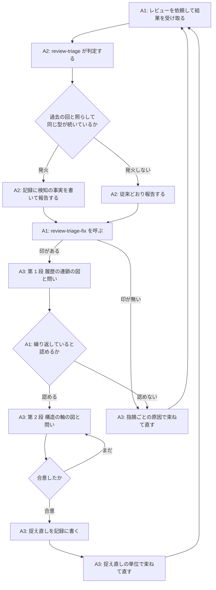
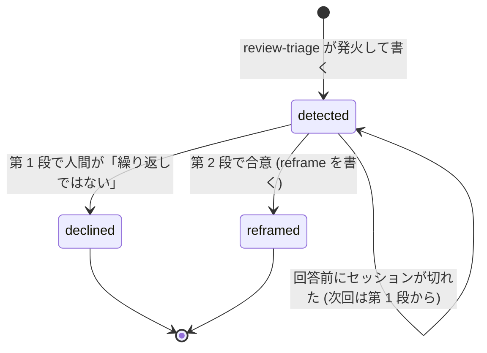
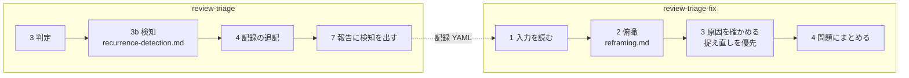

# レビュー指摘の繰り返しを検知して俯瞰する工程 - Plan

## Goal Capsule

- **目的**: `review-triage` と `review-triage-fix` に「同じ型の指摘が続いていることの検知」と「図を使った俯瞰による問題の捉え直し」の工程を足し、レビューと修正の繰り返しがどの記録でも 5 回以内で収束するようにする。
- **正本の優先順位**: 製品の振る舞いは Product Contract の R-ID が正本。実装の選び方は Planning Contract の KTD が正本。実装単位 (U-ID) はどちらも書き換えない。
- **止まる条件**: 記録の様式の変更が過去 6 件の記録を検査で赤くする場合、書き換えずに止めて報告する。設計の選択肢が複数あり規範を変える場合は、決めずに人間に返す。
- **実行の型**: 検査ツール (Go) はテストを先に書いて固める。スキルの手順書 (Markdown) は手動の通し確認で確かめる。
- **後始末の所有**: この計画の PR は人間が作る。コミットは動機ごとに分ける (規範は利用者のコミットルール)。
- **Product Contract の保全**: 変更あり — R8 (人間が出せないときはスキルが見立てを出す) は計画の確認で利用者が指示した変更。R3 は「指摘」を「採択」に統一 (意味の明確化、範囲は不変)。AE5 は R8 に合わせて更新。AE7・AE8 を追加 (流れの分析で見つかった境界条件)。

---

## Product Contract

### Summary

`review-triage` が判定の報告時に「修正が次の指摘を生む連鎖」に入ったことを検知して記録に印を残す。`review-triage-fix` はその印を見たら、原因を束ねる前に 2 段の図 (履歴の連鎖、次に構造の軸) を人間に見せ、問いで確認し、合意した捉え直しを記録に書いてから、その単位で直す。

### Problem Frame

トリアージ記録 6 件のうち 5 件は 3〜5 回で収束したが、1 件 (`docs/review-triage/fix-triagecheck-explicit-path-must-exist.yaml`) は 17 回かかった。この記録では、回 7 の全量レビューで「経路によって契約が違う」という型に名前が付いたにもかかわらず、回 14 まで同じ型の指摘が続いた。修正のたびに「規則 × 経路 × フラグ」の表の空いたマスを 1 つ埋め、レビューは次の空いたマスを見つけた。修正の単位が「表そのもの」に変わったのは回 14 で、そこで型は止まった。

つまり、型に名前を付けることと、修正の単位を捉え直すことは別の作業で、前者だけでは収束しない。捉え直しが起きたのは、人間が図で関係を確認していく対話の中で、Claude が自分から新しい形に気づいたときだった。

既存の規範には「採択が同じファイルの同じ関数を指す回が 2 回続いたら、次の修正の前に表を書く」という規則が `review-triage/skills/review-triage/references/record-schema.md` にある。しかし、この規則はどのスキルのどの手順が発火させるかを持たず、記録にも残らないため、人間が気づかなければ働かない。

### Key Decisions

- **検知は `review-triage` が報告時にスキルの読みで判断する** (session-settled: user-directed — chosen over 記録からの機械検出・回数の固定・人間の判断: 「修正由来」という型はファイルと行の一致では捕まらず、回数の固定では誤検知が多い)。Governs R1, R2, R3.
- **発火の根拠は「修正由来の指摘が 2 回連続」を主、「同じ場所への採択が 2 回連続」を補助にする** (session-settled: user-approved — chosen over 主の条件だけ・補助だけ・原因の種類の分類を加える: 長引いた記録で実際に起きたのは修正が次の指摘を生む連鎖で、補助は読みが外れたときの下限の網)。Governs R2.
- **検知は `review-triage`、俯瞰は `review-triage-fix` の冒頭が受け持つ** (session-settled: user-directed — chosen over 両方を triage が持つ・第 3 のスキルに切り出す: 「判断まで、修正しない」と「原因を確かめて束ねる」の境目を動かさない)。Governs R3, R4.
- **図は 2 段で出す。先に履歴の連鎖、次に構造の軸** (session-settled: user-directed — chosen over 構造だけ・履歴だけ・型に応じてスキルが選ぶ: 繰り返していることを人間と確認してから、根本の形を探す)。Governs R6, R7.
- **図に添えるのは問いが先で、見立ては人間が出せないときだけ出す** (session-settled: user-directed — chosen over 常に見立てを出さない・最初から見立てを出す: 人間が確認していく余白で Claude が新しい形に気づく経験を守りつつ、対話から何も出ないときに止まらない)。Governs R8.
- **捉え直しは記録 YAML に書き、`review-triage-fix` が必ず読む** (session-settled: user-directed — chosen over 会話で渡す・別の文書に残す: 2 つのスキルの受け渡しは記録だけ、という現在の契約を保つ)。Governs R9, R10.
- **俯瞰は人間の回答を待って止まる。自動化は将来の課題にする** (session-settled: user-approved — chosen over 発火時も止まらず進む: 誤検知のときに 1 回の対話を払う代償は現時点では受け入れる)。Governs R5.

### Actors

- A1. 人間 — レビューの依頼、トリアージ、修正の繰り返しを回す。俯瞰の図を見て、関係が合っているかを答える。
- A2. `review-triage` — 指摘を判定し、記録に追記する。この計画で「繰り返しの検知」を担う。
- A3. `review-triage-fix` — 採択を原因で束ねて直す。この計画で「俯瞰と捉え直し」を担う。
- A4. `mermaid-preview` — 図を HTML にして人間に見せる。別プラグインで、無くても進む。

### Requirements

**検知 (`review-triage`)**

- R1. `review-triage` は、判定を終えて報告するとき、今回の採択と過去の回の記録を照らして「同じ型の指摘が続いているか」を判断する。過去の回が無い記録では判断しない。
- R2. 次のどちらかを満たしたら発火する。主の条件は、今回の採択に「原因が直前の回の修正作業にある指摘」(修正由来の指摘) があり、それが直前の回にもあったこと。補助の条件は、今回の採択が直前の回の採択と同じファイルの同じ関数または同じ節を指すこと。
- R3. 発火したら、記録のその回に検知の事実 (どの条件で、今回のどの採択と過去のどの問題または採択を根拠にしたか) を書き、報告にも出す。`review-triage` は俯瞰を行わず、`review-triage-fix` も呼ばない。検知は回ごとに行い、俯瞰を経た後でも条件を満たせば再び発火する。

**俯瞰 (`review-triage-fix`)**

- R4. `review-triage-fix` は、入力を読んだ後、対象の回に検知の印があれば、原因を確かめて束ねる前に俯瞰を行う。印が無ければ従来どおり進む。
- R5. 俯瞰は人間の回答を待って進む。回答が無いまま束ねや修正に進まない。
- R6. 第 1 段として、回ごとの「指摘 → 修正 → 次の指摘」を辺でつないだ履歴の図を出し、繰り返していると人間が認めるかを問う。認めなければ俯瞰を終え、その旨を記録に残して従来どおり進む。
- R7. 第 2 段として、同じ入力が別々に処理される軸 (規則 × 経路、正本 × 複製など) を取り出し、埋まっているマスと空いているマスを示した構造の図を出す。
- R8. 図に添える問いは「この関係は合っているか」「違和感のあるところはどこか」のような確認にとどめ、人間の答えで図を直し、合意するまで繰り返す。人間が「出せない」「分からない」と答えたとき、または問いが尽きて確認が進まなくなったときに限り、スキルは自分の見立て (繰り返しの源と修正の単位の案) を見立てだと明示して出し、人間が認めた場合だけ捉え直しにする。
- R9. 合意した捉え直し (繰り返しの型の名前、軸、根本の原因、修正の単位、人間の確認から出たかスキルの見立てから出たか) を記録のその回に書く。書いてから束ねる。
- R10. 捉え直しがある回では、指摘ごとの原因より捉え直しの原因を優先して束ね、修正の単位を捉え直しの単位にする。同じ原因の別の現れは、指摘されていなくても既存の調査手順に従って含める。捉え直しの型に当たらない採択は、既存の束ねる基準に従って別の問題にする。
- R11. 図の生成と表示は `mermaid-preview` に任せる。無い、または途中で失敗したときは、その段から Markdown の表と箇条書きで同じ内容を出す。図は正本ではなく、Markdown があれば俯瞰は完了する。

**記録と規範**

- R12. 記録の様式に検知の事実と捉え直しを書く場所を足し、同梱の検査ツールがその形を検査し、生成サマリにも出す。項目が無い過去の記録は検査を通る。
- R13. 既存の「同じ場所への採択が 2 回続いたら表を書く」規則は、この俯瞰の工程に統合し、正本を 1 か所にする。

### Key Flows

- F1. 検知から捉え直し、修正まで
  - **Trigger:** A1 が別セッションのレビュー結果を渡して `review-triage` を実行する。
  - **Actors:** A1, A2, A3, A4
  - **Steps:** A2 が判定し、過去の回と照らして発火する (R1, R2)。A2 が記録に検知の事実を書いて報告する (R3)。A1 が `review-triage-fix` を呼ぶ。A3 が検知の印を見て、第 1 段の図と問いを出す (R4, R6)。A1 が繰り返していると認める。A3 が第 2 段の図と問いを出し、A1 の答えで図を直す (R7, R8)。合意した捉え直しを A3 が記録に書く (R9)。A3 がその単位で束ね、調査し、直す (R10)。
  - **Outcome:** 修正の単位が「表の 1 マス」ではなく「表そのもの」になり、次の回で同じ型の指摘が出ない。
- F2. 検知したが人間が繰り返しを認めない
  - **Trigger:** F1 と同じ経路で第 1 段の図が出る。
  - **Actors:** A1, A3
  - **Steps:** A1 が「繰り返しではない」と答える。A3 が記録にその旨を残し、俯瞰を終える (R6)。A3 が従来どおり指摘ごとの原因で束ねて直す。
  - **Outcome:** 誤検知が 1 回の対話で済み、記録には検知と否定の両方が残る。



### Acceptance Examples

- AE1. 遡って当てると回 3 で発火する
  - **Covers R1, R2.**
  - **Given:** 17 回の記録 (`docs/review-triage/fix-triagecheck-explicit-path-must-exist.yaml`) の回 1〜3。回 2 の採択 1・2 の原因は回 1 の修正 (不在をエラーにした・基準を `$PWD` にした) にあり、回 3 の採択 1 の原因は回 2 の修正 (ラッパーに `-current-dir` を焼き込んだ) にある。
  - **When:** 回 3 の判定を終えて報告する。
  - **Then:** 主の条件で発火し、回 3 の記録に「修正由来の指摘が回 2 と回 3 で連続」と、根拠の採択と問題が書かれる。記録は書き換えず、検証用の読み取りとして確かめる。
- AE2. 過去の回が無ければ発火しない
  - **Covers R1.**
  - **Given:** 記録に回 1 しか無い。
  - **When:** 回 1 の判定を終えて報告する。
  - **Then:** 検知の判断を行わず、記録にも報告にも検知の項目は出ない。
- AE3. 補助の条件だけで発火する
  - **Covers R2.**
  - **Given:** 直前の回と今回の採択がどちらも同じファイルの同じ関数を指すが、今回の指摘の原因は直前の回の修正作業ではない。
  - **When:** 今回の判定を終えて報告する。
  - **Then:** 補助の条件で発火し、記録にその条件と対象の採択が書かれる。
- AE4. 人間が繰り返しを認めない
  - **Covers R4, R5, R6.**
  - **Given:** 対象の回に検知の印がある。
  - **When:** `review-triage-fix` が第 1 段の図を出し、人間が「繰り返しではない」と答える。
  - **Then:** 記録に検知とその否定が残り、捉え直しは書かれず、指摘ごとの原因で束ねて直す。
- AE5. 合意した捉え直しが束ねる単位になる
  - **Covers R8, R9, R10.**
  - **Given:** 第 2 段で「規則 × 経路」の軸を出し、人間の答えで図を直して合意した。
  - **When:** `review-triage-fix` が束ねる。
  - **Then:** 記録のその回に捉え直しが「人間の確認から出た」印つきで書かれ、修正計画の原因は捉え直しを指し、今回の採択に無い同じ原因の別の現れも同じ問題に含まれる。人間が「出せない」と言うまで、スキルの発話には「源はここだ」「こう直すべきだ」という見立てが含まれない。
- AE6. `mermaid-preview` が無い
  - **Covers R11.**
  - **Given:** `mermaid-preview` プラグインが入っていない。
  - **When:** 俯瞰の第 1 段を出す。
  - **Then:** Markdown の表と箇条書きで履歴の連鎖を出し、図が無いことを報告に書いて俯瞰を続ける。
- AE7. 未処理の検知の印が 2 つの回に溜まっている
  - **Covers R4, R5.**
  - **Given:** 回 3 と回 4 に検知の印があり、どちらも捉え直しも否定も書かれていない (人間が `review-triage-fix` を呼ばずにレビューを回した)。
  - **When:** `review-triage-fix` を呼ぶ。
  - **Then:** 回 3 の印を対象に俯瞰を始め、回 4 の印が残っていることを報告する。回 3 の俯瞰が済んでから回 4 の印を扱う。
- AE8. 捉え直しの後の回で同じ型を照らす
  - **Covers R2, R3.**
  - **Given:** 回 5 に「規則 × 経路」の捉え直しが書かれ、その単位で修正した。回 6 の採択に、その表の別の空いたマスを指す指摘がある。
  - **When:** 回 6 の判定を終えて報告する。
  - **Then:** 主の条件は回 5 の修正作業ではなく回 5 の捉え直しの軸と照らして判断し、発火する。記録の根拠には回 5 の捉え直しを指す。

### Success Criteria

- 次に長引く記録が出たとき、推移の表の行数が 5 以下で収束する。収束とは、増分レビューで採択 0 件に到達し、最終確認の全量レビューを経て未処理の採択が無い状態を指す。
- 発火して捉え直しを書いた後の回で、同じ型の指摘が 2 回以上続かない。
- 17 回の記録に遡って当てたとき、遅くとも回 3 で発火する (AE1)。記録は書き換えない。

### Scope Boundaries

**後回しにするもの**

- 俯瞰の自動化 (人間の回答を待たずに捉え直しまで進める)。まず人間を挟む形で効果を確かめてから決める。
- 原因の種類を分類する語彙を持ち、種類の再出現で発火すること。語彙の維持の費用が効果の確認より先に立つため。
- 同梱の検査ツールによる機械的な検知。検知は当面スキルの読みに任せる。
- 「見立てを先に出さない」という振る舞いを自動で確かめる仕組み (評価用の台本や検査)。当面は人間が対話を読んで確かめる。

**この計画で扱わないもの**

- 上流レビュアへの依頼文の変更 (前回の修正計画の原因をレビュアに渡して同じ型を明記させる案)。判断を上流に持たせると、もっともらしい分類で誤る問題が上流に移るだけになる。
- 全量レビューと増分レビューの使い分けの運用。17 回の記録では全量が 5 回使われたが、修正が多くなった後に全量へ戻すのが妥当な場合もあり、規則の見直しは別の作業にする。
- 回答が無いまま放置された俯瞰を自動で決着させること。既存の選択待ち (`awaiting-human`) と同じく、スキルは人間の代わりに決めない。

#### Deferred to Follow-Up Work

- 実装後に、俯瞰の対話が実際に捉え直しを生んだかを `ce-compound` で学びとして残す (人間の確認と見立ての使い分け、任意プラグインの失敗時の切り替え方)。
- このリポジトリ自身の `review-triage` 用の設定ファイル (記録の置き場・検査コマンド・サマリ生成コマンド) は未設定で、検査は手で `go run` している。設定を置く作業は別にする。

### Dependencies / Assumptions

- 「図を人間と確認していく対話が新しい捉え直しを生む」は経験則で、記録には図を使った痕跡が残っていない。この計画はその経験則を前提にする。
- 「修正由来」の判断はスキルの読みに頼る。記録の修正計画の原因の文には、直前の問題の識別子を挙げて「〜を直したときに対象に入れなかった」と書く例が既にあり、読みの手がかりになる。
- `mermaid-preview` は別プラグインで、無くても進む (R11)。

### Sources / Research

- トリアージ記録 6 件: `docs/review-triage/` 配下。推移の表と、17 回の記録の回 7〜14 の修正計画の原因の文。
- 既存の収束の目安と「2 回続いたら表を書く」規則: `review-triage/skills/review-triage/references/record-schema.md` の「生成サマリの読み方」。
- 「経路ごとに規則を書くと収束しない」の実例: `docs/solutions/tooling-decisions/require-explicit-basis-for-relative-paths.md`。
- 束ねる基準と直す前の調査: `review-triage/skills/review-triage-fix/references/grouping.md`、同 `investigation.md`。
- 保留の提示で図を使う既存の形: `review-triage/skills/review-triage/references/hold-presentation.md`。
- 記録に項目を足した前例: `investigation` (コミット `9a4b4ac`・`6126c54`) と `done-external` (コミット `0571013`・`495f4a0`)。いずれも `record-schema.md`・`record.go`・`record_test.go` の 3 ファイルを同じ動機で変えている。
- エージェントが組み立てる構造化データの扱い: `docs/solutions/design-patterns/typed-contract-for-agent-input.md`、`docs/solutions/architecture-patterns/fail-soft-by-data-class.md`。

---

## Planning Contract

### Key Technical Decisions

- KTD1. **検知と捉え直しは回 (`runs[]`) の直下に 1 つの構造 `recurrence` として持つ。** 俯瞰は修正計画 (`plans[]`) を作る前に起きるので、修正計画の下には置けない。`review-triage` が `status: detected` で書き、`review-triage-fix` が `declined` か `reframed` に更新する。`plans` と同じく「書き換えない範囲」の例外にする。Governs R3, R9, R12。
- KTD2. **`recurrence` は任意の項目で、無いことは「検知なし」を意味する。キーだけあって値が無い形は検査で報告する。** 過去 6 件の記録を書き換えずに検査を通すため。null の扱いは `investigation` の前例 (ポインタで有無を持つ) と同じにする。Governs R12。
- KTD3. **検知の根拠は構造化して残す。** 条件 (`fix-derived` / `same-location`)、今回の採択の id、比べた回の番号、比べた先 (問題の識別子か採択の id)、理由の 1 文を 1 件ごとに書く。誤検知を後から監査する経路がこれしかないため、自由記述 1 つにしない。Governs R3。
- KTD4. **比べる相手は scope を問わない直前の 1 回。直前の回に `status: reframed` の捉え直しがあれば、修正作業ではなく捉え直しの軸と照らす。** 同じ scope の直前回に限ると増分と全量が交互のとき比較相手が遠くなる。Governs R2 (AE8)。
- KTD5. **俯瞰の途中の状態は記録に持たない。** `status: detected` のまま捉え直しも否定も無い回を「未処理」と読み、`review-triage-fix` は最も古い未処理の回から 1 つずつ、毎回第 1 段からやり直す。選択待ち (`awaiting-human`) のような専用の状態を足すより、状態の種類を増やさないほうを取る。Governs R4, R5 (AE7)。
- KTD6. **判断の中身はスキルごとに参照文書 1 つを正本にし、手順書は短く引く。** `review-triage` には `references/recurrence-detection.md`、`review-triage-fix` には `references/reframing.md`。既存の `judgment-flow.md` と `hold-presentation.md` の役割分担に倣う。判定フローの図 (`judgment-flow.md`) と検査 (`judgment_flow.go`) には触れない。検知は判定フローの後に行う別の判断だからである。Governs R13。
- KTD7. **図の生成と失敗時の扱いは `hold-presentation.md` の形を写す。** Markdown が正本、HTML は任意の表示形式、`mermaid-preview` が無いか失敗したら Markdown で続ける。未導入と実行時の失敗を区別して報告する。Governs R11。
- KTD8. **既存の「2 回続いたら表を書く」の段落は削り、参照文書へ誘導する 1 文に置き換える。** 同じ規則を 2 か所に持つと片方だけ更新される。Governs R13。
- KTD9. **スキルの振る舞い (発火の判断、問いが先で見立ては後) の確認は、17 回の記録を使った手動の通し確認にする。** 検査ツールは記録の形しか検査できない。自動の評価は後回しの項目にする。

### High-Level Technical Design

`recurrence` の状態遷移。`review-triage` が作り、`review-triage-fix` が閉じる。



`recurrence` の形 (方向を示す下書きであって、キーの正本は U1 で書く `record-schema.md`)。

```yaml
recurrence:
  status: detected            # detected / declined / reframed
  evidence:                   # 1 件以上
    - condition: fix-derived  # fix-derived / same-location
      finding_id: 1           # 今回の採択
      prior_run: 2            # 比べた回
      prior: P6               # 比べた先 (問題の識別子か「指摘 3」)
      reason: "..."           # 1 文
  declined_reason: ""         # status: declined のとき必須
  reframe:                    # status: reframed のとき必須
    pattern: "経路によって契約が違う"
    axes: "規則 × 経路 × フラグ"
    root_cause: "..."
    fix_unit: "..."
    source: human             # human / skill (見立て由来)
```

2 つのスキルの手順の中で、新しい手順がどこに入るか。



### Assumptions

- スキルの手順書に手順を挿入すると番号がずれる。番号を引用している参照文書 (`investigation.md` など) をすべて直す。

### Sequencing

U1 (記録の様式と検査) が先。U2 (検知) と U3 (俯瞰) は U1 に依存し、互いには依存しない。U4 (README と用語の整合) は最後。

---

## Implementation Units

### U1. 記録の様式に `recurrence` を足し、検査ツールで形を検査してサマリに出す

- **Goal:** 検知と捉え直しを記録に書ける様式を定め、検査ツールが形を検査し、生成サマリに表示する。
- **Requirements:** R3, R9, R12。KTD1, KTD2, KTD3。
- **Dependencies:** 無し。
- **Files:**
  - `review-triage/skills/review-triage/references/record-schema.md` (スキーマ表に `recurrence` とその下位の表を足す。「書き換えない範囲」の例外に `recurrence` の更新を足す。キーを散文で数え上げない)
  - `review-triage/tools/triagecheck/record.go` (構造体、`recordAllowedKeys` の階層 `"検知"`・`"根拠"`・`"捉え直し"`、`recordUnknownKeyProblems` の未知キー検出に `recurrence` 配下の分岐を足す、`recordNullSilentKeys` に `recurrence` を足す、`recordSemanticProblems` の検査、サマリ描画)
  - `review-triage/tools/triagecheck/record_test.go`
  - `review-triage/tools/triagecheck/README.md` (「何を検査するか」の `review-triage-record` の行に検査項目を足す)
- **Approach:**
  1. `recordRun` に `Recurrence *recordRecurrence` を足す。ポインタで有無を持ち、null は「値の無い構造キー」として報告する (`investigation` と同じ)。
  2. 検査: `status` は 3 値の列挙。`evidence` は 1 件以上で、各件の `condition` は 2 値、`finding_id` は同じ回の採択の id を指す、`prior_run` は 1 以上かつ自回より小さい。`declined` なら `declined_reason` 必須、`reframed` なら `reframe` 必須で `source` は 2 値。
  3. サマリ: 推移の表に列を足さず、回ごとの節に「検知」の小節を出す。状態、根拠の一覧、捉え直し (あれば) を表の外に出す。生成物の見出しは既存の「修正計画」「観察」に倣う。
  4. `record-schema.md` はスキーマ表に足すだけにし、意味の説明は各キーの行に書く。
- **Execution note:** 検査とサマリの契約は、テストを先に書いてから実装する。
- **Patterns to follow:** `investigation` の追加 (ポインタ、null 検出、表の外への描画、`TestReviewTriageRecordInvestigationPasses` / `TestReviewTriageSummaryInvestigation`)。`awaiting-human` の必須項目の検査 (`options` の扱い)。
- **Test scenarios:**
  - 有効な `recurrence` (detected / declined / reframed の 3 状態) を持つ記録が検査を通る。
  - `recurrence` の無い記録 (過去 6 件の実記録を含む) が検査を通る。
  - `recurrence:` とだけ書いて値が無い記録が「値の無い構造キー」として報告される。
  - `status` が列挙の外、`evidence` が空、`condition` が列挙の外、`finding_id` が採択でない指摘を指す、`prior_run` が自回以上、のそれぞれが報告される。
  - `declined` で `declined_reason` が無い、`reframed` で `reframe` が無い、`reframe.source` が列挙の外、のそれぞれが報告される。
  - 未知のキーを `recurrence` の下に書くと報告される。
  - サマリに検知の小節が出て、自由文字列の縦棒が無害化される (既存の `recordCell` の規則)。
  - `recurrence` の無い回にはサマリの小節が出ない。
- **Verification:** `review-triage/tools/triagecheck` で `go test ./...` が通る。`docs/review-triage` の実記録 6 件を検査して赤くならない。README の検査項目の行が実装と一致する。

### U2. `review-triage` に検知の手順と参照文書を足す

- **Goal:** 判定のあと報告の前に、直前の回と照らして繰り返しを検知し、記録に `recurrence` を書き、報告に出す。
- **Requirements:** R1, R2, R3, R13。KTD3, KTD4, KTD6, KTD8。AE1, AE2, AE3, AE8。
- **Dependencies:** U1。
- **Files:**
  - `review-triage/skills/review-triage/references/recurrence-detection.md` (新規。判断の正本)
  - `review-triage/skills/review-triage/SKILL.md` (手順 3 と 4 の間に検知の手順、手順 7 に報告の 1 文、前提知識に 1 行)
  - `review-triage/skills/review-triage/references/record-schema.md` (「生成サマリの読み方」の「2 回続いたら表を書く」段落を削り、参照文書への誘導 1 文に置き換える)
- **Approach:**
  1. 参照文書に、比べる相手 (直前の 1 回、scope を問わない)、過去の回が無ければ判断しないこと、主の条件 (修正由来: 今回の採択の原因が直前の回の `plans[].cause` の修正作業にある指摘が、直前の回にもある)、補助の条件 (同じファイルの同じ関数または同じ節)、直前の回に `reframed` があればその軸と照らすこと、根拠の書き方 (KTD3)、発火したときに記録へ書く内容と報告の形を書く。用語は `CONCEPTS.md` の定義を引き、言い直さない。
  2. 手順書には「判定の後、参照文書に従って検知し、発火したら記録の追記 (手順 4) に `recurrence` を含める」とだけ書く。条件を手順書で言い直さない。
  3. 報告 (手順 7) に「検知があれば、その条件と根拠を出し、`review-triage-fix` の俯瞰を案内する。勝手に呼ばない」を足す。
  4. `record-schema.md` の段落を置き換えるとき、`docs/solutions/tooling-decisions/require-explicit-basis-for-relative-paths.md` への言及は参照文書側へ移す。
- **Patterns to follow:** `hold-presentation.md` と手順 7 の関係 (手順書は短く引き、中身は参照文書)。`review-request.md` の「範囲の規則」の書き方。
- **Test scenarios:**
  - Covers AE1. 17 回の記録の回 3 までを入力に、参照文書の手順を手で当てると主の条件で発火し、根拠に回 2 の問題の識別子が挙がる。記録は書き換えない。
  - Covers AE2. 回 1 だけの記録では検知の判断を行わない。
  - Covers AE3. 修正由来ではないが同じ関数への採択が 2 回続く例 (17 回の記録の回 3〜5 の `wrapper.go`) で補助の条件が発火する。
  - Covers AE8. 直前の回に `reframed` があるとき、根拠がその捉え直しを指す。
  - 直前の回が全量、今回が増分でも、比べる相手は直前の 1 回になる。
  - `record-schema.md` を grep して「2 回続いたら」の規則が 1 か所 (参照文書) にしか無い。
- **Verification:** 手順書と参照文書を `doc-dag` に回して重複が無い。`CLAUDE.md` の言い回しの 3 原則に照らして不自然な語が無い。上の手動の通し確認を行い、結果を PR の本文に書く。

### U3. `review-triage-fix` に俯瞰の手順と参照文書を足す

- **Goal:** 入力を読んだ直後、未処理の `recurrence` があれば 2 段の図と問いで人間と確認し、捉え直しか否定を記録に書いてから束ねる。
- **Requirements:** R4, R5, R6, R7, R8, R9, R10, R11。KTD5, KTD6, KTD7。AE4, AE5, AE6, AE7。
- **Dependencies:** U1。
- **Files:**
  - `review-triage/skills/review-triage-fix/references/reframing.md` (新規。俯瞰の正本)
  - `review-triage/skills/review-triage-fix/SKILL.md` (手順 1 の直後に俯瞰の手順を挿入。以降の番号と、番号を引用している箇所を直す。原則に「見立ては人間が出せないときだけ」を足す)
  - `review-triage/skills/review-triage-fix/references/grouping.md` (束ねる基準に「捉え直しがあれば、その原因を指摘ごとの原因より優先する。型に当たらない採択は通常どおり」を足す)
  - `review-triage/skills/review-triage-fix/references/investigation.md`、`ordering.md`、`verification.md`、`committing.md` (手順番号の引用を直す)
- **Approach:**
  1. 参照文書に次を書く。対象の選び方 (`status: detected` で捉え直しも否定も無い最も古い回。複数あれば残りを報告して 1 つずつ)。第 1 段の図 (回ごとの指摘 → 修正計画 → 次の回の指摘を辺でつなぐ。根拠の `evidence` を辺にする) と問い (繰り返していると認めるか)。認めなければ `declined` と理由を書いて終える。第 2 段の図 (軸を取り出し、埋まったマスと空いたマスを表にする) と問い (関係は合っているか、違和感はどこか)。人間の答えで図を直して合意まで繰り返す。人間が「出せない」と言うか問いが尽きたら、見立てだと明示して出し、認められたら `source: skill` で書く。合意したら `reframed` と `reframe` を書き、記録をコミットしてから束ねに進む。
  2. 図の提示は `hold-presentation.md` の「Markdown が正本、HTML は任意」の節を写し、未導入と実行時の失敗を分けて報告する。
  3. 手順書の新しい手順は「参照文書に従う。人間の回答を待つ。回答が無いまま次の手順に進まない」とだけ書く。
  4. `grouping.md` の追記は 1 段落にとどめ、捉え直しの定義は `CONCEPTS.md` を引く。
- **Patterns to follow:** `hold-presentation.md` の構成。手順 9 の `doc-dag` の書き方 (「別のプラグインなので、無ければ飛ばし、飛ばしたことを報告に書く」)。手順 1 の `awaiting-human` の再開の扱い (回数を問わず報告する)。
- **Test scenarios:**
  - Covers AE4. 印のある記録で第 1 段を出し、「繰り返しではない」と答えると `declined` と理由が書かれ、束ねは従来どおり。
  - Covers AE5. 第 2 段で合意すると `reframed` と `reframe` (`source: human`) が書かれ、修正計画の原因が捉え直しを指す。合意までのスキルの発話に見立てが無い。
  - 人間が「出せない」と答えると、見立てだと明示した提案が出て、認めると `source: skill` で書かれる。
  - Covers AE6. `mermaid-preview` が無いとき Markdown で 2 段が出て、報告に図が無いことが書かれる。第 2 段の生成で失敗したときも同じく Markdown に切り替わる。
  - Covers AE7. 未処理の印が 2 回分あるとき、古い回から俯瞰し、残りを報告する。
  - 回答前にセッションが切れた記録を再度読むと、第 1 段からやり直す。
  - 捉え直しの型に当たらない採択が別の問題として束ねられる。
- **Verification:** 手順書と参照文書を `doc-dag` に回して重複が無い。手順番号の引用を grep して古い番号が残っていない。17 回の記録の回 3 に手で `recurrence` を足した複製 (tmp/ 配下) を入力に手動で通し、上の場面を確かめて結果を PR の本文に書く。

### U4. README と併用プラグインの説明を整える

- **Goal:** プラグインの README に検知と俯瞰の工程を 1 段落で足し、`mermaid-preview` の用途に俯瞰を加える。
- **Requirements:** R11, R13。
- **Dependencies:** U2, U3。
- **Files:**
  - `review-triage/README.md` (収録スキルの表の説明、「併用すると役に立つプラグイン」の `mermaid-preview` の行)
- **Approach:** 規則を書かず、参照文書へのリンクにとどめる。
- **Test expectation: none -- 文書の整合だけで、振る舞いを変えない。**
- **Verification:** README から参照文書へのリンクが実在する。`doc-dag` で重複が無い。

---

## Verification Contract

| 検査 | コマンド | 対象 | 通る条件 |
| --- | --- | --- | --- |
| 検査ツールのテスト | `review-triage/tools/triagecheck` で `go test ./...` | U1 | 全件通る |
| 環境非依存の確認 | 同ディレクトリで `CLAUDE_PLUGIN_ROOT=/nonexistent-root go test ./...` | U1 | 全件通る |
| 実記録の検査 | リポジトリのルートで `go run -C review-triage/tools/triagecheck . -current-dir "$PWD" -record-dir docs/review-triage` (フラグの正本は同ツールの README) | U1 | 6 件とも報告なし。サマリの鮮度も通る |
| 文書の構造 | `doc-dag` を変更した文書群に回す | U2, U3, U4 | 重複と循環が無い |
| 言い回し | `CLAUDE.md` の 3 原則で読み直す | U2, U3, U4 | 説明のない省略・比喩・直訳が無い |
| スキルの通し確認 | 17 回の記録を使った手動の確認 (U2・U3 の Test scenarios) | U2, U3 | 各場面の結果を PR の本文に書く |

## Definition of Done

- U1〜U4 がそれぞれ動機ごとのコミットで積まれている (様式と検査、検知、俯瞰、README)。
- Verification Contract の 6 行がすべて通っている。
- 過去 6 件の記録は書き換えられていない。
- `record-schema.md` に「2 回続いたら表を書く」の規則が残っておらず、参照文書 1 か所にある。
- 試行で作った複製の記録 (tmp/ 配下) や途中の下書きが差分に残っていない。
- PR の本文に、手動の通し確認の結果 (AE1・AE4・AE5・AE6・AE7 に対応する場面) が書かれている。
