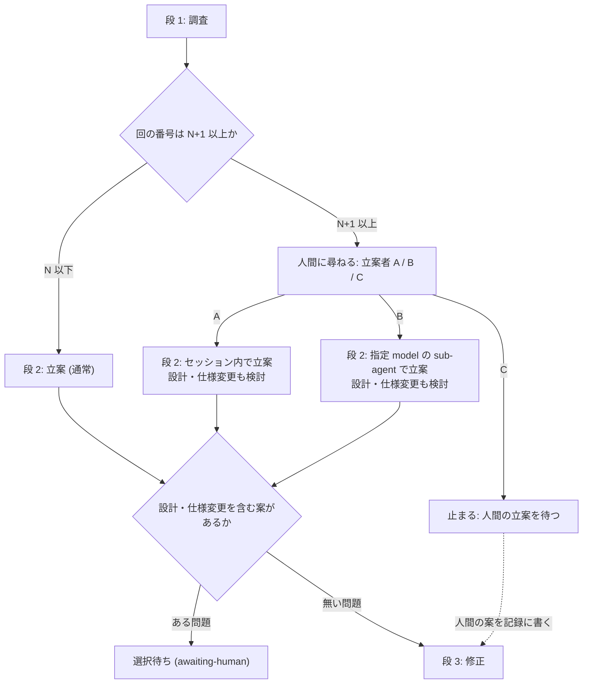

# レビュー指摘の繰り返しへの対応を、回数の閾値と立案者の選択に置き換える - Plan

## Goal Capsule

- **目的**: レビューと修正の周回で、人間が読まなくなった俯瞰 (繰り返しを図で確かめる作業) に時間を使わず、記録の回 N を越えた回だけ人間が「誰が立案するか」を選んで関与する状態にする。周回が止まるのは、人間の判断が要るところ (回 N+1 以降の立案者の選択、設計・仕様変更を含む案、人間が立案する回) と上限・収束だけになる。
- **手段**: `review-triage` の検知と `review-triage-fix` の俯瞰・捉え直しを廃止し、記録の回数の閾値 N (既定 5) と立案者の選択に置き換える。立案者は A (セッションのモデル)、B (指定モデルの sub-agent)、C (人間自身) の 3 つから人間が選ぶ。`review-triage-fix` を 調査 → 立案 → 修正 の 3 段にし、段ごとに sub-agent で走らせて model と effort を選べるようにする。周回の上限の既定を 10 にする。
- **優先順位**: 効き目の中心は「俯瞰の廃止 + 閾値 N + 上限 10」で、「段の sub-agent 化」と「立案者の選択」はその上に載る付加。実装単位を切るときはこの順を保ち、前半だけでも出せる形にする。
- **正本の優先順位**: 製品の振る舞いは Product Contract の R-ID が正本。実装の選び方は、`ce-plan` が足す Planning Contract が正本になる。
- **未解決の阻害要因**: 無し。計画で決める事項は Outstanding Questions の「Deferred to Planning」にある。
- **範囲外の隣接領域**: 採否の判断軸 (判定フロー・却下ゲート) と `review-triage` 本体の判定の sub-agent 化は、この計画の対象にしない (Scope Boundaries が正本)。

---

## Product Contract

### Summary

`review-triage` の検知 (同じ型の指摘が続いているかの判断) と、`review-triage-fix` の俯瞰・捉え直しを廃止し、繰り返しへの対応を記録の回数に置き換える。記録の回 N (既定 5) までは従来どおり直す。回 N+1 以降は毎回、調査の結果を添えて人間に尋ね、人間が立案者を選んでから、設計・仕様変更を含めて立案する。立案者は A (セッションのモデル)、B (指定モデルの sub-agent)、C (人間自身) の 3 つである。`review-triage-fix` は 調査 → 立案 → 修正 の 3 段にし、段ごとに sub-agent で走らせて model と effort を選べるようにする。周回の上限の既定は 10 にする。

### Problem Frame

検知と俯瞰は、2026-09-03 の計画 (ファイル `docs/plans/2026-09-03-001-feat-review-triage-reframe-plan.md`) で「修正が次の指摘を生む連鎖を、人間が図で確かめて捉え直すことで断つ」ために入れた。実際に使うと、検知は頻繁に発火するが、俯瞰の図と表が修正の切り口として効くことは稀だった。22 回の記録 `docs/review-triage/feat-review-triage-loop.yaml` では、比較できる 21 回のうち 15 回で発火し、うち 8 回は人間が「繰り返しではない」と否定した。否定は記録に状態 `declined` として残っている。直近のブランチの記録 `tmp/review-triages/feat-review-triage-record-dir-tmp.yaml` では 4 回発火して 3 回が否定だった。

利用者の実感は「繰り返しの説明は意味を持たなくなっている。俯瞰の表も機能するか分からないまとめ方が多く、修正の切り口として効いたことは稀。読むのに時間がかかるので、だんだん読まなくなった」というものである。俯瞰は人間が図を確認して初めて意味を持つ設計なので、読まれない時点で機能していない。

その一方で、検知と俯瞰は周回を止める関門でもある。機能していない判断のために周回が止まり、上限 5 回のうち修正に使える回が減る。検知の判断軸 (修正由来の指摘・同じ場所への採択) を見直すことは難易度が高く、見直した結果が機能しているかを判定することも難しい。

### Key Decisions

- **検知の判断をやめ、合図は記録の回数だけにする** (session-settled: user-directed — chosen over 検知を記録と報告に残すだけにする・検知の条件を現行のまま閾値で遅らせる: 何も駆動しない判断に毎回コストを払わない)。Governs R1, R2.
- **俯瞰と捉え直しを廃止する** (session-settled: user-approved — chosen over 人間が立案する回の道具として残す・任意の資料として残す: 読まれていない時点で機能していない)。Governs R3, R4.
- **閾値 N は記録の回番号で数える** (session-settled: user-approved — chosen over 同じ型の指摘が N 回続いた回数・周回がこの起動で数えた回数: `review-triage-fix` は記録しか見ないので、単独で走らせても周回から呼ばれても同じ振る舞いになる)。Governs R2.
- **回 N+1 以降は毎回、人間に尋ねて立案者を選ばせる。設定で既定を持たない** (session-settled: user-directed — chosen over 設定で事前に決め、未設定なら尋ねる: 回 N を越えた時点で人間が毎回関与することを意図している)。Governs R7, R8.
- **設計・仕様変更を含む案だけ人間に返す** (session-settled: user-approved — chosen over 回 N+1 以降の案はすべて人間に返す・立案者に判断も委ねて実施まで進む: 現行の「規範や構造の設計を変える案は決めずに人間に返す」原則と矛盾しない)。Governs R10.
- **effort ごとの汎用 agent 定義を同梱し、段は依頼文で指示し、model は呼び出し時に渡す** (session-settled: user-approved — chosen over 選べる effort の値を絞る・effort は選ばずセッションのものを継承するだけにする: Claude Code は sub-agent の effort を agent 定義の frontmatter でしか受けず、呼び出し時の上書きが無い)。Governs R14, R15.
- **段の既定はセッション内で、sub-agent は段ごとに設定で選ぶ** (session-settled: user-approved — chosen over すべての段を sub-agent にする・修正の段だけ sub-agent にする: 既定の振る舞いを変えず、段階的に移せる)。Governs R13.
- **段のあいだの受け渡しは記録 YAML だけにする** — 現行の「2 つのスキルの受け渡しは記録だけ」の原則を、段を sub-agent に出しても崩さない。Governs R16.
- **回 N+1 以降に尋ねる位置は、調査 (段 1) の後にする** — 人間が調査の結果を見てから立案者を選べるようにする。Governs R7.

### Actors

- A1. 人間 — 周回を起動し、回 N+1 以降で立案者を選び、設計・仕様変更を含む案に答える。C を選んだときは自分で立案する。
- A2. `review-triage` — 指摘を判定して記録に追記する。検知は行わなくなる。
- A3. `review-triage-fix` — 採択を原因で束ね、調査 → 立案 → 修正 の 3 段で直す。回 N+1 以降は段 1 の後に人間に尋ねる。
- A4. `review-triage-loop` — レビューの起動・`review-triage`・`review-triage-fix` を 1 周として回す。止まる条件が変わる。
- A5. 段の sub-agent — プラグインが同梱する effort ごとの汎用 agent 定義から起動され、依頼文で指示された段を、記録 YAML を入出力にして実行する。
- A6. `triagecheck` — 記録の検査ツール。検知の項目の検査を持たなくなる。

### Requirements

**回数の閾値と上限**

- R1. `review-triage` は検知 (同じ型の指摘が続いているかの判断) を行わず、記録にも報告にも検知の項目を出さない。
- R2. 回数の閾値 N は `review-triage-fix` が使う。対象の回の番号は記録の `runs` の要素数で数える。N 以下なら R6 の立案、N+1 以上なら R7〜R10 の立案にする。既定は 5 で、設定と引数で変えられる。
- R3. 俯瞰 (連鎖の図と軸の表を人間と確認する作業) と捉え直し (記録の `reframe` を書くこと) を廃止する。新しく書く回には検知の項目 (`recurrence`) を書かない。
- R4. 周回の上限 (設定キー `loop.max_rounds`) の既定を 5 から 10 にする。

**`review-triage-fix` の 3 段**

- R5. `review-triage-fix` は、回の番号に関わらず次の 3 段で進む。各段の中身の規範は現行の手順 (ファイル `review-triage/skills/review-triage-fix/SKILL.md` の手順 3〜8 と references/ 配下の各文書) を引き継ぐ。
  - **段 1 (調査):** 採択ごとの原因を確かめ、同じ原因で束ね、類似箇所と影響範囲を調べる。必要に応じて仕様・設計・テスト・文書・Issue / PR を確かめる。
  - **段 2 (立案):** 問題ごとに修正方法と順序を決め、計画を記録に書く。
  - **段 3 (修正):** 問題単位で直し、検証してからコミットする。
- R6. 回 N 以下の回では、段 1 → 段 2 → 段 3 を人間に尋ねずに進める。ただし R10 の案が出た問題は人間に返す (現行どおり)。
- R7. 回 N+1 以降の回では、段 1 の後に、調査の結果 (原因・束ね・類似箇所・影響範囲) を添えて人間に尋ね、立案者を A / B / C から選ばせる。設定や引数で既定を持たず、毎回尋ねる。
- R8. 立案者の意味は次のとおり。A: セッションのモデルがセッション内で段 2 を行う。B: 人間がそのとき指定した model (と effort) の sub-agent が段 2 を行う。C: 人間が立案し、スキルは人間の案を記録の計画に書いてから段 3 に進む。
- R9. 回 N+1 以降の段 2 は、通常の修正に加えて設計変更・仕様変更を含めて検討する。検討の材料は段 1 の結果と、それまでの回の記録 (指摘と計画の推移) である。
- R10. 立案者 (A / B) が設計・仕様変更を含む案を出した問題は、現行の選択待ち (`awaiting-human`: 案とトレードオフを書いて人間に返す) と同じ形で人間に返し、承認まで実施しない。通常の修正で足りる問題は段 3 に進める。
- R11. `review-triage-loop` が止まる条件は、選択待ち (R10 の案が出た、または C で人間の立案を待つ)・収束・上限の 3 つにする。検知による停止は無くなる。回 N+1 以降の立案者の選択 (R7) は周回の中で人間の答えを待ち、A / B なら答えの後に続ける。
- R12. `review-triage-loop` は、周回の開始前の報告に閾値 N と、段ごとの走らせ方 (R13) を含める。各回の報告と `review-triage-fix` の報告には、各段をどこで (セッション内か sub-agent か、その model と effort) 走らせたかを書く。

**段の sub-agent 化**

- R13. 段 1〜3 のそれぞれを sub-agent で走らせるかを、段ごとに設定と引数で選べる。既定はセッション内 (現行と同じ)。回 N+1 以降の段 2 は R8 の選択が優先し、段 2 の設定は使わない。段 1 と段 3 の設定は回の番号に関わらず効く。
- R14. sub-agent で走らせる段は、model と effort を段ごとに選べる。既定はセッションの model と effort。effort の選択肢は「継承」と Claude Code が受ける値 (low / medium / high / xhigh / max)。
- R15. プラグインは effort ごとの汎用 agent 定義 (継承 + 5 値の 6 つ) を同梱する。定義の違いは effort だけで、どの段を行うかは依頼文で指示し、model は呼び出し時に渡す。
- R16. 段のあいだの受け渡しは記録 YAML だけにする。sub-agent で走らせる段は記録に無い情報を前提にせず、段の結果は記録に書いてから次の段に渡す。段の sub-agent の結果は、現行の原則どおり検証してから反映する。
- R17. sub-agent で走らせる段も、その段の規範 (調査の 2 方向、束ねの基準、検証の観点 A〜F、機械検査の関門、1 問題 1 コミット) を現行どおり守る。規範の正本は `review-triage-fix` の references/ 配下の各文書で、この計画では言い直さない。

**文書と検査**

- R18. 検知・俯瞰・捉え直しの規範文書と、それらを参照する箇所を廃止に合わせて更新し、廃止した文書や項目への参照を残さない。
  - 規範文書: ファイル `review-triage/skills/review-triage/references/recurrence-detection.md` とファイル `review-triage/skills/review-triage-fix/references/reframing.md`。
  - 参照する箇所: 3 つのスキルの `SKILL.md`、`record-schema.md`、`loop-flow.md`、`grouping.md`、プラグインの `README.md`、リポジトリ直下の `CONCEPTS.md` の「レビューの収束」。
- R19. `triagecheck` は検知の項目 (`recurrence`) の検査を持たなくなる。過去の記録 (凍結扱いの `docs/review-triage/` 配下) は書き換えない。

### Key Flows

- F1. 回 N 以下の 1 周
  - **起点:** `review-triage-loop` がレビューを起動し、`review-triage` が判定して記録に回を追記する。
  - **関与:** A2, A3, A4 (A5 は設定で段が sub-agent のとき)。
  - **手順:** `review-triage-fix` が段 1 → 段 2 → 段 3 を進める。各段はセッション内か、設定で選んだ sub-agent で走る。設計・仕様変更を含む案が出た問題は選択待ちにする。
  - **結果:** 覆われていない採択が無くなれば次の回へ。選択待ちがあれば止まる。上限に達すれば止まる。
  - **Covers R5, R6, R10, R11, R13.**
- F2. 回 N+1 以降の 1 周
  - **起点:** 記録の回番号が N+1 以上の回で `review-triage-fix` が始まる。
  - **関与:** A1, A3, A4, A5。
  - **手順:** 段 1 を走らせ、その結果を添えて人間に立案者を尋ねる。A ならセッション内で段 2、B なら指定された model と effort の sub-agent で段 2、C なら人間の立案を待って止まる。段 2 は設計・仕様変更を含めて検討し、設計・仕様変更を含む案が出た問題は選択待ちにする。通常の修正で足りる問題は段 3 に進める。
  - **結果:** A / B で選択待ちが無ければ次の回へ。C か選択待ちがあれば止まり、人間が案を伝えたら、スキルが記録に書いて段 3 から再開する。
  - **Covers R2, R7, R8, R9, R10, R11.**

- F3. 段を sub-agent で走らせる
  - **起点:** 設定か引数で、ある段を sub-agent で走らせると決まっている (または回 N+1 以降で人間が B を選んだ)。
  - **関与:** A3, A5。
  - **手順:** その段の effort に対応する agent 定義を選び、model を呼び出し時に渡し、依頼文に段の名前と記録 YAML のパスを書く。sub-agent は記録を読んで段を実行し、結果を記録に書く。呼び出し側は結果を検証してから次の段に進む。
  - **結果:** 段の結果が記録にあり、報告にその段の走らせ方 (model・effort) が書かれている。
  - **Covers R13, R14, R15, R16, R17, R12.**

### Acceptance Examples

- AE1. 回 N 以下では人間に尋ねない
  - **Covers R1, R2, R6.**
  - **Given:** N は既定の 5。記録に 2 回あり、回 3 が追記された。
  - **When:** `review-triage-fix` が回 3 を対象に始まる。
  - **Then:** `review-triage` は回 3 に検知の項目を書いていない。段 1 → 段 2 → 段 3 が人間に尋ねずに進み、設計・仕様変更を含む案が無ければ止まらない。
- AE2. 回 N+1 で A を選ぶ
  - **Covers R7, R8, R9, R11.**
  - **Given:** N は 5。記録に 5 回あり、回 6 が追記された。
  - **When:** 段 1 が終わる。
  - **Then:** 調査の結果を添えて立案者を尋ねる。人間が A を選ぶと、セッション内で設計・仕様変更を含めて立案し、その案が無ければ段 3 に進み、周回は回 7 に続く。
- AE3. 回 N+1 で B を選び、設計変更の案が出る
  - **Covers R8, R10, R11, R12.**
  - **Given:** AE2 と同じ状態。
  - **When:** 人間が B を選び、model と effort を指定する。
  - **Then:** その model と effort の sub-agent が段 2 を行う。問題の 1 つに設計変更を含む案が出たら、その問題は案とトレードオフを書いて選択待ちにし、他の問題は段 3 で直す。周回は選択待ちで止まり、報告に段 2 の走らせ方 (model・effort) が書かれている。
- AE4. 回 N+1 で C を選ぶ
  - **Covers R8, R11.**
  - **Given:** AE2 と同じ状態。
  - **When:** 人間が C を選ぶ。
  - **Then:** 周回は人間の立案を待って止まる。人間が案を伝えると、スキルはそれを記録の計画に書いてから段 3 に進む。
- AE5. N を設定で変える
  - **Covers R2.**
  - **Given:** 設定で N を 3 にしている。
  - **When:** 回 4 が追記される。
  - **Then:** 回 4 の段 1 の後に立案者を尋ねる。引数で N を 6 にして起動すれば、回 4 では尋ねない。
- AE6. 回が既に N を越えた記録に対して周回を起動する
  - **Covers R2, R11.**
  - **Given:** N は 5。記録に既に 8 回ある。
  - **When:** `review-triage-loop` を起動する。
  - **Then:** この起動の 1 周目 (記録の回 9) から、段 1 の後に立案者を尋ねる。
- AE7. 段 1 だけを sub-agent にする
  - **Covers R13, R14, R15, R16.**
  - **Given:** 設定で段 1 を sub-agent (model は sonnet、effort は継承) にし、段 2 と段 3 は設定していない。
  - **When:** 回 2 で `review-triage-fix` が始まる。
  - **Then:** 段 1 は effort を持たない agent 定義に model sonnet を渡して走り、結果は記録に書かれる。段 2 と段 3 はセッション内で走る。報告に段 1 の走らせ方が書かれている。
- AE8. 上限の既定
  - **Covers R4.**
  - **Given:** 設定に `max_rounds` が無い。
  - **When:** `review-triage-loop` を起動する。
  - **Then:** 開始前の報告に上限 10 が出て、この起動で 10 回回したら止まる。

### Success Criteria

- 俯瞰の手順と文書が無くなり、周回のどこにも人間が確認する図は出ない。
- 回 N 以下の回で人間が答える場面は、設計・仕様変更を含む案の承認だけである。回 N+1 以降は、それに加えて立案者の選択が 1 回だけ増える。
- 段ごとの sub-agent が設定で有効になり、記録 YAML の様式は段をどこで走らせたかに依存しない。
- `ce-plan` がこの計画から実装単位を切るときに、製品の振る舞い・範囲・成功の基準を補う必要が無い。

### Scope Boundaries

- 採否の判断軸 (判定フロー D1〜D7・却下ゲート・保留の扱い) の見直しは対象外。
- `review-triage` 本体の判定を sub-agent で走らせることは対象外。
- 過去の記録 (凍結扱いの `docs/review-triage/` 配下と、既存の `tmp/review-triages/` 配下) は書き換えない。
- レビューの起動経路 (ファイル `review-triage/skills/review-triage-loop/references/review-invocation.md` の実効モデルと範囲の規則) は変えない。
- 立案者の既定を設定で持つことはしない (Key Decisions のとおり)。
- `triagecheck` に `loop-flow.md` の検査を足すことは対象外 (現行から残る課題)。

### Dependencies / Assumptions

- Claude Code の sub-agent は、`model` を呼び出し時に指定でき、省略時はセッションのモデルになる。effort は agent 定義の frontmatter (`effort: low / medium / high / xhigh / max`) でだけ指定でき、省略時はセッションの effort を継承する。呼び出し時に effort を上書きする手段は無い (公式ドキュメント `https://code.claude.com/docs/en/sub-agents` で 2026-09-18 に確認)。
- プラグインは `agents/` ディレクトリで agent 定義を配布できる。現在の `review-triage` プラグインは agent 定義を持たない。
- sub-agent は人間に問えないので、立案者を尋ねる (R7) のはセッション側の `review-triage-fix` (または周回) が行う。
- 記録の回番号は `runs` の要素数で、回 1 から数える (現行の記録の様式のとおり)。
- C で人間が案を伝える経路は会話とし、スキルがそれを記録の計画に書く。人間が記録 YAML を直接書くことは前提にしない。
- 検査コマンド (`triage_check_command`) が検査するのは設定の `record_dir` 配下だけで、`docs/review-triage/` 配下の過去の記録は検査されない。

### Outstanding Questions

**Deferred to Planning**

- 閾値 N と段ごとの sub-agent の設定を、設定ファイル `.claude/akm-claude-plugins/review-triage/config.json` のどの節に置くか (`loop` に足すか、`review-triage-fix` 用の節を新設するか) と、引数の様式。
- 既存の `tmp/review-triages/` 配下の記録に残る `recurrence` (状態 `reframed` / `declined`) を、新しい `triagecheck` が読んだときの扱い。未知のキーとして報告するか、旧様式として受け入れるか。
- 段をどこで走らせたか (model・effort) を記録 YAML にも残すか、報告だけにするか。R12 は報告を必須にしている。
- モデルが対応しない effort を指定したときの振る舞い (エラーにするか、継承に落として報告するか)。
- 回 N+1 以降の「尋ねて待つ」と「止まる」を、`loop-flow.md` の状態機械 (ノードと決定表) にどう組み込むか。検知のノード (G1・J1・S1) を外し、立案者の選択のノードを足す設計。
- B で人間が指定した model の綴りを実効モデルに解決する規則を、`review-invocation.md` の規則と共通にするか。
- `CONCEPTS.md` の「修正由来の指摘」「捉え直し」の項を外すか、廃止の経緯を残す形に書き換えるか。

### Sources / Research

- 検知の正本: `review-triage/skills/review-triage/references/recurrence-detection.md` — 直前の 1 回と比べる、回 1 では判断しない、件数による緩和。
- 俯瞰の正本: `review-triage/skills/review-triage-fix/references/reframing.md` — 2 段の図と問い、人間の回答を待つ、`mermaid-preview` への依存。
- 周回の状態機械: `review-triage/skills/review-triage-loop/references/loop-flow.md` — 検知で止まる S1 (G1・J1)、選択待ちで止まる S2 (G2・J4・J6)、上限 J5 は起動時に 0 から数える。
- 設定と引数: `review-triage/skills/review-triage/references/project-config.md` (`loop.max_rounds` の既定 5、「未設定」の定義)、`review-triage/skills/review-triage-loop/references/arguments.md` (引数が設定より優先)。
- 記録の様式: `review-triage/skills/review-triage/references/record-schema.md` — `runs[].recurrence` の状態 (`detected` / `reframed` / `declined`)、`plans[].status` (`pending` / `awaiting-human` / `done` / `done-external`)、`awaiting-human` には `options` が必須。
- 検査ツール: `review-triage/tools/triagecheck/record.go` — `awaiting-human` の `options`、回 1 に `recurrence` 無し、`prior_run` は直前の回、捉え直し済みの `prior` の検査。
- sub-agent へのモデルの渡し方: `review-triage/skills/review-triage-loop/references/review-invocation.md` — 実効モデルを `model` で明示して渡す、`code-review` の effort の既定は `high`。
- 用語: リポジトリ直下の `CONCEPTS.md` の「レビューの収束」(修正由来の指摘・捉え直し)。
- 前の計画: `docs/plans/2026-09-03-001-feat-review-triage-reframe-plan.md` — この計画が置き換える検知と俯瞰を導入した計画。
- 実測 1: `docs/review-triage/feat-review-triage-loop.yaml` — 22 回、検知 15 回、`declined` 8 回・`reframed` 7 回。
- 実測 2: `tmp/review-triages/feat-review-triage-record-dir-tmp.yaml` — 検知 4 回、`declined` 3 回・`reframed` 1 回。
- Claude Code の sub-agent の仕様: `https://code.claude.com/docs/en/sub-agents` — frontmatter の `effort` と `model`、呼び出し時の `model` の上書き、effort の継承。
