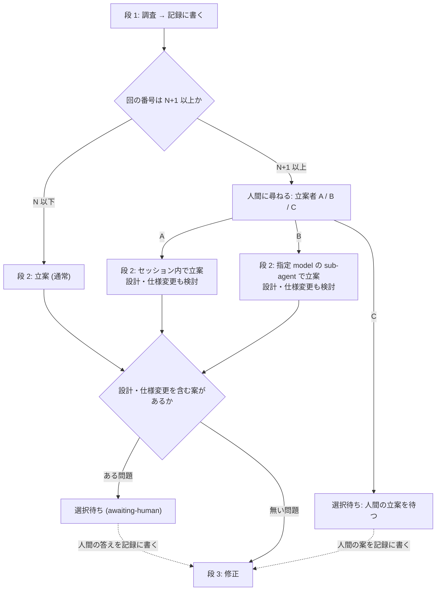
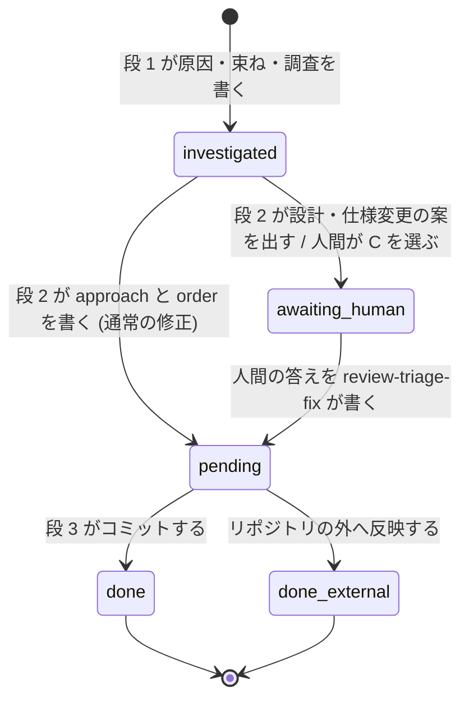
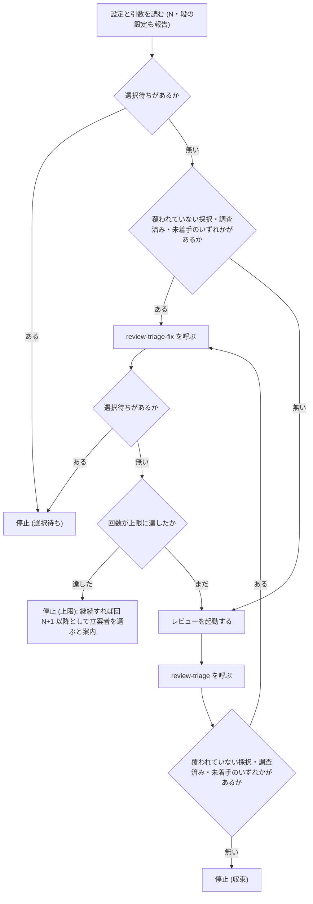
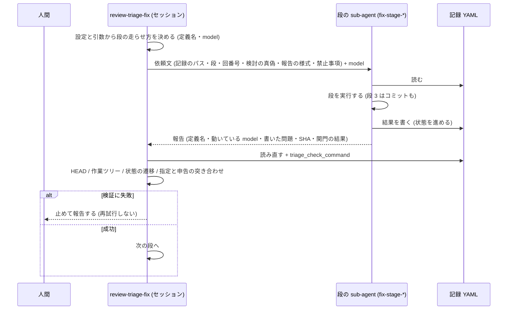

# レビュー指摘の繰り返しへの対応を、回数の閾値と立案者の選択に置き換える - Plan

## Goal Capsule

- **目的**: レビューと修正の周回で、人間が読まなくなった俯瞰 (繰り返しを図で確かめる作業) に時間を使わず、記録の回 N を越えた回だけ人間が「誰が立案するか」を選んで関与する状態にする。周回が止まるのは、人間の判断が要るところ (回 N+1 以降の立案者の選択、設計・仕様変更を含む案、人間が立案する回) と上限・収束だけになる。
- **手段**: `review-triage` の検知と `review-triage-fix` の俯瞰・捉え直しを廃止し、記録の回数の閾値 N (既定 5) と立案者の選択に置き換える (Key Decisions の 1〜5 番目)。`review-triage-fix` を 調査 → 立案 → 修正 の 3 段にし、段ごとに sub-agent で走らせて model と effort を選べるようにする (同 6〜8 番目、KTD2・KTD6〜KTD9)。周回の上限の既定を 10 にする。
- **優先順位**: 効き目の中心は「俯瞰の廃止 + 閾値 N + 上限 10」で、「段の sub-agent 化」と「立案者の選択」はその上に載る付加。実装単位は 3 つの段階に分け、段階 1 だけでも出せる形にする。段階 2 が閾値と立案者 (A / C)、段階 3 が段の sub-agent 化と立案者 B になる (Planning Contract の「順序」)。
- **正本の優先順位**: 製品の振る舞いは Product Contract の R-ID が正本。実装の選び方は Planning Contract の KTD が正本。実装単位 (U-ID) はどちらも書き換えない。
- **止まる条件**: 記録の様式の変更で、置き場にある既存の記録 (`recurrence` を含む) の検査が失敗する形になったら、既存の記録を書き換えずに止めて報告する。設計の選択肢が複数あり規範を変える場合は、決めずに人間に返す。
- **実行の型**: 検査ツール (Go) はテストを先に書いて固める。スキルの手順書 (Markdown) は記録の fixture で手動の通し確認をする。文書を変えたら `doc-dag` を回す。
- **後始末の所有**: この計画の PR は人間が作る。コミットは動機ごとに分ける (規範は利用者のコミットルール)。
- **Product Contract の保全**: 変更あり (計画の確認で利用者が承認したもの) — R2 (対象の回と計画の書き先を明確化)、R7 (尋ねるのは `review-triage-fix` 自身と明記)、R18 (更新対象の一覧を実測に合わせて追加)、R19 (既存の記録の検査を通す受け入れ条件を追加)、R20〜R22 を追加 (段 1 の結果を置く記録の状態、人間の答えの反映と再開、再入場の順序)、AE9〜AE12 を追加、Success Criteria の文言 (立案者の選択の回数)、Key Decisions に「同じ場所を再び直すとき」の扱いを追加。

---

## Product Contract

### Summary

`review-triage` の検知 (同じ型の指摘が続いているかの判断) と、`review-triage-fix` の俯瞰・捉え直しを廃止し、繰り返しへの対応を記録の回数に置き換える。記録の回 N (既定 5) までは従来どおり直す。回 N+1 以降は毎回、調査の結果を添えて人間に尋ね、人間が立案者を選んでから、設計・仕様変更を含めて立案する。立案者は A (セッションのモデル)、B (指定モデルの sub-agent)、C (人間自身) の 3 つである。`review-triage-fix` は 調査 → 立案 → 修正 の 3 段にし、段ごとに sub-agent で走らせて model と effort を選べるようにする。周回の上限の既定は 10 にする。

### Problem Frame

検知と俯瞰は、2026-09-03 の計画 (ファイル `docs/plans/2026-09-03-001-feat-review-triage-reframe-plan.md`) で「修正が次の指摘を生む連鎖を、人間が図で確かめて捉え直すことで断つ」ために入れた。実際に使うと、検知は頻繁に発火するが、俯瞰の図と表が修正の切り口として効くことは稀だった。22 回の記録 `docs/review-triage/feat-review-triage-loop.yaml` では、比較できる 21 回のうち 15 回で発火し、うち 8 回は人間が「繰り返しではない」と否定した。否定は記録に状態 `declined` として残っている。直近のブランチの記録 `tmp/review-triages/feat-review-triage-record-dir-tmp.yaml` では 4 回発火して 3 回が否定だった。

利用者の実感は「繰り返しの説明は意味を持たなくなっている。俯瞰の表も機能するか分からないまとめ方が多く、修正の切り口として効いたことは稀。読むのに時間がかかるので、だんだん読まなくなった」というものである。俯瞰は人間が図を確認して初めて意味を持つ設計なので、読まれない時点で機能していない。

その一方で、検知と俯瞰は周回を止める関門でもある。機能していない判断のために周回が止まり、上限 5 回のうち修正に使える回が減る。検知の判断軸 (修正由来の指摘・同じ場所への採択) を見直すことは難易度が高く、見直した結果が機能しているかを判定することも難しい。

### Key Decisions

- **検知の判断をやめ、合図は記録の回数だけにする** (session-settled: user-directed — chosen over 検知を記録と報告に残すだけにする・検知の条件を現行のまま閾値で遅らせる: 何も駆動しない判断に毎回コストを払わない)。Governs R1, R2.
- **俯瞰と捉え直しを廃止する** (session-settled: user-approved — chosen over 人間が立案する回の道具として残す・任意の資料として残す: 読まれていない時点で機能していない)。Governs R3, R4.
- **閾値 N は記録の回番号で数える** (session-settled: user-approved — chosen over 同じ型の指摘が N 回続いた回数・周回がこの起動で数えた回数: `review-triage-fix` は記録しか見ないので、単独で走らせても周回から呼ばれても同じ振る舞いになる)。Governs R2.
- **回 N+1 以降は毎回、人間に尋ねて立案者を選ばせる。設定で既定を持たない** (session-settled: user-directed — chosen over 設定で事前に決め、未設定なら尋ねる: 回 N を越えた時点で人間が毎回関与することを意図している)。Governs R7, R8.
- **設計・仕様変更を含む案だけ人間に返す** (session-settled: user-approved — chosen over 回 N+1 以降の案はすべて人間に返す・立案者に判断も委ねて実施まで進む: 現行の「規範や構造の設計を変える案は決めずに人間に返す」原則と矛盾しない)。Governs R10.
- **effort ごとの汎用 agent 定義を同梱し、段は依頼文で指示し、model は呼び出し時に渡す** (session-settled: user-approved — chosen over 選べる effort の値を絞る・effort は選ばずセッションのものを継承するだけにする: Claude Code は sub-agent の effort を agent 定義の frontmatter でしか受けず、呼び出し時の上書きが無い)。Governs R14, R15.
- **段の既定はセッション内で、sub-agent は段ごとに設定で選ぶ** (session-settled: user-approved — chosen over すべての段を sub-agent にする・修正の段だけ sub-agent にする: 既定の振る舞いを変えず、段階的に移せる)。Governs R13.
- **段のあいだの受け渡しは記録 YAML だけにする** — 現行の「2 つのスキルの受け渡しは記録だけ」の原則を、段を sub-agent に出しても崩さない。Governs R16, R20.
- **回 N+1 以降に尋ねる位置は、調査 (段 1) の後にする** — 人間が調査の結果を見てから立案者を選べるようにする。Governs R7.
- **「同じ場所を再び直すとき」の手順は、手だけ残して「同じ場所」の枠を外す** (session-settled: user-approved — chosen over 手順ごと削除する・検知から切り離して残す: 手 (数を書かない・重複を参照にする・書く前に形を見る) は検知が無くても成り立ち、発火条件を捨てれば突き合わせの手間も消える)。Governs R18.

### Actors

- A1. 人間 — 周回を起動し、回 N+1 以降で立案者を選び、設計・仕様変更を含む案に答える。C を選んだときは自分で立案する。
- A2. `review-triage` — 指摘を判定して記録に追記する。検知は行わなくなる。
- A3. `review-triage-fix` — 採択を原因で束ね、調査 → 立案 → 修正 の 3 段で直す。回 N+1 以降は段 1 の後に人間に尋ねる。セッション内で走る (sub-agent に包まない)。
- A4. `review-triage-loop` — レビューの起動・`review-triage`・`review-triage-fix` を 1 周として回す。止まる条件が変わる。
- A5. 段の sub-agent — プラグインが同梱する effort ごとの汎用 agent 定義から起動され、依頼文で指示された段を、記録 YAML を入出力にして実行する。人間には問えない。
- A6. `triagecheck` — 記録の検査ツール。検知の項目の整合検査を持たなくなり、段 1 の結果を置く状態を検査する。

### Requirements

**回数の閾値と上限**

- R1. `review-triage` は検知 (同じ型の指摘が続いているかの判断) を行わず、記録にも報告にも検知の項目を出さない。
- R2. 回数の閾値 N は `review-triage-fix` が使う。対象の回の番号は記録の `runs` の要素数 (最後の回の番号) で数える。N 以下なら R6 の立案、N+1 以上なら R7〜R10 の立案にする。既定は 5 で、設定と引数で変えられる。計画 (`plans`) は、その採択が属する回に書く (現行どおり。別の回の採択は `plan_ref` で束ねる)。
- R3. 俯瞰 (連鎖の図と軸の表を人間と確認する作業) と捉え直し (記録の `reframe` を書くこと) を廃止する。新しく書く回には検知の項目 (`recurrence`) を書かない。
- R4. 周回の上限 (設定キー `loop.max_rounds`) の既定を 5 から 10 にする。

**`review-triage-fix` の 3 段**

- R5. `review-triage-fix` は、回の番号に関わらず次の 3 段で進む。各段の中身の規範は現行の手順 (ファイル `review-triage/skills/review-triage-fix/SKILL.md` の手順 3〜8 と references/ 配下の各文書) を引き継ぐ。
  - **段 1 (調査):** 採択ごとの原因を確かめ、同じ原因で束ね、類似箇所と影響範囲を調べる。必要に応じて仕様・設計・テスト・文書・Issue / PR を確かめる。結果は記録に書く (R20)。
  - **段 2 (立案):** 問題ごとに修正方法と順序を決め、計画を記録に書く。
  - **段 3 (修正):** 問題単位で直し、検証してからコミットする。
- R6. 回 N 以下の回では、段 1 → 段 2 → 段 3 を人間に尋ねずに進める。ただし R10 の案が出た問題は人間に返す (現行どおり)。
- R7. 回 N+1 以降の回では、段 1 の後に、調査の結果 (原因・束ね・類似箇所・影響範囲) を添えて人間に尋ね、立案者を A / B / C から選ばせる。設定や引数で既定を持たず、毎回尋ねる。尋ねるのは `review-triage-fix` 自身で、周回から呼ばれたときも単独で走らせたときも同じ。
- R8. 立案者の意味は次のとおり。A: セッションのモデルがセッション内で段 2 を行う。B: 人間がそのとき指定した model (と effort) の sub-agent が段 2 を行う。C: 人間が立案し、スキルは人間の案を記録の計画に書いてから段 3 に進む (R21)。
- R9. 回 N+1 以降の段 2 は、通常の修正に加えて設計変更・仕様変更を含めて検討する。検討の材料は段 1 の結果と、それまでの回の記録 (指摘と計画の推移) である。
- R10. 立案者 (A / B) が設計・仕様変更を含む案を出した問題は、現行の選択待ち (`awaiting-human`: 案とトレードオフを書いて人間に返す) と同じ形で人間に返し、承認まで実施しない。通常の修正で足りる問題は段 3 に進める。
- R11. `review-triage-loop` が止まる条件は、選択待ち (R10 の案が出た、または C で人間の立案を待つ)・収束・上限の 3 つにする。検知による停止は無くなる。回 N+1 以降の立案者の選択 (R7) は周回の中で人間の答えを待ち、A / B なら答えの後に続ける。
- R12. `review-triage-loop` は、周回の開始前の報告に閾値 N と、段ごとの走らせ方 (R13) を含める。各回の報告と `review-triage-fix` の報告には、各段をどこで (セッション内か sub-agent か、その model と effort) 走らせたかを書く。

**段の sub-agent 化**

- R13. 段 1〜3 のそれぞれを sub-agent で走らせるかを、段ごとに設定と引数で選べる。既定はセッション内 (現行と同じ)。回 N+1 以降の段 2 は R8 の選択が優先し、段 2 の設定は使わない。段 1 と段 3 の設定は回の番号に関わらず効く。
- R14. sub-agent で走らせる段は、model と effort を段ごとに選べる。既定はセッションの model と effort。effort の選択肢は「継承」と Claude Code が受ける値 (low / medium / high / xhigh / max)。
- R15. プラグインは effort ごとの汎用 agent 定義 (継承 + 5 値の 6 つ) を同梱する。定義の違いは effort だけで、どの段を行うかは依頼文で指示し、model は呼び出し時に渡す。
- R16. 段のあいだの受け渡しは記録 YAML だけにする。sub-agent で走らせる段は記録に無い情報を前提にせず、段の結果は記録に書いてから次の段に渡す。段の sub-agent の結果は、現行の原則どおり検証してから反映する。
- R17. sub-agent で走らせる段も、その段の規範 (調査の 2 方向、束ねの基準、検証の観点 A〜F、機械検査の関門、1 問題 1 コミット) を現行どおり守る。規範の正本は `review-triage-fix` の references/ 配下の各文書で、この計画では言い直さない。

**記録の状態と再開**

- R20. 段 1 の結果 (原因・束ね・調査) を保持する計画の状態を 1 つ足す。この状態の問題は修正方法 (`approach`) と順序をまだ持たない。段 2 がそれらを書いて未着手 (`pending`) か選択待ち (`awaiting-human`) にする。`triagecheck` はこの状態を検査する。
- R21. 人間の答えは `review-triage-fix` が記録に反映する。選択待ちの承認 (案を選ぶ・別の案を伝える) と C の案 (会話で伝える) のどちらも、修正方法を記録の計画に書いて未着手にし、段 3 に進む。C の案が一部の問題しか覆わないときは、残りの問題ごとに案を求め、答えが無ければその問題は選択待ちのまま止まる。人間が記録 YAML を直接書くことは前提にしない。
- R22. 段 1 が終わった後 (立案者の選択の途中、または C の待ち) にセッションが切れて再起動したときは、段 1 を飛ばして記録の状態から続ける — 回 N+1 以上なら再度立案者を尋ね、N 以下なら段 2 から進める。`review-triage-loop` は入口で、段 1 の結果だけがある問題と未着手の問題をレビューより先に片付ける (直していない問題がレビューで再指摘されないようにする)。

**文書と検査**

- R18. 検知・俯瞰・捉え直しの規範文書と、それらを参照する箇所を廃止に合わせて更新し、廃止した文書や項目への参照を残さない。
  - 規範文書: ファイル `review-triage/skills/review-triage/references/recurrence-detection.md` とファイル `review-triage/skills/review-triage-fix/references/reframing.md` を削除する。
  - 参照する箇所: 3 つのスキルの `SKILL.md`、`review-triage/skills/review-triage/references/record-schema.md`、`review-triage/skills/review-triage/references/project-config.md`、`review-triage/skills/review-triage-loop/references/loop-flow.md`、`review-triage/skills/review-triage-loop/references/reporting.md`、`review-triage/skills/review-triage-loop/references/arguments.md`、`review-triage/skills/review-triage-fix/references/grouping.md`、`review-triage/tools/triagecheck/README.md`、プラグインの `review-triage/README.md`、リポジトリ直下の `CONCEPTS.md` の「レビューの収束」。
  - 「同じ場所を再び直すとき」(ファイル `review-triage/skills/review-triage-fix/references/same-location-fix.md`) は、発火条件と検知・俯瞰への言及を外し、文書の記述を直すときに常に当てる手 (数を書かない・重複を参照にする・書く前に形を見る) として残す。ファイル名と冒頭はその形に書き換える。
- R19. `triagecheck` は検知の項目 (`recurrence`) の整合検査を持たなくなる。既存の記録 (置き場に残る `recurrence` を含む記録) があっても検査は成功し、既存の生成サマリを書き換えない。過去の記録 (凍結扱いの `docs/review-triage/` 配下と `tmp/review-triages/` 配下) は書き換えない。

### Key Flows

- F1. 回 N 以下の 1 周
  - **起点:** `review-triage-loop` がレビューを起動し、`review-triage` が判定して記録に回を追記する。
  - **関与:** A2, A3, A4 (A5 は設定で段が sub-agent のとき)。
  - **手順:** `review-triage-fix` が段 1 → 段 2 → 段 3 を進める。各段はセッション内か、設定で選んだ sub-agent で走る。設計・仕様変更を含む案が出た問題は選択待ちにする。
  - **結果:** 覆われていない採択が無くなれば次の回へ。選択待ちがあれば止まる。上限に達すれば止まる。
  - **Covers R5, R6, R10, R11, R13.**
- F2. 回 N+1 以降の 1 周
  - **起点:** 記録の回番号が N+1 以上の回で `review-triage-fix` が始まる。
  - **関与:** A1, A3, A4, A5。
  - **手順:** 段 1 を走らせて結果を記録に書き、その結果を添えて人間に立案者を尋ねる。A ならセッション内で段 2、B なら指定された model と effort の sub-agent で段 2、C なら人間の立案を待つ (記録上は選択待ち)。段 2 は設計・仕様変更を含めて検討し、設計・仕様変更を含む案が出た問題は選択待ちにする。通常の修正で足りる問題は段 3 に進める。
  - **結果:** A / B で選択待ちが無ければ次の回へ。選択待ちがあれば止まる。人間が案を伝えたら、スキルが記録に書いて段 3 から続ける (R21)。
  - **Covers R2, R7, R8, R9, R10, R11, R20, R21.**



- F3. 段を sub-agent で走らせる
  - **起点:** 設定か引数で、ある段を sub-agent で走らせると決まっている (または回 N+1 以降で人間が B を選んだ)。
  - **関与:** A3, A5。
  - **手順:** その段の effort に対応する agent 定義を選び、model を呼び出し時に渡し、依頼文に段の名前と記録 YAML のパスを書く。sub-agent は記録を読んで段を実行し、結果を記録に書く。呼び出し側は結果を検証してから次の段に進む。
  - **結果:** 段の結果が記録にあり、報告にその段の走らせ方 (model・effort) が書かれている。
  - **Covers R12, R13, R14, R15, R16, R17.**

### Acceptance Examples

- AE1. 回 N 以下では人間に尋ねない
  - **Covers R1, R2, R6.**
  - **Given:** N は既定の 5。記録に 2 回あり、回 3 が追記された。
  - **When:** `review-triage-fix` が回 3 を対象に始まる。
  - **Then:** `review-triage` は回 3 に検知の項目を書いていない。段 1 → 段 2 → 段 3 が人間に尋ねずに進み、設計・仕様変更を含む案が無ければ止まらない。
- AE2. 回 N+1 で A を選ぶ
  - **Covers R7, R8, R9, R11.**
  - **Given:** N は 5。記録に 5 回あり、回 6 が追記された。
  - **When:** 段 1 が終わる。
  - **Then:** 調査の結果を添えて立案者を尋ねる。人間が A を選ぶと、セッション内で設計・仕様変更を含めて立案し、その案が無ければ段 3 に進み、周回は回 7 に続く。
- AE3. 回 N+1 で B を選び、設計変更の案が出る
  - **Covers R8, R10, R11, R12.**
  - **Given:** AE2 と同じ状態。
  - **When:** 人間が B を選び、model と effort を指定する。
  - **Then:** その model と effort の sub-agent が段 2 を行う。問題の 1 つに設計変更を含む案が出たら、その問題は案とトレードオフを書いて選択待ちにし、他の問題は段 3 で直す。周回は選択待ちで止まり、報告に段 2 の走らせ方 (model・effort) が書かれている。
- AE4. 回 N+1 で C を選ぶ
  - **Covers R8, R11, R21.**
  - **Given:** AE2 と同じ状態。
  - **When:** 人間が C を選ぶ。
  - **Then:** 記録上は選択待ちになり、周回は止まる。人間が案を伝えると、スキルはそれを記録の計画に書いて未着手にし、段 3 に進む。
- AE5. N を設定で変える
  - **Covers R2.**
  - **Given:** 設定で N を 3 にしている。
  - **When:** 回 4 が追記される。
  - **Then:** 回 4 の段 1 の後に立案者を尋ねる。引数で N を 6 にして起動すれば、回 4 では尋ねない。
- AE6. 回が既に N を越えた記録に対して周回を起動する
  - **Covers R2, R11.**
  - **Given:** N は 5。記録に既に 8 回ある。
  - **When:** `review-triage-loop` を起動する。
  - **Then:** この起動の 1 周目 (記録の回 9) から、段 1 の後に立案者を尋ねる。
- AE7. 段 1 だけを sub-agent にする
  - **Covers R13, R14, R15, R16, R20.**
  - **Given:** 設定で段 1 を sub-agent (model は sonnet、effort は継承) にし、段 2 と段 3 は設定していない。
  - **When:** 回 2 で `review-triage-fix` が始まる。
  - **Then:** 段 1 は effort を持たない agent 定義に model sonnet を渡して走り、結果は段 1 の状態で記録に書かれる。段 2 と段 3 はセッション内で走る。報告に段 1 の走らせ方が書かれている。
- AE8. 上限の既定
  - **Covers R4.**
  - **Given:** 設定に `max_rounds` が無い。
  - **When:** `review-triage-loop` を起動する。
  - **Then:** 開始前の報告に上限 10 が出て、この起動で 10 回回したら止まる。
- AE9. 既存の記録があっても検査が通る
  - **Covers R19.**
  - **Given:** 置き場に、`recurrence` (状態 `declined` / `reframed`) を含む別ブランチの記録と、その生成サマリがある。
  - **When:** 新しい `triagecheck` で検査コマンドを走らせる。
  - **Then:** 検査は成功し、既存の記録と生成サマリは書き換わらない。
- AE10. 段 1 の後にセッションが切れて再起動する
  - **Covers R20, R22.**
  - **Given:** 回 6 (N は 5) で段 1 の結果が記録に書かれ、立案者を尋ねる前にセッションが切れた。
  - **When:** `review-triage-loop` を再起動する。
  - **Then:** レビューを走らせる前に `review-triage-fix` が呼ばれ、段 1 を飛ばして、記録の段 1 の結果を添えて再度立案者を尋ねる。
- AE11. 選択待ちに答えた後、段 3 から続く
  - **Covers R21, R22.**
  - **Given:** 回 6 で問題 P1 は段 3 で直してコミット済み、問題 P2 は設計変更の案で選択待ち。
  - **When:** 人間が P2 の案の 1 つを選ぶ。
  - **Then:** `review-triage-fix` は P2 の修正方法を記録に書いて未着手にし、段 3 で P2 を直す。周回を再起動した場合も、レビューを走らせる前に P2 を直す。
- AE12. C の案が一部の問題だけを覆う
  - **Covers R21.**
  - **Given:** 回 6 で C を選び、問題は P1・P2 の 2 つ。
  - **When:** 人間が P1 の案だけを伝える。
  - **Then:** P1 は記録に書いて段 3 で直す。P2 は案を求め、答えが無ければ選択待ちのまま止まる。

### Success Criteria

- 俯瞰の手順と文書が無くなり、周回のどこにも人間が確認する図は出ない。
- 回 N 以下の回で人間が答える場面は、設計・仕様変更を含む案の承認だけである。回 N+1 以降は、それに加えて立案者の選択が加わる (C を選べば人間が立案する)。
- 段ごとの sub-agent が設定で有効になり、記録 YAML の様式は段をどこで走らせたかに依存しない。
- 既存の記録がある置き場で検査コマンドが成功し、周回が段階 1 の実装だけでも回る。

### Scope Boundaries

- 採否の判断軸 (判定フロー D1〜D7・却下ゲート・保留の扱い) の見直しは対象外。
- `review-triage` 本体の判定を sub-agent で走らせることは対象外。
- 過去の記録 (凍結扱いの `docs/review-triage/` 配下と、既存の `tmp/review-triages/` 配下) は書き換えない。
- レビューの起動経路 (ファイル `review-triage/skills/review-triage-loop/references/review-invocation.md` の実効モデルと範囲の規則) は変えない。
- 立案者の既定を設定で持つことはしない (Key Decisions のとおり)。
- `triagecheck` に `loop-flow.md` の検査を足すことは対象外 (現行から残る課題)。

#### Deferred to Follow-Up Work

- 段の実行情報 (どの段をどこで、どの model・effort で走らせたか) を記録 YAML にも残すこと。今回は報告だけにする (KTD12)。
- sub-agent に包んだ `review-triage-fix` (人間に問えない経路) の対応。今回は `review-triage-fix` をセッション内で走らせることを前提にする (R7)。

### Dependencies / Assumptions

- Claude Code の sub-agent は、`model` を呼び出し時に指定でき、省略時はセッションのモデルになる。effort は agent 定義の frontmatter (`effort: low / medium / high / xhigh / max`) でだけ指定でき、省略時はセッションの effort を継承する。呼び出し時に effort を上書きする手段は無い (公式ドキュメント `https://code.claude.com/docs/en/sub-agents` で 2026-09-18 に確認)。
- プラグインが同梱する agent 定義は `plugin-name:agent-name` の形で参照され、`permissionMode` / `hooks` / `mcpServers` の frontmatter は無視される (同ドキュメント)。段の sub-agent の権限はセッションの権限モードに従い、許可の問い合わせはそのまま人間に流れる。
- sub-agent は `AskUserQuestion` を持たず人間に問えない (同ドキュメント)。立案者を尋ねる (R7) のも、選択待ちの答えを受けるのも、セッション側の `review-triage-fix` が行う。
- sub-agent はセッションと同じ `CLAUDE.md` の階層を読み込む (同ドキュメント)。利用者配下の規則ファイル (`~/.claude/rules/`) まで読むかは明記が無いので、段 3 のコミットメッセージの規約は通し確認で確かめる。
- 呼び出し時の `model` の別名が組織の許可一覧に無いときは、許可された同じ系列の最新版か継承モデルに置き換わる (同ドキュメント)。報告は sub-agent の自己申告と指定を突き合わせる (KTD9)。
- 現在の `review-triage` プラグインは agent 定義を持たず、このリポジトリのどのプラグインも `agents/` ディレクトリを持たない。R15 の 6 つが最初の agent 定義になる。
- 記録の回番号は `runs` の要素数で、回 1 から数える (現行の記録の様式のとおり)。
- 検査コマンド (`triage_check_command`) が検査するのは設定の `record_dir` 配下の全記録で、`docs/review-triage/` 配下の過去の記録は検査されない。`frozen_paths` は検査ツールが読まない。
- 「同じ場所を再び直すとき」のファイルは、ブランチ `feat/review-triage-fix-same-location` のコミット `490f4b4` で入ったもので、main にはまだ無い。この計画はそのブランチ (またはそれを取り込んだブランチ) の上で実装する。
- このリポジトリには Makefile と CI (`.github/workflows/`) が無い。関門は設定ファイル `.claude/akm-claude-plugins/review-triage/config.json` の `gates` と `triage_check_command` に書かれたコマンドである。

### Open Questions

**Deferred to Implementation**

- 段の依頼文の雛形の文面 (KTD8 が運ぶものと禁止事項を定め、文面は実装で書く)。
- `loop-flow.md` の新しいノード ID の付け方 (KTD5 が形を定め、ID は既存の連番の慣習に合わせて実装で決める)。
- 段 3 が直せずに未着手のまま残した問題で、周回がレビューと修正を上限まで繰り返すことを止めるか (「計画の状態が 1 つも進まなかったら止まる」ノードを足すか)。KTD5 の図には失敗の枝が無い。
- 手順書の通し確認で使う fixture の記録の置き場と、どの作業ツリー・ブランチで周回を走らせるか。fixture の採択に対応する実際の修正対象が無いと段 3 のコミットと関門の確認が成り立たない。
- 周回が選択待ちで止まった後、人間が答えて周回を再起動すると入口で再び止まる。答えの反映が `review-triage-fix` の単独起動に限られることを、止まったときの報告で案内するか。
- 人間の C の案や選択待ちへの答えが、段 1 が書いた問題の分け方と一致しないとき (2 つを 1 つで扱う・1 つを分ける) の `plans[]` と `finding_ids` / `plan_ref` の書き換え方。
- 段の sub-agent がサマリの再生成コマンドを走らせると置き場の全記録のサマリが書き直されるので、AE9 の「書き換わらない」を更新時刻で確かめる U1 の検証と、通常運用でのサマリ再生成の扱いをどう切り分けるか。

### Sources / Research

- 検知の正本: `review-triage/skills/review-triage/references/recurrence-detection.md` — 直前の 1 回と比べる、回 1 では判断しない、件数による緩和。削除の対象。
- 俯瞰の正本: `review-triage/skills/review-triage-fix/references/reframing.md` — 2 段の図と問い、人間の回答を待つ、`mermaid-preview` への依存。削除の対象。
- 周回の状態機械: `review-triage/skills/review-triage-loop/references/loop-flow.md` — 検知で止まる S1 (G1・J1)、選択待ちで止まる S2 (G2・J4・J6)、未着手の再開 J3・F2、上限 J5 は起動時に 0 から数える。図が正本で散文はノード ID で参照する規律 (同ファイルの冒頭)。
- 設定と引数: `review-triage/skills/review-triage/references/project-config.md` (`loop` の表、「未設定」の定義、`max_rounds` の既定 5)、`review-triage/skills/review-triage-loop/references/arguments.md` (引数が設定より優先、決定した値の検査と出所の報告)。
- 記録の様式: `review-triage/skills/review-triage/references/record-schema.md` — `runs[]` の表、`plans[]` の表 (`approach` 必須)、状態の表 (`pending` / `awaiting-human` / `done` / `done-external`)、`awaiting-human` には `options` が必須、19 行目「`plans` のキーを個別に数え上げない」、100〜121 行目の検知・根拠・捉え直しの表。
- 検査ツール: `review-triage/tools/triagecheck/record.go` — 検知の型 (`recordRecurrence` ほか)、整合検査 `recordRecurrenceProblems`、描画 `renderRecurrence`、許可キー `recordAllowedKeys`、`recordUnknownKeyProblems`、`plans[]` の検査は `recordSemanticProblems` の中に展開されている。置き場の全 YAML を検査する読み込み (同ファイルの末尾)。テストは `record_test.go` の `TestReviewTriageRecordRecurrence*` と `TestReviewTriageSummaryRecurrence`、fixture の組み立て `recurrenceRecordYAML` / `recurrenceReframedThenRecordYAML`。
- sub-agent への依頼の慣習: `review-triage/skills/review-triage/references/review-request-template.md` — 値で明記して自分で別の値を選ばせない、実際に呼んだ skill・effort・モデルを報告させる、出力は 1 ファイルでキーを足さない、読み取り専用の禁止事項の節。`review-triage/skills/review-triage-loop/references/review-invocation.md` — 指定と実効モデルの 2 語だけを使う規律、実効モデルを `model` で明示して渡す、レビュー前後で HEAD と作業ツリーが不変であることの確認。
- sub-agent の結果の扱い: `review-triage/skills/review-triage/references/premise-check.md` — 結果は検証してから反映する。
- 報告: `review-triage/skills/review-triage-loop/references/reporting.md` — 「書かないもの」に「どの sub-agent をいつ立てたか」がある (R12 と整合させる)。
- 用語: リポジトリ直下の `CONCEPTS.md` の「レビューの収束」(修正由来の指摘・捉え直し)。
- 前の計画: `docs/plans/2026-09-03-001-feat-review-triage-reframe-plan.md` — この計画が置き換える検知と俯瞰を導入した計画。
- 実測 1: `docs/review-triage/feat-review-triage-loop.yaml` — 22 回、検知 15 回、`declined` 8 回・`reframed` 7 回。
- 実測 2: `tmp/review-triages/feat-review-triage-record-dir-tmp.yaml` — 検知 4 回、`declined` 3 回・`reframed` 1 回。
- 知見: `docs/solutions/tooling-decisions/require-explicit-basis-for-relative-paths.md` (経路ごとに規則を書くと収束しない。規則は 1 か所で当てる)、`docs/solutions/design-patterns/typed-contract-for-agent-input.md` (LLM が組み立てる入力は未知のキーを弾き、必須の欠落を構造で検出する)、`docs/solutions/architecture-patterns/fail-soft-by-data-class.md` (設定は既定値で続行、記録は壊れていれば止める)、`docs/solutions/design-patterns/extract-identifiers-in-code-not-llm.md` (識別子を確定させる場所を 1 か所に絞る)。
- Claude Code の sub-agent の仕様: `https://code.claude.com/docs/en/sub-agents` — frontmatter の `effort` と `model`、呼び出し時の `model` の上書き、effort の継承、プラグインの agent 定義で無視される項目、`AskUserQuestion` の除外、CLAUDE.md の読み込み、許可一覧による置き換え。

---

## Planning Contract

### Key Technical Decisions

- KTD1. **既存の記録の `recurrence` は、読み込みと生成サマリの描画を残し、整合検査だけ外す。** `triagecheck` は置き場の全記録を検査し、生成サマリの鮮度も比べる。`recurrence` を許可キーから外すと未知のキーとして全ブランチの関門が止まり、描画を外すと既存のサマリが「古い」と報告される。新しい記録には `review-triage` が書かないので、描画が残っても新しいサマリには出ない。`record-schema.md` には「旧様式のキー。新しい回には書かない。検査は形だけを見る」と 1 行残す。Governs R19。
- KTD2. **段 1 の結果は `plans[].status: investigated` (調査済み・未立案) で記録に置く。** `plans[]` は現行では `approach` が必須で、段 1 の結果を置く場所が無い。状態を 1 つ足し、`approach` と `order` の必須条件を状態ごとに定める — `pending` / `done` / `done-external` では必須 (現行どおり)、`awaiting-human` では任意 (設計・仕様変更の案は `options` に書き、C の待ちでは書かない。人間の答えの後に KTD4 が書く)、`investigated` では書いてあれば検査が報告する。被覆の規則 (採択は `plans` か `plan_ref` で覆う) は状態を問わない。生成サマリは、`investigated` の問題がある回にだけ修正計画の表の下に注記を出し、推移の表には列を足さない — 鮮度の検査が描画結果の全文一致なので、列を足すと既存の全サマリが古いと報告され R19 に反する。別の節を新設する案は、段 2 が `plans` を二重に書く形になるので取らない。R16, R20 を実装する。
- KTD3. **C (人間が立案) の待ちは、既存の `awaiting-human` で表す。** `options` に「立案者 C: 人間が立案する」と書き、`approach` は書かない (KTD2 の状態ごとの条件)。周回の止まる条件 (G2・J4・J6 → S2) がそのまま使え、状態の種類も周回のノードも増えない。R8, R11, R21 を実装する。
- KTD4. **人間の答えは `review-triage-fix` が記録に反映する。** 選択待ちの承認と C の案のどちらも、`approach` (と `order`) を書き、`options` は残し、`status: pending` にして段 3 に進む。周回はこれを未着手の再開として扱う。R21 を実装する。
- KTD5. **周回の状態機械は、検知のノード (G1・J1・S1) を外し、`review-triage-fix` を呼ぶ条件に `investigated` を加え、入口で未着手をレビューより先に片付ける。** 入口の判定は「選択待ち → 停止」「覆われていない採択・調査済み・未着手のいずれかがある → `review-triage-fix` を呼んでからレビュー」の順にする。周回の中の判定は現行の J2 (覆われていない採択) に調査済みと未着手を加える (図が正)。S4 (上限) の勧めは俯瞰への言及を外し、「継続するか」を人間に問う形にする (回 N+1 以降で毎回立案者を選ぶことは R7 のとおりで、S4 で言い直さない)。図が正本で散文はノード ID で参照する規律 (`loop-flow.md` の冒頭) は保つ。R11, R22 を実装する。
- KTD6. **閾値 N と段の設定は、設定ファイル `.claude/akm-claude-plugins/review-triage/config.json` に `fix` 節を新設して置き、引数で上書きする。** R2, R13, R14 を実装する。
  - キー: `threshold_rounds` は整数で既定 5。`stages` は段 (`investigate` / `plan` / `fix`) ごとに `subagent` (真偽)・`model` (文字列)・`effort` (文字列) を持つ。文字列の空は「未設定」= 継承で、定義は `loop` の「未設定」を再利用する。
  - 引数: `review-triage-fix` が `--threshold <N>` と `--stage <段>[=<値>]` を受ける。`<値>` は `session` (その段をセッション内で走らせる。設定の `subagent: true` を上書きする) か `<model>[:<effort>]` で、`=` 以降を省くと sub-agent で継承。`--stage` は段ごとに 1 つ。`review-triage-loop` は同じ引数をそのまま `review-triage-fix` に渡す。
  - 検査: 決定した値を検査し (`threshold_rounds` は 1 以上の整数、段の名前は 3 つのいずれか、`<値>` は `session` か `<model>[:<effort>]`、effort は 5 値のいずれか)、値の出所 (引数か設定か) を報告する。`arguments.md` の流儀に合わせる。
  - 継承の model: 空 (継承) は、セッションのモデルの名前に解決してから呼び出し時の `model` に明示して渡す (`review-invocation.md` の「G0 より後の規則」の再利用)。省略すると agent 定義・環境変数・親の順で解決され、周回が知らないモデルで走りうる。
  - 設定の形 (方向を示す例):

    ```json
    "fix": {
      "threshold_rounds": 5,
      "stages": {
        "investigate": { "subagent": false, "model": "", "effort": "" },
        "plan":        { "subagent": false, "model": "", "effort": "" },
        "fix":         { "subagent": false, "model": "", "effort": "" }
      }
    }
    ```
- KTD7. **agent 定義は `review-triage/agents/` に 6 ファイルを置き、名前は `fix-stage` (effort 無し = 継承) と `fix-stage-<effort>` (`low` / `medium` / `high` / `xhigh` / `max`) にする。** 参照名は `review-triage:fix-stage-high` の形。R15 を実装する。
  - frontmatter に書くのは `name`・`description`・(継承以外は) `effort` だけ。
  - 書かないもの: `model` (呼び出し時に渡す)、`tools`・`disallowedTools` (継承)、`isolation` (作業ツリーを共有する)、`memory` (段は記録以外を持ち越さない)、`background`、`omitClaudeMd` (コミット規約は CLAUDE.md 経由で要る)、`skills` (SKILL.md 全文を注入すると段ではなくスキル全体を実行しやすい)。
  - `description` には「`review-triage-fix` が段を指示する依頼文と一緒に呼ぶ専用の定義で、他の用途で選ばない」と書き、自動委任を抑える。
  - 本文は 6 つで共通。依頼文で指示された段を、記録 YAML を入出力にして実行すると書く。
- KTD8. **段の依頼文と呼び出し側の検証は、新しい参照文書 `review-triage/skills/review-triage-fix/references/stage-subagent.md` を正本にする。** R12, R16, R17 を実装する。
  - 依頼文が運ぶもの: 記録 YAML の絶対パス、設定ファイルのパス、段の名前、対象の回の番号、「設計・仕様変更を含めて検討するか」の真偽 (R9。回 N+1 以上かどうかを sub-agent に計算させない)、その段が読む references の一覧、返す報告の様式 (定義名・動いている model 名・書いた `problem_id`・コミット SHA・通した関門と結果・できなかったこと)。値は依頼文に書き、自分で別の値を選ばせない (`review-request-template.md` の流儀)。
  - 禁止事項: 段 1・2 は記録と生成サマリ以外に書かない。コミットしない。`git push` しない。記録に行コメントを書かない。選択待ちの問題に触らない。入れ子の sub-agent の結果も検証してから使う。
  - 運ばないもの: 指摘や計画の中身の言い直し (記録が正本)。
  - 呼び出し側の検証: 記録を読み直して `triage_check_command` を走らせる。段ごとに期待する状態の遷移を確かめる。段 1・2 の後は HEAD と作業ツリーが記録とサマリ以外で変わっていないことを確かめる (`review-invocation.md` の規則の再利用)。段 3 の後は `done` の各 `sha` が HEAD の履歴にあり作業ツリーに未コミットの変更が無いことを確かめ、最終 HEAD で `gates` を 1 度走らせる。
  - 失敗時: 再試行も inline への切り替えもせず、止めて検査の出力と一緒に報告する。止まった sub-agent を再開しない (記録の状態から新しい段として始める)。
  - 実行の形: 段は逐次で、同時に走らせる sub-agent は 1 つ。Agent ツールの `run_in_background` は既定が background なので、`run_in_background: false` を明示して渡し、結果が返るまで次の段に進まない。手順 10 の `doc-dag` は段 3 の sub-agent に含めず、セッション側で行う。
  - 追跡内の記録の置き場: `record_dir` を git の追跡内にしている利用者では、記録と生成サマリのコミット (`record-schema.md` のコミット節の分け方) は呼び出し側が検証の後に行う。段 1・2 の禁止事項「コミットしない」は記録のコミットも含む。段 3 は現行の手順どおり、区切りで sub-agent が記録をコミットしてよい。
- KTD9. **effort から定義名への対応表は `stage-subagent.md` の 1 か所に置き、報告の effort は使った定義名から導く。** sub-agent は自分の effort を確かめられないので自己申告を根拠にしない。model は sub-agent に「動いている model 名」を報告させ、呼び出し側が指定と突き合わせる (`review-request.md` の「食い違えば人間に報告する」の再利用)。モデルが対応しない effort を指定したときは検出できないので、5 値の検査だけ行い、その限界を文書に書く。呼び出し時の `model` は、この環境では別名 (sonnet / opus / haiku / fable) の列挙で、それ以外の綴りは置き換わるのではなく入力エラーになりうる — 設定・引数・B の指定は別名に解決してから渡し (`review-invocation.md` の実効モデルの規則)、置き換えかエラーかは通し確認で確かめる。R12, R14 を実装する。
- KTD10. **「同じ場所を再び直すとき」は `references/doc-fix-form.md` (仮。「文書の記述を直すときの形」) に改名し、発火条件の節を「文書の記述を直すときは、書く前に形を見る」に置き換える。** 手 (数を書かない・重複を参照にする) と「記録に書く」はそのまま残す。`SKILL.md` の 2 箇所の参照を新しい名前と条件に合わせる。Governs R18 の同ファイルの項。
- KTD11. **sub-agent を起動する前に記録の写しは取らない。** 記録はブランチ単位で短命で、壊れたら検査が止めて人間が直す。置き場を git の追跡内にしている利用者は git で戻せる。写しを取る仕組みは、置き場に別のファイルを増やし、検査の対象の扱いを決める必要が生じるので、費用に見合わない。
- KTD12. **段の実行情報 (定義名・model・effort) は報告だけに書き、記録 YAML には残さない。** 記録の様式の変更を R20 の 1 つに絞る。セッションが切れた後の再開では出所を失うが、回 N+1 以降は再度尋ねる (R22) ので判断には影響しない。記録に残すことは後続の課題にする (Scope Boundaries)。
- KTD13. **検査ツールの変更はテストを先に書く。** `record_test.go` の検知のテスト 9 本 (`TestReviewTriageRecordRecurrence*` 8 本と `TestReviewTriageSummaryRecurrence`) と fixture の組み立て 2 本は、旧様式の受け入れ (AE9) のテストに置き換える。`investigated` の検査 (KTD2) は状態の列挙・条件付きのキー・被覆の 3 つをテストで固める。

### High-Level Technical Design

計画の状態の遷移 (KTD2〜KTD4)。図は方向を示すもので、状態の意味と遷移の条件の正本は R20〜R22 と `record-schema.md` の状態の表。



周回の状態機械の形 (KTD5)。ノード ID は既存の連番に合わせて実装で決める。図が正本で散文はノード ID で参照する規律は `loop-flow.md` のとおり。



段を sub-agent で走らせるときの受け渡し (KTD8・KTD9)。



### Assumptions

- 段の sub-agent は対話セッションから foreground で起動し、結果を待つ。非対話 (`claude -p`) での周回は現行でも前提にしていない (人間に尋ねる手順がある)。
- 6 つの agent 定義の本文は同じ文面でよい。定義ごとの本文の差分を持つと、段の規範が 6 か所に複製される。
- `investigated` の問題があるときの `plan_ref` の被覆の免除 (最後の回に `plans` が無いときだけ免除) は現行のまま使える。段 1 が `plans` を書いた時点で免除は解け、段 1 の束ねがその回の採択を覆う。

### Sequencing

3 つの段階に分け、段階 1 だけでも出せる形にする。段階の中は依存の順。

1. **段階 1 — 検知・俯瞰の廃止と上限 10**: U1 → U2 → U3 → U4 → U5。
2. **段階 2 — 3 段化、閾値 N と立案者 A / C**: U6 → U7。
3. **段階 3 — 段の sub-agent 化と立案者 B**: U8 → U9 → U11 → U10。

閾値 N (効き目の中心) は段階 2 に置く。立案者 B (指定モデルの sub-agent で段 2 を行う) だけは U9 の仕組みを使うので U11 に切り出し、段階 3 に置く。U7 の A / C は U6 だけで動く。

### Alternatives Considered

- **段 1 の結果を `plans` とは別の節に置く** — 段 2 が `plans` を新規に書く形になり、同じ問題が 2 か所に現れる。`plans[].status` に 1 つ足す (KTD2) ほうが、被覆の規則も再開の経路もそのまま使える。
- **既存の記録の `recurrence` を未知のキーとして報告する** — 置き場の全記録を検査する現行の読み込みでは全ブランチの関門が止まり、凍結扱いの記録を書き換えることになる。読み込みと描画を残す (KTD1) ほうが「書き換えない」と両立する。
- **C の待ちに専用の状態と周回のノードを足す** — 状態の種類と図のノードが増える。`awaiting-human` の再利用 (KTD3) で同じ振る舞いになる。
- **段ごとに agent 定義を分ける (段 × effort の 18 ファイル)** — 本文が段ごとに複製され、段の規範が定義と SKILL.md の 2 か所に現れる。段は依頼文で指示する (Key Decisions の 6 番目)。

### System-Wide Impact

- **記録の様式 (全スキルと検査ツールが共有)**: `plans[].status` に `investigated` が増え (R20)、`recurrence` は旧様式として読むだけになる (R19)。`review-triage`・`review-triage-fix`・`review-triage-loop`・`triagecheck` の 4 つが同じ表を読むので、様式の正本 `record-schema.md` を先に変え、他は参照だけにする。
- **周回の入口の順序**: 未着手と調査済みをレビューより先に片付ける (R22) ので、`review-triage` を単独で走らせて `review-triage-fix` を呼ばずに周回を起動する既存の使い方でも、入口で先に修正が走る。振る舞いの変更として README に書く。
- **設定ファイル**: `fix` 節が増える (KTD6)。無くても既定で動くので、既存の利用者の設定はそのまま使える。
- **agent 定義 (新しい配布面)**: プラグインが初めて `agents/` を持つ。定義は自動委任の候補になりうるので `description` で抑える (KTD7)。利用者のセッションに 6 つの定義名が増える。
- **権限と人間の関与の境界**: 段の sub-agent の許可の問い合わせはセッションに流れ、sub-agent は人間に問えない。立案者の選択・選択待ちの答え・`doc-dag` の確認はセッション側に残る (KTD8)。
- **共有の作業領域**: 記録 YAML と git の作業ツリーをセッションと sub-agent が共有する。段は逐次で、同時に走る sub-agent は 1 つ (KTD8)。
- **過去の記録と生成サマリ**: 書き換えない (R19)。検査が通ることを AE9 で確かめる。

### Risks

- **段 3 の sub-agent がコミット規約 (日本語・動機ごとの分割) を守らない** — `~/.claude/rules/` が sub-agent に読み込まれるかは未確認。通し確認 (U9 の検証) で確かめ、守られなければ依頼文に規約を値で書く。
- **sub-agent が壊れた記録を書く** — 検査が止める (KTD8)。写しは取らない (KTD11) ので、直すのは人間。
- **モデルが対応しない effort** — 検出できない (KTD9)。文書にその限界を書く。
- **同じ場所への指摘の再発** — 「同じ場所」の枠を外すので、形を見る手が常に当たる (KTD10) ことに頼る。再発したら記録から確かめる。
- **このブランチの前提** — `same-location-fix.md` はコミット `490f4b4` にしか無い。main から始めると U3 の対象が無い。
- **関門の Go の版** — 設定の `gates` と `triage_check_command` は `ASDF_GOLANG_VERSION=1.25.1` を指すが、この機材の asdf には 1.25.1 が無く (1.24.5 / 1.25.4 / 1.26.4)、そのままでは終了コード 126 で失敗する。計画が持ち込んだ問題ではないが、Definition of Done は 1.25.1 を入れるか設定の版を直すまで満たせない (1.25.4 ではテストと検査の両方が成功する)。設定の版の変更は別の動機なので、この計画の外で先に直す。

---

## Implementation Units

| U-ID | 名前 | 主なファイル | 依存 |
| --- | --- | --- | --- |
| U1 | `triagecheck` から検知の整合検査を外し、旧様式として受け入れる | `review-triage/tools/triagecheck/record.go`, `record_test.go`, `README.md` | — |
| U2 | `review-triage` から検知を外す | `review-triage/skills/review-triage/SKILL.md`, `references/record-schema.md`, `references/recurrence-detection.md` (削除) | U1 |
| U3 | `review-triage-fix` から俯瞰・捉え直しを外し、「同じ場所」の枠を外す | `review-triage/skills/review-triage-fix/SKILL.md`, `references/reframing.md` (削除), `references/grouping.md`, `references/same-location-fix.md` (改名), `CONCEPTS.md`, `review-triage/README.md` | U2 |
| U4 | 周回の状態機械から検知の停止を外し、入口で未着手を先に片付ける | `review-triage/skills/review-triage-loop/references/loop-flow.md`, `SKILL.md`, `references/reporting.md` | U3 |
| U5 | 周回の上限の既定を 10 にする | `review-triage/skills/review-triage/references/project-config.md`, `review-triage/README.md` | — |
| U6 | 3 段化と `investigated` の状態 | `review-triage/skills/review-triage-fix/SKILL.md`, `references/record-schema.md`, `record.go`, `record_test.go`, `loop-flow.md` | U3, U4 |
| U7 | 閾値 N と立案者の選択 (A / C) | `review-triage-fix/SKILL.md`, `references/arguments.md` (新設), `project-config.md`, `loop-flow.md`, `review-triage-loop/references/arguments.md`, `reporting.md` | U6 |
| U8 | effort ごとの agent 定義 6 つ | `review-triage/agents/fix-stage*.md` | — |
| U9 | 段の sub-agent 実行 | `review-triage-fix/references/stage-subagent.md` (新設), `references/arguments.md`, `review-triage-fix/SKILL.md`, `project-config.md`, `review-triage-loop` の `SKILL.md`・`arguments.md`・`loop-flow.md` | U7, U8 |
| U11 | 立案者 B の経路 | `review-triage-fix/SKILL.md` | U7, U9 |
| U10 | README と版の更新、文書の構造の確認 | `review-triage/README.md`, `review-triage/.claude-plugin/plugin.json`, `.claude-plugin/marketplace.json`, リポジトリ直下の `README.md` | U1〜U9, U11 |

### U1. `triagecheck` から検知の整合検査を外し、旧様式として受け入れる

- **Goal:** 新しい `triagecheck` が、`recurrence` を含む既存の記録をそのまま検査に通し、生成サマリも従来どおり描画する。検知の整合 (直前の回・回 1・捉え直しの `prior`) の検査は無くす。
- **Requirements:** R19 (AE9)。KTD1, KTD13。
- **Dependencies:** 無し。
- **Files:**
  - `review-triage/tools/triagecheck/record.go` — `recordRecurrenceProblems` とその呼び出し、`recordAllowedKeys` の `recurrence` と「検知」の扱い、`recordNullSilentKeys`、`recordUnknownKeyProblems` の `recurrence` の分岐、描画 `renderRecurrence` 系。
  - `review-triage/tools/triagecheck/record_test.go` — `TestReviewTriageRecordRecurrence*` 8 本と `TestReviewTriageSummaryRecurrence` (合わせて KTD13 の 9 本)、fixture `recurrenceRecordYAML` / `recurrenceReframedThenRecordYAML`。
  - `review-triage/tools/triagecheck/README.md` — 「何を検査するか」の表の `recurrence` の記述。
- **Approach:**
  1. 検知の型 (`recordRecurrence` ほか) と YAML の読み込みは残す。許可キーに `recurrence` を残す (KTD1)。
  2. `recordRecurrenceProblems` と `recordSemanticProblems` からの呼び出しを削除する。`recordSemanticProblems` の中に展開されている `plans[]` の検査は触らない。
  3. 描画 (`renderRecurrence` とその呼び出し) は残す。`recurrence` が無い回では何も出ないことを確かめる。
  4. 検知のテスト 9 本と fixture の組み立て 2 本を、旧様式の受け入れのテストに置き換える。`recurrenceRecordYAML` を他のテストが 2 回分の土台として使っていないか先に確かめ、使っていれば土台だけ残す。
  5. README の表から検知の整合の記述を外し、「`recurrence` は旧様式のキーで、形だけを見る」と書く。
- **Execution note:** テストを先に書く (旧記録の fixture で検査が成功し、整合の報告が出ないことを確かめてから本体を変える)。
- **Patterns to follow:** `record_test.go` の既存の fixture の組み立て方 (YAML 文字列を関数で組む)。`record.go` の未知のキーの報告の文面の流儀。
- **Test scenarios:**
  - Covers AE9. `recurrence` (`declined` と `reframed` の両方) を含む 2 回以上の記録を検査すると、問題が 0 件で成功する。
  - `recurrence` の `prior_run` が直前の回でない・回 1 に `recurrence` がある・捉え直し済みの回の `prior` が `捉え直し` でない、のいずれの記録でも問題を報告しない (整合検査が消えたことの確認)。
  - `recurrence` を含む記録の生成サマリが、変更前と同じ検知の節を含み、鮮度の検査が成功する。
  - `recurrence` を持たない記録の生成サマリに検知の節が出ない。
  - `recurrence` 以外の未知のキーは従来どおり報告される。
  - `recurrence` の値が null のときの扱い (`recordNullSilentKeys`) が変更前と同じ。
- **Verification:** `ASDF_GOLANG_VERSION=1.25.1 go test -C review-triage/tools/triagecheck ./...` が成功し、`config.json` の `triage_check_command` が `tmp/review-triages/` の既存の記録 (`feat-review-triage-record-dir-tmp.yaml` を含む) に対して成功し、その生成サマリが書き換わらない (`git status` と `ls -l` の更新時刻で確かめる)。

### U2. `review-triage` から検知を外す

- **Goal:** `review-triage` が検知を行わず、記録の様式の正本から検知・根拠・捉え直しの表を外す。
- **Requirements:** R1, R3, R18。
- **Dependencies:** U1 (検査ツールが旧様式を受け入れてから、様式の正本を変える)。
- **Files:**
  - `review-triage/skills/review-triage/SKILL.md` — 前提知識の検知の項、手順 4、手順 8 の検知の報告。
  - `review-triage/skills/review-triage/references/record-schema.md` — `runs[]` の表の `recurrence` 行、「検知」「根拠」「捉え直し」の 3 つの表、冒頭の書き換え例外の文、`detected` を未処理として扱う文、「生成サマリの読み方」の検知への言及。
  - `review-triage/skills/review-triage/references/recurrence-detection.md` — 削除。
- **Approach:**
  1. `recurrence-detection.md` を削除し、`SKILL.md` の手順 4 と前提知識の項、手順 8 の検知の案内を外す。手順の番号がずれるので、番号で参照している箇所 (`review-request.md`・`review-request` の SKILL.md など) を grep で確かめて直す。
  2. `record-schema.md` は、3 つの表を削除し、`runs[]` の表の `recurrence` 行を「旧様式のキー。新しい回には書かない。検査は形だけを見る」の 1 行にする (KTD1)。冒頭の書き換え例外の列挙から `recurrence` を外す。
  3. `docs/solutions/tooling-decisions/require-explicit-basis-for-relative-paths.md` は凍結扱いなので触らない (参照していたのは削除する側)。
- **Patterns to follow:** `record-schema.md` の表の形。CLAUDE.md の文章の規約。
- **Test scenarios:**
  - Test expectation: none -- 文書だけの変更。検証は grep と `doc-dag` で行う。
- **Verification:** `grep -rnE 'recurrence-detection|検知' review-triage/skills/review-triage/` で残るのは旧様式の 1 行だけ。`doc-dag` を `review-triage/skills/review-triage/` に回して重複と循環が無い。

### U3. `review-triage-fix` から俯瞰・捉え直しを外し、「同じ場所」の枠を外す

- **Goal:** `review-triage-fix` が俯瞰を行わず、捉え直しを前提にした束ねの規則が消え、「同じ場所を再び直すとき」が文書の記述を直すときの常の手になる。用語集からも検知と捉え直しの項が消える。
- **Requirements:** R3, R18 (Key Decisions の 10 番目)。KTD10。
- **Dependencies:** U2。
- **Files:**
  - `review-triage/skills/review-triage-fix/SKILL.md` — 前提知識の俯瞰と同じ場所の項、手順 1 の `recurrence` の項、手順 2 の俯瞰、手順 3 の捉え直しの優先、手順 6 の同じ場所の項、原則の「見立て」の項。
  - `review-triage/skills/review-triage-fix/references/reframing.md` — 削除。
  - `review-triage/skills/review-triage-fix/references/grouping.md` — 「捉え直しがあるとき」の節。
  - `review-triage/skills/review-triage-fix/references/same-location-fix.md` — 改名して書き換え。
  - リポジトリ直下の `CONCEPTS.md` — 「レビューの収束」。
  - `review-triage/README.md` — 収録スキルの表の `review-triage` / `review-triage-fix` の 2 行の検知・俯瞰の説明、「繰り返しを検知して捉え直す」の節、`mermaid-preview` の行の俯瞰への言及。
- **Approach:**
  1. `reframing.md` を削除し、`SKILL.md` の手順 2 と、手順 1・3・原則の捉え直し・俯瞰への言及を外す。手順の番号がずれるので、番号で参照している箇所 (`loop-flow.md` の F2、`same-location-fix.md`、`record-schema.md`) を grep で確かめて直す。3 段の再編成は U6 で行うので、ここでは番号を詰めるだけにする。
  2. `grouping.md` の「捉え直しがあるとき」を削除する。
  3. `same-location-fix.md` を `doc-fix-form.md` に改名し、冒頭と「いつ当てるか」を「文書の記述を直すときは、書く前に形を見る」に置き換える。検知・緩和・`declined`・`reframe.fix_unit` への言及を外し、実測の説明は検知の語を使わずに書き直す。手と「記録に書く」はそのまま残す。`SKILL.md` の 2 箇所の参照を新しい名前と条件に合わせる。
  4. `CONCEPTS.md` の「レビューの収束」から「修正由来の指摘」「捉え直し」を外し、代わりに「立案者の選択」(A / B / C の意味と、回 N+1 以降に人間が選ぶこと) を 1 項として足す。既存の項の書き方に合わせる。
  5. `review-triage/README.md` から検知・俯瞰の説明と、削除する文書へのリンクを外す (立案者の選択と段の sub-agent 化の説明は U10 で足す)。段階 1 だけを出しても README が削除済みの文書を案内しないようにするため。
- **Patterns to follow:** `CONCEPTS.md` の既存の項の形 (見出し・1 文の定義・理由)。
- **Test scenarios:**
  - Test expectation: none -- 文書だけの変更。検証は grep と `doc-dag` で行う。
- **Verification:** `grep -rnE '俯瞰|捉え直し|reframing|same-location-fix|declined' review-triage/skills/review-triage-fix/ CONCEPTS.md` が 0 件。`doc-dag` を `review-triage/skills/review-triage-fix/` に回して重複と循環が無い。

### U4. 周回の状態機械から検知の停止を外し、入口で未着手を先に片付ける

- **Goal:** `review-triage-loop` が検知で止まらず、入口で未着手をレビューより先に片付け、上限の案内が立案者の選択を指す。
- **Requirements:** R11, R22。KTD5。
- **Dependencies:** U3。
- **Files:**
  - `review-triage/skills/review-triage-loop/references/loop-flow.md` — 図と決定表。
  - `review-triage/skills/review-triage-loop/SKILL.md` — 前提知識の検知の項、手順 2・4 のノード ID の参照。
  - `review-triage/skills/review-triage-loop/references/reporting.md` — S1 の報告。
- **Approach:**
  1. 図から G1・J1・S1 を外し、入口に「未着手があれば `review-triage-fix` を呼んでからレビュー」の分岐を足す (High-Level Technical Design の 2 つ目の図が形。ID は既存の連番に合わせる)。この単位では「覆われていない採択・未着手」までを条件にし、「調査済み」は U6 で足す。
  2. 決定表を図のノードと 1:1 に保つ。S4 の勧めを「継続すれば回 N+1 以降として毎回立案者を選ぶ」に置き換える (閾値の説明自体は U7 の `project-config.md` が正本になるので、ここでは参照だけ)。
  3. `SKILL.md` と `reporting.md` から検知の停止の記述を外す。散文は順序・分岐を言い直さない規律を保つ。
- **Patterns to follow:** `loop-flow.md` の冒頭の規律 (図が正本、決定表は条件と報告だけ、散文はノード ID で参照)。
- **Test scenarios:**
  - Test expectation: none -- 文書だけの変更。図と決定表の ID 集合が 1:1 であることを目視で確かめる (`triagecheck` は `loop-flow.md` を検査しない)。
- **Verification:** 図のノード ID と決定表の ID が 1:1。`grep -rnE 'S1|G1|J1|検知' review-triage/skills/review-triage-loop/` が 0 件 (新しい ID を同じ名前で振り直した場合はその限りでない)。`doc-dag` を `review-triage/skills/review-triage-loop/` に回す。

### U5. 周回の上限の既定を 10 にする

- **Goal:** 設定に `max_rounds` が無いとき、周回の上限が 10 になる。
- **Requirements:** R4 (AE8)。
- **Dependencies:** 無し (他の単位と動機が違うので別のコミットにする)。
- **Files:** `review-triage/skills/review-triage/references/project-config.md` (JSON の様式と `loop` の表の既定)、`review-triage/README.md` (設定例)。
- **Approach:**
  1. `loop` の表の `max_rounds` の既定を 5 から 10 に変え、JSON の様式の例も 10 にする。README の設定例も合わせる。
  2. 上限を設ける理由の説明は変えない。
- **Patterns to follow:** `project-config.md` の表の形。
- **Test scenarios:**
  - Test expectation: none -- 既定値の文書だけの変更。
- **Verification:** `grep -rn 'max_rounds' review-triage/ | grep 5` が設定例の値として 5 を返さない。

### U6. 3 段化と `investigated` の状態

- **Goal:** `review-triage-fix` の手順が 調査 → 立案 → 修正 の 3 段として書かれ、段 1 の結果が `investigated` で記録に残り、`triagecheck` がそれを検査し、再開が状態ごとの段から続く。
- **Requirements:** R5, R6, R16, R20, R22 (AE1, AE7, AE10)。KTD2, KTD13。
- **Dependencies:** U3, U4。
- **Files:**
  - `review-triage/skills/review-triage-fix/SKILL.md` — 手順を 3 段に再編成、手順 1 の再開の対象に `investigated` を足す。
  - `review-triage/skills/review-triage/references/record-schema.md` — 状態の表に `investigated` を足す、`approach` の必須条件を状態で書く、再開時の扱い。
  - `review-triage/tools/triagecheck/record.go` — `plans[].status` の列挙、状態ごとの `approach` / `order` の必須条件 (KTD2)、`investigated` の問題がある回だけの生成サマリの注記。
  - `review-triage/tools/triagecheck/record_test.go` — 上の検査のテスト。
  - `review-triage/skills/review-triage-loop/references/loop-flow.md` — `review-triage-fix` を呼ぶ条件に「調査済み」を足す、決定表の F1 / F2 の説明。
- **Approach:**
  1. `record-schema.md` の状態の表に `investigated` (調査済み・未立案。再開時は段 2 から) を足し、`plans[]` の表の `approach` と `order` の行に状態ごとの必須条件 (KTD2) を書く。`plans` のキーを散文で数え上げない (冒頭の規則)。
  2. `record.go` の状態の列挙と状態ごとの条件付きの検査を足す。被覆の規則は状態を問わない。生成サマリは `investigated` の問題がある回にだけ注記を出し、無い記録の出力は変えない。
  3. `SKILL.md` の手順を 段 1 (現行の 3〜5)、段 2 (現行の 6〜7)、段 3 (現行の 8〜10) の見出しで再編成し、段 1 の終わりで記録に書く (状態 `investigated`) ことと、段 2 が `pending` / `awaiting-human` に進めることを書く。手順 1 の再開の対象に「`investigated` は段 2 から、`pending` は段 3 から」を足す。段 3 の手順 10 (`doc-dag`) はセッション側で行う (KTD8)。
  4. `loop-flow.md` の `review-triage-fix` を呼ぶ条件 (U4 で作った入口の分岐と J2) に「調査済み」を足す。
- **Execution note:** 検査ツールはテストを先に書く。手順書は fixture の記録で通し確認する (段 1 の後に記録が `investigated` で止まり、再起動で段 2 から続く)。
- **Patterns to follow:** `record.go` の `awaiting-human` に `options` を必須にする検査の書き方。`record-schema.md` の状態の表。
- **Test scenarios:**
  - `investigated` で `approach` と `order` が無い問題は問題を報告しない。
  - `investigated` で `approach` がある問題は「調査済みでは approach を書かない」と報告する。
  - `pending` で `approach` が無い問題は従来どおり報告する。
  - 列挙に無い状態は従来どおり報告する。
  - `investigated` の問題が採択を覆っているとき、被覆の検査が成功する。
  - `awaiting-human` で `approach` が無く `options` がある問題 (C の待ち) は問題を報告しない。
  - `investigated` の問題があるときだけ生成サマリに注記が出て、無い記録の生成サマリは変更前と同一である。
  - Covers AE10. 手動: 段 1 の後で記録を保存し、セッションを切って `review-triage-fix` を再起動すると、段 1 を飛ばして続く。
  - Covers AE1. 手動: 回 3 の fixture で 3 段が人間に尋ねずに進む。
- **Verification:** Go のテストが成功する。fixture の記録で通し確認が上のとおりになる。`doc-dag` を両スキルの references に回す。

### U7. 閾値 N と立案者の選択 (A / C)

- **Goal:** 回 N+1 以降で `review-triage-fix` が段 1 の後に人間に立案者を尋ね、A と C が R8 のとおりに進み、人間の答えが記録に反映され、周回が新しい止まる条件で回る。B の経路は U11 で足す (この単位では、B を選ぶと「段の sub-agent 化 (U11) がまだ無い」と報告して止まる)。
- **Requirements:** R2, R7, R8 (A と C), R9, R10, R11, R12 (開始前の報告), R21, R22 (AE2, AE4〜AE6, AE11, AE12)。KTD3, KTD4, KTD6 (閾値の部分), KTD5 (S4 の案内)。
- **Dependencies:** U6。
- **Files:**
  - `review-triage/skills/review-triage-fix/SKILL.md` — 段 1 の後の問い、A / B / C の意味、人間の答えの反映。
  - `review-triage/skills/review-triage-fix/references/arguments.md` — 新設 (`--threshold`)。
  - `review-triage/skills/review-triage/references/project-config.md` — `fix` 節を新設し `threshold_rounds` を書く。
  - `review-triage/skills/review-triage-loop/references/arguments.md` — `--threshold` の受け渡し。
  - `review-triage/skills/review-triage-loop/references/loop-flow.md` — G0 の報告に N を足す、S4 の案内。
  - `review-triage/skills/review-triage-loop/references/reporting.md` — 開始前の報告に N。
  - `review-triage/README.md` — 設定例の `threshold_rounds`。
- **Approach:**
  1. `project-config.md` に `fix` 節を新設し、`threshold_rounds` を `loop` の表と同じ形で書く。「未設定」の定義は `loop` のものを参照する。
  2. `review-triage-fix` の `arguments.md` を新設し、`--threshold <N>` と優先順位 (引数 > 設定 > 既定)、決定した値の検査 (1 以上の整数)、出所の報告を `review-triage-loop` の `arguments.md` と同じ形で書く。`review-triage-loop` は `--threshold` をそのまま渡す。
  3. `SKILL.md` の段 1 の終わりに、対象の回の番号 (R2) と N を比べ、N+1 以上なら調査の結果を添えて立案者を尋ねる手順を書く。A / B / C の意味は R8 のとおり。B の経路は U11 が足す。C は `awaiting-human` に `options: 立案者 C: 人間が立案する` を書く (KTD3)。この状態では `approach` を書かない (KTD2)。
  4. 人間の答えの反映 (KTD4) を、選択待ちの承認と C の案の両方について 1 つの節に書く。一部の問題だけ答えたときの扱い (R21) も同じ節。
  5. 回 N+1 以降の段 2 の検討の範囲 (R9) を書く。設計・仕様変更を含む案の扱いは現行の手順 (`awaiting-human`) を参照する。
  6. `loop-flow.md` の G0 の報告に N を足し、S4 の案内を KTD5 のとおりにする。
- **Execution note:** fixture の記録 (回 5 まである記録と、回 8 まである記録) で通し確認する。A・B・C の 3 通りと、一部だけ答える場合を確かめる。
- **Patterns to follow:** `review-triage-loop/references/arguments.md` の様式と検査の節。`project-config.md` の `loop` の表。`hold-presentation.md` の保留の提示 (立案者を尋ねるときの提示の形はこれに倣う)。
- **Test scenarios:**
  - Covers AE2. 手動: 回 6 で尋ね、A を選ぶとセッション内で立案し、案が無ければ段 3 に進む。
  - Covers AE4 / AE12. 手動: C を選ぶと `awaiting-human` になり周回が止まる。案を伝えると `pending` になって段 3 に進む。一部だけ伝えると残りは選択待ちのまま。
  - Covers AE5. 手動: `threshold_rounds: 3` で回 4 に尋ね、`--threshold 6` で尋ねない。
  - Covers AE6. 手動: 回 8 の記録で周回を起動すると回 9 から尋ねる。
  - Covers AE11. 手動: 選択待ちの問題に答えると、周回はレビューの前にその問題を直す。
  - `--threshold 0` と `threshold_rounds: "5"` は周回を始めずにエラーになり、出所が報告される。
- **Verification:** 通し確認が上のとおり。`doc-dag` を両スキルと `review-triage` の references に回す。

### U8. effort ごとの agent 定義 6 つ

- **Goal:** プラグインが `review-triage:fix-stage` と `review-triage:fix-stage-<effort>` の 6 つの agent 定義を配布し、Claude Code から参照できる。
- **Requirements:** R15。KTD7。
- **Dependencies:** 無し (U9 と同じ段階だが、定義だけ先に作れる)。
- **Files:** `review-triage/agents/fix-stage.md`、`review-triage/agents/fix-stage-low.md`、`review-triage/agents/fix-stage-medium.md`、`review-triage/agents/fix-stage-high.md`、`review-triage/agents/fix-stage-xhigh.md`、`review-triage/agents/fix-stage-max.md`。
- **Approach:**
  1. frontmatter は `name`・`description`・(継承以外は) `effort` だけ (KTD7)。`description` は日本語で、専用の定義であることと自動委任しないことを書く。
  2. 本文は 6 つで同じ文面: 依頼文で指示された段を、記録 YAML を入出力にして実行する。手順の正本は `review-triage-fix` の SKILL.md と依頼文が挙げる references で、この本文には手順を写さない。
- **Patterns to follow:** 公式ドキュメントの frontmatter の項目名。プラグインの `skills/*/SKILL.md` の日本語の `description` の書き方。
- **Test scenarios:**
  - Test expectation: none -- 定義ファイルの追加。検証は起動の確認で行う。
- **Verification:** Claude Code でプラグインを読み込み、`review-triage:fix-stage-high` を Agent ツールから起動して本文どおりの応答が返る。`effort` を持たない定義で起動したとき、セッションの effort を継承していることを `/tasks` の表示で確かめる。

### U9. 段の sub-agent 実行

- **Goal:** 段 1〜3 を設定と引数で sub-agent に出せ、依頼文と検証が正本に従い、報告に走らせ方が書かれ、周回が開始前に段の設定を報告する。
- **Requirements:** R12, R13, R14, R16, R17 (AE7)。KTD6 (段の部分), KTD8, KTD9, KTD11, KTD12。
- **Dependencies:** U7, U8。
- **Files:**
  - `review-triage/skills/review-triage-fix/references/stage-subagent.md` — 新設。
  - `review-triage/skills/review-triage-fix/references/arguments.md` — `--stage` を足す。
  - `review-triage/skills/review-triage-fix/SKILL.md` — 各段の冒頭で走らせ方を決める。
  - `review-triage/skills/review-triage/references/project-config.md` — `fix` 節に `stages` を足す。
  - `review-triage/skills/review-triage-loop/SKILL.md`、`review-triage/skills/review-triage-loop/references/arguments.md` — `--stage` の受け渡し。
  - `review-triage/skills/review-triage-loop/references/loop-flow.md` — G0 の報告に段の設定。
  - `review-triage/skills/review-triage-loop/references/reporting.md` — 「書かないもの」を狭める。
  - `review-triage/README.md` — 設定例。
- **Approach:**
  1. `project-config.md` の `fix` 節に `stages` を足す (KTD6)。`review-triage-fix` の `arguments.md` に `--stage` (値 `session` を含む) と決定した値の検査 (段の名前・`session` か `<model>[:<effort>]`・effort の 5 値)、出所の報告を足す。
  2. `stage-subagent.md` を新設し、依頼文が運ぶもの・運ばないもの・禁止事項・報告の様式・呼び出し側の検証・失敗時の扱い・effort と定義名の対応表・model の突き合わせを KTD8・KTD9 のとおり書く。依頼文の雛形は `review-request-template.md` と同じく値を埋める形にする。
  3. `SKILL.md` の各段の冒頭に「設定と引数で sub-agent なら `stage-subagent.md` に従って走らせ、そうでなければセッション内で進める」を書く。
  4. `reporting.md` の「書かないもの」を「段の走らせ方以外の内部の進み方」に狭め、各回の報告に段の走らせ方を足す。`loop-flow.md` の G0 の報告に段の設定を足す。
- **Execution note:** fixture の記録で、段 1 だけ sub-agent (AE7)、段 2 だけ sub-agent、段 3 だけ sub-agent の 3 通りを通し確認する。段 3 の途中停止 (`maxTurns` を小さくして再現) と、段 1 の sub-agent がソースを変更した場合の停止も確かめる。
- **Patterns to follow:** `review-request-template.md` (値で明記・報告させる・出力は 1 ファイル・禁止事項の節)。`review-invocation.md` (指定と実効モデルの 2 語、HEAD と作業ツリーの不変の確認)。`premise-check.md` (結果は検証してから反映する)。
- **Test scenarios:**
  - Covers AE7. 手動: 段 1 を sub-agent (sonnet、継承) にすると、`fix-stage` に model sonnet を渡して走り、記録が `investigated` で書かれ、報告に走らせ方が出る。段 2・3 はセッション内。
  - 手動: 段 2 を設定で sub-agent (opus、max) にすると、`fix-stage-max` に model opus を渡して走り、設計変更の案は `awaiting-human` になり、報告に model・effort が出る (AE3 の B は U7 で同じ経路を使う)。
  - 手動: 段 3 を sub-agent にし、問題 2 件のうち 1 件のコミット後に止めると、記録は 1 件 `done` + `sha`、1 件 `pending`、作業ツリーに未コミットの変更が無く、周回が段 3 から再開する。
  - 手動: 段 1 の sub-agent がソースを変更すると、呼び出し側の HEAD / 作業ツリーの照合で止まり、次の段に進まない。
  - 手動: sub-agent が `options` の無い `awaiting-human` を書くと、検査に失敗して止まり、再試行しない。
  - 手動: 設定で許可されていない model を指定すると、置き換え (または入力エラー) が突き合わせで検出され、人間に報告される。
  - 手動: 段 3 の sub-agent が作るコミットメッセージが、セッション内で作るものと同じ規約 (日本語・動機ごとの分割) に従う。従わなければ依頼文に規約を値で書く (Risks)。
  - `--stage investigate=sonnet:ultra` は周回を始めずにエラーになり、出所が報告される。
- **Verification:** 通し確認が上のとおり。`doc-dag` を両スキルの references に回す。

### U11. 立案者 B の経路

- **Goal:** 回 N+1 以降で人間が B を選ぶと、人間が指定した model と effort の sub-agent が段 2 を行い、報告に走らせ方が出る。
- **Requirements:** R8 (B), R12 (AE3)。KTD8, KTD9。
- **Dependencies:** U7, U9。
- **Files:**
  - `review-triage/skills/review-triage-fix/SKILL.md` — 立案者の問いの B の枝。U7 が置いた「B はまだ無い」の報告を、`stage-subagent.md` に従って段 2 を走らせる手順に置き換える。
- **Approach:**
  1. B を選んだとき、人間に model (別名) と effort を聞き、KTD9 の対応表で定義名に解決し、`stage-subagent.md` の依頼文で段 2 を走らせる。「設計・仕様変更を含めて検討するか」は真で渡す (R9)。
  2. 結果の検証と報告は U9 の仕組みをそのまま使う。
- **Patterns to follow:** U9 の `stage-subagent.md`。`review-invocation.md` の実効モデルの規則 (別名への解決)。
- **Test scenarios:**
  - Covers AE3. 手動: B で model と effort を指定すると、対応する定義で段 2 が走り、設計変更の案は `awaiting-human` になり、報告に model・effort が出る。
  - 手動: B で列挙に無い綴りの model を指定すると、別名に解決できないことを人間に報告して段 2 に進まない。
- **Verification:** 通し確認が上のとおり。

### U10. README と版の更新、文書の構造の確認

- **Goal:** プラグインの README が新しい振る舞い (検知と俯瞰の廃止、閾値 N と立案者の選択、段の sub-agent 化と agent 定義) を説明し、版が上がり、変更した文書群の重複と循環が無い。
- **Requirements:** R18 (README の項), R12 の説明。
- **Dependencies:** U1〜U9, U11。
- **Files:**
  - `review-triage/README.md` — 収録スキルの表、設定例、agent 定義の節。
  - `review-triage/.claude-plugin/plugin.json` — `version` を 0.9.0 に、`description` に agent 定義を足す。
  - `.claude-plugin/marketplace.json` — `review-triage` の `description` を plugin.json と同じ文にする。
  - リポジトリ直下の `README.md` — プラグインの表の説明文と、ディレクトリ構成に `agents/` を足す (前回の説明文の変更、コミット `1749513` と同じ 4 つの組)。
- **Approach:**
  1. README の収録スキルの表に、立案者の選択と段の sub-agent 化を 1〜2 文で足す (検知・俯瞰の説明は U3 で外している)。設定例に `fix` 節を足す。agent 定義の一覧と、`review-triage-fix` の依頼文からだけ呼ぶことを書く。
  2. `plugin.json` の版を上げ、`description` を marketplace.json と直下の README の説明文にも写す (動機が違うので別のコミット)。
  3. `doc-dag` を `review-triage/` 全体と `CONCEPTS.md` に回し、重複と循環を解消する。
- **Patterns to follow:** README の既存の表と設定例の形。
- **Test scenarios:**
  - Test expectation: none -- 文書と配布情報の変更。
- **Verification:** `doc-dag` の図が DAG で重複が無い。`grep -rnE 'recurrence-detection|reframing|俯瞰|捉え直し|same-location-fix|declined|reframed' review-triage/ CONCEPTS.md README.md` が、旧様式の 1 行と Go の型・テスト以外に 0 件。`plugin.json`・`marketplace.json`・直下の `README.md` の `review-triage` の説明文が同じ。

---

## Verification Contract

| 検査 | コマンド / 手段 | 対象の単位 | 証明するもの |
| --- | --- | --- | --- |
| Go のテスト | `ASDF_GOLANG_VERSION=1.25.1 go test -C review-triage/tools/triagecheck ./...` (設定の `gates`。版が無い機材では Risks のとおり先に設定を直す) | U1, U6 | 旧様式の受け入れ、`investigated` の検査、既存の検査の非退行 |
| 既存の記録の検査 | 設定の `triage_check_command` (`tmp/review-triages/` の全記録) | U1, U2, U6 | 既存の記録と生成サマリを書き換えずに検査が成功する (AE9) |
| 廃止した文書への参照 | 廃止した文書名と用語 (`recurrence-detection`・`reframing`・俯瞰・捉え直し・`same-location-fix`・`declined`・`reframed`) を `review-triage/`・`CONCEPTS.md`・`README.md` で grep する (コマンドは U10 の Verification) | U2, U3, U4, U10 | 旧様式の 1 行と Go の型以外に廃止した文書・項目への参照が無い |
| 文書の構造 | `doc-dag` skill を変更した文書群に回す | U2, U3, U4, U6, U7, U9, U10 | 重複と循環が無い |
| 状態機械の整合 | `loop-flow.md` の図のノード ID と決定表の ID を目視で照合 | U4, U6, U7, U9 | 1:1 (機械検査は無い) |
| 手順書の通し確認 | fixture の記録 (回 5 まで・回 8 まで) で `review-triage-fix` と `review-triage-loop` を実行 | U6, U7, U9, U11 | AE1〜AE8, AE10〜AE12 と U9 の手動シナリオ |
| agent 定義の起動 | Claude Code で `review-triage:fix-stage*` を起動し、`/tasks` で effort を確認 | U8, U9 | 定義が参照でき、effort の継承と指定が効く |

## Definition of Done

- U1〜U11 がすべて完了し、上の Verification Contract の全項目が成功している。
- 廃止した文書・項目への参照が、旧様式の 1 行と Go の型以外に残っていない。
- 既存の記録 (`tmp/review-triages/`・`docs/review-triage/`) と生成サマリが書き換わっていない。
- 各単位が動機ごとのコミットになっている (U5 と U10 の版の更新は独立したコミット)。
- 試行錯誤で残した文面・コード (使わなくなった fixture、途中の手順の名残) が差分に無い。
- `plugin.json` の版が上がり、README が新しい振る舞いを説明している。
