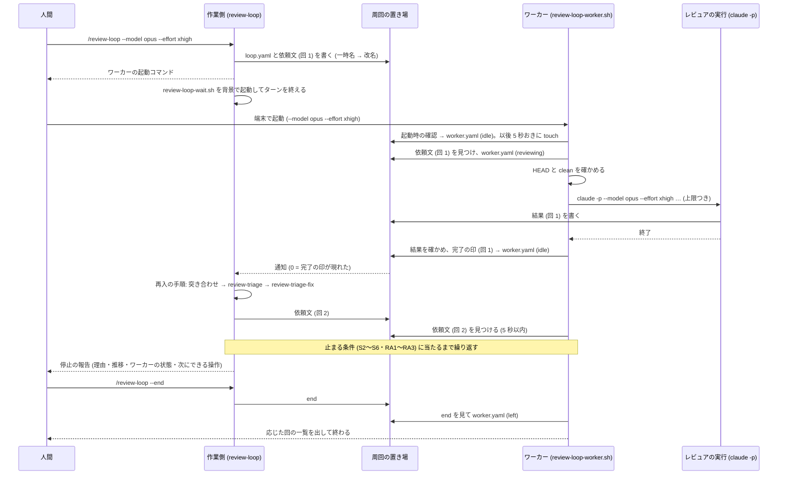
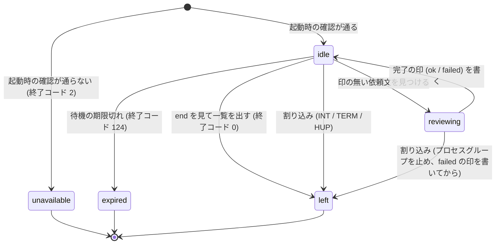
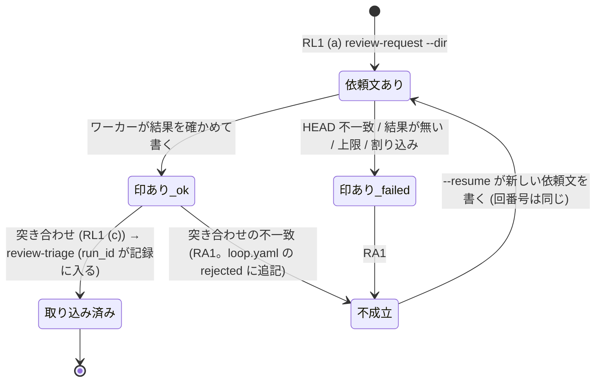
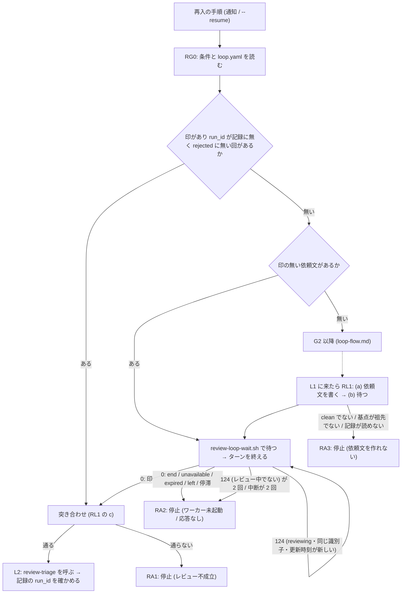

# レビューを端末のワーカーに任せて周回する (review-loop / review-loop-worker) - Plan

要件の出所は GitHub の Issue [akm/claude-plugins#63](https://github.com/akm/claude-plugins/issues/63)。Issue はレビュー側を対話セッションとし、名前を `review-rally` / `review-rally-server` としていたが、計画の文書レビューで「レビュー側を人間が起動するスクリプトにし、依頼文ごとに `claude -p` を走らせる」案が挙がり、利用者がそちらを採った。名前は `review-loop` (作業側のスキル) と `review-loop-worker` (レビュー側のスクリプト) に決めた。Issue と食い違う点は Goal Capsule の「Product Contract の保全」に挙げる。

## Goal Capsule

- **目的**: レビューと修正の周回を、人間がモデルと effort を決めた別のプロセス (ワーカー) にレビューを任せる形で回せるようにする。人間の操作は、ワーカーを端末で 1 回起動することと、周回が止まった後の判断だけにする。周回の記録に経路とワーカーのモデル・effort が残り、sub-agent 経路 (`review-triage-loop`) との収束の違いを後から比べられる。
- **手段**: スキル `review-loop` (作業側) とスクリプト `review-loop-worker.sh` (ワーカー) を review-triage プラグインに足し、2 つのプロセスの受け渡しを周回の置き場 (ディレクトリ) の中のファイルだけで行い、作業側の待機を同梱のスクリプトで背景で行う (KTD1〜KTD5)。
- **優先順位**: 効き目の中心はワーカーのスクリプト (レビュー側の判断をすべてテストできるコードにする) と、作業側の再入の手順。
- **正本の優先順位**: 製品の振る舞いは Product Contract の R-ID が正本。実装の選び方は Planning Contract の KTD が正本。実装単位 (U-ID) はどちらも書き換えない。
- **止まる条件**: 作業側の背景の待機が対話セッションで 10 分を越えて続くこと、`claude -p` の 1 回の実行が 30 分を越えても打ち切られないことは、2026-09-26 に 1 回ずつ実測して成り立った (Dependencies / Assumptions)。通し確認で打ち切りが出たら、設計 (KTD3・KTD4) を変えずに止めて報告し、代替 (短い期限の繰り返しにして中断ではなく期限で数える) を人間に返す。`review-triage-loop`・`review-triage`・`review-triage-fix` のファイルや記録のスキーマを変えなければ実装できないと分かったら、変えずに止めて人間に返す。既存の記録 (`tmp/review-triages/`・`docs/review-triage/`) が書き換わる形になったら止める。
- **実行の型**: 2 本のスクリプトはテスト (python の unittest。`claude` の代わりに置く偽のコマンドで動かす) を先に書いて固める。作業側の手順書 (Markdown) は、対話セッション 1 つと端末 1 つを実際に開いて通し確認する (Verification Contract)。文書を変えたら `doc-dag` と `wording-guard` を回す。
- **後始末の所有**: この計画の PR は人間が作る。コミットは動機ごとに分ける (規範は利用者のコミットルール)。
- **Product Contract の保全**: 出所は Issue #63。変更あり。(1) レビュー側を対話セッションではなく、人間が起動するスクリプト (`claude -p` を依頼文ごとに走らせる) にした (Key Decisions の 2 番目)。(2) 名前を `review-loop` / `review-loop-worker` にした。(3) 段階 2 (セッション間メッセージ) を落とした — ワーカーがレビュー中も動いていることの印を出し、失敗を即座に印にするので、停滞の検知が期限を待たずにできる。(4) 完了の印から導出できる項目を外し、識別子だけを持たせる (KTD2)。(5) 相手を起こすファイルは一時名に書いてから改名する (KTD4)。(6) 作業側の待機を同梱のスクリプトで行う (KTD3)。(7) `--resume` は `active` の周回も対象にする (R21)。(8) 停止ノードを 3 つ足す (KTD9)。(9) 依頼文に埋める出力先を絶対パスにする (KTD12)。(10) `review-request.md` に `run_id` の受け渡しの 1 文を足す (KTD6。`review-triage` の SKILL.md は変えない)。

---

## Product Contract

### Summary

review-triage プラグインに、作業側で回すスキル `review-loop` と、レビューを行うワーカーのスクリプト `review-loop-worker.sh` を足す。作業側は依頼文を周回の置き場に書いて完了の印を待ち、判定と修正をして次の依頼文を書く。ワーカーは印の無い依頼文を見つけるたびに `claude -p` を人間が決めたモデルと effort で走らせ、結果を確かめて完了の印を書く。受け渡しは周回の置き場の中のファイルだけ、周回の判定は `review-triage-loop` の状態機械を正本として参照する。既存への変更は `review-request` の置き場の引数と実行識別子の埋め込み、設定の `review_loop` の節、README と CONCEPTS の更新に留め、記録のスキーマと `review-triage-loop` は変えない。

### Problem Frame

`review-triage-loop` はレビューを同じセッションの sub-agent で走らせる。この形では指摘が収束しないことが多く、レビューを別のセッションで走らせると収束に向かいやすい、という観察が Issue #63 の出発点である。確かな違いは 2 つある — レビューを走らせるモデルとセッションの effort (推論の深さ) を人間が選べること、そして sub-agent は呼び出し時に effort を指定できない (agent 定義の frontmatter でしか受けない) こと。残りの違い (レビュースキルが使える Claude Code のツール — `Bash`・`Read`・`Skill` など、モデルが作業のために呼び出す機能 — の違い、レビュアと修正者の文脈の分離) は仮説で、この計画は記録に経路を残して後から比べられるようにする。

Issue の案 (レビュー側を人間が開く対話セッションにする) では、レビュー側の状態や起動時の確認を LLM の手順書に頼ることになり、effort は期待値のまま確かめられず、回を重ねるとレビュー側の文脈が長くなる。ワーカーをスクリプトにすると、effort は起動引数で確定し、回ごとに新しい `claude -p` の実行になるので文脈は長くならず、レビュー側の判断がすべてテストできるコードになる。失うのは、レビュー側を人間が対話で見守り割り込むことである。利用者はそれを承知でこの形を選んだ。

### Key Decisions

- **名前は `review-loop` (作業側のスキル) と `review-loop-worker` (ワーカーのスクリプト)** (session-settled: user-directed — chosen over `review-rally` / `review-rally-server`・queue / worker・inbox / server・external: 作業側から見えるのは「レビューを回す」ことだけで、交互に打ち合う様子は見えない。置き場には依頼文が基本的に 1 つしか無いので queue でもない)。Governs R1。
- **レビュー側は、人間が端末で起動するスクリプトにし、依頼文ごとに `claude -p` を走らせる** (session-settled: user-directed — chosen over 人間が開く対話セッションで `review-rally-server` スキルを走らせる案: effort が起動引数で確定し、文脈が回を重ねて長くならず、レビュー側の判断がテストできるコードになる。対話で見守り割り込むことはできなくなる)。Governs R23〜R31。
- **`review-loop` は独立した周回にし、`review-triage-loop` のファイルは変えない** (session-settled: user-directed — chosen over `review-triage-loop` に経路を足す案: 既存のスキルを変えずに済む)。周回の順序・分岐・止まる条件は `review-triage-loop` の `references/loop-flow.md` を正本として参照し、差し替える部分だけを `review-loop` の references に書く。Governs R16, R18。
- **停止 (S2〜S6) と周回の終了は別で、終了は `review-loop --end` で人間が指示する** (session-settled: user-approved — chosen over 採択 0 で両方を終了する案: 収束の後の最終確認や、選択待ちに答えた後の続きで、ワーカーを起動し直さずに済む)。Governs R13, R20, R22。
- **受け渡しはファイルだけ、作業側の待機は背景のシェルのループ** (session-settled: user-approved — chosen over Monitor ツール・ファイル変更通知・セッション間メッセージを主にする案: 版や権限モードの条件に依存せず、待っている間はトークンを消費しない)。Governs R6〜R12。
- **セッション間メッセージは使わない** (session-settled: user-approved — Issue では段階 2 に置いたが、ワーカーがレビュー中も動いていることの印を出し、失敗を即座に印にするので、停滞の検知にメッセージは要らない)。Governs R11, R30。
- **機械検査 (`triagecheck` の拡張) は足さない** (session-settled: user-approved — chosen over 置き場のファイルの様式検査を足す案: 様式の検査はワーカーのスクリプトと作業側の手順が行う)。Governs R12。
- **通し確認は `code-review` の経路で行う** (session-settled: user-approved — chosen over `ce-code-review` も通し確認する案: 手順には書くが、確認の費用は抑える)。Governs R26。
- **`--end` は印の無い依頼文があれば人間に尋ねる** — 待つか捨てるかで費用と記録が変わるので、スキルが決めない。Governs R22。
- **1 つのブランチに終わっていない周回は 1 つだけ** — 2 つあると同じ記録の同じ回番号の依頼文が 2 つできる。Governs R3。

### Actors

- A1. 人間 — 作業側で `review-loop` を起動し、案内されたコマンドで端末にワーカーを起動し、停止の後に判断する。周回の間は作業ツリーを変えない。
- A2. 作業側 — `review-loop` を実行する Claude Code のセッション (Claude Desktop app でも CLI でもよい)。依頼文を書き、完了の印を待ち、`review-triage` と `review-triage-fix` を呼び、停止・再開・終了を扱う。
- A3. ワーカー — スクリプト `review-loop-worker.sh` を走らせる端末のプロセス。依頼文ごとに `claude -p` を起動し、結果を確かめて完了の印を書き、次の依頼文か終了を待つ。
- A4. レビュアの実行 — ワーカーが起動する `claude -p` の 1 回。依頼文のとおりレビュースキルを呼び、結果を書く。人間に問えない。
- A5. `review-request` — 依頼文を書く既存のスキル。置き場の引数と `run_id` の埋め込みが増える。
- A6. `review-triage` / `review-triage-fix` — 判定と修正を担う既存のスキル。変えない。
- A7. 作業側の待機スクリプト — プラグインに同梱し、作業側が背景で走らせる。ファイルの出現と期限を終了コードで返す。

### Requirements

**周回の開始と案内**

- R1. スキルの名前は `review-loop` (`review-triage/skills/review-loop/`)、ワーカーのスクリプトは `review-triage/scripts/review-loop-worker.sh`。
- R2. `review-loop` は条件を引数 > 設定 > 既定の順で決め、決めた値を始める前に検査する。値の誤りは出所 (引数か設定か) を添えて報告して終わる。ワーカーに求めるモデルと effort が決まらなければ人間に尋ね、推測しない。引数の様式は `references/arguments.md` が正本 (KTD1)。
- R3. 開始の前提は、作業ツリーが clean であること、周回の置き場が git に無視されていること、記録 YAML が読めること (無い場合は新規として扱う)、同じブランチに `ended` でない周回が無いこと。満たさなければ始めず、何を片付ければよいかを報告する。`ended` でない周回があれば `--resume` か `--end` を案内する。
- R4. 開始時に周回の置き場 `<review_loop.dir>/<周回 id>/` を作り、`loop.yaml` に条件と状態を書く。周回 id は `<YYYYMMDD>-<hhmm>-<ブランチ名>` で、ブランチ名の整え方は `review-request` の手順 3 と同じ。
- R5. 開始時と停止時の報告に、人間がワーカーを起動するためのコマンドをコピーできる形で出す — スクリプトの絶対パス (`${CLAUDE_PLUGIN_ROOT}` を展開したもの)、周回の置き場の絶対パス、`--model` と `--effort`、設定 `review_loop.permission_mode` と `review_loop.allowed_tools` が設定されていれば `--permission-mode` と `--allowed-tools` (一覧の要素ごとに 1 つ。`Bash(git diff:*)` の括弧と `*` をシェルが展開しないように、各要素を単一引用符で囲む)、作業側と同じ作業ツリーで起動すること、周回の間は作業ツリーを変えないこと。Claude Desktop app で端末のツールが使えるときは、そのコマンドを端末のタブで起動することを人間に提案してよい (起動するかどうかとモデル・effort は人間が決める)。

**受け渡しの契約 (ファイル)**

- R6. 周回の置き場の中のファイルは、どれも書く側が 1 つ。作業側が書くのは `loop.yaml`・依頼文・`end`。ワーカーが書くのは `worker.yaml`・完了の印・レビュアの実行のログ。レビュアの実行が書くのは結果 (依頼文が指す出力先)。読む側は書き換えない。様式の正本は 1 つの references (KTD2) で、作業側のスキルとワーカーのスクリプトがそれに従う。
- R7. 依頼文と結果は `review-request` が `--dir` で周回の置き場に書く。依頼文に埋める出力先は絶対パス (KTD12)。雛形の `run_id` は識別子で埋める (KTD6)。識別子は `review-request` が付けるものをそのまま使う。
- R8. 完了の印 `delivered-<識別子>.yaml` はワーカーが結果を確かめた後に書く。持つのは識別子・`status` (`ok` / `failed`)・`model` (ワーカーに渡した指定と、レビュアの実行の出力から取れた実効モデルの名前)・`effort` (ワーカーに渡した値)・`skill_called` (レビュアの実行の出力から取れれば真偽、取れなければ `unknown`)・`permission_denials` (許可されずに拒否されたツールの呼び出しの件数とツール名の一覧。ログから取れなければ `unknown`)・`head_before`・`head_after`・`tree_clean_after`・`started`・`finished`・`exit_code` (レビュアの実行の終了コード)・`error`・`log` (ログのファイル名)。識別子から導出できるファイル名は持たない。
- R9. `worker.yaml` はワーカーが起動時に書き、状態が変わるたびに書き換え、動いている間は 5 秒おきに更新時刻を進める (レビュアの実行中も)。持つのは `state` (`idle` / `reviewing` / `expired` / `unavailable` / `left`)・`current_request` (識別子)・`pid`・`model`・`effort`・`permission_mode`・`cwd`・`head` (起動時)・`started`・`updated`・`rounds_served`・`error` (`unavailable` のとき)。
- R10. `end` は作業側が `--end` で書く (理由 1 行)。ワーカーは `end` を見たら応じた回の一覧を標準出力に出して終わる。人間が `end` を直接置いた場合も同じ。
- R11. 相手を起こすファイル (依頼文・完了の印・`worker.yaml`・`end`・`loop.yaml`) は、同じディレクトリの一時名に書いてから改名する (KTD4)。待機と探索は一時名に反応しない。
- R12. 読む側は、読む前に最低限の検査を行う。ワーカーは依頼文に埋め残しの `{{` が無く「出力様式」の節があることを、作業側は完了の印と `worker.yaml` が YAML として読め必須キーがあることと、結果 YAML に `findings` キーがあり `run_id` が識別子と一致することを確かめる。検査に通らないときの態度はファイルの種類で決める — 設定 (`review_loop` 節) は既定値で続行して警告、状態 (`loop.yaml`) は壊れていれば止めて知らせる (新規に寄せない)、レビュアの実行が書く結果は形が違えばワーカーが `failed` の印にする、ワーカーが書くファイルが読めなければ作業側は「レビュー不成立」(RA1) として止める。書きかけを待ち直しの経路に入れない。

**作業側の待機**

- R13. 作業側の待機はプラグイン同梱のスクリプト `review-triage/scripts/review-loop-wait.sh` で行う (KTD3)。返る事象は、完了の印 (`status` が `ok` なら印・依頼文・結果の 3 点一致、`failed` なら印と依頼文の 2 点一致)・`end`・`worker.yaml` の出現 (無い状態から現れた)・`worker.yaml` の `unavailable` / `expired` / `left`・`worker.yaml` の更新時刻が `review_loop.worker_stale_seconds` (既定 30) より古いこと (停滞。ワーカーのプロセスが居なくなった印)。`worker.yaml` が無い間は停滞と判定しない。終了コードは 0 (現れた。何が現れたかは標準出力の 1 行)、124 (期限切れ)、それ以外 (中断)。期限は壁時計の締切で測る。
- R14. 待機を始めたターンでは、それ以外を何もせずにターンを終える。待機の Bash 呼び出しの `description` には、周回 id・回・終了コードの意味・通知を受けたら再入の手順に入ることを書く (KTD10)。
- R15. 待機の期限は設定 `review_loop.wait_minutes` (完了の印を待つ上限。既定 60) と `review_loop.worker_wait_minutes` (回 1 で `worker.yaml` の出現を待つ上限。既定 15) で決め、引数 `--wait-minutes`・`--worker-wait-minutes` で上書きできる。期限切れ (124) のときは、宣言する前にファイルの有無をもう 1 度確かめる。作業側は 2 回続けて期限切れなら止める (RA2)。ただし、期限切れのときに `worker.yaml` が `reviewing` で、`current_request` が待っている識別子と一致し、更新時刻が `worker_stale_seconds` 以内なら、ワーカーはその依頼文をレビュー中なので、回数に数えずに待ち直す (待つ長さの上限はワーカーの `--review-timeout-minutes` が保証する。これが無いと、待機の期限の 2 倍より長くかかる正常なレビューも RA2 で止まる)。例外は回 1 の最初の待機で、`worker_wait_minutes` を期限にして起動し、その期限切れは `worker.yaml` が無ければ待ち直さずに RA2 とし、回数に数えない。`worker.yaml` が現れた後の待機は `wait_minutes` を期限にして起動し直す。中断 (それ以外) は 1 回だけ待ち直し、2 回目は止める。

**周回 (作業側)**

- R16. 周回の順序・分岐・止まる条件・報告は `review-triage-loop` の `references/loop-flow.md`・`references/reporting.md` を正本として参照し、言い直さない。`review-triage-loop` を呼ぶのではなく、同じ図に従って `review-loop` 自身が `review-triage` と `review-triage-fix` を呼ぶ。G0 と L1 だけは `review-loop` の references が正本になる (KTD1)。
- R17. L1 は 3 つの手順に置き換える — (a) `review-request --dir` で依頼文を書く、(b) 完了の印を待つ (R13)、(c) 完了の印と結果を依頼文と突き合わせる。突き合わせの順序は `status` → HEAD と作業ツリー (印の値と、作業側自身の `git rev-parse` / `git status`) → effort とモデル (名前で比べる。KTD7) → 拒否されたツールの呼び出し (`permission_denials` が 1 件以上なら RA1 にし、報告に拒まれたツール名と、許可の一覧を直すためのワーカーの起動コマンドを書く。調べられなかった範囲の指摘が欠けた結果を、採択 0 の収束として記録に入れないため) → 結果 YAML の `run_id` == 識別子 → 様式。どれかが通らなければ RA1。L2 (`review-triage` を呼ぶ) の直後に、記録の末尾の回の `run_id` が識別子と一致することを確かめ、一致しなければ `review-triage` が `run_id` を写さなかった旨を添えて RA1 で止める。増分の基点 (直前の回の `head`) が現在の HEAD の祖先でなければ依頼文を書かずに RA3 (KTD13)。
- R18. 停止ノードを 3 つ足す — RA1 レビュー不成立 (印が `failed`・突き合わせの不一致・様式の差し戻し)、RA2 ワーカー未起動または応答なし (`worker.yaml` が無い・`unavailable`・`expired`・`left`・停滞・ワーカーがその依頼文をまだ取り上げていないまま 2 回続けての期限切れ)、RA3 依頼文を作れないまたは記録が読めない (作業ツリーが汚れている・識別子の衝突・記録の破損・基点が祖先でない)。定義と報告に書くものは `review-loop` の references の決定表が正本 (KTD9)。S2〜S6 と同じく `loop.yaml` を `state: stopped` にし、ワーカーは待機を続ける。RA1 で止めるときは、その回の識別子を `loop.yaml` の `rejected` (不成立と判定した回の識別子の一覧) に追記する。
- R19. 通知で入る手順と `--resume` の手順は同じ 1 つの入口 (再入の手順) にする (KTD10)。入口は `loop.yaml` を読み直し、状態が `active` / `stopped` でなければ報告して終わり、完了の印があり `run_id` が記録に無く `loop.yaml` の `rejected` に含まれない回を取り込み、印の無い依頼文があれば待ち、どちらも無ければ周回の入口 (G2・G3) へ進む。`run_id` の照合は空でない値の完全一致に限る。通知が 2 回来ても 2 回目は何もしない。通知を人間の答え (S2 の回答など) として扱わない。
- R20. 停止時は `loop.yaml` を `state: stopped`・`stop_reason` (ノード ID と 1 行) にし、`review-triage-loop` の報告 (`reporting.md` の 6 項目と、停止ノードごとに足すもの) に、周回の id と置き場、ワーカーの状態 (`worker.yaml` から)、印の無い依頼文の有無、この起動で回した回数と周回全体で応じた回数、次にできる操作 (`--resume` / `--end` / `review-triage-fix` に答える) とワーカーの起動コマンドを足す。S3 では「最終確認の全量は周回の外」と書く。
- R21. `--resume [<置き場>]` は、ブランチの `active` か `stopped` の周回 (引数があればそれ。複数あれば id の新しいもの) を再入の手順で続ける。依頼文を書く前にワーカーが居るか (`worker.yaml` の状態と更新時刻) を確かめ、居なければ起動コマンドを案内して待つ。RA1 で止まった回はやり直しの対象として新しい依頼文を書く (識別子が衝突するなら分が変わるまで待つ)。上限 (J5) は周回と同じく起動ごとに 0 から数え、`--max` を受け付ける。`active` を再開したときは、前のセッションが報告せずに終わったことを報告に書く。
- R22. `--end [<置き場>]` は、印の無い依頼文があれば人間に「印を待つ / 捨てる」を尋ね、`end` を書き、`loop.yaml` を `state: ended` にする。`end` が既にあれば (人間が置いた場合)、`loop.yaml` を `ended`・理由「end を外部で置かれた」に書き換える。

**ワーカー**

- R23. `review-loop-worker.sh <置き場の絶対パス> --model <指定> --effort <値> [--permission-mode <値>] [--allowed-tools <ツール>]... [--idle-minutes <分>] [--review-timeout-minutes <分>] [-- <claude に渡す追加の引数>]` で起動する。`--model` と `--effort` は必須で、既定を持たない (人間が決める)。`--allowed-tools` は繰り返して指定でき、1 回でも指定すれば R26 の既定の一覧を置き換える (設定 `review_loop.allowed_tools` をワーカーに届ける経路。ワーカーは設定を読まない)。`--` 以降は `claude -p` にそのまま渡す (`--plugin-dir` や `--settings` を通し確認で使う)。
- R24. 起動時の確認を行う。最初に、動いているワーカーが居るかを判定する — `worker.yaml` の `state` が `idle` / `reviewing` で、更新時刻が 30 秒以内で、`kill -0 <pid>` が成功する、の 3 つがすべて成り立てば、他のワーカーか端末を閉じたのに残ったプロセスが居るので、`worker.yaml` に触れずに PID と止め方を出して終了コード 2 で終わる (更新時刻を条件に加えるのは、`kill -9` の後に PID が別のプロセスに再利用された場合に居ないワーカーを居ると判定しないため)。この判定を通った後の確認は、通らなければ `worker.yaml` を `unavailable` と理由で書いて終了コード 2 で終わる — 置き場に `loop.yaml` があり読めること、実体パスに解決した `git rev-parse --show-toplevel` が `loop.yaml` の `repo_dir` と一致すること (別の worktree は `--git-common-dir` の一致で判別して報告する)、`end` が無いこと、`claude` コマンドがあること。通れば `worker.yaml` を `idle` で書き、5 秒おきに更新時刻を進める処理を始める。
- R25. 印の無い依頼文を 5 秒おきに探し (識別子の順で最初の 1 つ)、見つけたら `worker.yaml` を `reviewing` と識別子にし、`git rev-parse --short HEAD` が依頼文の `head` と一致し作業ツリーが clean であることを確かめる。違えばレビュアの実行を起動せずに `failed`・`error: head mismatch (expected …, actual …)` (または `tree not clean`) の印を書き、`idle` に戻る。
- R26. レビュアの実行は `claude -p` を、`--model`・`--effort`・`--permission-mode` (ワーカーの `--permission-mode` の値。指定が無ければ `default`)・`--allowedTools` (ワーカーの `--allowed-tools` の値。指定が無ければ既定の一覧 — git の読み取り・ファイルの読み取り・Skill・Agent。どちらの場合も、その回の結果ファイル 1 つへの書き込みの許可 `Edit(//<結果の絶対パス>)` をワーカーが足す。結果の絶対パスは識別子から導出する)・`--disallowedTools AskUserQuestion`・`--output-format stream-json`・`--verbose` と、`--` 以降の追加の引数で起動し、標準出力と標準エラーを置き場の `<識別子>.log` に残す。プロンプトは固定の 1 文「依頼文 `<絶対パス>` のとおりに作業し、結果を依頼文が指す出力先に書く」で、依頼文の中身は写さない。実行には `--review-timeout-minutes` (既定は設定 `review_loop.review_timeout_minutes`、それも無ければ 60) の上限を付け、越えたら止めて `failed`・`error: timeout` にする。`ce-code-review` のように JSON を返す skill を依頼文が指す場合は、依頼文の「出力様式」のとおり結果 YAML を書くことをレビュアの実行に求める (対応表は `review-triage-loop` の `references/review-invocation.md` を参照する) — ワーカーは変換しない。
- R27. レビュアの実行が終わったら、結果ファイルが存在し、`findings:` の行と識別子入りの `run_id` の行があり、前後で HEAD と作業ツリーが不変であり、周回の置き場のファイルが結果と `<識別子>.log` を除いて前後で変わっていないことを確かめ、完了の印を `ok` で書く。置き場の比較は、レビュアの実行の前後でファイルの一覧と各ファイルの更新時刻を記録して行う (置き場は git に無視されているので、作業ツリーの確認では検出できない。レビュアの実行が依頼文や `end` を置くと、ワーカーや作業側がそれに従ってしまう)。どれかが通らなければ `failed` と `error` (何が通らなかったか。作業ツリーが汚れていればその一覧、置き場が変わっていれば `loop dir modified (<一覧>)`) で書く。実効モデルと skill を呼んだかは、ログ (stream-json) から取れれば書き、取れなければ `unknown` にする。読み方は次のとおりで、正本は `references/worker.md` — ログは 1 行ずつ JSON として読み、読めない行 (標準エラーの行など) は飛ばす。実効モデルは `type` が `system` で `subtype` が `init` の行の `model` だけから読む。`parent_tool_use_id` が空でない行 (レビュースキルが起動した sub-agent の行) は、モデルにも skill の呼び出しの判定にも使わない。`skill_called` は、最上位の `type: assistant` の行の content にある `tool_use` のうち `name` が `Skill` のものだけで判定し、ツールの結果 (`type: user` の行の tool_result) の中身は読まない (レビュー対象のファイルに `Skill` やモデル名の文字列が含まれていても判定が変わらないようにするため)。拒否されたツールの呼び出しは、最後の `type: result` の行の `permission_denials` (配列) から件数とツール名を読む。印を書かずに次へ進まない。
- R28. `end` が現れたら `worker.yaml` を `left` にし、応じた回の一覧 (識別子・`status`・モデル・effort・所要時間・`error`) を標準出力に出して終了コード 0 で終わる。印の無い依頼文が無いまま `--idle-minutes` (既定は設定 `review_loop.worker_idle_minutes`、それも無ければ 180) が過ぎたら `expired` にして、周回は終わっていないことと同じコマンドで起動し直せることを出して終了コード 124 で終わる。割り込み (SIGINT / SIGTERM / SIGHUP。SIGHUP は端末を閉じたとき) を受けたら、進行中の回があれば、レビュアの実行のプロセスグループ全体に TERM を送り、数秒後に残っていれば KILL を送り、すべて止まったことを確かめてから `failed`・`error: interrupted` の印を書く。進行中の回があってもなくても、更新時刻を進める背景の処理を止め、`worker.yaml` を `left` にして終わる。上限 (`--review-timeout-minutes`) を越えたときも、同じ手順でプロセスグループ全体を止めてから `failed`・`error: timeout` の印を書く。
- R29. ワーカーは `claude -p` (上限つき) をそれ専用のプロセスグループで背景に起動し、`wait` で終わりを待つ。前景で待たないのは、bash が前景のコマンドを待っている間は trap の処理をそのコマンドが終わるまで遅らせるためと、GNU の `timeout` は別のプロセスグループで動くので端末の Ctrl-C が `claude -p` に届かないためである。待っている間も更新時刻を進める。ワーカー自身は git の状態を変えない (レビュアの実行が変えた場合は R27 で検出する)。
- R30. ワーカーのスクリプトは python の unittest で検査する。`claude` の代わりに PATH の先頭に置く偽のコマンド (引数を記録し、指示どおりに結果ファイルを書く・書かない・止まる) で、`claude` を呼ばずに全経路を通す。

**記録・設定・文書**

- R31. 記録のスキーマは変えない。作業側は `review-triage` に渡す `notes` の 1 行を固定の書式で指定する — `review-loop: <周回 id> / worker_model: <指定> (実効: <名前 or 不明>) / worker_effort: <値> / skill_called: <真偽 or 不明> / permission_denials: <件数 or 不明> / review_minutes: <分>`。記録の `model` / `skill` / `level` / `scope` の出所は `review-invocation.md` の「記録のキーの出所」の `code-review` (または `ce-code-review`) の列と同じで、「sub-agent の報告」を完了の印と読み替える (KTD8)。
- R32. 設定 `config.json` に `review_loop` 節を足す — `dir` (既定 `tmp/review-loop`)・`wait_minutes` (60)・`worker_wait_minutes` (15)・`worker_idle_minutes` (180)・`worker_stale_seconds` (30)・`review_timeout_minutes` (60)・`worker_effort` (ワーカーに求める effort。未設定なら人間に尋ねる)・`permission_mode` (未設定なら `default`)・`allowed_tools` (文字列の配列)。ワーカーのモデルは `loop.review_model` を共用する。`loop` と `fix` の既定値を `review-loop` も読むことを `project-config.md` の各節の導入文に 1 文足す。「未設定」の定義は `project-config.md` を参照する。ワーカーのスクリプトは設定を読まず、作業側が案内のコマンドに値を埋める。
- R33. `review-request` に `--dir <ディレクトリ>` を足す (依頼文と結果の置き場。省略時は今のまま `tmp/`)。置き場が git に無視されていることの確認は渡された置き場に対して行う。雛形の `run_id: ""` を `{{run_id}}` にして識別子で埋め、雛形のキー表の `run_id` の行を「`review-request` が識別子で埋める。受け取る側は記録の `runs[].run_id` にそのまま写す」に変える。`review-request.md` の「出力様式」の節に同じ 1 文を足す。出力先は絶対パスで埋める。依頼文は一時名に書いてから改名する。description の引数の説明を直す。
- R34. README (プラグインとルート)・`CONCEPTS.md`・`.claude-plugin/marketplace.json`・`review-triage/.claude-plugin/plugin.json` を更新する。「skill 4 つ」は「skill 5 つと、レビューを行うワーカーのスクリプト」に揃える。`CONCEPTS.md` の「レビューの収束」に用語「周回の置き場」「ワーカー」「完了の印」「再入の手順」を既存の項と同じ形で足し、定義の正本はスキル側に置く。版は 0.13.0 (独立したコミット)。

### Key Flows

- F1. 周回の開始から 1 往復
  - **起点:** 人間が作業側で `/review-loop --model <指定> --effort <値>` を打つ。
  - **関与:** A1〜A7。
  - **手順:** 作業側が条件と前提を確かめ (R2, R3)、置き場と `loop.yaml` を書き (R4)、依頼文を書き (R7)、ワーカーの起動コマンドを案内し (R5)、`worker.yaml` と完了の印を待つ (R13, R14)。人間が端末でワーカーを起動する。ワーカーが起動時の確認をして `worker.yaml` を書き (R24)、依頼文を見つけてレビュアの実行を起動し (R25, R26)、結果を確かめて完了の印を書き (R27)、次を待つ。作業側が通知で再入の手順に入り (R19)、突き合わせ (R17) を通して `review-triage` と `review-triage-fix` を呼び、次の依頼文を書く。
  - **結果:** 記録に回が追記され (`run_id`・`notes` の 1 行)、ワーカーは待機中。
  - **Covers R2〜R9, R13, R14, R17, R19, R24〜R27, R31.**
- F2. 停止から再開
  - **起点:** 周回が S2〜S6 か RA1〜RA3 で止まる。
  - **関与:** A1, A2, A3。
  - **手順:** 作業側が `loop.yaml` を `stopped` にして報告する (R20)。人間が判断し (S2 なら `review-triage-fix` に答える)、`--resume` を打つ。作業側がワーカーの存在を確かめ、再入の手順で続ける (R21)。
  - **結果:** 周回が続く。ワーカーは待機中のまま (期限内)。
  - **Covers R18, R20, R21.**
- F3. 終了
  - **起点:** 人間が `--end` を打つ、または `end` を直接置く。
  - **関与:** A1, A2, A3。
  - **手順:** 作業側が印の無い依頼文の扱いを尋ね、`end` を書き、`loop.yaml` を `ended` にする (R22)。ワーカーが `end` を見て一覧を出して終わる (R10, R28)。
  - **結果:** 周回が終わる。置き場は残る。
  - **Covers R10, R22, R28.**
- F4. ワーカーの失敗
  - **起点:** ワーカーの起動時の確認が通らない、依頼文の `head` と HEAD が違う、レビュアの実行が結果を書かない・止まる。
  - **関与:** A2, A3, A4。
  - **手順:** 起動時なら `worker.yaml` を `unavailable` にして終わる (R24)。回の途中なら `failed` の印を書く (R25〜R27)。作業側は前者を RA2、後者を RA1 で止めて報告する (R18)。
  - **結果:** 人間が直して `--resume` する。
  - **Covers R18, R24〜R27.**

### Acceptance Examples

- AE1. 正常な 1 往復
  - **Covers F1.**
  - **Given:** 作業ツリーは clean、`tmp/` は無視されている、記録は無い。
  - **When:** `/review-loop --model opus --effort xhigh` を打ち、案内されたコマンドで端末にワーカーを起動する。
  - **Then:** `worker.yaml` (`idle` → `reviewing` → `idle`)、結果、完了の印 (`ok`) の順に現れ、作業側が `review-triage` を呼び、記録の回 1 に `run_id` = 識別子、`model` = 名前、`notes` に固定書式の 1 行が入る。待機を始めたターンで作業側は他の操作をしていない。
- AE2. 2 往復目が増分
  - **Covers R17.**
  - **Given:** AE1 の後、`review-triage-fix` がコミットした。
  - **When:** 作業側が L1 に戻る。
  - **Then:** 回 2 の依頼文の `base` が回 1 の `head`、`scope` が `incremental`。ワーカーは同じプロセスのまま回 2 を処理する。
- AE3. 待ち直しで二重に取り込まない
  - **Covers R19.**
  - **Given:** 完了の印 (`ok`) が現れた直後に作業側で `--resume` を打つ。
  - **Then:** 記録の回は増えない (`run_id` の一致で取り込み済みと判定)。
- AE4. 空の `run_id` の過去の回
  - **Covers R19.**
  - **Given:** 記録に `run_id: ''` の回が 3 回ある。
  - **When:** 新しい完了の印を取り込む。
  - **Then:** 空の回とは照合せず、回 4 が追記される。
- AE5. レビュアの実行が `run_id` を空で書いた
  - **Covers R27.**
  - **Then:** ワーカーが `failed`・`error: run_id mismatch` の印を書き、作業側は RA1 で止まり、記録は増えない。
- AE6. ワーカーを別の worktree で起動した
  - **Covers R24, F4.**
  - **Then:** ワーカーは `worker.yaml` を `unavailable` と「別の worktree」の理由で書いて終了コード 2 で終わる。作業側は期限を待たずに RA2 で止まり、正しい作業ツリーでの起動コマンドを案内する。
- AE7. レビュアの実行中に作業側でファイルを変えた
  - **Covers R27.**
  - **Then:** 完了の印の `tree_clean_after` が偽で `failed`、作業側は RA1 で止まり `review-triage` を呼ばない。
- AE8. HEAD の不一致
  - **Covers R25, F4.**
  - **Given:** 依頼文の `head` と違う HEAD でワーカーが依頼文を見つけた (人間がコミットした後の古い依頼文など)。
  - **Then:** レビュアの実行を起動せずに `failed`・`error: head mismatch (expected …, actual …)` の印が書かれる。
- AE9. 作業側セッションを閉じて再開する
  - **Covers R21.**
  - **Given:** 待機中の作業側セッションを閉じる (`loop.yaml` は `active` のまま)。
  - **When:** 新しいセッションで `--resume <置き場>` を打つ。
  - **Then:** 印を待つところから続く。報告に、前のセッションが報告せずに終わったことが書かれる。
- AE10. ワーカーが期限切れで去った後に依頼文を書く
  - **Covers R13, R18, R21.**
  - **Then:** 作業側は `worker.yaml` の `expired` で 1 周期以内に RA2 で止まり、起動コマンドを案内する。起動し直すと、ワーカーは印の無い依頼文から続く。
- AE11. 人間が `end` を直接置く
  - **Covers R10, R22.**
  - **Then:** ワーカーは一覧を出して終わり、作業側は同じ周期で止まって `loop.yaml` を `ended` に書き換える。
- AE12. S2 の後に答えて `--resume` する
  - **Covers R20, R21.**
  - **Given:** `awaiting-human` の問題がある。
  - **When:** `review-triage-fix` を単独で起動して答え、`--resume` を打つ。
  - **Then:** G2 で選択待ちが無く、G3 を経て (残りが無ければ) L1 に進む。
- AE13. `--end` と印の無い依頼文
  - **Covers R22.**
  - **Then:** 「印を待つ / 捨てる」を尋ねられる。「待つ」なら印の後に `end` が書かれ、ワーカーは印を書いてから終わる。
- AE14. 2 つ目のワーカー
  - **Covers R24.**
  - **Given:** 待機中のワーカーがある。
  - **When:** 別の端末で同じコマンドを起動する。
  - **Then:** 起動時の確認で `worker.yaml` の `pid` のプロセスが動いていると分かり、PID と止め方を出して終了コード 2 で終わる。`worker.yaml` は書き換えない。
- AE15. レビュアの実行が止まる
  - **Covers R26, R28.**
  - **Given:** `--review-timeout-minutes 1` で起動し、偽の `claude` が終わらない。
  - **Then:** 1 分で止められ、`failed`・`error: timeout` の印が書かれ、ワーカーは `idle` に戻る。
- AE16. ワーカーへの割り込み
  - **Covers R28.**
  - **Given:** レビュアの実行中に端末で Ctrl-C を押す。
  - **Then:** レビュアの実行が止まり、`failed`・`error: interrupted` の印と `worker.yaml` の `left` が書かれ、作業側は次の周期で RA1 か RA2 で止まる。
- AE17. ワーカーのプロセスが消えた
  - **Covers R13.**
  - **Given:** 待機中のワーカーを `kill -9` で消す。
  - **Then:** `worker.yaml` の更新時刻が止まり、作業側は `worker_stale_seconds` の後に停滞 (RA2) で止まる。起動し直すと、古い `pid` のプロセスは終了しているので起動時の確認を通る。

### Success Criteria

- 通し確認の成功の経路 (AE1・AE2) で、人間が行った操作がワーカーの起動・停止後の判断の 2 種類だけである (KTD15 の権限モードで走らせたとき)。
- 待機中の作業側は、待機のターンでツールを呼ばず、通知で次のターンが始まる。ワーカーはレビュアの実行の外でトークンを消費しない。
- 記録に `run_id` と固定書式の `notes` が入り、ワーカーに渡した effort が残る (effort は `claude -p` のログに出ないので、実行時の値は確かめられない。Dependencies / Assumptions)。同じ回が 2 つできない。既存の記録と生成サマリは書き換わらない。
- ワーカーのスクリプトの全経路 (AE5〜AE8・AE10・AE11・AE14〜AE17) が偽の `claude` のテストで通る。
- `review-triage-loop`・`review-triage`・`review-triage-fix` のディレクトリと `record-schema.md`・`triagecheck` に差分が無い。

### Scope Boundaries

- `review-triage-loop`・`review-triage`・`review-triage-fix`・`record-schema.md`・`tools/triagecheck/` は変えない (Key Decisions)。`project-config.md` の 1 文と `review-request.md` の 1 文だけが review-triage 側の references への追記。
- レビュー側を対話セッションで動かす形 (Issue の案) は作らない。人間がレビュアと対話したいときは、これまでどおり `review-request` の依頼文を対話セッションに貼る運用を使う。
- セッション間メッセージ (SendMessage / `notify_when_idle`) は使わない (Key Decisions)。
- 記録のスキーマに経路のキー (`runs[].route` など) を足すことは対象外 (段階 1 の記録を比べてから)。
- `code-review` の effort `ultra` (クラウドで走る) は対象外。`review_args` に `ultra` が来たら R27 の `failed` で分かる。
- Windows は対象外 (スクリプトは macOS と Linux の bash と GNU / BSD の `stat` で動かす)。2 本のスクリプトは macOS の `/bin/bash` (3.2) で動く書き方にする — 空の配列は `${args[@]+"${args[@]}"}` で展開し (3.2 では `set -u` のもとで空の配列を `"${args[@]}"` と展開すると終了する)、連想配列・`mapfile`・`wait -n`・`$BASHPID` を使わない。作業側の `claude -p` (非対話) は対象外 — 待機の通知で次のターンが始まる対話セッションだけを前提にする。
- 作業側からワーカーを起動するのは、Claude Desktop app の端末のツールで人間が承認したときだけ。作業側がワーカーのモデルや effort を決めることはしない (`session-handoff` の原則「どのモデルで、いつ始めるかは人間が決める」)。
- 周回の置き場は消さない (後で比べる材料)。

#### Deferred to Follow-Up Work

- `review-loop --final` (最終確認の全量を同じワーカーに 1 回だけ頼む)。この計画では S3 の報告で「周回の外」と案内する。
- 却下した指摘を次の依頼文に添えて再報告を抑える案 (効き目と危険の両方があるので、記録を見て決める)。
- 置き場のファイルの様式の機械検査 (`triagecheck` の拡張) と、完了の印の項目を記録に写す機械的な経路。
- 周回との収束の比較の手段 (何本の周回を回したら、記録のどの値を並べるか)。段階 1 の記録が数本たまってから決める。
- 実効モデルと skill の呼び出しをログ (stream-json) から機械的に読む部分の精度。取れなければ `unknown` で動く。

### Dependencies / Assumptions

- Claude Code 2.1.236 (利用者の環境)。端末の `claude` は claude.ai の認証済み (Claude Desktop app とは別の認証)。
- `claude -p` は `--model`・`--effort` (low / medium / high / xhigh / max)・`--permission-mode`・`--allowedTools`・`--disallowedTools`・`--output-format stream-json`・`--plugin-dir`・`--settings` を受ける (`claude --help` で確認)。`-p` の中でも Skill と Agent のツールが使える (自動メモリの通し確認で `--plugin-dir` のスキルを `-p` で走らせた実績)。`-p` は人間に問えない。
- `claude -p` の 1 回の実行は 30 分を越えても打ち切られない (2026-09-26 に実測。`claude -p --model sonnet --effort low --permission-mode acceptEdits --allowedTools Bash --output-format stream-json --verbose` で、`timeout: 600000` を付けた前景の Bash (290 秒の待ち) を 7 回続けさせ、2051 秒で終了コード 0、`result` の行は `subtype: success`・`terminal_reason: completed`)。背景タスクの待ち上限 10 分は `-p` の実行そのものの上限ではない。
- 作業側の Bash ツールの `run_in_background` はターンをまたいで走り、終了で通知が届く。対話セッション (main。Claude Desktop app) でも、背景の `for i in $(seq 1 66); do sleep 10; done` が 660 秒で打ち切られずに終わり、完了の通知が届いた (2026-09-26 に実測)。sub-agent でも 630 秒の背景の `sleep` が打ち切られなかった。
- `claude -p --output-format stream-json --verbose` のログ (2026-09-26 に実測): `type: system`・`subtype: init` の行に `model` (モデル ID。例 `claude-sonnet-5`)・`permissionMode`・`tools`・`skills`・`plugins`・`claude_code_version` がある。effort はログのどの行にも出ない。最後の `type: result` の行に `permission_denials` (配列)・`modelUsage` (モデルごとの集計)・`is_error`・`terminal_reason`・`duration_ms`・`total_cost_usd` がある。`init` の行より前に、利用者の SessionStart のフックの `hook_started` / `hook_response` の行が出る。
- `claude -p` のレビュアの実行にも、利用者の設定・フック・インストール済みのプラグイン (`init` の行の `plugins`)・CLAUDE.md が効く (2026-09-26 に実測)。
- 前景の `sleep` は拒否されるので、作業側の待機は必ず背景で起動する。`sleep` で始まるコマンドは前景の timeout の例外扱いになるので、スクリプトの先頭は `sleep` にしない。
- Bash ツールのシェルは zsh で、`find` は同梱の bfs に置き換わっている。スクリプトは `bash` で起動し、その中の `find` は `/usr/bin/find` になる。
- macOS に `fswatch` / `inotifywait` は無い。ポーリング (5 秒) で足りる。
- 背景のタスクの通知は終了コードと `description` だけを運び、標準出力は出力ファイルに残る。通知は人間の入力ではない。

### Open Questions

**Deferred to Implementation**

- 対話セッション (main) の背景の待機 (10 分を越える) と `claude -p` の 1 回の実行 (30 分を越える) は、1 回ずつの実測では打ち切られなかった (Dependencies / Assumptions)。通し確認で打ち切りが 1 回でも出たら、待機を短い期限 (例: 10 分) の繰り返しにして中断ではなく期限で数える設計に改めるかを人間に返す (Goal Capsule)。
- 作業側の背景の待機が外から止められる条件 (セッションの切り替え・compact・app の再起動)。通し確認の再開のシナリオで、閉じる・切り替えるの両方を試す。
- レビュアの実行の権限の既定 (権限モード `default`・読み取りのツールの許可の一覧・結果ファイル 1 つへの書き込みの許可。KTD15) で `code-review` が最後まで走るか。パスを指定した書き込みの許可 (`Edit(//<絶対パス>)`) が `-p` で効くか、レビュースキルが起動した sub-agent が結果を書く場合にも効くか。通し確認で、拒まれたツールをログから数える。
- 実効モデルは `init` の行の `model` から読めることを確かめた (Dependencies / Assumptions)。skill の呼び出しの `tool_use` の形と、拒否があったときの `permission_denials` の要素の形は、実測の実行ではどちらも起きていないので、通し確認のログで確かめる。読めなければ `unknown` のままにする。
- `-p` の中で `code-review` が並行レビューを走らせるか (Problem Frame の仮説)。ログと記録の `notes` で集める。
- 依頼文の雛形の「出力様式」の節で、`review-triage` の手順 1 の例示 `tmp/review-<識別子>.yaml` が周回の置き場でも読み違えを起こさないか。起こせば例示の 1 語を直すことを人間に返す (`review-triage` は変えない決定)。
- Claude Desktop app の端末のツールでワーカーを起動する提案を段階 1 に含めるか。含めるなら、起動の承認を人間に求める形と、端末を閉じたときのワーカーの扱いを確かめる。

### Sources / Research

- Issue #63 (要件の出所)。手元の下書き `tmp/review-rally-proposal.md` (git 追跡外。対話セッション案の全文)。
- 周回の状態機械: `review-triage/skills/review-triage-loop/references/loop-flow.md` — 図が正本、決定表が条件と報告、散文はノード ID で参照 (冒頭の規律)。G0 (77 行目) と L1 (80 行目) の行、S2〜S6 の「報告に書くもの」(89〜93 行目)。`references/reporting.md` の必ず出すもの 6 項目。`references/arguments.md` の値の検査と出所の報告。`references/review-invocation.md` の「記録のキーの出所」(48〜59 行目)、「範囲」(90〜96 行目)、「起動の後に確かめること」(98〜100 行目)、部分流用の書き方の前例 (63 行目)。
- 依頼文: `review-triage/skills/review-request/SKILL.md` (手順 1〜5、識別子の成分の表、上書きしない規則)、`review-triage/skills/review-triage/references/review-request-template.md` (`run_id` は 59 行目と 80 行目)、`references/review-request.md` (出力様式の節)。
- 記録: `review-triage/skills/review-triage/references/record-schema.md` (`run_id` は任意キー)、`review-triage/tools/triagecheck/record.go` (`run_id` は許可キーで意味検査は無い。空でなければ生成サマリの回の見出しに付く)。既存の記録 `tmp/review-triages/*.yaml` は全回 `run_id: ''`。
- 段の sub-agent の依頼文と検証の流儀: `review-triage/skills/review-triage-fix/references/stage-subagent.md` (実効モデルの解決、失敗時は再試行せず止める)。
- 受け渡しの前例: `session-handoff/skills/handoff-write/SKILL.md` (貼る 1 行の様式 87〜103 行目、絶対パスを渡す理由、新しいセッションを起動しない原則)、`session-handoff/skills/handoff-resume/references/verify-state.md` (突き合わせの表)。
- スクリプトとテストの前例: `commit-rules-guard/hook-scripts/` と `commit-rules-guard/tests/` (python の unittest から subprocess で呼ぶ)、`review-triage/tools/triagecheck/README.md` (バイナリは配らない)。`${CLAUDE_PLUGIN_ROOT}` を SKILL.md の本文に書く前例は `pr-teeth/skills/pr-glossary/SKILL.md`。
- 設定: `review-triage/skills/review-triage/references/project-config.md` (`loop` / `fix` の節の形、「未設定」の定義)。このリポジトリの設定 `.claude/akm-claude-plugins/review-triage/config.json` は git 追跡内。
- 更新の慣例: コミット `1749513` (review-request の追加で触ったファイル)、`12427f1` ほか (版上げは `plugin.json` の 1 行だけの独立コミット)。`CONCEPTS.md` の「レビューの収束」(84〜99 行目) の項の形。
- 知見: `docs/solutions/architecture-patterns/fail-soft-by-data-class.md` (失敗時の態度をデータの種類で決める)、`docs/solutions/design-patterns/typed-contract-for-agent-input.md` (導出できる値は受け取らない、未知のキーはエラー)、`docs/solutions/design-patterns/extract-identifiers-in-code-not-llm.md` (識別子の照合は完全一致、確定させる場所を 1 つに)、`docs/solutions/tooling-decisions/require-explicit-basis-for-relative-paths.md` (基準は実体パスで確かめ、契約に範囲を書く)、`docs/solutions/tooling-decisions/avoid-dual-parser-implementations.md` (同じ規則を 2 か所に持たない)。
- 過去の記録の実測 (生成サマリの notes): 出力先の相対パスがレビュア側の cwd で解決された (`docs/review-triage/feat-port-lappds-skills.md` 回 3)、レビュー側が結果も報告も残さず終わった (`docs/review-triage/fix-review-request-effort-model.md` 回 2)、出力先に履歴に無いコミットを指す古い結果が残った (`docs/review-triage/fix-triagecheck-explicit-path-must-exist.md` 回 13)、セッションのモデルが途中で変わり記録の `model` が誤った (`docs/review-triage/feat-review-triage-loop.md` 回 6)、記録のキーの出所を複数の文書が定めて同じ場所に採択が 4 回続いた (`fix-review-request-effort-model.md` 回 1〜4)。
- Claude Code の公式文書 (2026-09-26 に確認): `tools-reference` (Bash の timeout と背景、Monitor の期限)、`cli-reference` (`-p`・`--model`・`--effort`・`--permission-mode`・`--allowedTools`・`--output-format`・`--plugin-dir`)、`cross-session-messaging` (使わないと決めた根拠: 版と権限モードの条件、配達の結果が返らない場合)。
- 自動メモリ: ブランチ版のプラグインの通し確認は `claude -p --plugin-dir` で走らせ、インストール済みの同名プラグインを `--settings` で無効にする。sub-agent 経由の `code-review` では並行レビューが走らない回があった。
- 対話セッション案の文書レビュー (2026-09-26): レビュー側をスクリプトにする案 (product-lens)、`failed` の印と待機の 3 点一致の不整合、停滞判定の誤り、`serving.yaml` の出現、更新時刻の読み方、名前による他のレビュー側の判定の不成立、再入が同じ失敗を繰り返す、`run_id` の写しの検査 — すべてこの計画に反映済み。

---

## Planning Contract

### Key Technical Decisions

- KTD1. **`review-loop` の references は、`loop-flow.md` との差分だけをノード ID で書く** (session-settled: user-directed — chosen over `review-triage-loop` に経路を足す案: 既存のスキルを変えない)。SKILL.md の導入で「順序・分岐・止まる条件は `review-triage-loop` の `references/loop-flow.md` が正本で、G0 と L1 と追加の停止だけをこのスキルの references が定める」と宣言し、`review-invocation.md` の 63 行目と同じ形で「どの行を流用し、どの行を使わないか」を明示する。差し替えるノードは `RG0` (条件を読む)・`RL1` (レビューを起動する)、足す停止は `RA1`〜`RA3` — 接頭辞を分けるのは、`loop-flow.md` に将来足される `S7` などと ID が衝突しないため (図と決定表の ID は 1:1 で、機械検査は無い)。散文で遷移を言い直さない (規律は `loop-flow.md` の冒頭)。新しい語は `CONCEPTS.md` に 1 回だけ定義し、中間語を作らない。Governs R16, R18。
- KTD2. **周回の置き場のファイル契約の正本は 1 つの references `review-triage/skills/review-loop/references/loop-files.md` にし、作業側のスキルとワーカーのスクリプトがそれに従う。** ファイルごとに書く側・いつ書くか・キーの表 (必須 / 任意 / 列挙値)・失敗時の態度 (設定 / 状態 / ワーカーとレビュアの実行が書くファイル / 印) を 1 か所に置く。識別子から導出できる項目は持たない (完了の印の `request` / `result`、`loop.yaml` の `record`)。「無いキーは省略」と「必須」を表で分け、様式に無いキーを足さない (雛形 `review-request-template.md` の流儀)。ワーカーのスクリプトはこの文書のキーの表をそのまま書き出し、テストがその一致を確かめる。R6, R8, R9, R12 を実装する。
- KTD3. **作業側の待機は同梱のスクリプト `review-triage/scripts/review-loop-wait.sh` で行い、python の unittest で検査する。** 理由は 3 つ — 回ごとに文面が変わるインラインのループは既定の権限モードで毎回確認を求める、終了コードの規約と締切の計算をスクリプトに閉じ込めて SKILL.md には呼び方だけを書く、CI の既存の枠 (`.github/test-targets.txt` の python の対象) に載る。呼び出しは `bash "${CLAUDE_PLUGIN_ROOT}/scripts/review-loop-wait.sh" <置き場> <識別子> <分>` の形で、`${CLAUDE_PLUGIN_ROOT}` は SKILL.md の本文で置換される。規約: 終了コードは 0 / 124 / それ以外、何が現れたかは標準出力の 1 行、期限は `date +%s` の締切、列挙は `find` (zsh の glob の打ち切りを避ける)、先頭は `sleep` にしない、一時名 (`.` で始まる名前) は見ない、印の `status` が `ok` なら 3 点一致・`failed` なら 2 点一致、`worker.yaml` が無い状態から現れたことも事象として返す、停滞は `worker.yaml` の更新時刻だけで判定する (ワーカーはレビュアの実行中も更新時刻を進めるので、状態で場合分けしない)、更新時刻は関数 1 つで読み `stat -c %Y` が失敗したら `stat -f %m` に切り替える (GNU と BSD の両方で動かす)。R13, R15 を実装する。
- KTD4. **ワーカーは bash のスクリプト `review-triage/scripts/review-loop-worker.sh` 1 本にし、レビュアの実行 (`claude -p`) 以外の判断をすべてスクリプトに置く。** 起動時の確認・依頼文の探索・HEAD と clean の確認・`claude -p` の起動と上限・結果の確認・完了の印・`worker.yaml` の状態と更新時刻・`end` と期限切れと割り込みの扱いを、すべて決定的なコードにする。`claude -p` の起動は 1 か所の関数にまとめ、テストでは PATH の先頭に置いた偽の `claude` が呼ばれる。更新時刻を進める処理は、スクリプトが起動する背景のサブシェル 1 つで行い、終了時に必ず止める (`trap`)。サブシェルは周期ごとに `kill -0 <ワーカーの PID>` (サブシェルを起動する前に控えた `$$`) を確かめ、ワーカーが居なければ `touch` せずに終わる — `kill -9` は trap で捕まえられず、親を失ったサブシェルが `touch` を続けると作業側が停滞を検出できないため。`claude -p` は専用のプロセスグループで背景に起動して `wait` で待ち (R29)、上限と割り込みではプロセスグループ全体を TERM、残れば KILL で止める (R28)。上限は `timeout` コマンド (無ければ同等の処理) で付ける。どちらの場合も、`claude -p` が起動した子孫のプロセス (Bash の子や sub-agent) を残さない。設定ファイルは読まない — 値はすべて引数で受け、作業側が案内のコマンドに埋める (プラグインの展開先と利用者のリポジトリが別の場所にあり、スクリプトから設定を探すと基準の取り違えが起きる)。R23〜R30 を実装する。
- KTD5. **`worker.yaml` は状態機械にし、更新時刻を動いていることの印にする。** 状態は `idle` / `reviewing` / `expired` / `unavailable` / `left`。ワーカーが遷移のたびに書き換え、動いている間は 5 秒おきに `touch` する (レビュアの実行中も)。作業側は「更新時刻が `worker_stale_seconds` より古い」を「ワーカーのプロセスが居ない」と読み、状態で場合分けしない。この読み方が成り立つよう、`touch` するサブシェルはワーカーが居なくなったら自分も終わる (KTD4)。他のワーカーの検出は、`state` が `idle` / `reviewing`・更新時刻が新しい・`pid` のプロセスが動いている (`kill -0`) の 3 つで行い (R24)、セッションの名前や乱数の値は使わない。受領の印を別のファイルにする案は、`reviewing` と識別子で同じことが分かるので採らない。R9, R24 を実装する。
- KTD6. **二重の取り込みは `run_id` で防ぎ、依存先を明文化する。** `review-request` が雛形の `run_id` を識別子で埋め (R33)、`review-request.md` の「出力様式」の節に「受け取る側は記録の `runs[].run_id` にそのまま写す」を足す (`review-triage` の SKILL.md は変えない。今も結果 YAML のトップレベルのキーを写しているのを規範にする)。ワーカーは結果の `run_id` が識別子と一致することを確かめ (不一致は `failed`)、作業側は取り込む前に同じ検査を行い、記録に空でない同じ `run_id` の回があれば取り込まず、`review-triage` の直後に記録の末尾の回の `run_id` を確かめる。既存の記録の `run_id: ''` は照合の対象にしない。R7, R17, R19, R27 を実装する。
- KTD7. **モデルを指す語は `review-invocation.md` の 2 つ (指定・実効モデル) だけを使い、突き合わせは名前で行う。** `loop.yaml` の `worker.model` と `worker.yaml` の `model` は指定 (別名。人間が `--model` に渡す綴り)、完了の印の `model` は指定と、レビュアの実行のログから取れた実効モデルの名前 (記録の表記。モデル ID から `claude-` を除いたもの) の両方。一致の判定は「名前から版を除いた部分が指定の別名と等しい」(`stage-subagent.md` の「実効モデルの解決」と同じ規則) で、名前が取れなければ判定しない。effort はワーカーへの `--effort` (セッションの effort。記録の `notes` に実測として残す) とレビュースキルに渡す effort (`--review-args`。依頼文と記録の `level`) を分け、対応表を `references/arguments.md` に置く。R2, R8, R17, R31 を実装する。
- KTD8. **記録のキーの出所に第 3 の表を作らない。** `review-invocation.md` の「記録のキーの出所」は経路ごとにその表だけが定めると宣言している。この周回は新しい経路ではなく、`code-review` (または `ce-code-review`) の列をそのまま使い、「sub-agent の報告」を完了の印と読み替える 1 文だけを `review-loop` の references に書く。過去に出所を複数の文書が定めて同じ場所に採択が 4 回続いた実測がある。R31 を実装する。
- KTD9. **追加の停止ノードは `review-loop/references/stops.md` に、`loop-flow.md` と同じ「図 + 決定表」の形で置く。** RA1 レビュー不成立、RA2 ワーカー未起動または応答なし、RA3 依頼文を作れないまたは記録が読めない。決定表の列は ID / 種類 / 条件 / 報告に書くもので、報告には人間が次の行動を決める材料 (待った識別子・経過時間・`worker.yaml` の状態と更新時刻の古さ・結果ファイルとログの有無・起動コマンド) を書く。期限切れは、ワーカーがその依頼文をレビュー中 (R15 の 3 条件) なら数えずに待ち直し、そうでなければ 2 回続いたら RA2、中断は 1 回待ち直して 2 回目で RA2。S2〜S6 の「報告に書くもの」は参照だけにし、この周回で足す項目 (R20) を別の表に置く。R15, R18, R20 を実装する。
- KTD10. **再入の手順を 1 つにし、`description` を自己記述にする。** 待機の通知と `--resume` はどちらも同じ入口 (R19) に入る。入口は会話の文脈に依存せず、`loop.yaml` と記録と置き場のファイルだけから状態を決める。待機の Bash 呼び出しの `description` に「review-loop <周回 id> 回 <n>: 完了の印を待つ (0 = 現れた / 124 = 期限切れ / それ以外 = 中断)。通知を受けたら再入の手順へ」と書く — 通知に出るのはこの文と終了コードだけなので、compact の後や別の話題の途中でも手順に戻れる。R14, R19, R21 を実装する。
- KTD11. **ワーカーの起動時の確認は `references/worker.md` の表 (状況 / 確かめ方 / 通らないときの扱い) で定め、スクリプトはその表のとおりに実装する。** 作業ツリーの一致は `git rev-parse --show-toplevel` を実体パスに解決して `repo_dir` と比べ、`--git-common-dir` が同じで toplevel が違えば「別の worktree」と報告する。サポートする配置 (同じマシン・同じ作業ツリー) としない配置 (別の worktree・別のマシン) を表に書く。R24 を実装する。
- KTD12. **依頼文に埋める出力先は絶対パスにする。** `review-request` の手順 3 の出力先を `repo_dir` 起点の絶対パスで組み、手順 4 でそのまま埋める。相対パスはレビュア側の cwd で解決されて別の場所に書かれた実測がある。既存の周回の経路 (同じ cwd) でも絶対パスは成り立つ。R7, R33 を実装する。
- KTD13. **全量と増分の基点は `review-request` の規則に従い、増分の基点が HEAD の祖先でなければ止める。** `review-request` を呼ぶので基点の決め方はその手順 2 (全量は分岐元、増分は直前の回の `head`) になり、`review-invocation.md` の merge-base の規則は使わない — `review-loop` の references にその旨を明記する。増分の基点は `git merge-base --is-ancestor` で祖先であることを確かめ、祖先でなければ (reset や squash の後) RA3 で止める。周回の間に履歴を書き換えないことを前提知識に書く。R17 を実装する。
- KTD14. **レビュアの実行のプロンプトは固定の 1 文にし、依頼文の中身を写さない。** 「依頼文 `<絶対パス>` のとおりに作業し、結果を依頼文が指す出力先に書く」だけを渡す。依頼文はレビュアが読む前提で書かれており (雛形の冒頭)、写すと貼り方が回ごとに変わる元の問題 (`review-request.md` の実測) に戻る。`AskUserQuestion` は `--disallowedTools` で外す (`-p` は人間に問えないため)。外したツールはレビュアに示されないので、レビュアは問わずに進む。失敗として現れるのではない。許可の一覧に無いツールの呼び出しも、その呼び出しが拒否されるだけでレビュアは続けるので、拒否の件数を完了の印に書き、作業側が RA1 で止める (R17)。R26 を実装する。
- KTD15. **レビュアの実行の権限は引数で決め、既定は権限モード `default` と、読み取りのツールの許可の一覧と、その回の結果ファイル 1 つへの書き込みの許可にする** (session-settled: user-approved — chosen over 既定を `acceptEdits` とファイルの読み書きの許可にする案: `acceptEdits` は許可の一覧と関係なく作業ディレクトリ内の編集をすべて自動で許可するので、git に無視されるファイル (記録 `tmp/review-triages/*.yaml` やファイル `.claude/settings.local.json` など) への書き込みが検出されずに `ok` になる)。依頼文は読み取りを前提に書かれているので、既定のレビューは書き込みを要しない。依頼文の雛形が許すプローブ (一時的な変更と revert) を許したいときは、人間が `--permission-mode acceptEdits` を明示してワーカーを起動する。`bypassPermissions` は使わない。`-p` は許可の問い合わせに答えられないので、拒まれたツールは呼び出しが拒否されるだけで、レビュアは実行を続ける。許可の一覧の既定は `references/worker.md` に置き、通し確認で拒まれたツールを数えて直す。R5, R26 を実装する。
- KTD16. **通し確認は、作業側の対話セッション 1 つと、ワーカーを起動する端末 1 つで行う。** 作業側はブランチ版のプラグインを `claude --plugin-dir <リポジトリ>/review-triage --settings '{"enabledPlugins":{"review-triage@akm-claude-plugins":false}}'` で開く (インストール済みの同名プラグインを外す)。ワーカーはリポジトリの `review-triage/scripts/review-loop-worker.sh` を直接起動し、`-- --plugin-dir …` は要らない (`code-review` は組み込みのスキル)。待機の期限は引数で短くする (R15)。対話セッションの背景の待機が 660 秒で打ち切られないことと、`claude -p` の 34 分の実行が打ち切られないことは、計画の段階で確かめた (Dependencies / Assumptions)。ワーカーのスクリプトの経路は偽の `claude` のテストで先に固め、通し確認では成功の経路と再開・終了だけを実際に走らせる。Verification Contract を実装する。
- KTD17. **変えないもの。** `review-triage-loop/**`・`review-triage/SKILL.md`・`review-triage-fix/**`・`record-schema.md`・`tools/triagecheck/**`・`.github/workflows/`。review-triage 側で触るのは `project-config.md` の 1 文、`review-request.md` の 1 文、雛形の `run_id` の行、`review-request` の SKILL.md、`review-triage/README.md`、`review-triage/.claude-plugin/plugin.json` (description と version) だけ。

### High-Level Technical Design

作業側とワーカーの受け渡し (KTD2〜KTD5)。図は方向を示すもので、各ファイルの様式と条件の正本は R6〜R12 と `loop-files.md`。

ワーカーの状態 (`worker.yaml` の `state`。KTD5) と、回の状態 (ファイルの有無から決まる。KTD6)。

作業側の周回のうち、`loop-flow.md` と違う部分 (KTD1・KTD9・KTD10)。G2 以降のノードは `loop-flow.md` の図のまま。

### Assumptions

- レビュアの実行 (`claude -p`) は、実行中に人間に問わず、結果を書いて終わる。`AskUserQuestion` は外してあるので、問うことはできない (KTD14)。
- ワーカーのスクリプトが起動する背景のサブシェル (更新時刻を進める) は、スクリプトの終了時に `trap` で止まる。`kill -9` で消された場合は trap が動かないが、サブシェルが周期ごとにワーカーの PID を確かめて自分も終わるので、`worker.yaml` の更新時刻が止まり、作業側が停滞で気づく (AE17。KTD4)。
- 作業側で人間がプロンプトを打つことがある (`--end` の後の確認など)。その間の待機スクリプトは走り続けてよい。

### Sequencing

1 つの段階で出す。中は依存の順: U1 → U2 → U3 → U4 → U5 → U6 → U7。U4 (ワーカーのスクリプト) を U5 (作業側のスキル) より先にするのは、手で `review-request --dir` した依頼文 1 本と偽の `claude` でワーカーを単独に検査できるため。

### Alternatives Considered

- **レビュー側を人間が開く対話セッションにし、`review-rally-server` スキルで応じる (Issue #63 の案)** — 人間がレビュアを見守り割り込めるが、レビュー側の状態と起動時の確認が LLM の手順書になり、effort は期待値のまま確かめられず、文脈が回を重ねて長くなる。文書レビューで退けた (Key Decisions の 2 番目)。
- **effort ごとのレビュー用 agent 定義を足して、`review-triage-loop` の経路でモデルと effort を選べるようにする** — 確かな違い 2 つ (モデル・effort) はこれでも得られるが、仮説 2 つ (使えるツールの違い・文脈の分離) は sub-agent の中では試せない。この計画は仮説の検証まで含めるので採らない。周回の経路でも effort を選びたくなったら、別の計画にする。
- **`review-triage-loop` に経路を足し、`review-loop` はそれを呼ぶ薄いスキルにする** — 判定が 1 か所になるが、既存のスキルの references を変える。利用者の決定で退けた。
- **作業側の待機をインラインのループで書く** — 同梱のスクリプトより手順書が短いが、権限の確認が毎回出うる、終了コードの規約が SKILL.md に散る、zsh の glob の打ち切りを SKILL.md で避ける必要がある (KTD3)。
- **ワーカーが `ce-code-review` の JSON を結果 YAML に変換する** — ワーカーの中にレビュースキルごとの変換が入り、`review-invocation.md` の対応表と二重になる。変換はレビュアの実行 (依頼文の出力様式) に任せる (R26)。
- **セッション間メッセージで早く再開する (Issue の段階 2)** — 5 秒周期のポーリングでは縮まるのは最大 5 秒で、停滞の検知はワーカーの更新時刻と失敗の印で足りる。使わない (Key Decisions)。
- **`--end` で印の無い依頼文を常に捨てる** — 費用を捨てる判断をスキルがすることになる (Key Decisions)。

### System-Wide Impact

- **共有の作業ツリー**: 作業側とレビュアの実行が同じ作業ツリーを使う。同時に動くのはどちらか一方だけで、人間も周回の間は作業ツリーを変えない (R5)。レビュアの実行の一時的なプローブ (依頼文の雛形が許す。revert 必須) が戻されなかった場合はワーカーが `failed` の印で検出し、片付けるのは人間 (印の `error` に汚れたファイルの一覧を書く)。
- **`review-request` の呼び出し元**: `--dir` と `run_id` の埋め込みと絶対パスの出力先は、置き場を省略した既存の呼び出し (人間が別セッションに貼る運用) にも効く。`run_id` が埋まると、新しい回の生成サマリの見出しに識別子が付く (既存の記録は変わらない)。
- **端末の `claude` の認証と権限**: ワーカーは端末の `claude` を使うので、Claude Desktop app とは別の認証が要る (この機材では認証済み)。レビュアの実行の権限は引数で決まり、利用者の `settings.json` の許可も効く。
- **フック**: ワーカーのスクリプト自体は Claude Code のセッションを持たないが、レビュアの実行 (`claude -p`) は Claude Code のセッションなので、利用者のフック (commit-rules-guard など)・プラグイン・CLAUDE.md が効く (実測で SessionStart のフックが走った)。作業ツリーは clean なので、未コミットの変更の警告は出ないはず。フックがレビューの終了を妨げないかは通し確認で見る。背景の通知はプロンプトではないので、作業側ではフックは走らない (通し確認で見る)。
- **CI**: python のテストのディレクトリが 1 つ増え (`review-triage/tests/`)、`.github/test-targets.txt` に 1 行足す。テストは `claude` を呼ばない (偽のコマンド)。
- **記録**: スキーマは変えない。`notes` の 1 行の固定書式が増える (R31)。
- **プラグインの説明**: 「skill 4 つ」が 3 か所 (`review-triage/README.md`・`plugin.json`・`marketplace.json`) にあり、「skill 5 つと、レビューを行うワーカーのスクリプト」に揃える。

### Risks

- **`claude -p` の長い実行が打ち切られる** — 34 分の実行 1 回では打ち切られなかった。通し確認で打ち切られれば止めて設計を人間に返す (Goal Capsule)。
- **作業側の背景の待機が対話セッションで打ち切られる** — 660 秒の待機 1 回では打ち切られなかった。外から止められる条件 (セッションの切り替え・compact・app の再起動) は未確認で、通し確認で試す。打ち切りが出たら短い期限の繰り返しにする判断を人間に返す (Open Questions)。
- **レビュアの実行の権限が足りず、`code-review` が一部を調べないまま結果を書く** — `-p` では拒否された呼び出しだけが失敗し、レビュアは続ける。拒否の件数を完了の印に書いて RA1 で止め (R17)、ログから拒まれたツールを読み、許可の一覧の既定を直す (KTD15)。
- **実効モデルと skill の呼び出しをログから読めない** — `unknown` で動く設計にし、記録の比較は指定のモデルと effort で行う。
- **待機スクリプトの許可** — 既定の権限モードでは初回に確認が出る。呼び出しの形を一定にして許可ルール 1 つで済むようにする (KTD3)。auto モードなら出ない。
- **`review-triage` の手順 1 の例示** — `tmp/review-<識別子>.yaml` の字面が周回の置き場と違う。作業側がパスを明示して渡すので動くはずだが、通し確認で読み違えが出れば人間に返す (Open Questions)。
- **識別子の衝突** — RA1 の後に同じ分に依頼文を作り直すと `review-request` が拒む。分が変わるまで待つ (R21)。成分を足すと `review-request` の表の全欄を触ることになるので採らない。

---

## Implementation Units

| U-ID | 名前 | 主なファイル | 依存 |
| --- | --- | --- | --- |
| U1 | `review-request` に置き場の引数・`run_id`・絶対パスの出力先を足す | `review-triage/skills/review-request/SKILL.md`, `review-triage/skills/review-triage/references/review-request-template.md`, `references/review-request.md`, `review-triage/README.md` | — |
| U2 | 作業側の待機スクリプトとテスト | `review-triage/scripts/review-loop-wait.sh`, `review-triage/tests/test_review_loop_wait.py`, `.github/test-targets.txt` | — |
| U3 | 周回の置き場のファイル契約の正本 | `review-triage/skills/review-loop/references/loop-files.md` | U1, U2 |
| U4 | ワーカーのスクリプトとテスト | `review-triage/scripts/review-loop-worker.sh`, `review-triage/tests/test_review_loop_worker.py`, `review-triage/tests/fake-claude` | U3 |
| U5 | `review-loop` (作業側のスキル) | `review-triage/skills/review-loop/SKILL.md`, `references/arguments.md`, `references/round.md`, `references/stops.md`, `references/reentry.md`, `references/worker.md`, `references/guide-template.md` | U3, U4 |
| U6 | 設定 `review_loop` 節・用語・README・説明文 | `review-triage/skills/review-triage/references/project-config.md`, `CONCEPTS.md`, `review-triage/README.md`, `README.md`, `.claude-plugin/marketplace.json`, `review-triage/.claude-plugin/plugin.json` (description) | U4, U5 |
| U7 | 版の更新と文書の構造の確認 | `review-triage/.claude-plugin/plugin.json` (version) | U1〜U6 |

### U1. `review-request` に置き場の引数・`run_id`・絶対パスの出力先を足す

- **Goal:** `review-request --dir <ディレクトリ>` で依頼文と結果の置き場を指定でき、依頼文の `run_id` が識別子で埋まり、出力先が絶対パスで埋まり、依頼文が一時名から改名されて現れる。置き場を省略した既存の呼び出しの振る舞いは、`run_id` と絶対パスを除いて変わらない。
- **Requirements:** R7, R33 (AE4, AE5 の前提)。KTD4, KTD6, KTD12。
- **Dependencies:** 無し。
- **Files:**
  - `review-triage/skills/review-request/SKILL.md` — description の引数の説明、手順 1 (引数に `--dir` を足す。このスキルで初めてのフラグ引数なので `## 引数` の節を足して様式を書く)、手順 2 (`tmp/` の無視の確認を、渡された置き場に対して行う)、手順 3 (置き場を `<dir>/` に読み替える。識別子の成分の表は変えない)、手順 4 (`run_id` = 識別子、`output_path` = 絶対パス、一時名に書いてから改名する)。
  - `review-triage/skills/review-triage/references/review-request-template.md` — 59 行目の `run_id: ""` を `run_id: "{{run_id}}"` に、80 行目の説明を「`review-request` が識別子で埋める。受け取る側は記録の `runs[].run_id` にそのまま写す」に。
  - `review-triage/skills/review-triage/references/review-request.md` — 「出力様式」の節に、受け取る側が `run_id` を記録に写す 1 文 (KTD6)。
  - `review-triage/README.md` — 収録スキルの表の `review-request` の行と「使い方」の `tmp/` の記述を「既定は `tmp/`」に。
- **Approach:**
  1. `## 引数` の節に、様式 (`review-request [<スキル名>] [<モデル名>] [<effort>] [--dir <ディレクトリ>]`) と表 (引数 / 意味 / 省略時) を書く。既存の位置引数の順序はこの節で初めて明文化する。
  2. 手順 2 の無視の確認は `git check-ignore -q <置き場>` に置き換え、既定の `tmp/` もこの形で確かめる。存在しないパスにも効く。
  3. 手順 3 の依頼文と出力先の名前は据え置き、置き場だけを引数で変える。上書きしない規則 (同じ識別子があれば終了) はそのまま。
  4. 手順 4 で `{{run_id}}` に識別子、`{{output_path}}` に `<repo_dir>/<置き場>/review-<識別子>.yaml` の絶対パスを埋め、依頼文は `.review-request-<識別子>.md.tmp` に書いてから改名する。
  5. 雛形と `review-request.md` の `run_id` の記述を直す。
- **Patterns to follow:** `review-triage/skills/review-triage-loop/references/arguments.md` の様式の節の形。`session-handoff/skills/handoff-write/SKILL.md` の `## 引数` の表。
- **Test scenarios:**
  - Test expectation: none -- 手順書だけの変更。検証は通し確認と grep で行う。
- **Verification:** ブランチ版のプラグインで `review-request --dir tmp/review-loop/x` を実行し、依頼文が指定の置き場に現れ、`run_id` が識別子、出力先が絶対パス、`{{` が残っていないこと。置き場を省略した実行で `tmp/` に現れること。`grep -n 'run_id' review-triage/skills/` で雛形・`review-request.md`・`record-schema.md` の記述が矛盾しないこと。

### U2. 作業側の待機スクリプトとテスト

- **Goal:** 作業側が背景で走らせる待機スクリプトが、ファイルの出現・ワーカーの状態・期限切れ・中断を終了コードで返し、テストで固まっている。
- **Requirements:** R13, R15 (AE10, AE11, AE17)。KTD3。
- **Dependencies:** 無し。
- **Files:**
  - `review-triage/scripts/review-loop-wait.sh` — 引数は置き場・識別子・分。R13 の事象で 0 と標準出力の 1 行 (`delivered <識別子>` / `end` / `worker <state>` / `worker stale`)。期限で 124。
  - `review-triage/tests/test_review_loop_wait.py` — python の unittest。一時ディレクトリで subprocess から呼ぶ。
  - `.github/test-targets.txt` — `python review-triage/tests` の 1 行。
- **Approach:**
  1. 規約をスクリプトの冒頭のコメントに書く — 終了コード、標準出力の 1 行、締切は `date +%s`、列挙は `find -maxdepth 1 -name`、一時名 (`.` で始まる) は見ない、先頭の命令は `sleep` ではない。
  2. 周期は 5 秒。期限切れの直前にもう 1 度確かめてから 124 を返す (R15)。
  3. 印が現れたら `status` を読み、`ok` なら依頼文と結果の存在 (3 点一致)、`failed` なら依頼文の存在 (2 点一致) を確かめ、揃わなければ次の周期まで待つ。
  4. `worker.yaml` が無い状態から現れたら `worker <state>` で返す。`worker.yaml` があり、更新時刻が `worker_stale_seconds` (第 4 引数。既定 30) より古ければ `worker stale` で返す。`state` が `unavailable` / `expired` / `left` なら `worker <state>` で返す。
  5. 更新時刻は関数 1 つで読み、`stat -c %Y` が失敗したら `stat -f %m` に切り替える (GNU と BSD)。
- **Execution note:** テストを先に書く (一時ディレクトリに印を後から置いて 0、置かずに短い期限で 124、`end` で 0、一時名の印には反応しない)。
- **Patterns to follow:** `commit-rules-guard/tests/` の unittest の形 (subprocess で hook-scripts を呼ぶ)。
- **Test scenarios:**
  - 待っている間に完了の印 (`ok`) と依頼文と結果を置くと 0 と `delivered <識別子>` で終わる。印だけを置き、依頼文が無いときは終わらない。
  - Covers AE8. `status: failed` の印を結果ファイル無しで置くと 0 と `delivered <識別子>` で終わる。
  - `.delivered-<識別子>.yaml.tmp` を置いても終わらない。改名すると終わる。
  - Covers AE11. `end` を置くと 0 と `end` で終わる。
  - Covers AE10. `worker.yaml` の `state: expired` で 0 と `worker expired` で終わる。`left` と `unavailable` も同じ。
  - Covers AE17. `worker.yaml` の更新時刻を 31 秒前にすると 0 と `worker stale` で終わる。更新時刻が新しければ `state` が `reviewing` でも終わらない。
  - `worker.yaml` が無い間は停滞と判定せず、現れると 0 と `worker idle` で終わる。
  - 短い期限 (0.1 分) で何も置かなければ 124 で終わる。期限切れの直前に置いたファイルは 124 ではなく 0 で返る。
  - 更新時刻の読み方が ubuntu (GNU の `stat`) と macOS (BSD の `stat`) で同じ結果になる (CI と手元の両方でテストが通る)。
- **Verification:** `python3 -m unittest discover -s review-triage/tests` が CI (ubuntu の bash 5) と手元の macOS (`/bin/bash` 3.2) の両方で成功し、CI の discover ジョブが一覧と一致する。

### U3. 周回の置き場のファイル契約の正本

- **Goal:** 周回の置き場の中の各ファイルの様式・書く側・いつ書くか・失敗時の態度・読む側の検査が 1 つの文書に揃い、作業側のスキルとワーカーのスクリプトがそれに従う。
- **Requirements:** R6, R8〜R12。KTD2, KTD4, KTD5。
- **Dependencies:** U1 (依頼文と結果の名前と `run_id`), U2 (待機スクリプトの終了コードの規約)。
- **Files:**
  - `review-triage/skills/review-loop/references/loop-files.md` (新設) — 冒頭に「このファイルが契約の正本」の宣言。ファイルごとの表 (ファイル / 書く側 / いつ / キーの表へのリンク)、`loop.yaml`・`worker.yaml`・`delivered-<識別子>.yaml` のキーの表 (キー / 必須 / 内容 / 列挙値)、`end` とログの中身、一時名と改名の規則、読む側の検査の表 (ファイル / 確かめること / 通らないときの態度)、失敗時の態度の表 (設定 / 状態 / ワーカーとレビュアの実行が書くファイル / 印)。
- **Approach:**
  1. キーの表は `record-schema.md` の表の形 (キー / 必須 / 内容) に列挙値を足す。
  2. 導出できる値を持たない (KTD2)。`loop.yaml` に持つのは、周回 id・作成日時・`repo_dir`・`branch`・`worker` (`model` = 指定、`effort`)・`review` (`skill`・`args`)・`loop` (`max_rounds`・`structure_rounds`・`threshold`・`stages`)・`wait` (`wait_minutes`・`worker_wait_minutes`・`worker_stale_seconds`)・`state`・`stop_reason`・`rejected` (RA1 で不成立と判定した回の識別子の一覧)。設定のキー名と揃える。
  3. 失敗時の態度は `docs/solutions/architecture-patterns/fail-soft-by-data-class.md` の表の形で書き、「存在しない = まだ」と「壊れている = 失敗」を分ける。
  4. `worker.yaml` の状態の遷移 (High-Level Technical Design の図) と、更新時刻の意味 (ワーカーが動いている間は 5 秒おきに進む)。
- **Patterns to follow:** `review-triage/skills/review-triage/references/record-schema.md` (表の形、キーだけ書いて値を省いた形を検査が報告する流儀)、`review-request-template.md` (様式に無いキーを足さない)。
- **Test scenarios:**
  - Test expectation: none -- 文書だけ。U4 のテストが、ワーカーの書くファイルがこの文書のキーの表と一致することを確かめる。
- **Verification:** `doc-dag` を `review-triage/skills/review-loop/` に回して、契約が他の文書に複製されていないこと。U4 のテストで書き出される `worker.yaml` と完了の印のキーが表と一致すること。

### U4. ワーカーのスクリプトとテスト

- **Goal:** 人間が端末で `review-loop-worker.sh` を起動するだけで、起動時の確認・依頼文の処理・レビュアの実行・完了の印・待機・期限切れと `end` と割り込みの扱いが、人間の追加の操作なしに回り、全経路が偽の `claude` のテストで固まっている。
- **Requirements:** R10, R23〜R30 (AE5〜AE8, AE10, AE11, AE14〜AE17, F4)。KTD4, KTD5, KTD7, KTD11, KTD14, KTD15。
- **Dependencies:** U3。
- **Files:**
  - `review-triage/scripts/review-loop-worker.sh` — 引数の解析、起動時の確認 (`worker.md` の表のとおり)、`worker.yaml` の書き出しと更新時刻の更新 (背景のサブシェル + `trap`)、依頼文の探索、HEAD と clean の確認、`claude -p` の起動 (関数 1 つ。`timeout` 付き。ログへの出力)、結果の確認、完了の印、`end` と期限切れと割り込みの扱い、一覧の出力。
  - `review-triage/tests/fake-claude` — PATH の先頭に置く偽の `claude`。環境変数で振る舞いを変える (結果を書く / 書かない / `run_id` を空で書く / 作業ツリーを汚す / 終わらない / 終了コード) と、受けた引数の記録。
  - `review-triage/tests/test_review_loop_worker.py` — 一時の git リポジトリと置き場を作り、`loop.yaml` と依頼文を置いて、スクリプトを subprocess で走らせる。
- **Approach:**
  1. 引数の様式と既定 (R23・R26) をスクリプトの冒頭の使い方に書き、`--model` と `--effort` が無ければ使い方を出して終了コード 2。`--allowed-tools` は繰り返しを配列に集め、1 つでもあれば既定の一覧を置き換える。
  2. 起動時の確認は `worker.md` の表の順に行う。最初に動いているワーカーの判定 (`state`・更新時刻・`kill -0` の 3 つ。R24) を行い、居れば `worker.yaml` に触れずに終了コード 2。以降の項目は、最初に通らなかった項目で `worker.yaml` を `unavailable` にして終了コード 2。作業ツリーの一致は実体パス (`cd` して `pwd -P`) で比べる。
  3. `worker.yaml` と完了の印は一時名から改名する (KTD4)。更新時刻を進める背景のサブシェルは、起動前に控えたワーカーの PID を周期ごとに `kill -0` で確かめ、居なければ終わる。スクリプトの `EXIT` と `INT` / `TERM` / `HUP` の `trap` でも止める。
  4. 依頼文を見つけたら `reviewing` にし、`git rev-parse --short HEAD` と `git status --porcelain` を確かめる (R25)。
  5. `claude -p` は関数 1 つで、専用のプロセスグループで背景に起動し、PID を控えて `wait` で待つ (R29) — `--model`・`--effort`・`--permission-mode`・`--allowedTools`・`--disallowedTools AskUserQuestion`・`--output-format stream-json`・`--verbose`・`--` 以降の追加の引数・固定のプロンプト (KTD14)。標準入力は `/dev/null` にし、標準出力と標準エラーを `<識別子>.log` に残す。`timeout` で上限を付ける。起動の前に、置き場のファイルの一覧と更新時刻を記録する。
  6. 終わったら結果の存在・`findings:` の行・識別子入りの `run_id` の行・前後の HEAD と作業ツリー・置き場の前後の一覧と更新時刻 (結果とログを除く) を確かめ、印を書く (R27)。実効モデルと skill の呼び出しは、R27 の読み方 (`system`/`init` の行の `model`、最上位の `tool_use` の `Skill`、`parent_tool_use_id` のある行と tool_result は使わない) でログを 1 行ずつ JSON として読み、読めなければ `unknown`。JSON の解析は `python3` で行う。
  7. `end` で `left` と一覧 (終了コード 0)、期限で `expired` (終了コード 124)。割り込み (INT / TERM / HUP) では、進行中の回があればプロセスグループ全体を TERM、数秒後に残っていれば KILL で止めて `failed` の印を書き、どちらの場合も `left` にして終わる。上限を越えたときも同じ手順で止めてから `failed`・`timeout` の印を書く (R28)。
  8. bash 3.2 で動く書き方にする (Scope Boundaries)。
- **Execution note:** テストを先に書く。偽の `claude` で全経路を通し、実際の `claude` は通し確認でだけ呼ぶ。
- **Patterns to follow:** `commit-rules-guard/hook-scripts/` の python の書き方は流用しない (このスクリプトは bash)。`review-triage/tools/triagecheck/README.md` の「前提」の書き方。`session-handoff/skills/handoff-resume/references/verify-state.md` の突き合わせの表 (`worker.md` に流用)。
- **Test scenarios:**
  - Covers AE1. 依頼文 1 本を置いて起動すると、`worker.yaml` が `idle` → `reviewing` (識別子入り) → `idle` と遷移し、偽の `claude` が受けた引数に `--model` / `--effort` / `--permission-mode` / `--output-format stream-json` と固定のプロンプトが含まれ、完了の印 (`ok`) が一時名から改名されて現れ、`<識別子>.log` がある。
  - Covers AE5. 偽の `claude` が `run_id` を空で書くと、`failed`・`error: run_id mismatch` の印が書かれる。
  - Covers AE6. `loop.yaml` の `repo_dir` と違う作業ツリー (別の worktree) で起動すると、`worker.yaml` が `unavailable` と「別の worktree」の理由で書かれ、終了コード 2。
  - Covers AE7. 偽の `claude` が作業ツリーを汚すと、`tree_clean_after` が偽で `failed` の印が書かれ、`error` に汚れたファイルの一覧がある。
  - Covers AE8. 依頼文の `head` と HEAD が違うと、偽の `claude` を呼ばずに `failed`・`error: head mismatch` の印が書かれる。
  - Covers AE10. 依頼文が無いまま `--idle-minutes 0.05` で起動すると、`expired` になり終了コード 124。
  - Covers AE11. 待機中に `end` を置くと、`left` になり、応じた回の一覧が標準出力に出て、終了コード 0。
  - Covers AE14. `worker.yaml` の `pid` のプロセスが動いていて更新時刻が新しいとき、起動時の確認で終了コード 2 になり、`worker.yaml` は書き換わらない。別の worktree から 2 つ目を起動した場合も、`unavailable` で上書きせずに終了コード 2。`pid` のプロセスが終了しているか、更新時刻が 30 秒より古ければ通る。
  - Covers AE15. 偽の `claude` が終わらないとき、`--review-timeout-minutes 0.05` で `failed`・`error: timeout` の印が書かれ、`idle` に戻る。偽の `claude` が起動した子プロセスも残っていない。
  - Covers AE16. レビュアの実行中に SIGINT を送ると、偽の `claude` の終わりを待たずに (数秒以内に) `failed`・`error: interrupted` の印と `left` が書かれ、偽の `claude` とその子プロセス、更新時刻を進める背景のサブシェルが残っていない。SIGTERM と SIGHUP も同じ。
  - 印の無い依頼文を待っている間 (`idle`) に SIGINT を送ると、印を書かずに `worker.yaml` が `left` になって終わる。
  - Covers AE17. ワーカーを SIGKILL で消すと、10 秒以内に `worker.yaml` の更新時刻が止まる (背景のサブシェルが残って `touch` を続けない)。
  - 偽の `claude` が周回の置き場に依頼文を書くと、`failed`・`error: loop dir modified` の印が書かれ、その依頼文はレビュアの実行に回されない。
  - `result` の行の `permission_denials` に 2 件あるログでは、印の `permission_denials` が件数 2 とツール名になる。`result` の行が無いログでは `unknown` になる。
  - ログの読み方: sub-agent の行 (`parent_tool_use_id` あり) に別のモデルが混ざったログでも、印の `model` は `system`/`init` の行のモデルになる。tool_result に `"name":"Skill"` の文字列を含み、最上位の `tool_use` に `Skill` が無いログでは `skill_called` が偽になる。JSON として読めない行が混ざっても読み飛ばす。
  - 権限の引数を指定せずに起動すると、偽の `claude` が受けた引数は `--permission-mode default` と既定の一覧に、その回の結果の絶対パスへの `Edit(//…)` を足したものになる。
  - `--allowed-tools` を 2 回指定すると、偽の `claude` が受けた `--allowedTools` がその 2 つと結果ファイルへの `Edit(//…)` だけになる (既定の一覧は付かない)。指定しなければ既定の一覧になる。`--` 以降の追加の引数を付けない起動が、bash 3.2 の `set -u` のもとでも失敗しない。
  - 偽の `claude` が結果を書かずに 0 で終わると `failed`・`error: no result`。結果が YAML として読めない (`findings:` が無い) と `failed`。
  - 印の無い依頼文が 2 つあるとき、識別子の順で処理し、2 つの印が書かれる。
  - `claude` が PATH に無いと起動時の確認で終了コード 2。
  - `worker.yaml` の更新時刻が、レビュアの実行中 (偽の `claude` が 12 秒待つ) にも 5 秒おきに進む。
  - 書き出した `worker.yaml` と完了の印のキーが `loop-files.md` の表と一致する。
- **Verification:** `python3 -m unittest discover -s review-triage/tests` が、CI (ubuntu の bash 5) と手元の macOS (`/bin/bash` 3.2) の両方で成功する。手で `review-request --dir` した依頼文 1 本で実際の `claude` を使って起動し、完了の印 (`ok`) が書かれ、ログに `code-review` の呼び出しが見えること。

### U5. `review-loop` (作業側のスキル)

- **Goal:** 作業側で `/review-loop` を打つと、条件の決定・前提の確認・置き場の作成・依頼文・ワーカーの起動コマンドの案内・待機・再入の手順・周回・停止の報告・`--resume`・`--end` が、`review-triage-loop` の状態機械を正本として回る。
- **Requirements:** R1〜R5, R13〜R22, R31 (AE1〜AE4, AE7, AE9, AE10, AE12, AE13, F1〜F3)。KTD1, KTD6〜KTD10, KTD13, KTD15。
- **Dependencies:** U3, U4。
- **Files:**
  - `review-triage/skills/review-loop/SKILL.md` — frontmatter、導入 (正本の宣言。KTD1)、前提知識 (周回は止まる・停止と終了は別・同時に動くのは一方・周回の間に履歴を書き換えない・通知は人間の入力ではない)、手順 (条件 → 前提 → 置き場 → 依頼文 → 案内 → 待機、再入の手順、停止、`--resume`、`--end`)、原則、このスキルがしないこと、検出しないもの (レビュアの実行の中身が正しいか)。
  - `references/arguments.md` — 様式、引数と設定の対応表 (`--model` / `--effort` / `--review` / `--review-args` / `--max` / `--structure-rounds` / `--threshold` / `--stage` / `--wait-minutes` / `--worker-wait-minutes` / `--resume` / `--end`)、優先順位、値の検査、effort とモデルの語の対応表 (KTD7)。
  - `references/round.md` — RG0 と RL1 の決定表 (条件 / 報告に書くもの)、RL1 の 3 手順、突き合わせの順序と L2 の後の `run_id` の検査 (R17)、基点の規則 (KTD13)、記録のキーの出所の読み替え (KTD8)、`notes` の固定書式 (R31)。
  - `references/stops.md` — 追加の停止の図と決定表 (KTD9)、S2〜S6 にこの周回で足す項目の表 (R20)。
  - `references/reentry.md` — 再入の手順 (R19)、待機の呼び方と `description` の文 (KTD10)、期限切れ・中断の扱い (R15)。
  - `references/worker.md` — ワーカーの起動時の確認の表、サポートする配置、引数と既定、レビュアの実行の権限の既定と一覧 (KTD11, KTD15)、ログ (stream-json) から実効モデルと skill の呼び出しを読む規則 (R27)。スクリプトはこの文書のとおりに実装する。
  - `references/guide-template.md` — 人間への案内の雛形 (R5。`handoff-write` の報告の様式に倣う。起動コマンドは `${CLAUDE_PLUGIN_ROOT}` を展開した絶対パス)。
- **Approach:**
  1. SKILL.md の導入で `loop-flow.md`・`reporting.md` を正本として宣言し、`review-invocation.md` の 63 行目の形で「使う行と使わない行」を書く。周回の中で `review-triage` と `review-triage-fix` を呼ぶのは `loop-flow.md` の L2・F1 のとおり。
  2. 条件の決定は `review-triage-loop` の `arguments.md` と同じ規則 (引数 > 設定 > 既定、決定した値の検査、出所の報告)。`--threshold` と `--stage` は `review-triage-fix` にそのまま渡す。
  3. 前提の確認 (R3) と、`ended` でない周回の探し方 (`<review_loop.dir>/*/loop.yaml` の `branch` を走査し、状態と id の新しさで選ぶ) を手順に書く。
  4. 再入の手順を 1 つの節にし、通知と `--resume` の両方がそこに入ることを明記する。取り込みの前の突き合わせと `run_id` の照合 (KTD6)、`rejected` の回を候補から除くこと、L2 の直後の記録の `run_id` の検査 (R17)。
  5. 停止時の `loop.yaml` の書き換えと報告の追加項目 (R20)。S3 では最終確認の全量が周回の外であること。
  6. `--end` の尋ね方は blocking question tool (無ければ番号付きの選択肢) — `review-triage-fix` の手順 4 と同じ流儀。
  7. Claude Desktop app の端末のツールがあるとき、起動コマンドを端末で起動することを提案する手順を書く (人間の承認。Open Questions のとおり段階 1 に含めるかは通し確認で決める)。
- **Patterns to follow:** `review-triage/skills/review-triage-loop/SKILL.md` (導入の宣言、手順、原則、検出しないもの)、`references/arguments.md`・`loop-flow.md`・`reporting.md` の各節の形、`session-handoff/skills/handoff-write/SKILL.md` の報告の様式。
- **Test scenarios** (手順書の通し確認で確かめる。自動テストは無い):
  - Covers AE1 / AE2. `--model opus --effort xhigh --wait-minutes 5` で起動し、ワーカーを端末で起動すると、回 1 の記録に `run_id` と固定書式の `notes` が入り、回 2 の依頼文が回 1 の `head` を基点にした増分になる。待機のターンではツールを呼んでいない。
  - Covers AE3. 完了の印が現れた直後に `--resume` を打っても、記録の回は増えない。
  - Covers AE4. `run_id: ''` の回がある記録では新しい回が追記される。
  - Covers AE7. レビュアの実行中に作業側でファイルを変えると、`failed` の印で RA1 になり、`review-triage` を呼ばない。
  - Covers AE9. 待機中に作業側セッションを閉じ、新しいセッションで `--resume <置き場>` を打つと、印を待つところから続き、前のセッションが報告せずに終わったことが報告に出る。
  - Covers AE10. ワーカーが期限切れで `expired` になった後に依頼文を書くと、待機の 1 周期以内に RA2 で止まり、起動コマンドを案内する。
  - Covers AE12. `awaiting-human` に答えて `--resume` すると、G2 で止まらず G3 を経て進む。
  - Covers AE13. 印の無い依頼文がある状態で `--end` を打つと「印を待つ / 捨てる」を尋ねられ、「待つ」なら印の後に `end` が書かれる。
  - レビューが待機の期限の 2 倍より長くかかっても (`--wait-minutes 1` で、ワーカーが `reviewing` のまま 3 分)、期限切れを数えずに待ち直し、RA2 で止まらない。
  - ワーカーを起動せずに `--worker-wait-minutes 1` で放置すると、RA2 (`worker.yaml` が無い) で止まり、起動コマンドを再掲する。
  - 作業ツリーが汚れた状態で `--resume` すると RA3 で止まり、何を片付ければよいかを報告する。
  - `reset` で直前の回の `head` を履歴から外した後に `--resume` すると、依頼文を書かずに RA3 で止まる。
  - `ended` でない周回が同じブランチにあるときに `/review-loop` を打つと、作らずに `--resume` か `--end` を案内する。
  - レビュー不成立で止めた後に `--resume` すると、同じ印を再び取り込まず、新しい依頼文を書く。
  - 完了の印の `permission_denials` が 1 件以上だと、`review-triage` を呼ばずに RA1 で止まり、拒まれたツール名と起動コマンドが報告に出る。
  - 記録の末尾の回に `run_id` が写されていない状態を作ると、RA1 で止まり、`review-triage` が写さなかった旨が報告に出る。
- **Verification:** 通し確認の成功の経路 (AE1・AE2) が回り、停止の報告に R20 の項目が揃い、`--resume` (AE3・AE9・AE12) と `--end` (AE13) が期待どおり。`doc-dag` を `review-triage/skills/review-loop/` と `review-request/` の references に回して重複と循環が無い。

### U6. 設定 `review_loop` 節・用語・README・説明文

- **Goal:** 設定の `review_loop` 節が文書化され、用語が `CONCEPTS.md` に載り、README と説明文が 5 つのスキルとワーカーを説明する。
- **Requirements:** R32, R34。KTD17。
- **Dependencies:** U4, U5。
- **Files:**
  - `review-triage/skills/review-triage/references/project-config.md` — 様式の JSON に `review_loop`、トップの表に 1 行、`## \`review_loop\` — 周回の既定値` の節 (`fix` の節の形)、`loop` と `fix` の導入文に「`review-loop` も同じ既定を読む」。
  - `CONCEPTS.md` — 「レビューの収束」に「周回の置き場」「ワーカー」「完了の印」「再入の手順」の項 (定義 + 正本への参照)。
  - `review-triage/README.md` — 3 行目 (skill 5 つとワーカー)、収録スキルの表に 1 行、「同梱の道具」にワーカーの節 (起動の仕方・権限・端末の認証)、設定例に `review_loop`、使い方に周回の起動の説明。
  - `README.md` — 14 行目の説明、「構成」の review-triage の項に `skills/review-loop/`・`scripts/`・`tests/` の行と、テストのコマンド。
  - `.claude-plugin/marketplace.json`・`review-triage/.claude-plugin/plugin.json` — description を同文で「skill 5 つと、レビューを行うワーカーのスクリプト」に。
- **Approach:**
  1. `review_loop` 節の表は キー / 意味 / 未設定のときの扱い。`worker_effort` の未設定は「人間に尋ねる」(`review_skill` と同じ扱い)。整数のキーは空文字列を未設定と読まない。`allowed_tools` は文字列の配列。
  2. `CONCEPTS.md` の各項は定義の段落 1 つと「正本は … で、ここでは言い直さない」の段落 1 つ。
- **Patterns to follow:** `project-config.md` の `fix` の節、`CONCEPTS.md` の「段」の項、コミット `1749513` が触ったファイル、`review-triage/README.md` の「同梱の道具 (nearedges)」の節。
- **Test scenarios:**
  - Test expectation: none -- 文書と説明文だけ。
- **Verification:** `grep -rn 'skill 4 つ' review-triage .claude-plugin` が 0 件。`plugin.json` と `marketplace.json` の description が同文。`doc-dag` を `project-config.md` と `CONCEPTS.md` に回して重複が無い。

### U7. 版の更新と文書の構造の確認

- **Goal:** `review-triage` の版が 0.13.0 になり、変更した文書群に重複と不自然な言い回しが無い。
- **Requirements:** R34。
- **Dependencies:** U1〜U6。
- **Files:**
  - `review-triage/.claude-plugin/plugin.json` — `version` の 1 行 (独立したコミット `🔖 chore(review-triage): review-triage を 0.13.0 に上げる`)。
- **Approach:**
  1. `doc-dag` を変更した文書群 (`review-request`・`review-loop` の各 references と `project-config.md`・`review-request.md`・`CONCEPTS.md`) に回す。
  2. `wording-guard` を変更した Markdown に回す。
  3. 版を上げる。
- **Patterns to follow:** コミット `12427f1` (版の 1 行だけ)。
- **Test scenarios:**
  - Test expectation: none -- 版の更新と確認だけ。
- **Verification:** `doc-dag` の図に向きの無い重複と巡回が無い。`wording-guard` の最後の走査で新しい種類が見つからない。版が 0.13.0。

---

## Verification Contract

| 検査 | コマンド / 手段 | 対象の単位 | 証明するもの |
| --- | --- | --- | --- |
| スクリプトのテスト | `python3 -m unittest discover -s review-triage/tests` (偽の `claude` を使う。実際の `claude` は呼ばない) | U2, U4 | 待機の終了コードと事象、ワーカーの全経路 (AE5〜AE8・AE10・AE11・AE14〜AE17)、書き出すファイルのキーが契約と一致 |
| CI の対象の一覧 | `.github/workflows/test.yml` の discover ジョブ (push で走る) | U2, U4 | `.github/test-targets.txt` と実際の対象が一致する |
| Claude Code の動作の前提の実測 | 対話セッションで 660 秒の待機を背景で走らせる。端末で `claude -p --effort low` に 30 分を越える待ちを含む作業をさせる (2026-09-26 に実施済み。Dependencies / Assumptions) | 通し確認の前 | 作業側の背景の待機と `claude -p` の 1 回の実行が打ち切られない (打ち切られれば止める) |
| 既存の記録の検査 | 設定の `triage_check_command` (`tmp/review-triages/` の全記録) | U1, U5 | `run_id` を埋めても既存の記録と生成サマリが書き換わらない |
| 変えないものの差分 | `git diff --stat main -- review-triage/skills/review-triage-loop review-triage/skills/review-triage/SKILL.md review-triage/skills/review-triage-fix review-triage/skills/review-triage/references/record-schema.md review-triage/tools` | U1〜U7 | 差分が無い (KTD17) |
| 説明文の一致 | `plugin.json` と `marketplace.json` の description の比較、`grep -rn 'skill 4 つ'` | U6 | 同文で 5 つとワーカー |
| 文書の構造 | `doc-dag` skill を変更した文書群に回す | U3, U5〜U7 | 重複と巡回が無い。契約と状態機械が 1 か所にある |
| 言い回し | `wording-guard` skill を変更した Markdown に回す | U7 | 最後の走査で新しい種類が無い |
| 停止ノードの整合 | `stops.md` の図の ID (RG0・RL1・RA1〜RA3) と決定表の ID を目視で照合。`loop-flow.md` の ID と衝突しない | U5 | 1:1 (機械検査は無い) |
| 手順書の通し確認 | 作業側の対話セッション 1 つ (`--plugin-dir` + インストール済み版の無効化) と、ワーカーを起動する端末 1 つ。このリポジトリの小さなブランチ。期限は `--wait-minutes 5` などで短く | U4, U5 | 下のシナリオ |

通し確認のシナリオ (順に行う。各シナリオで、置き場のファイルの書き手と様式・記録 (`run_id`・`notes`・回が 2 重に無い)・両側の出力・人間の操作が 2 種類だけだったことを見る):

| # | シナリオ | 期待 | Covers |
| --- | --- | --- | --- |
| 0 | Claude Code の動作の前提 (待機中にセッションの切り替え・compact・別の話題のプロンプトを挟む、レビュアの実行で拒まれたツールの数。背景の待機 11 分と `claude -p` の 30 分を越える実行は実施済み) | 打ち切られない。124 が `failed` の通知で届く。拒まれたツールを記録し、許可の一覧の既定を直す | Open Questions |
| A | 成功の経路 2 往復 → 採択 0 で S3 | 記録の回 1・2 に `run_id` と `notes`。待機のターンで他の操作をしていない。ワーカーは `idle` のまま同じプロセス | AE1, AE2 |
| B | ワーカー未起動 → 期限切れ → 起動して `--resume` | RA2 で止まり起動コマンドを再掲。`--resume` が印の無い依頼文を待ち直して回 1 に進む | R18, R21 |
| C | 別の worktree でワーカーを起動 | `worker.yaml` が `unavailable`。作業側は期限を待たずに RA2 | AE6 |
| D | レビュアの実行中に作業側でコミット | `head_after` が変わり `failed`、作業側は RA1 | AE7 |
| E | 再開 3 通り (待機中に作業側を閉じる / 印の後・取り込む前に閉じる / ワーカーを `kill -9` して起動し直す) | (E1) 待ち直す。(E2) 取り込んで記録に同じ回が 2 つできない。(E3) 停滞で RA2 → 起動し直すと印の無い依頼文から続く | AE3, AE9, AE17 |
| F | 終了 2 通り (停止後に `--end` / レビュアの実行中に `--end`) | (F1) 一覧を出して `left`。(F2) 尋ねられ、「待つ」で印の後に終わる | AE13 |
| G | ワーカーの期限切れの後に依頼文を書く | RA2 (`expired`) で止まり、起動し直した後に続く | AE10 |
| H | 人間が `end` を直接置く | ワーカーは一覧を出し、作業側は `ended` に書き換える | AE11 |
| I | S2 の後に答えて `--resume` | G2 → G3 → L1 | AE12 |
| J | ワーカーへの Ctrl-C | `failed`・`interrupted` の印と `left`。作業側は RA1 | AE16 |
| K | 仮説の材料 | A の各回のログから、`code-review` が並行レビューを走らせたかと実効モデルを読む | Open Questions |

## Definition of Done

- U1〜U7 がすべて完了し、上の Verification Contract の全項目が成功している。
- `review-triage-loop`・`review-triage/SKILL.md`・`review-triage-fix`・`record-schema.md`・`tools/` に差分が無い。
- 既存の記録 (`tmp/review-triages/`・`docs/review-triage/`) と生成サマリが書き換わっていない。
- 各単位が動機ごとのコミットになっている (U7 の版の更新は独立したコミット)。通し確認のために設定 `config.json` に `review_loop` を足した場合は、設定の変更として別のコミットにするか、引数で補って設定を変えない。
- 試行錯誤で残した文面・スクリプト・テストの名残が差分に無い。周回の置き場は `tmp/` に残してよい (追跡外)。
- `plugin.json` の版が 0.13.0 で、README が 5 つのスキルとワーカーの起動の仕方 (端末の認証と権限の前提を含む) を説明している。
