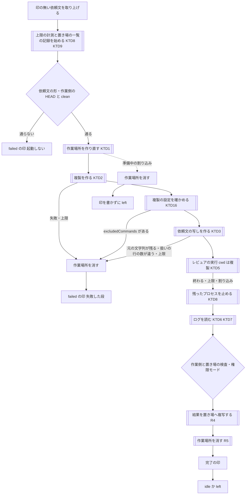
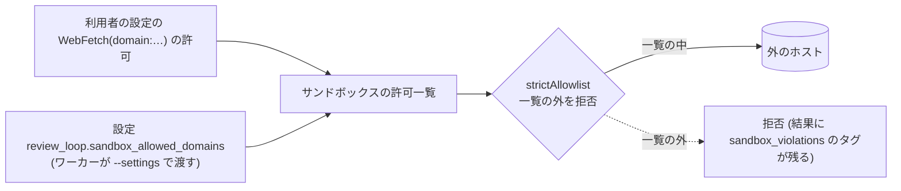

# レビュアの実行を使い捨ての作業ツリーとサンドボックスで走らせる (review-loop-worker) - Plan

要件の出所は GitHub の Issue [akm/claude-plugins#68](https://github.com/akm/claude-plugins/issues/68) の本文と、実測の結果と対応案をまとめたコメント ([#68 のコメント](https://github.com/akm/claude-plugins/issues/68#issuecomment-5852454987))。利用者はコメントの対応案のうち案 1 (B + D + C) を選んだ。コメントに無い決定は Goal Capsule の「Product Contract の保全」に挙げる。

## Goal Capsule

- **目的**: スキル `review-loop` の周回で、レビュアが依頼文の求める確認 (テストの実行・プローブ・ミューテーション) を行っても、権限が足りないことでレビュー不成立 (停止ノード RA1) にならない。確認のための変更は、作業側の作業ツリーにも、ホームの下 (書き込みを許した場所と Claude Code 自身の置き場を除く)にも残らない。確認を止められた回は周回が止まり、何に止められたかと直し方が報告に出る。
- **手段**: ワーカーが依頼文ごとに使い捨ての作業ツリーを作り、その中でレビュアの実行を auto モード・サンドボックス・拒否の規則で走らせる (Key Decisions の 1 番目、KTD2・KTD5)。
- **優先順位**: 効き目の中心はワーカーのスクリプト (判定をすべてテストできるコードに置く)。次に依頼文の雛形と作業側の手順書。
- **正本の優先順位**: 製品の振る舞いは Product Contract の R-ID が正本。実装の選び方は Planning Contract の KTD が正本。実装単位 (U-ID) はどちらも書き換えない。
- **止まる条件**: U1 の実測で、次の前提のどれかが Claude Code 2.1.273 で成り立たないと分かったら、実装に進まずに止めて人間に返す。
  - 複製の中で、サンドボックスの中の Bash が書き込める
  - 設定キー `sandbox.allowUnsandboxedCommands` を `false` にしても Bash が動く
  - auto モードで起動したとき、ログの `init` の行の `permissionMode` が `auto` になる

  ネットワークの扱いは、U1 の実測の後に利用者が決めた (KTD12)。スキル `review-triage-loop`・`review-triage`・`review-triage-fix` と記録のスキーマを変えなければ実装できないと分かったら、変えずに止めて人間に返す。
- **実行の型**: U1 は本物の `claude` を使う実測で、始める前に回数・費用・手順を人間に示して許可を得る。U4・U5 のスクリプトは、テスト (python の unittest と偽の `claude`) を先に書く。手順書は通し確認で確かめる (Verification Contract)。文書を変えたら `doc-dag` と `wording-guard` を回す。
- **後始末の所有**: PR の作成と #68 へのコメントは、人間の指示を受けてから行う。コミットは動機ごとに分ける (規範は利用者のコミットルール)。
- **Product Contract の保全**: 出所は Issue #68 とそのコメント。コメントに無い決定は次の 6 つで、計画を書く側が判断した (Planning Contract の Assumptions)。
  1. 雛形の「読み取り専用の厳守」を、作業ツリーの扱いを示す行で 2 通りに書き分ける。周回以外の経路では今の厳守を残す (R16)。
  2. レビュアの実行に、MCP サーバーと自動メモリを使わせない (R11)。WebFetch とネットワークは利用者の設定に従う (KTD12。U1 の結果を見て利用者が決めた)。
  3. ワーカーが消えた後に残ったレビュアの実行と作業場所を、起動し直したときに片付ける (R6)。0.13.0 からある問題だが、ログから読む判定が増えるので併せて直す。
  4. 上限を、依頼文を取り上げてからレビュアの実行が終わるまでに広げる (R7)。
  5. 利用者の設定とレビュー対象のブランチの設定の `sandbox.excludedCommands` を、ワーカーが検査する (R9)。
  6. 書き込みを許す場所 (`sandbox_allow_write`) を、`--resume` のたびに設定から読み直す (R17)。

---

## Product Contract

### Summary

ワーカー (スクリプト `review-triage/scripts/review-loop-worker.sh`) は依頼文ごとに回の作業場所を作り、依頼の `head` を取り出した複製と、依頼文の写しを置く。レビュアの実行は、その複製の中で auto モード・サンドボックス・拒否の規則を付けて起動する。結果はワーカーが作業場所から周回の置き場へ移す。ワーカーはログから実効の権限モードとサンドボックスが止めた確認の件数を読んで完了の印に書き、作業側はそれを RL1 で突き合わせる。依頼文の雛形は、作業ツリーの扱いが共有か使い捨てかで確認の規則を書き分ける。対象は macOS だけで、ネットワークは利用者の設定に従う。

### Problem Frame

依頼文の雛形 (ファイル `review-triage/skills/review-triage/references/review-request-template.md`) には、両立しない 2 つの節がある。

- 節「読み取り専用の厳守」: ファイルの作成と編集を禁じる
- 節「検証の前払い」: プローブやミューテーションを伴う確認を求める

ワーカー 0.13.0 は前者に合わせて、レビュアの実行 (`claude -p` の 1 回) を作業側と同じ作業ツリーで、読み取りの許可の一覧だけで起動する。2026-09-27 に 2 つの周回を試したところ、確認を実行したレビュアはどちらも 6〜8 件の呼び出しを拒否されて RA1 になった。そのため、同じ指摘が 2 回とも記録に入らなかった。拒否の多くは、安全のための検査によるもの (コマンドの置換・ヒアドキュメント・環境変数つきの実行・作業ディレクトリの外への書き込み) で、許可の一覧を足しても防げなかった。一方、利用者の設定が許していた書き込み (プローブのテストファイル・`Makefile` の編集) は拒否されなかった。レビュアが最後に戻したので、完了の印は `status: ok` だった。

同じ日の実測 (#68 のコメント) で、次のことが分かった。

- auto モードでは、この種類の拒否が 0 件になる。
- どの設定でも、作業ツリーを書き換えて戻したことは検出されない。
- サンドボックスが制限するのは Bash だけで、`Write`・`Edit` のツールは拒否の規則で止める必要がある。
- サンドボックスが止めた書き込みは `permission_denials` に数えられず、Bash の結果のエラーの文面としてだけログに残る。

### Key Decisions

- **案 1 (auto モード + サンドボックス + 使い捨ての作業ツリー) を採る** (session-settled: user-directed — chosen over 案 2 (サンドボックス無し)・案 3 (権限モードは `default` のまま)・案 4 (レビュー側を対話セッションにする): ファイルでの受け渡しとスクリプトでの判定を変えずに済み、実測で拒否が 0 件になった)。Governs R1〜R10, R12, R13。
- **Linux は対象外** (session-settled: user-directed — chosen over Linux のサンドボックスにも対応する案: 利用者の環境は macOS だけで、Linux では実測していない)。Governs R18。
- **サンドボックスが止めた確認も RA1 にする** (session-settled: user-directed — chosen over 件数を印に残すが止めない案・数えない案: 調べられなかった範囲の指摘が欠けた結果を記録に入れない、という拒否の扱いと同じ理由)。Governs R13, R14。
- **安全のための検査による拒否も RA1 のまま** (session-settled: user-directed — chosen over 許可の一覧で防げない拒否は止めない案: 0.13.0 の通し確認 (2026-09-27) で決めた。auto モードで大半は起きなくなる見込みで、頻度の見直しは #65 で扱う)。Governs R14。
- **ネットワークの制限が効かなかった原因は、実装の最初の単位で調べる** (session-settled: user-directed — chosen over 調べずに、名前で拒否できるコマンドだけを止めて受け入れる案: 閉じられるなら閉じる)。Governs R10。
- **ネットワークは利用者の設定に従う** (session-settled: user-directed — chosen over 利用者の設定を読まずに閉じる案・利用者が `WebFetch(domain:*)` を外す案・閉じない案: 利用者が `WebFetch(domain:*)` で許しているなら、レビュアの実行もそれで動いてよい。U1 の実測で原因が分かった後に決めた)。Governs R10, R11, R21。
- **許可の一覧の既定は読み取りのまま** (session-settled: user-directed — chosen over テストのコマンドなどを既定に足す案: 0.13.0 の通し確認で決めた。auto モードでは一覧に無い呼び出しも判定が許すので、一覧を広げる必要が無い)。Governs R8。

### Actors

- A1. 人間 — 作業側で `review-loop` を起動し、案内されたコマンドでワーカーを端末に起動する。RA1 の報告を読み、設定かワーカーの引数を直して再開する。
- A2. 作業側 — スキル `review-loop` を実行するセッション。依頼文を書き、完了の印を RL1 で突き合わせる。
- A3. ワーカー — `review-loop-worker.sh` を走らせる端末のプロセス。サンドボックスの外で動く。回の作業場所を作って片付け、レビュアの実行を起動し、ログを読んで印を書く。
- A4. レビュアの実行 — ワーカーが起動する `claude -p` の 1 回。複製の中で依頼文の写しのとおりにレビューし、結果を作業場所に書く。
- A5. スキル `review-request` — 依頼文を書く。作業ツリーの扱いを示す行は、常に「共有」のまま書く。

### Requirements

**回の作業場所と使い捨ての作業ツリー**

- R1. ワーカーは依頼文を取り上げるたびに、回の作業場所 (その回だけに使う一時ディレクトリ) を作り、その中に使い捨ての作業ツリー (作業側のリポジトリの複製で、依頼の `head` を取り出したもの) を作る。複製では、作業側で解決できるブランチ・リモート追跡ブランチ・タグの名前が、同じ commit に解決できる。複製の HEAD は detached (ブランチを指さない状態) で、remote は無い。
- R2. 作業場所か複製を作れなければ、レビュアの実行を起動せずに `failed` の印を書き、どの段で失敗したかを `error` に書く。作業側の作業ツリーでレビュアを走らせる代わりの経路は作らない。
- R3. ワーカーは依頼文の写しを作業場所に作り、レビュアの実行には写しを渡す。写しでは、出力先のすべての出現・作業ツリーのパス・作業ツリーの扱いを示す行を書き換える。書き換えた後に元の出力先か元の作業ツリーのパスが残るか、扱いの行がちょうど 1 つでなければ、起動せずに `failed` の印を書く。作業側の依頼文は変えない。
- R4. レビュアの実行の cwd は複製にする。レビュアは結果を作業場所の中 (複製の外) に書き、ワーカーが検査の後に、依頼文が指す置き場の出力先へ複写する。`ok` の印を書くのは、置き場の出力先に結果が通常のファイルとして在ることを確かめた後にする。次のどれかなら `failed` にする。`failed` の回も、結果を複写できれば複写する。
  - 結果が通常のファイル (シンボリックリンク・FIFO・ディレクトリでないもの) でない
  - 結果の実体が作業場所の外にある
  - 結果の大きさが上限を越える
  - 複写に失敗する
- R5. ワーカーは作業場所を、`ok`・`failed`・上限・割り込みのどの終わり方でも、完了の印を書く前に消す。消す前に、作業場所の中を cwd (作業ディレクトリ) にしているプロセスが残っていれば止める。作業場所がシンボリックリンクに置き換えられていたら、その先は消さない。レビュアの実行を起動した後は、複製の中で git を実行しない。
- R6. ワーカーは、レビュー中の回の作業場所を `worker.yaml` に書く。起動時には、動いているワーカーが無いと判定した直後、他のどの確認よりも前に、前の回の作業場所の中を cwd にしているプロセスを止め、作業場所を消す。
- R7. 上限 (`--review-timeout-minutes`) は、依頼文を取り上げてから、レビュアの実行が終わるまで (準備を含む) を測る。越えたら `failed`・`error: timeout` の印を書く。回の終わりの処理 (KTD8) は上限の対象にしない。

**レビュアの実行の権限**

- R8. 権限モードの既定を `auto` にする。`bypassPermissions` は今までどおり拒む。許可の一覧の既定 (読み取りのツール) は変えない。
- R9. レビュアの実行の Bash はサンドボックスの中で動かす。サンドボックスの外で実行し直すことは許さず、サンドボックスを起動できなければ実行をエラーで終わらせる。サンドボックスの既定に加えて書き込みを許すのは、作業場所と設定の一覧 (R17) だけにする。利用者の設定かレビュー対象のブランチの設定に、サンドボックスの外で実行させるコマンドの一覧 (設定キー `sandbox.excludedCommands`) があれば、レビュアの実行を起動しない (KTD16)。
- R10. レビュアの実行が複製と作業場所の外を変えないように、次のものを拒否の規則で止める。ネットワークは、利用者の設定と、設定で許すドメイン (R17) に従う (KTD12)。
  - 書き込みのツールによる、ホームの下・作業側のリポジトリ・周回の置き場への書き込み
  - `git push`
- R11. レビュアの実行に、利用者の MCP サーバーと自動メモリを使わせない。WebFetch と WebSearch は利用者の設定に従う。

**ログからの判定と作業側の突き合わせ**

- R12. ワーカーは、実行のログの `init` の行から実効の権限モードを読み、指定と違えば `failed` の印を書く。読めなければ `unknown` と書き、それだけでは `failed` にしない。
- R13. ワーカーは、サンドボックスが止めた確認を数え、件数とコマンドを完了の印に書く。サンドボックスが止めた確認とは、Bash の呼び出しのうち、サンドボックスが書き込みを止めたときの文面のエラーで終わったもので、sub-agent の中の呼び出しを含む。ログから数えられなければ `unknown` と書く。
- R14. 作業側は RL1 で次の 3 つを確かめ、どれかが成り立たなければ RA1 にする。
  - 印に書かれたワーカーの版が 0.14.0 以降であること
  - 印の権限モードの指定が、`loop.yaml` と一致すること
  - サンドボックスが止めた件数が 0 であること

  RA1 の報告には、止めたものごとに直し方を分けて書く。止めたものは、拒否の規則・auto モードの判定・安全のための検査・サンドボックス・権限モードの指定の食い違い・実効の権限モードの食い違い・ワーカーの版のどれか。
- R15. 作業側が `review-triage` に渡す `notes` の 1 行に、実効の権限モードを足す。

**依頼文の雛形**

- R16. 雛形に作業ツリーの扱いを示す行を足し、節「読み取り専用の厳守」を扱いごとに 2 通りに書く。
  - 「共有」(作業側と同じ作業ツリー): 今の厳守のまま。
  - 「使い捨て」: 複製の中でだけ、確認のための変更をしてよい。戻さなくてよい。複製と出力先の外は変えない。HEAD を動かしたら、調べ続ける前に依頼の `head` に戻す。

  節「検証の前払い」の revert の注記と、末尾の「HEAD と作業ツリーの確認」も、扱いに合わせて書き分ける。`review-request` は常に「共有」で書く。

**起動・設定・互換**

- R17. 設定 `review_loop` にキー `sandbox_allow_write` (サンドボックスで書き込みを許す場所の一覧。既定は空) を足す。値は `loop.yaml`・ワーカーのフラグ `--sandbox-allow-write` (繰り返して指定できる)・案内の起動コマンドに通す。このキーは環境の値として扱い、`--resume` のたびに設定から読み直す (KTD17)。許すドメインの一覧 (キー `sandbox_allowed_domains`・フラグ `--sandbox-allowed-domain`。既定は空) も同じ形で足す (KTD12)。設定 `review_loop.permission_mode` の既定を `auto` にし、案内の起動コマンドには `--permission-mode` を常に付ける。
- R18. ワーカーの起動時の確認に次を足し、満たさなければ `unavailable` で終わる。
  - macOS であること
  - 環境変数 `TMPDIR` があり、その実体がホームと作業側の外にあり、作業側がその中に無いこと
  - 作業側と周回の置き場の実体が、サンドボックスが既定で書き込みを許す一時ディレクトリ (`/private/tmp/claude-<利用者の番号>`) の下に無いこと
  - `--sandbox-allow-write` の値が、ホーム・作業側・周回の置き場と同じでも、その祖先でもないこと
  - 作業側・周回の置き場・一時ディレクトリの実体パスに、許可の規則で扱えない文字が無いこと
  - 追加の引数 (`--` 以降) が、許可する一覧 (KTD11) に収まること
  - 利用者の設定に `sandbox.excludedCommands` が無いこと (KTD16)
- R19. 0.13.0 で始めた周回は、`loop.yaml` に無い新しいキーを既定値として続ける。権限モードは `loop.yaml` の値を使う。0.13.0 の `review-request` が書いた依頼文 (扱いの行が無いもの) は、R3 で `failed` になる。ワーカーの版を持たない完了の印 (0.13.0 のワーカーが書いたもの) は、作業側が R14 で RA1 にし、ワーカーの版が古いことを報告する。

- R21. 利用者の設定の `WebFetch(domain:…)` の許可はサンドボックスのネットワークの許可一覧に加わるので、ワーカーは起動時に、加わるドメインを表示する。`*` があれば、レビュアの Bash が外のすべてのホストに接続できることを表示する。止めはしない (KTD12)。

**文書と版**

- R20. ワーカーと置き場の正本・作業側の手順書・設定の説明・README を案 1 に合わせ、プラグイン review-triage の版を 0.14.0 にする。

### Key Flows

- F1. 回の処理 (ワーカー)
  - **起点:** ワーカーが印の無い依頼文を見つける。
  - **関与:** A3, A4。
  - **手順:**
    1. 依頼文の形と、作業側の HEAD・clean を確かめる。
    2. 作業場所・複製・写しを作り、複製の設定を確かめる (R1〜R3, R9)。
    3. レビュアの実行を起動する (R8〜R11)。
    4. 終わったら、残ったプロセスを止め、ログを読み (R12, R13)、作業側と置き場が変わっていないことを確かめる。
    5. 結果を置き場へ複写し (R4)、作業場所を消し (R5)、完了の印を書く。
  - **結果:** 置き場に結果と印がそろい、作業場所は残らない。
  - **Covers R1〜R7, R12, R13.**
- F2. 確認を止められた回から再開する
  - **起点:** 印のサンドボックスが止めた件数か拒否の件数が 1 以上。
  - **関与:** A1, A2, A3。
  - **手順:**
    1. 作業側が RL1 で RA1 にし、止めたものと直し方を報告する (R14)。
    2. 書き込みを許す場所が足りなかった場合、人間は設定 `review_loop.sandbox_allow_write` (止められたのがホストなら `sandbox_allowed_domains`) に足してコミットし、動いているワーカーを Ctrl-C で止める。設定のファイルは git が追跡しているので、コミットしないと作業ツリーが clean でなくなり、`--resume` が RA3 で止まる。
    3. 人間が `--resume` を打つ。作業側は設定を読み直して `loop.yaml` を書き換え (KTD17)、新しい起動コマンドを案内し、RA1 の回をやり直す新しい依頼文を書く。
    4. 人間が案内のコマンドでワーカーを起動する。
  - **結果:** 周回が続く。
  - **Covers R13, R14, R17.**

### Acceptance Examples

- AE1. 正常な回
  - **Covers R1, R3, R4, R5, R8, R9, R12, R13.**
  - **Given:** macOS。一時ディレクトリはホームと作業側の外にある。依頼文は 0.14.0 の `review-request` が書いたもの。
  - **When:** ワーカーがその依頼文を処理する。
  - **Then:**
    - レビュアの実行の cwd は、依頼の `head` を detached で取り出した複製。`--permission-mode auto`・サンドボックスの設定・拒否の規則が付き、プロンプトは写しを指す。
    - 写しには元の出力先と元の作業ツリーのパスが残っておらず、扱いの行は「使い捨て」。
    - 結果は印より先に置き場に現れる。印は `ok`・実効の権限モード `auto`・サンドボックスが止めた件数 0・ワーカーの版 0.14.0。
    - 作業場所は残っていない。
- AE2. 全量の回で `base` がブランチ名
  - **Covers R1.**
  - **Given:** 作業側は feature ブランチにいて、依頼文の `base` が `main`。
  - **When:** ワーカーが複製を作る。
  - **Then:** 複製の中で `main` と `origin/main` が作業側と同じ commit に解決でき、`git diff main..HEAD` が作業側と同じ差分を返す。
- AE3. #68 の再現
  - **Covers R4, R9, R10, R16.**
  - **Given:** Go のコードを含むブランチ。設定 `review_loop.sandbox_allow_write` に Go のビルドのキャッシュ (`~/Library/Caches/go-build`) がある。
  - **When:** レビュアがプローブのテストファイルを作り、`Makefile` を書き換え、環境変数を付けた `go test` を実行して確認する。
  - **Then:** 拒否は 0 件、サンドボックスが止めた件数も 0 で、印は `ok`。作業側の作業ツリーとホームの下 (書き込みを許した場所と Claude Code 自身の置き場を除く)に、プローブのファイルも書き換えも残っていない。
- AE4. auto モードが使えない
  - **Covers R12, R14.**
  - **Given:** ログの `init` の行の `permissionMode` が `default`。
  - **Then:** 印は `failed` で、`error` に期待したモードと実際のモードがある。作業側は RA1 で止まり、`--resume` でやり直せることと、モデルと設定の確かめ方を報告する。
- AE5. サンドボックスが止めた
  - **Covers R13, R14.**
  - **Given:** 最上位の Bash の結果に `Operation not permitted` (大文字で始まる) を含むエラーが 1 件、sub-agent の中の Bash の結果に小文字の同じ文面のエラーが 1 件ある。
  - **Then:** 印の件数は 2 で、その 2 つのコマンドが書かれる。作業側は RA1 で止まり、`sandbox_allow_write` の足し方 (F2) を報告する。
- AE6. 写しを作れない
  - **Covers R3, R19.**
  - **Given:** 依頼文に作業ツリーの扱いを示す行が無い (0.13.0 の依頼文)。
  - **Then:** レビュアの実行を起動せずに `failed` の印が書かれ、作業場所は残っていない。
- AE7. 複製を作れない
  - **Covers R2.**
  - **Given:** 依頼文の `head` は作業側で解決できるが、複製の作成が途中で失敗する (偽の `git` で再現する)。
  - **Then:** レビュアの実行を起動せずに `failed` の印が書かれ、`error` に失敗した段がある。作業場所は残っていない。
- AE8. 準備の途中で上限を越える
  - **Covers R7.**
  - **Given:** 複製の作成か写しの作成が、上限より長くかかる。
  - **Then:** レビュアの実行は起動されず、`failed`・`error: timeout` の印が書かれる。作業場所は残らず、ワーカーは `idle` に戻る。
- AE9. 割り込み
  - **Covers R5.**
  - **Given:** 準備の途中、レビュアの実行中、回の終わりの処理 (結果の複写など) の途中のどれかで SIGINT を送る。
  - **Then:** どれでも作業場所は残らず、`worker.yaml` は `left` になる。
    - 準備の途中: 印は書かれず、起動し直したワーカーが同じ依頼文を処理する。
    - レビュアの実行中: `failed`・`error: interrupted` の印が書かれる。
    - 回の終わりの処理の途中: その回の印を書き終えてから終わる。
- AE10. ワーカーを `kill -9` で消して起動し直す
  - **Covers R6.**
  - **Given:** 準備の途中か、レビュアの実行中に、ワーカーを `kill -9` で消した。準備の git かレビュアの実行が動き続けている。
  - **When:** 同じコマンドでワーカーを起動し直す。
  - **Then:** 前の作業場所の中を cwd にして残っていたプロセス (別のプロセスグループで動く Bash の子を含む) が止まり、前の作業場所が消えてから、同じ依頼文の処理が始まる。新しいログに前の実行の行が混ざらない。
- AE11. 起動時の確認
  - **Covers R18.**
  - **Then:** 次のどれでも、ワーカーは `worker.yaml` を `unavailable` と理由で書いて、終了コード 2 で終わる。
    - `uname -s` が `Linux`
    - `TMPDIR` が無い、またはホームの下
    - 作業側が一時ディレクトリの下、またはサンドボックスの一時ディレクトリ (`/private/tmp/claude-<利用者の番号>`) の下
    - `--sandbox-allow-write ~`
    - 追加の引数に `--add-dir`
    - `enabledPlugins` 以外のキーを持つ `--settings`
    - 利用者の設定に `sandbox.excludedCommands` がある
- AE12. レビュアが複製の git の設定を書き換える
  - **Covers R5.**
  - **Given:** レビュアの実行が、複製の `.git/config` に `core.fsmonitor`・`core.hooksPath`・`filter.<名前>.clean` を書き、`.git/hooks/post-checkout` を置く (どれも git が後で実行するコマンド)。
  - **Then:** ワーカーはそのどれも実行しない (レビュアの実行の後に、複製の中で git を使わない)。
- AE13. レビュアが置き場の出力先に直接書く
  - **Covers R4.**
  - **Then:** 置き場が変わったとして、`failed`・`error: loop dir modified` の印が書かれる。
- AE14. 0.13.0 の周回を再開する
  - **Covers R17, R19.**
  - **Given:** `loop.yaml` にキー `worker.sandbox_allow_write` が無く、`worker.permission_mode` が `default`。設定 `review_loop.sandbox_allow_write` に Go のビルドのキャッシュがある。
  - **When:** `--resume` を打つ。
  - **Then:** 作業側は止まらずに続け、`loop.yaml` の `worker.sandbox_allow_write` を設定の値で書く。案内の起動コマンドは `--permission-mode default` と、設定の要素ごとの `--sandbox-allow-write` を付ける。
- AE15. 結果を複写できない
  - **Covers R4.**
  - **Given:** 置き場への結果の複写が失敗する。
  - **Then:** `failed` の印が書かれ、`error` に複写の失敗とその理由がある。`ok` の印は書かれない。
- AE16. レビュー対象のブランチの設定がサンドボックスの外で実行させる
  - **Covers R9.**
  - **Given:** 複製の `.claude/settings.json` に `sandbox.excludedCommands` がある。
  - **Then:** レビュアの実行を起動せずに `failed` の印が書かれ、`error` にその設定のことが書かれる。作業場所は残っていない。
- AE17. 利用者の設定がネットワークを広げている
  - **Covers R21.**
  - **Given:** 利用者の設定 `~/.claude/settings.json` に `WebFetch(domain:*)` の許可がある。
  - **Then:** ワーカーは起動時に、レビュアの Bash が外のすべてのホストに接続できることを表示し、起動を続ける。

### Success Criteria

- #68 と同じ形の確認を行うレビュー (AE3) が、通し確認で RA1 にならずに記録に入る。作業側の作業ツリーとホームの下 (書き込みを許した場所と Claude Code 自身の置き場を除く)に変更が残らない。
- 書き込みを許す場所が足りない回では、サンドボックスが止めた件数とコマンドが、印と RA1 の報告に出る。人間は報告だけから直し方を決められ、周回を終えずに直して再開できる (F2)。
- ワーカーの全経路 (AE1, AE2, AE4〜AE13, AE15〜AE17) が偽の `claude` のテストで、macOS の `/bin/bash` 3.2 と CI (ubuntu。偽の `uname` を使う) の両方で成功する。AE3 と AE14 は、通し確認のシナリオ B で確かめる。
- `review-triage-loop`・`review-triage`・`review-triage-fix` のディレクトリと、記録のスキーマに差分が無い。

### Scope Boundaries

- 対象は macOS。Linux と Windows では、ワーカーは起動時に止まる (R18)。
- 周回以外の経路は、作業側と同じ作業ツリーで走るので、雛形の「共有」の規則 (今の厳守) のまま。周回以外の経路とは、`review-request` の依頼文を人間が別のセッションに渡す経路と、`review-triage-loop` の sub-agent の経路。この 2 つの経路で「検証の前払い」と厳守が両立しない問題は扱わない。
- サンドボックスは、自身の一時ディレクトリ (`/private/tmp/claude-<利用者の番号>`。サンドボックスの中の `TMPDIR`) への書き込みを止めない。そこにある他のプロセスの一時ファイルは守られず、そこへの書き込みは検出しない。
- 作業場所の外に cwd を移して動き続けるプロセスは、後始末でも、起動し直したときの掃除でも止まらない。
- ネットワークは利用者の設定に従う。利用者の設定が `WebFetch(domain:*)` を許していれば、レビュアの Bash は外のすべてのホストに接続でき、手元の情報を外へ送ることを仕組みでは止めない (R21 で起動時に表示する)。
- 利用者の設定とレビュー対象のブランチの設定の `sandbox.filesystem.allowWrite` は、ワーカーの設定と結合される。ワーカーはこれを検査しない。
- git が追跡しないファイル (依存のディレクトリ・`.env`・`.claude/settings.local.json`) は複製に無い。そのため確認が失敗することがあり、その回はレビュアの報告か RA1 で分かる。
- Git LFS・submodule・partial clone・shallow clone のリポジトリは、複製の作成の失敗 (R2) として扱い、対応はしない。
- レビュー対象のブランチの `.claude/settings.json` は、複製の中でもレビュアの実行に効く (拒否の規則・フック・環境変数・サンドボックスの配列)。`sandbox.excludedCommands` だけは R9 で検査し、ほかは作業側で走らせていた 0.13.0 と同じ扱いにする。
- #65 (安全のための検査による拒否の頻度) は、この計画では閉じない。auto モードで大半は起きなくなる見込みで、周回の置き場がたまってから見直す。サンドボックスと無関係の EPERM による RA1 の頻度も、同じときに見る。

#### Deferred to Follow-Up Work

- 複製に写す、git が追跡しないファイルの一覧を設定で渡す案。
- レビュー対象のブランチの `.claude/settings.json` が、`sandbox.excludedCommands` 以外のキー (`allowWrite`・`allowedDomains` など) でサンドボックスを広げていないかを、ワーカーが検査する案。
- フラグ `--restricted` で、`Write`・`Edit` の範囲を拒否の規則ではなく作業ディレクトリで限る案。このフラグは利用者の設定を読まないので、プラグインのレビュースキルが読み込まれるかを確かめる必要がある。
- 複製・サンドボックス・ログの読み方で分かったことを、ディレクトリ `docs/solutions/` に知見として残す。

### Dependencies / Assumptions

- Claude Code 2.1.273 (Homebrew の cask)、macOS 26.5。端末の `claude` は claude.ai のログインで動かす (利用者は API に料金を払わない)。
- 2026-09-27 の実測 (#68 のコメント)。実験の置き場はセッションの一時ディレクトリで、リポジトリには無い。
  - auto モードでは、#68 の形の呼び出し (ヒアドキュメント・変数を使うループ・環境変数つきの実行・作業ディレクトリの外の `rm`) が拒否されなかった。実際のレビュー (opus / high) も、推奨の設定で拒否 0 件だった。
  - サンドボックスは Bash だけに効き、`Write`・`Edit` には効かない。サンドボックスの中の Bash は、ホームの下には書けない。
  - auto モードとサンドボックスを併用すると、レビュアは止められたコマンドを、Bash の引数 `dangerouslyDisableSandbox` を付けて実行し直した。auto モードの判定はそれを許した。設定キー `sandbox.allowUnsandboxedCommands` を `false` にすると、実行し直しは止まった。
  - 拒否の規則 (フラグ `--disallowedTools`) は auto モードの判定より優先し、sub-agent にも効く。sub-agent の拒否も、最上位の `result` の行の `permission_denials` に数えられる。
  - `go test` は、Go のビルドのキャッシュへの書き込みが止まって失敗した。設定キー `sandbox.filesystem.allowWrite` にキャッシュを足すと、`Edit(~/**)` の拒否と一緒でも通った。
  - `git worktree` で作った作業ツリーは、git の管理情報がホームの下 (利用者のリポジトリの中) にあるので、サンドボックスの中の git の書き込みが止まった。`git clone --shared` で一時ディレクトリに作った複製では通った。作業側が `git worktree` で作った作業ツリーでも、そこから `git clone --shared` で複製を作れる (計画の点検で git 2.50.1 を使って確かめた)。
  - サンドボックスが止めた書き込みは、Bash の `tool_result` (`is_error: true`) の本文にだけ残る。本文は `Exit code 1\n(eval):1: operation not permitted: <パス>` か `open <パス>: operation not permitted` の形。`<sandbox_violations>` のタグは無い。sub-agent の中の呼び出しは、`parent_tool_use_id` のある行に同じ形で残る。`permission_denials` にも `init` の行にも現れない。
  - `init` の行には `permissionMode`・`cwd`・`tools`・`mcp_servers`・`memory_paths` がある。`mcp_servers` には、利用者の claude.ai のコネクタ (Slack など) が並んでいた。
  - 設定キー `sandbox.network.allowedDomains`・`sandbox.network.strictAllowlist` を `--settings` で渡しても、`curl` で外に出られた。
- 2026-09-27 の U1 の実測 (15 回、API 換算 約 2.4 ドル。実験の置き場はセッションの一時ディレクトリ)。
  - 利用者の設定の `WebFetch(domain:*)` の許可が、サンドボックスの許可一覧に「すべてのホスト」を加えていた。`strictAllowlist` を渡しても、利用者の設定を読むと外に出られる。利用者の設定を読まなければ止まり、そのうえでこの 1 行だけを足すと外に出られる。WebFetch ツールを外しても、拒否の規則に `WebFetch(domain:*)` を足しても変わらない。
  - 利用者の設定を読まない (フラグ `--setting-sources project,local`) と、利用者の `~/.claude/CLAUDE.md` とプラグインも読み込まれない。プラグインは `--settings` の `enabledPlugins` で読み込める。利用者は、この方法ではなく利用者の設定に従うことを選んだ (KTD12)。
  - 許可一覧が効くとき、一覧の外への接続は `CONNECT tunnel failed, response 403` などで失敗し、結果の本文に `<sandbox_violations> deny network-outbound <ホスト>:<ポート> (host is not on the allow list)` のタグが付く。
  - サンドボックスの中の Bash が書けるのは、作業ディレクトリ・`allowWrite` の場所・サンドボックス自身の一時ディレクトリ (`/tmp/claude-<利用者の番号>`。サンドボックスの中の `TMPDIR`) だった。`/private/tmp` のほかの場所・利用者の一時ディレクトリ (`/var/folders/…`)・ホームの下には書けない。#68 の実測の「`/private/tmp` に書ける」は、実験の置き場が `/private/tmp/claude-501` の下だったためである。
  - 複製の `.git/config`・`.git/hooks/`・`.claude/settings.json`・`.mcp.json` には、サンドボックスの中の Bash から書けない (保護されたパス)。`git checkout -- <ファイル>`・`git stash list` は通る。
  - ファイルの書き込みを止められたときの本文は、`touch: <パス>: Operation not permitted`・`mkdir: <パス>: Operation not permitted`・python の `PermissionError` (`Operation not permitted`)・`(eval):1: operation not permitted: <パス>`・`fatal: Unable to create '<パス>/index.lock': Operation not permitted` で、`<sandbox_violations>` のタグは付かない。sub-agent の中の呼び出しも同じ形で、`parent_tool_use_id` のある行に残る。
  - Bash で出力した JSON の行は `tool_result` の文字列の中に入り、ログの `init` の行としては現れない。
  - Bash のコマンドは、レビュアの実行 (`claude`) とは別のプロセスグループで動く。サンドボックスの中では `ps` を使えない。
  - `--strict-mcp-config` で、`init` の行の `mcp_servers` が空になる。`autoMemoryEnabled: false` で `memory_paths` が無くなる。拒否の規則で `WebFetch`・`WebSearch` を外すと `tools` から消える。auto モードの判定は sub-agent の起動を許した。
  - サンドボックスの中からレビュアの実行を起動した場合 (サンドボックスを重ねられない)、`failIfUnavailable` の値に関わらず起動は通り、各 Bash が `sandbox-exec: sandbox_apply: Operation not permitted` で失敗した。サンドボックスの外で実行されることはなかった。
  - auto モードに対応していない `haiku` を指定すると、`init` の行の `permissionMode` は `default` だった。
  - 設定キー `failIfUnavailable`・`strictAllowlist`・`autoMemoryEnabled` とフラグ `--strict-mcp-config`・`--setting-sources` は、2.1.273 の本体にある (本体の文字列で確かめた)。
- Claude Code の公式文書 (2026-09-27 に確認。現行の文書は 2.1.283 のもの)。
  - `WebFetch(domain:...)` の許可の規則は、サンドボックスのネットワークの許可一覧に加わる。利用者の設定 `~/.claude/settings.json` には `WebFetch(domain:*)` の許可がある。U1 で、ネットワークが閉じなかった原因だと確かめた。
  - auto モードでサンドボックスが有効なとき (v2.1.271 以降)、許可一覧の外のホストへの接続を、auto モードの判定がコマンドごとに許すことがある。`strictAllowlist` があれば、この許し方は使われない。
  - auto モードに入ると、任意のコードの実行を許す広い許可の規則 (`Bash(*)`・インタプリタのワイルドカード・`Agent` など) は使われず、それらの呼び出しは判定が決める。許可の一覧は、判定の前に即決する役割だけを持つ。
  - 設定キー `sandbox.failIfUnavailable` を `true` にすると、サンドボックスを起動できないときに起動時にエラーで終わる。CLI のデフォルト値は `false` で、警告を出してサンドボックスの外で実行する。
  - 設定キー `sandbox.excludedCommands` に当たるコマンドは、仕様としてサンドボックスの外で動く。サンドボックスの配列は、利用者の設定・プロジェクトの設定・`--settings` のものが結合される。
  - サンドボックスには、`allowWrite` に書いても書き込めない保護されたパス (作業ディレクトリの `.claude` の設定、`.git/hooks` など) がある。U1 で、複製の `.git/config`・`.git/hooks/`・`.claude/settings.json`・`.mcp.json` が保護されることを確かめた。
  - `--settings` の値は利用者の設定より優先し、配列は結合される。どこかの設定の拒否は、他の設定の許可より優先する。
  - `-p` では、作業ディレクトリの `.claude/settings.json` の許可の規則は使われない。拒否の規則・フック・環境変数・サンドボックスの配列は使われ、`disableAutoMode` も効く。
  - `Edit` の規則は、ファイルを書き換えるすべての組み込みのツール (`Write`・`NotebookEdit` を含む) に効く。パスを付けた `Write(...)` の規則は照合に使われない。
  - 文書には、`Edit` の拒否の規則がサンドボックスの `denyWrite` にも加わるとある。実測では `Edit(~/**)` と Go のキャッシュの `allowWrite` が両立したので、2.1.273 での扱いは確かめていない。作業側がサンドボックスの書ける場所の下に無いことを R18 で確かめるので、計画はこの扱いに頼らない。
  - 許可の規則のパスに `( ) [ ] { } * ? ! #` が含まれると安全に扱えない (本体の文字列)。
- 費用の見込み (どちらも Max のログインの利用枠で行う)。
  - U1 の実測: 15 回で API 換算 約 2.4 ドル (実施済み)。
  - 通し確認: #66 の通し確認と同じ程度。opus / xhigh なら回ごとにそれ以上。

### Open Questions

**Deferred to Implementation**

- 作業場所の中を cwd にしているプロセスを、CI (ubuntu) のテストでどう列挙するか (macOS では `lsof` で列挙する)。
- detached で remote の無い複製で、`code-review` が `base..head` を正しくレビューするか (通し確認)。
- `error` の文字列の細部 (どの段で失敗したかの書き方) と、結果の大きさの上限の値。

### Sources / Research

- Issue #68 と実測のコメント (冒頭のリンク)。#63 (`review-loop` の要件)、#65 (安全のための検査による RA1)。
- 0.13.0 の計画: ファイル `docs/plans/2026-09-26-1338-feat-review-loop-plan.md`。KTD15 がワーカーの権限の既定で、この計画で置き換える。
- ワーカー `review-loop-worker.sh` (0.13.0) の主な箇所。
  - 起動時の確認 (201〜245 行目)
  - 関数 `read_log_facts` (402〜457 行目)
  - 関数 `write_marker` (460〜491 行目)
  - 関数 `finish_round` (504〜564 行目)
  - 関数 `run_reviewer` (566〜604 行目)
  - 関数 `process_request` (606〜648 行目)
  - 関数 `on_signal` (364〜379 行目)
- 正本 (ディレクトリ `review-triage/skills/review-loop/references/` の下)。
  - ファイル `review-triage/skills/review-loop/references/worker.md`: 「レビュアの実行の権限」(111〜128 行目)、「ログの読み方」(134〜138 行目)
  - ファイル `review-triage/skills/review-loop/references/loop-files.md`: 完了の印の表 (147〜184 行目)
  - ファイル `review-triage/skills/review-loop/references/round.md`: RL1 の手順 c (54〜57 行目)、`notes` の書式 (77 行目)
  - ファイル `review-triage/skills/review-loop/references/stops.md`: RA1 (52 行目)、RA2 (53 行目)
  - ファイル `review-triage/skills/review-loop/references/guide-template.md`: 起動コマンド (30〜38 行目)
  - ファイル `review-triage/skills/review-loop/references/reentry.md`: 期限切れの規則 (71 行目)
- テスト: ファイル `review-triage/tests/test_review_loop_worker.py`。関数 `assert_contract` が、ワーカーの書いたファイルを `loop-files.md` の表と照らす。偽のコマンドを PATH に置く仕組みは 150〜158 行目。偽の `claude` はファイル `review-triage/tests/fake-claude` で、振る舞いを環境変数で切り替える。
- 依頼文の雛形の該当行: 出力先は 3・15・51 行目、作業ツリーのパスは 7 行目、厳守の節は 12〜17 行目、検証の前払いの revert は 27〜28 行目、末尾の確認は 94 行目。スキル `review-request` の手順書 (ファイル `review-triage/skills/review-request/SKILL.md`) の 30・40 行目。
- 知見 (ディレクトリ `docs/solutions/` の下)。
  - ファイル `docs/solutions/tooling-decisions/require-explicit-basis-for-relative-paths.md`: レビュアの cwd が変わるので、読む場所と書く場所をワーカーが明示する。macOS の `/var/folders` はシンボリックリンクなので、実体のパスにそろえる。
  - ファイル `docs/solutions/architecture-patterns/fail-soft-by-data-class.md`: 読めない値は 0 ではなく `unknown` にする。代わりの経路を作らない。
  - ファイル `docs/solutions/design-patterns/extract-identifiers-in-code-not-llm.md`: 判定はレビュアの報告ではなくログから行う。
  - ファイル `docs/solutions/tooling-decisions/avoid-dual-parser-implementations.md`: ログは python3 だけで読む。偽の `claude` のテストは本物のサンドボックスを動かさないので、本物で走らせる確認をテストとは別に置く。
- Claude Code の文書: `sandboxing` (network isolation、サンドボックスの外での再実行)、`settings-reference` (sandbox の各キー)、`settings` (設定の優先順位)、`permissions` (Read と Edit の規則、Bash の規則の限界)、`permission-modes` (auto モード)、`headless`。

---

## Planning Contract

### Key Technical Decisions

- KTD1. **作業場所は周回ごとに 1 つのパスを使い回し、回ごとに作り直す。**
  - 場所は、環境変数 `TMPDIR` の実体の下の、周回ごとのディレクトリ。名前は、周回 id と、周回の置き場の実体パスから作る短いハッシュでできる (例: `<TMPDIR の実体>/review-loop-<周回 id>-<ハッシュ>/`)。その下に複製 (`tree/`)・写し・結果を置く。
  - ハッシュを足すのは、別のクローンで同じブランチの周回を同じ分に始めたときに、名前が重ならないようにするため。周回の間は変わらない。
  - `TMPDIR` が無ければ `/tmp` に代えず、起動しない (R18)。`/tmp` は他の利用者も書ける場所で、名前も予測できるため。
  - 作るときに、そのディレクトリが自分の所有で、シンボリックリンクでないことを確かめる。
  - 使い回す理由は 2 つ。1 つは、レビュアの実行の cwd が回ごとに変わると、`~/.claude/projects/` の項目が回の数だけ増えること。もう 1 つは、R6 の掃除の範囲をこのディレクトリに限るため。
  - ワーカーはこのディレクトリを `sandbox.filesystem.allowWrite` に足し、一時ディレクトリの既定の扱いに頼らない。
  - `end` を見て終わるときに、ディレクトリごと消す。
- KTD2. **複製は `git clone --shared --no-checkout` で作り、remote を外し、作業側の refs を取り込んでから `head` を detached で取り出す** (session-settled: user-directed — chosen over `git worktree`: 管理情報がホームの下になり、サンドボックスの中の git の書き込みが止まる。案 1 の選択に含まれる)。Governs R1。
  - 取り込むのは `refs/heads/*`・`refs/remotes/*`・`refs/tags/*`。全量の回の `base` がブランチ名 (`main`) のときに、複製で解決できるようにするため。
  - `--no-checkout` の直後は HEAD がブランチを指すので、先に detach するか、取り込みを `--update-head-ok` で行う (実験で `refusing to fetch into branch` を確認した)。
  - remote を外すのは、`git push origin` の行き先 (作業側のリポジトリ) を無くすため。
  - `head` は、作業側で解決した完全な SHA を使う。
  - 複製に対する git は、レビュアの実行を起動する前だけに行う (R5)。
- KTD3. **レビュアの実行には、ワーカーが書き換えた依頼文の写しを渡す** (chosen over 固定のプロンプトで「依頼文の出力先ではなくここに書く」と伝える案: 依頼文とプロンプトが食い違い、レビュアが依頼文に従うことがある。chosen over `review-request` が複製のパスを埋める案: 依頼文を書く時点では複製が無い)。
  - 書き換えは文字列の置き換えで、順序は次のとおり。出力先は作業ツリーのパスで始まるので、この順でないと出力先が複製の中のパスになる。
    1. 元の出力先の絶対パスの、すべての出現
    2. バッククォートで囲んだ元の作業ツリーのパス
    3. 作業ツリーの扱いを示す行
  - 置き換えの後に、元の 2 つの文字列が残っていないことを確かめる (R3)。
- KTD4. **雛形は、作業ツリーの扱いを 1 行の値 (「共有」/「使い捨て」) で持ち、2 通りの規則をどちらも雛形に書く** (chosen over ワーカーが節ごと差し替える案: 規則の正本が雛形とワーカーの 2 か所になる。chosen over 周回用の雛形を別に持つ案: 2 つの雛形がずれる)。ワーカーは値だけを書き換える。行の書式はワーカーが文字列で探すので、U9 のテストは実際の雛形から依頼文を作る。
- KTD5. **レビュアの実行の引数** (案 1 の選択の具体化)。Governs R8〜R11。
  - 権限モードは `--permission-mode <指定>` (既定 `auto`)。
  - 設定は、`--settings` に 1 つの JSON で渡す。JSON は python3 の `json.dumps` で組み立てる。中身は次のとおり。
    - `sandbox.enabled`・`sandbox.autoAllowBashIfSandboxed` を `true`
    - `sandbox.allowUnsandboxedCommands` を `false`、`sandbox.failIfUnavailable` を `true`
    - `sandbox.filesystem.allowWrite` は、作業場所と設定の一覧
    - `autoMemoryEnabled` を `false`
    - `sandbox.network.strictAllowlist` を `true`、`sandbox.network.allowedDomains` は設定の一覧 (KTD12)
    - KTD11 で受け付けた `enabledPlugins`
  - `--strict-mcp-config` を付けて、MCP サーバーを読ませない。
  - 許可の一覧 `--allowedTools` は、今の既定 (読み取りのツール) に、作業場所の結果ファイルへの `Edit(//<絶対パス>)` を足したもの。auto モードでは、広い許可の規則 (`Agent` など) は使われず、判定が決める (Dependencies)。一覧は判定の前の即決にだけ効き、確認の実行と sub-agent の起動は判定に任せる。
  - 拒否の規則 `--disallowedTools` は次のとおり。`Edit` の規則は `Write` と `NotebookEdit` にも効く (文書)。ホームの外にあるリポジトリも、作業側の実体への規則で守る。
    - `AskUserQuestion`
    - `Edit(~/**)`
    - 作業側のリポジトリの実体と、周回の置き場の実体への `Edit(//<実体>/**)`
    - 複製の中の `.claude/`・`.git/`・`.mcp.json` への `Edit`
    - `Bash(git push:*)`
- KTD6. **サンドボックスが止めた確認は、Bash の `tool_result` のエラーの文面で数える。** Governs R13。
  - 数え方: ログの全行 (sub-agent の行を含む) から、`tool_use` の id と名前の対応を作る。`tool_result` のうち、次の 3 つを満たすものを数える。
    - 対応するツールが `Bash`
    - `is_error` が真
    - 本文 (文字列か、`text` の要素の連結) が、`operation not permitted` (大文字と小文字を区別しない) か `<sandbox_violations>` を含む
  - 印には、`tool_use` の `command` と、本文のうち文面を含む行 (止められたパスかホストを含む) を、それぞれ 1 行に直して先頭 200 文字までを書く。止められたのが書き込みかネットワークかで、直し方 (R14) が変わるため。`result` の行が無いログ (実行が最後まで行かなかった) では `unknown`。
  - `is_error` を条件にする理由: この文面を含む文書 (このリポジトリの `worker.md` と Issue) を `grep` して成功した結果を、数えないため。代わりに、最後の部分が成功して終了コード 0 になる複合コマンド (`touch ~/x; echo done`) は数えない。この限界は `worker.md` に書く。
  - 2.1.273 では、ネットワークを止められた結果に `<sandbox_violations>` のタグが付き、ファイルの書き込みを止められた結果には付かない (U1 の実測)。書き込みにもタグが付く版になったら、タグだけで数えるように見直す、と `worker.md` に書く。
  - サンドボックスと無関係の EPERM (macOS 自身の保護や、他のユーザーのプロセスへの `kill`) も数える。確認が実行できなかった点は同じなので、RA1 にする。
  - ログを信頼できる前提: ログは、ワーカーが開いた置き場のファイルで、レビュアの実行の Bash (サンドボックス) からも `Write` (拒否の規則) からも書けない。Bash の出力は `tool_result` の文字列の中に入るので、`init`・`result` の行を偽ることはできない (U1 で確かめた)。
  - 件数は、レビュアが確認を実行できなかった回を RA1 で拾うためのもの。レビュアが意図して隠す場合まで検出するものではない、と `worker.md` に書く。
- KTD7. **実効の権限モードは、`init` の行の `permissionMode` だけから読む。** Governs R12。
  - 読むのは最初の `init` の行 (`parent_tool_use_id` の無いもの)。値が指定と違えば、`failed`・`error: permission mode mismatch (expected <指定>, actual <実効>)` にする。
  - `init` の行が無ければ `unknown` で、`failed` にしない。手動のモードに戻った回は、拒否として別に現れるため。
  - 起動後にモードを解決し直す経路が本体にあるらしいが、ログに現れないので扱わない。ログを信頼できる前提は KTD6 と同じ。
- KTD8. **回の終わりの処理は、次の順にする。**
  1. 残ったプロセスを止める。正常に終わった回でも、作業場所の中を cwd にしているプロセスが残っていれば、TERM を送り、数秒後に KILL を送る。後始末の途中で、作業場所に書かれないようにするため。Bash のコマンドはレビュアの実行とは別のプロセスグループで動く (U1 の実測) ので、プロセスグループではなく cwd で見つける。上限と割り込みでは、先にレビュアの実行のプロセスグループを止めてから、同じように cwd で見つけて止める。レビュアの実行の終了コード (印の `exit_code`) は、この停止で変えない。
  2. ログを読む。
  3. 作業側と置き場を検査する。置き場の一覧は、依頼文を取り上げた時点で記録する (準備の途中に `end` が現れた回も `failed` になる)。その回の結果ファイルを検査の対象から外すのはやめる。レビュアは置き場に書かないので、書けば AE13 で検出する。
  4. 結果を複写する。結果の実体パスが作業場所の実体の下にあり、通常のファイルで、大きさが上限以下であることを確かめ、置き場に一時名で書いてから改名する。どれかが成り立たないか、複写に失敗したら `failed` にする。
  5. 作業場所を消す。作業場所のパスがシンボリックリンクでなく、実体が作成時と同じであることを確かめてから、`rm -rf` で消す。その前に、中のディレクトリに所有者の書き込みの権限を足す (Go のモジュールのキャッシュなど、読み取り専用のディレクトリを作るツールがあるため)。git は使わない。消せなければワーカーの出力にパスを書き、印の `status` は変えない (次の起動時の掃除 R6 が消す)。
  6. 印を書く。

  1〜6 の間に受けたシグナルは、印を書き終えてから処理する。印の無い回と、消し残した作業場所を作らないため。
- KTD9. **上限は、依頼文を取り上げた時点から、レビュアの実行が終わるまでを測る。** Governs R7。
  - 準備のコマンドは、レビュアの実行と同じく専用のプロセスグループで背景に起動して待ち、上限を越えたらグループごと止める。
  - 上限を越えたことは、準備の各段の前と、レビュアの実行を起動する前にも確かめる。0.13.0 は上限を越えたことを 1 度だけ知らせ、それを確かめるのはレビュアの実行を待つ間だけなので、準備の段の合間に越えると、レビュアの実行に上限が掛からない。
  - 上限を測る処理 (0.13.0 の 288〜314 行目) の起点を、取り上げの時点に移す。回の終わりの処理 (KTD8) は上限の対象にしない。
- KTD10. **起動し直したときの掃除は、作業場所の中を cwd にしているプロセスと、作業場所だけを対象にする。** Governs R6。
  - `worker.yaml` にキー `workspace` (作業場所のパス。`idle` では空) を足す。
  - 掃除は、起動時の確認 1 (動いているワーカーが無いこと) の直後、`worker.yaml` を書くどの処理よりも前に行う。`end` がある周回や、他の確認で `unavailable` になる起動でも、掃除だけは済む。
  - プロセスは cwd で見つける (macOS では `lsof`)。プロセスグループでは見つけられない (Bash のコマンドは別のプロセスグループで動く)。名前 (`claude`) でも照合しない。利用者の対話セッションも同じ名前で動くため。
  - 作業場所は、記録したパスが KTD1 の名前の形に合い、シンボリックリンクでないときだけ、KTD8 の 5 と同じ手順で消す。
- KTD11. **追加の引数は、許可するものの一覧で検査する** (chosen over 禁止するものの一覧: `--add-dir`・`--mcp-config`・`--setting-sources`・`--dangerously-skip-permissions` など、制限を弱めるフラグを列挙しきれない)。
  - 許可するのは、`--plugin-dir <ディレクトリ>` と、JSON を値に持つ `--settings`。
  - `--settings` の値は JSON として解析し、トップレベルのキーが `enabledPlugins` ちょうど 1 つで、その値がプラグイン名から真偽値への対応であることを確かめる。ワーカーはそれを自分の `--settings` の JSON に合成し、`claude` には `--settings` を 1 つだけ渡す。
  - この 2 つは、ブランチ版のプラグインを通し確認するときに、インストール済みの同名のプラグインを無効にするために要る (0.13.0 の通し確認のやり方)。`--plugin-dir` のプラグインのフックはレビュアの実行で動くので、信頼するブランチだけに使う、と `worker.md` に書く。
- KTD12. **ネットワークは利用者の設定に従い、ワーカーは設定で許すドメインだけを足す** (session-settled: user-directed — chosen over 利用者の設定を読まずに閉じる案・利用者が `WebFetch(domain:*)` を外す案・閉じない案: 利用者が `WebFetch(domain:*)` で許しているなら、レビュアの実行もそれで動いてよい)。Governs R10, R11, R21。
  - ワーカーは `--settings` で `sandbox.network.strictAllowlist` を `true` にし、`sandbox.network.allowedDomains` に設定の一覧 (キー `review_loop.sandbox_allowed_domains`。既定は空) を渡す。
  - 利用者の設定の `WebFetch(domain:…)` の許可は許可一覧に加わる (U1 の実測)。`*` があれば、レビュアの Bash は外のすべてのホストに接続できる。利用者が許可をドメインごとに絞れば、ワーカーを変えずに閉じる。
  - ワーカーは起動時に、利用者の設定ファイル `~/.claude/settings.json` の `WebFetch(domain:…)` の許可を読み、許可一覧に加わるドメインを表示する。`*` があれば、外のすべてのホストに接続できることを表示する。止めはしない (R21)。
  - 名前でネットワークのコマンドを拒否する規則は足さない。WebFetch と WebSearch も利用者の設定に従う。
- KTD13. **テストでは PATH の先頭に偽の `uname` を置き、既定で `Darwin` を返す。**
  - CI は ubuntu で走るので、偽の `uname` を置かないと、すべてのテストが起動時の確認 (R18) で止まる。
  - Linux の場合のテストは、`Linux` を返す偽物に差し替える。
  - ワーカーの `TMPDIR` は、テストの一時ディレクトリの中の、リポジトリとは別のディレクトリにする。ワーカーの `HOME` もテストの一時ディレクトリにし、利用者の設定 (KTD12・KTD16) を読まないようにする。
  - ワーカーと偽の `claude` が使う `python3` は、テストを走らせている python の実行ファイルへのリンクを PATH の先頭に置いて決める。`HOME` を差し替えると、asdf のような版の管理ツールの `python3` が起動しなくなるため。
- KTD14. **0.13.0 との互換は、ワーカーの版で判定する。** Governs R19。
  - 完了の印と `worker.yaml` に、ワーカーの版 (キー `worker_version`) を書く。版は、スクリプトの実体の位置からプラグインのファイル `review-triage/.claude-plugin/plugin.json` を読んで決める。
  - 作業側は、印に `worker_version` が無いか 0.14.0 より古ければ、RL1 で RA1 にし、ワーカーの版が古いことを報告する (R14)。新しいキーの有無では判定しない。起動しなかった回の印も、新しいキーを `unknown` で持つため。
  - `loop.yaml` の新しいキーは任意で、無ければ既定値 (空の一覧)。
  - 案内の起動コマンドは `--permission-mode` を常に付けるので、0.13.0 の周回 (`default`) は `default` のまま続く。
- KTD15. **完了の印・`worker.yaml`・`loop.yaml` に足すキー** (様式の正本は `loop-files.md`)。
  - 完了の印 (すべての印で必須。起動しなかった回は値を `unknown` にする): `worker_version`、`permission_mode` (`specified`・`effective`)、`sandbox_blocked` (`count`・`calls`。`calls` の各要素は `command` と `message`)。
  - `worker.yaml`: `worker_version`・`sandbox_allow_write`・`sandbox_allowed_domains`・`workspace`。
  - `loop.yaml` の `worker`: `sandbox_allow_write`・`sandbox_allowed_domains`。
  - 印の `log` などの既存のキーは変えない。
- KTD16. **サンドボックスの外で実行させる設定 (`sandbox.excludedCommands`) を、ワーカーが検査する** (chosen over 検出しないものとして書くだけの案: 仕様としてサンドボックスの外で動くので、R9 が成り立たなくなる)。Governs R9, R18。
  - 起動時に、利用者の設定ファイル `~/.claude/settings.json` を読み、`sandbox.excludedCommands` が空でなければ `unavailable` にする。
  - 回ごとに、レビュアの実行を起動する前に、複製の `.claude/settings.json` と `.claude/settings.local.json` を読み、同じ条件なら `failed` にする。
  - 管理設定 (組織が配布する設定) は利用者が変えられないので検査しない。JSON として読めない設定ファイルは、検査できないので同じく止める。
- KTD17. **`sandbox_allow_write` は、周回の条件ではなく環境の値として扱う** (chosen over 周回の条件として開始時に決める案: 書き込みを許す場所が足りずに RA1 になった周回を、終えずに直せない)。Governs R17。
  - 書き込みを許す場所は機材ごとに変わり、周回の結果を比べるときにそろえる値ではない。
  - `--resume` のたびに、作業側は設定 `review_loop.sandbox_allow_write` を読み直して `loop.yaml` に書き、案内の起動コマンドをその値で組み立てる。
  - `sandbox_allowed_domains` も同じに扱う。
  - 権限モードは周回の条件のまま (比べるときにそろえる値) で、`--resume` では変えない。

### High-Level Technical Design

回の処理 (ワーカー)。二重の枠は 0.13.0 から変わるところ。K から M までの間に受けたシグナルは、M の後に処理する (KTD8):

作業場所の配置 (KTD1):

| パス | 書く側 | 中身 |
| --- | --- | --- |
| `<TMPDIR の実体>/review-loop-<周回 id>-<ハッシュ>/` | ワーカー | 周回の作業場所。起動時と回ごとに中身を消し、`end` で消す |
| `…/tree/` | ワーカー (作成)、レビュアの実行 (確認のための変更) | 依頼の `head` を detached で取り出した複製。レビュアの実行の cwd |
| `…/review-request-<識別子>.md` | ワーカー | 依頼文の写し (KTD3) |
| `…/review-<識別子>.yaml` | レビュアの実行 | 結果。ワーカーが置き場へ複写する |

サンドボックスが止めた確認の数え方 (KTD6):

| ログの形 | 扱い |
| --- | --- |
| Bash の `tool_result` で `is_error` が真、本文に `Operation not permitted` / `operation not permitted` | 数える (sub-agent の行も) |
| Bash の `tool_result` で `is_error` が真、本文に `<sandbox_violations>` (ネットワークを止められたとき) | 数える |
| Bash の `tool_result` で `is_error` が偽 (文面を含む文書を `grep` した結果など) | 数えない |
| Bash 以外 (`Read` など) の `tool_result` | 数えない |
| `result` の行が無い | `unknown` |

ネットワークの許可一覧 (KTD12):

### Assumptions

次の判断は、計画を書く側が決めたもので、利用者に確認していない。違っていれば U2 以降に入る前に直す。

- 雛形の書き分けを周回の依頼文 (ワーカーの写し) に限り、周回以外の経路には今の厳守を残す (KTD4, R16)。「使い捨て」でも、HEAD を動かしたら依頼の `head` に戻させる (R16)。
- MCP サーバーと自動メモリを、レビュアの実行に使わせない (R11)。自動メモリを切るのは、書き込み先がホームの下で、拒否の規則に当たるため。
- 追加の引数を、`--plugin-dir` と、`enabledPlugins` だけを持つ `--settings` に限る (KTD11)。
- ワーカーが消えた後に残ったプロセスを、起動し直したときに止める。残ったプロセスは作業場所の中の cwd で見つける (R6, KTD8, KTD10)。
- 上限を、依頼文の取り上げからレビュアの実行の終わりまでに広げる (R7, KTD9)。
- 0.13.0 の周回は `default` のまま続ける。auto モードにしたければ、`--end` して始め直す (R19, KTD14)。
- サンドボックスが止めた件数は `is_error` が真のものだけを数え、終了コード 0 で終わる複合コマンドは数えない (KTD6)。
- 利用者の設定とブランチの設定の `sandbox.excludedCommands` を検査し、あれば止める (R9, KTD16)。
- `sandbox_allow_write` を `--resume` のたびに設定から読み直す (R17, KTD17)。
- 結果の大きさに上限を設ける (R4)。値は実装で決める。

### Sequencing

U1 (実測) → U2 (雛形) → U3 (正本の文章) → U4 (起動時の確認) → U9 (作業場所と起動) → U10 (上限と掃除) → U5 (ログの判定) → U6 (作業側の手順書) → U7 (設定と説明) → U8 (版と文書の確認)。

- U1 の結果で KTD12 の分岐と KTD5〜KTD7 の前提を確定させてから、U3 以降を書く。
- U2 を U9 より先にするのは、U9 のテストが実際の雛形から依頼文を作るため。
- `loop-files.md` のキーの表は、関数 `assert_contract` が、ワーカーの書いたファイルと必須キーの過不足の両方を照らす。そのため表の変更は、そのキーを書くコードと同じ単位 (U4・U9・U10・U5) に入れ、U3 は文章だけにする。
- U4 を先にするのは、偽の `uname` を最初に入れて、CI (ubuntu) が失敗する期間を作らないため。

### Alternatives Considered

- **`git worktree` で使い捨ての作業ツリーを作る** — 作業側のリポジトリと refs を共有できる。しかし管理情報が作業側のリポジトリの中 (ホームの下) に置かれ、サンドボックスの中の git の書き込み (インデックスの更新など) が止まる (実測)。KTD2。
- **依頼文を写さず、固定のプロンプトで書き先を伝える** — 実装は小さい。しかし、依頼文の 3 か所の出力先と 1 か所の作業ツリーのパスが、プロンプトと食い違う。KTD3。
- **フラグ `--restricted` で、ファイル操作のツールを作業ディレクトリに限る** — `Write`・`Edit` の範囲を、列挙に頼らずに限れる。しかし利用者の設定を読まないので、インストール済みのプラグイン (レビュースキル) が読み込まれるかを確かめる必要があり、実測していない。Deferred to Follow-Up Work。
- **サンドボックスが止めた確認を、`is_error` を問わずに数える** — 終了コード 0 の複合コマンドも数えられる。しかし、文面を含む文書を読んだだけの回を RA1 にしてしまい、このリポジトリ自身のレビューで起きる。KTD6。
- **回ごとに新しい作業場所を `mktemp -d` で作る** — 名前が重ならない。しかし cwd が回ごとに変わり、`~/.claude/projects/` の項目が回の数だけ増え、起動時の掃除の範囲も決めにくい。KTD1 (周回ごとの名前にハッシュを足す) で重なりを避ける。

### System-Wide Impact

- **依頼文の雛形の共有**: 雛形は、周回以外の 2 つの経路と共有する。1 つは `review-request` の依頼文を人間が別のセッションに渡す経路、もう 1 つは `review-triage-loop` の sub-agent の経路 (ファイル `review-triage/skills/review-triage-loop/references/review-invocation.md` の 63 行目)。「共有」の規則は今の厳守と同じ意味なので、この 2 つの経路の振る舞いは変わらない。
- **利用者の設定**: 利用者の `~/.claude/settings.json` は、ワーカーが渡す `--settings` と合成されて、レビュアの実行に効く。許可の規則は判定の前に効き、拒否の規則はワーカーの拒否と合わさる。ネットワークの許可 (`WebFetch(domain:*)`) の影響は KTD12、`sandbox.excludedCommands` は KTD16 で扱う。
- **ディスク**: 複製は object を作業側と共有するので、増えるのは作業ツリーを展開した分だけ。回ごとに消す。
- **`~/.claude/projects/`**: レビュアの実行の cwd が周回ごとのパスになるので、周回ごとに項目が 1 つ増える (KTD1)。
- **CI**: テストのファイルは偽の `uname` の 1 つだけ増える。ubuntu でもワーカーのテストが走る (KTD13)。
- **記録**: スキーマは変えない。`notes` の固定書式に 1 項目増える (R15)。

### Risks

| リスク | 対処 |
| --- | --- |
| auto モードがサーバー側で一時的に止まる (本体の `circuit-breaker`) か、指定のモデルが auto モードに対応していない | 手動のモードで走るので、R12 で `failed` になり、RA1 で止まる。報告に、`--resume` でやり直せることと、モデルの確かめ方を書く |
| 版の更新で、サンドボックスが止めたときの文面が変わり、数えられなくなる | KTD6 の数え方と、実測した版を `worker.md` に書く。`<sandbox_violations>` のタグが出る版になったら、数え方を見直す |
| レビュアがログを偽って、件数や権限モードを隠す | ログは置き場にあり、レビュアの実行からは書けない。Bash の出力は `tool_result` の中に入る (KTD6 の前提。U1 で確かめた)。意図して隠す場合までは検出しない、と `worker.md` に書く |
| 複製の `.git/config`・`.git/hooks/` に、git が後で実行するコマンドを書かれる | ワーカーはレビュアの実行の後に複製の中で git を使わず、`rm -rf` だけで消す (R5)。AE12 のテストで、主な実行の経路を確かめる |
| `Write`・`Edit` のツールで、ホームと作業側の外 (`/opt/homebrew` など) に書くことを、auto モードの判定が許す | Bash による同じ書き込みはサンドボックスが止めるので、対象は `Write`・`Edit` のツールだけ。拒否の規則で止めるのはホーム・作業側・置き場で、残る危うさを `worker.md` に書く。`--restricted` の案は Deferred |
| 名前での拒否は、書き方を変えると当たらない (`git -C . push`) | 複製には remote が無く、作業側のリポジトリへの Bash の書き込みはサンドボックスが止める |
| 利用者の設定が `WebFetch(domain:*)` を許していると、レビュー対象に埋め込まれた指示に従ったレビュアが、手元の情報を外へ送れる | 利用者の決定で受け入れる (KTD12)。ワーカーは起動時にそのことを表示する (R21) |
| サンドボックスと無関係の EPERM で、RA1 が増える | RA1 の報告に、止められたコマンドを書く。頻度は通し確認と周回の置き場で見て、#65 と併せて見直す |
| auto モードの判定の分だけ遅くなる (実測で 6 回のうち 1 回は 147 秒) | 上限 (既定 60 分) の中に収まる。通し確認で所要時間を見る |
| U1 で、サンドボックスか auto モードが前提どおりに働かないと分かる | Goal Capsule の止まる条件に従って止め、人間に返す |

---

## Implementation Units

### U1. 実測: ネットワーク・サンドボックスの書き込み範囲・ログの形

- **Goal:** KTD12 の分岐を決め、KTD5〜KTD7 の前提を Claude Code 2.1.273 で確かめ、結果を計画の該当箇所に書き込む。
- **Requirements:** R9, R10, R11, R13。KTD5, KTD6, KTD7, KTD12。
- **Dependencies:** 無し。
- **Files:**
  - `docs/plans/2026-09-27-1431-feat-review-loop-sandbox-plan.md` — Dependencies / Assumptions・KTD5・KTD6・KTD12 (分岐の決定) を、実測の結果で書き直す。
- **Approach:**
  1. 実験は #68 の実測と同じく、セッションの一時ディレクトリに作ったこのリポジトリの複製の中で行う。`claude -p` (sonnet / low) に、決まった手順を実行させる。リポジトリには実験のファイルを残さない。
  2. ネットワーク: `strictAllowlist` を `--settings` で渡したときに `curl` が止まるかを、次の 3 つで比べる。原因と、利用者の設定を変えずに閉じる方法があるかを決める。
     - (a) そのまま
     - (b) `WebFetch` を拒否したとき
     - (c) 診断のために、利用者の設定を読まないとき (フラグ `--setting-sources` で user を外す)
  3. 書き込みの範囲: サンドボックスの中の Bash が、次の場所に書けるかを確かめる。
     - 複製・作業場所 (`TMPDIR` の下)・`/tmp`・`/private/tmp`・ホームの下
     - 一時ディレクトリの下に置いたリポジトリ (`Edit(//<実体>/**)` の拒否が `denyWrite` に加わるか)
     - 複製の `.git/config`・`.git/hooks/`・`.claude/settings.json`。実行中に書き足した `.claude/settings.json` のフックが効くか
     - レビュアの実行に別の `TMPDIR` を渡したとき、書き込みを許す一時ディレクトリが狭まるか
  4. 起動の設定: 次のことを確かめる。
     - `failIfUnavailable` を `true` にしても起動するか
     - `--strict-mcp-config` で、`init` の行の `mcp_servers` から claude.ai のコネクタが外れるか
     - `autoMemoryEnabled` を `false` にすると、`memory_paths` が消えるか
     - `WebFetch`・`WebSearch` を拒否すると、`tools` から外れるか
     - `Agent` の許可の規則が使われなくても、sub-agent の起動を判定が許すか
  5. ログの形: `touch`・`mkdir`・python の `open`・git・リダイレクトがサンドボックスに止められたときの、`tool_result` の本文と `is_error` を集める。`<sandbox_violations>` のタグが出ないことと、Bash の出力に含めた JSON の行がログの行として現れないことも確かめる。
  6. auto モードに対応していないモデル (例: `haiku`) を指定したときの、`init` の行の `permissionMode` を確かめる。
- **Execution note:** 本物の `claude` を使うので、始める前に回数 (10〜15 回)・費用 (1 回 0.3〜0.45 ドル相当)・手順を人間に示して許可を得る。このセッションから起動するときは、Claude Code の環境変数を外して起動する (0.13.0 の通し確認のやり方)。Goal Capsule の止まる条件に当たったら、U2 に進まずに止める。
- **Patterns to follow:** #68 の実測のやり方 (決まった手順を依頼文にしてレビュアの実行に実行させ、ログを python で読む)。
- **Test scenarios:**
  - Test expectation: none -- 実測の単位。結果は計画と U3 の正本に書く。
- **Verification:** KTD12 の分岐が A か B に決まっている。KTD5〜KTD7 の前提 (書き込みの範囲・起動の設定・ログの文面・ログを信頼できる前提・権限モードの値) のそれぞれについて、実測した結果が計画に書かれている。

### U2. 依頼文の雛形に作業ツリーの扱いを足す

- **Goal:** 雛形が作業ツリーの扱い (「共有」/「使い捨て」) を 1 行で持ち、確認の規則を扱いごとに書き分けている。`review-request` が書く依頼文は「共有」で、周回以外の経路の意味は変わらない。
- **Requirements:** R16。KTD4。
- **Dependencies:** 無し (U1 と並行してよい)。
- **Files:**
  - `review-triage/skills/review-triage/references/review-request-template.md`
    - 「対象」の節に、扱いを示す行を足す。
    - 節「読み取り専用の厳守」(12〜17 行目) を「作業ツリーの扱い」の節にして、2 通りの規則を書く。
    - 「検証の前払い」の revert の注記 (27〜28 行目) と、末尾の確認 (94 行目) を扱いに合わせる。
    - 出力先の行 (51 行目) の「`tmp/` が無ければ作る」を「出力先のディレクトリが無ければ作る」にする。周回の置き場にも作業場所にも合うように。
  - `review-triage/skills/review-request/SKILL.md` — 節の名前を挙げている 30 行目と、clean を求める理由の 40 行目を直す。扱いの行を埋めない (雛形の値「共有」のまま書く) ことを、手順 4 に 1 文足す。
  - `review-triage/skills/review-triage/references/review-request.md` — 「読み取り専用の条件」の語 (7 行目) を、経緯として残すか直すかを判断する。
- **Approach:**
  1. 扱いの行は、ワーカーが行の先頭からの一致で見つけられる書式にする (例: `- 作業ツリーの扱い: 共有`)。値は「共有」と「使い捨て」の 2 つだけ。
  2. 「使い捨て」の規則は R16 のとおり。書き添えるのは、一時ファイルも複製の中に作ることと、HEAD は detached で remote は無いこと。
  3. 「共有」の規則は、今の 4 項目のまま。指摘を見つけても直さない (直すかどうかは受け取る側が決める) のは、両方に共通。
- **Patterns to follow:** 雛形の既存の節の書き方 (箇条書きと太字)。
- **Test scenarios:**
  - Test expectation: none -- 文書の変更。行の書式は、U9 のテストが実際の雛形から依頼文を作って確かめる。
- **Verification:** 雛形に扱いの行がちょうど 1 つあり、埋める値 (`{{…}}`) が増えていない。`review-invocation.md` の 63 行目の経路から読んで、「共有」の規則が今の厳守と同じ意味である。

### U3. ワーカーと置き場の正本の文章を書き換える

- **Goal:** `worker.md` と `loop-files.md` の文章が案 1 のワーカーを定めている。キーの表は、キーを書くコードと同じ単位で直す (Sequencing)。
- **Requirements:** R1〜R13, R17〜R19。KTD1〜KTD17。
- **Dependencies:** U1, U2。
- **Files:**
  - `review-triage/skills/review-loop/references/worker.md`
    - 起動の仕方の表: `--permission-mode` の既定、`--sandbox-allow-write`、`--` の許可する一覧
    - 要るもの: macOS と `TMPDIR`
    - 起動時の確認の表: 確認 1 の直後の掃除 (KTD10) と、R18 の確認を順番に足す
    - 回の処理の手順 (F1) と、失敗の項目の表 (複製・複製の設定・写し・権限モード・複写・上限の範囲)
    - レビュアの実行: cwd、固定のプロンプトが写しを指すこと、KTD5 の引数
    - 「レビュアの実行の権限」: 全面的に書き直す (auto モードでの許可の一覧の役割を含む)
    - ログの読み方: KTD6・KTD7。`tool_result` の中身を読む例外と、ログを信頼できる前提を明記する
    - `kill -9` の説明と、このワーカーが検出しないもの
  - `review-triage/skills/review-loop/references/loop-files.md`
    - 「書く側は 1 つ」の原則と結果の行 (結果を置き場に書くのはワーカー)
    - `ok` の印なら置き場に結果が在ること (待機スクリプト `review-triage/scripts/review-loop-wait.sh` がこれに依存する)
    - `worker.yaml` の状態の図: 準備の途中の `reviewing → left` は印を書かないこと
- **Approach:**
  1. 「このワーカーが検出しないもの」に、次のものを書く。
     - 利用者ごとの一時ディレクトリへの書き込み
     - ホームと作業側の外への `Write`・`Edit` (auto モードの判定に任せる)
     - 終了コード 0 で終わる複合コマンドの中で、サンドボックスが止めた書き込み
     - レビュアが意図してログの件数を隠す場合
     - 作業場所の外に cwd を移して動き続けるプロセス
     - 利用者とブランチの設定の `sandbox.filesystem.allowWrite`
     - 利用者の設定がネットワークを広げている場合の、外への送信 (KTD12)
  2. ワーカーは作業場所の中で git を実行しない、という不変条件を、回の処理の節に書く (R5)。
  3. 0.13.0 からの変更点 (権限モードの既定、結果の書き手、互換の扱い KTD14) は、`worker.md` の 1 か所にだけ書く。
- **Patterns to follow:** 両ファイルの既存の書き方。0.13.0 の計画の KTD2 (様式の正本は 1 つ)。
- **Test scenarios:**
  - Test expectation: none -- 正本の文章。キーの表は U4・U9・U10・U5 で、そのキーを書くコードと一緒に直す。
- **Verification:** `worker.md` と `loop-files.md` のほかに、同じ規則を言い直した文書が無い (`doc-dag` は U8 で回す)。

### U4. ワーカー: 起動時の確認と追加の引数

- **Goal:** ワーカーが R18 の起動時の確認と KTD11 の追加の引数の検査を行い、`worker.yaml` に版と書き込みを許す場所を書く。CI (ubuntu) でもテストが走る。
- **Requirements:** R8, R17, R18, R21 (AE11, AE17)。KTD11, KTD12, KTD13, KTD14, KTD16。
- **Dependencies:** U3。
- **Files:**
  - `review-triage/scripts/review-loop-worker.sh` — 冒頭の使い方と Linux の記述、引数の解析 (`--sandbox-allow-write` と `--sandbox-allowed-domain` の繰り返し、`--permission-mode` の既定 `auto`、`--` の許可する一覧)、起動時の確認 (R18、利用者の設定の `sandbox.excludedCommands`)、起動時の表示 (R21)、`worker.yaml` の `worker_version`・`sandbox_allow_write`・`sandbox_allowed_domains`。
  - `review-triage/tests/fake-uname` (新規) — 返す値を環境変数で変える偽の `uname`。既定は `Darwin`。
  - `review-triage/tests/test_review_loop_worker.py` — `setUp` で偽の `uname` を置き、ワーカーの `TMPDIR` と `HOME` をテストの一時ディレクトリの中の別々の場所にする (KTD13)。`--permission-mode default`・`acceptEdits` を確かめている既存のテストを直す。
  - `review-triage/skills/review-loop/references/loop-files.md` — `worker.yaml` の表に `worker_version`・`sandbox_allow_write`・`sandbox_allowed_domains` を足す。
- **Approach:**
  1. `TMPDIR` とリポジトリの実体パスは、関数 `real_dir` で解決する (macOS の `/var/folders` は `/private/var/folders` の別名)。
  2. 追加の引数の `--settings` は python3 で JSON として解析し、KTD11 の形を確かめる。
  3. ワーカーの版は、スクリプトの実体の位置からファイル `review-triage/.claude-plugin/plugin.json` を python3 で読んで決める (環境変数 `CLAUDE_PLUGIN_ROOT` はワーカーの起動では当てにできない)。
- **Execution note:** テストを先に書く。
- **Patterns to follow:** 既存の起動時の確認の順番 (`worker.md` の表が正本)、引数の繰り返しを配列に集める `--allowed-tools` の形、空の配列の展開 `${arr[@]+"${arr[@]}"}` (bash 3.2)。
- **Test scenarios:**
  - Covers AE11. 次のそれぞれで、`worker.yaml` が `unavailable` と理由で書かれ、終了コード 2 で終わる。
    - 偽の `uname` が `Linux` を返す
    - `TMPDIR` が無い、またはホームの下
    - リポジトリが `TMPDIR` の下、またはサンドボックスの一時ディレクトリ (`/private/tmp/claude-<利用者の番号>`) の下
    - `--sandbox-allow-write` が、ホーム・リポジトリ・置き場か、その祖先
    - 追加の引数に `--add-dir`
    - `--settings` の値が JSON でない、`enabledPlugins` 以外のキーを持つ、`enabledPlugins` の値が真偽値の対応でない
    - テストの `HOME` の `.claude/settings.json` に `sandbox.excludedCommands` がある
  - 追加の引数が、`--plugin-dir <dir>` と `enabledPlugins` だけの `--settings` なら起動する。
  - `--sandbox-allow-write` の値の先頭の `~` を HOME に展開し、相対パスの値は `unavailable` にする。
  - Covers AE17. テストの `HOME` の `.claude/settings.json` に `WebFetch(domain:*)` の許可があると、ワーカーは起動時に外のすべてのホストに接続できることを表示し、起動を続ける。ドメインを指定した許可なら、そのドメインを表示する。
  - `--sandbox-allow-write` を 2 回指定すると、`worker.yaml` の `sandbox_allow_write` にその 2 つがある。`worker_version` が `plugin.json` の版と同じ。
  - 権限の引数を指定しない起動の `worker.yaml` の `permission_mode` が `auto`。
  - `--` 以降を付けない起動が、bash 3.2 の `set -u` のもとでも失敗しない。
  - 書き出した `worker.yaml` のキーが `loop-files.md` の表と一致する (`assert_contract`)。
- **Verification:** `python3 -m unittest discover -s review-triage/tests` が、手元の macOS (`/bin/bash` 3.2) と CI (ubuntu) の両方で成功する。

### U9. ワーカー: 使い捨ての作業場所でレビュアの実行を走らせる

- **Goal:** ワーカーが回ごとに作業場所・複製・写しを作り、複製の設定を確かめ、レビュアの実行を KTD5 の引数で複製の中で起動し、結果を置き場に複写し、作業場所を残さない。
- **Requirements:** R1〜R5, R9〜R11 (AE1, AE2, AE6, AE7, AE12, AE13, AE15, AE16)。KTD1〜KTD5, KTD8, KTD16。
- **Dependencies:** U2, U4。
- **Files:**
  - `review-triage/scripts/review-loop-worker.sh` — 関数 `process_request` (作業場所・複製・複製の設定・写しの作成と、置き場の一覧の記録)、関数 `run_reviewer` (cwd と KTD5 の引数)、関数 `finish_round` (KTD8 の順序と結果の複写)。
  - `review-triage/tests/fake-claude`
    - cwd と、そこでの `git rev-parse HEAD`・`git branch --show-current`・`git remote`・`git rev-parse main` の結果を記録する。
    - 受けた `--settings` の JSON を記録する。
    - プロンプトの写しの `出力先:` の行から、書き先を読む (今と同じ)。
    - 作業側の作業ツリー・置き場の出力先・複製の `.git/config` と `.git/hooks/`・作業場所 (シンボリックリンクへの置き換え) に書くモードと、子孫のプロセスを残すモードを足す。
  - `review-triage/tests/test_review_loop_worker.py` — 依頼文を実際の雛形から作る関数を足す (KTD4)。プロンプトのパスと `dirty_tree` を確かめている既存のテストを直す。
  - `review-triage/skills/review-loop/references/loop-files.md` — 完了の印の表の、結果に関する説明を直す。
- **Approach:**
  1. 作業場所のパスは、起動時に 1 度決める (KTD1)。
  2. 複製の作成は KTD2 の順で行い、各段の失敗を `error` の段の名前で区別する。作業側に対する git は、今までどおり `git -C` で作業側に対して行う。
  3. 複製の設定の検査 (KTD16) と写しの作成 (KTD3) は python3 で行う (bash 3.2 の置き換えは、日本語と特殊文字を正しく扱えないことがある)。
  4. `--settings` の JSON は python3 の `json.dumps` で組み立て、U4 で受け付けた `enabledPlugins` を合成する。合成の後に、サンドボックスと権限のキーがワーカーの値のままであることを確かめる。
  5. 回の終わりの処理は KTD8 の順にする。シグナルを後で処理する仕組みは U10 で入れる。
- **Execution note:** テストを先に書く。偽の `claude` で全経路を通し、本物の `claude` は Verification Contract の通し確認でだけ呼ぶ。
- **Patterns to follow:** 既存のプロセスグループの起動と停止 (関数 `stop_reviewer`)、一時名に書いてから改名する関数 `write_atomic`。テストの関数 `assert_contract`。
- **Test scenarios:**
  - Covers AE1. 依頼文 1 本で起動すると、偽の `claude` が記録した cwd が作業場所の `tree/` で、そこでの HEAD が依頼の `head`、ブランチが空、remote が無い。
  - Covers AE1. 偽の `claude` が受けた引数に `--permission-mode auto`・`--strict-mcp-config`・`--settings` がある。JSON の `sandbox.enabled`・`autoAllowBashIfSandboxed`・`failIfUnavailable` が真、`allowUnsandboxedCommands` と `autoMemoryEnabled` が偽で、`filesystem.allowWrite` に作業場所と `--sandbox-allow-write` の値があり、`network.strictAllowlist` が真で、`network.allowedDomains` が `--sandbox-allowed-domain` の値と同じ。
  - Covers AE1. `--disallowedTools` に次のものがある。`--allowedTools` の最後は、作業場所の結果への `Edit(//…)`。
    - `AskUserQuestion`・`Edit(~/**)`
    - 作業側と置き場の実体への `Edit(//…/**)`
    - 複製の `.claude/`・`.git/`・`.mcp.json` への `Edit`
    - `Bash(git push:*)`
  - Covers AE1. プロンプトが指す写しに、元の出力先と元の作業ツリーのパスが無く、扱いの行が「使い捨て」。作業側の依頼文は変わっていない。
  - Covers AE1. 結果が置き場の出力先に現れ、印 (`ok`) より先に在る。回の後に、作業場所の中身が無い。
  - Covers AE2. 作業側が feature ブランチにいて、`main` が別の commit を指すとき、偽の `claude` が記録した複製の中の `git rev-parse main` が作業側と同じ。作業側のブランチを取り出したままでも、複製の作成が失敗しない。
  - Covers AE6. 扱いの行の無い依頼文では、偽の `claude` を呼ばずに `failed` の印が書かれ、作業場所が残らない。扱いの行が 2 つある依頼文でも同じ。
  - Covers AE7. 複製の作成だけを失敗させる偽の `git` を置くと、`failed` の印の `error` に失敗した段がある。偽の `claude` は呼ばれず、作業場所が残らない。
  - Covers AE12. 偽の `claude` が、複製の `.git/config` に `core.fsmonitor`・`core.hooksPath`・`filter.<名前>.clean` (実行されると印のファイルを作るコマンド) を書き、`.git/hooks/post-checkout` を置いても、回の後にその印のファイルが無い。
  - Covers AE13. 偽の `claude` が置き場の出力先に直接書くと、`failed`・`error: loop dir modified` の印が書かれる。
  - Covers AE15. 置き場への複写が失敗すると (置き場の結果の一時名の場所に、あらかじめディレクトリを置いて再現する)、`failed` の印の `error` に複写の失敗がある。
  - Covers AE16. 複製の `.claude/settings.json` に `sandbox.excludedCommands` があると、偽の `claude` を呼ばずに `failed` の印が書かれる。
  - 準備の途中に置き場に `end` が現れた回は、`failed`・`error: loop dir modified` の印が書かれる。
  - 偽の `claude` が作業側の作業ツリーに書くと、`tree_clean_after` が偽で `failed` になる (0.13.0 の `dirty_tree` を、作業側の絶対パスに書く形に直したもの)。
  - 結果がシンボリックリンク・FIFO・ディレクトリのとき、実体が作業場所の外にあるとき、大きさが上限を越えるときに、止まらずに `failed` の印が書かれる。
  - `failed` の回 (偽の `claude` が `run_id` を空で書く) でも、結果が通常のファイルなら置き場に複写されている。
  - 偽の `claude` が作業場所をシンボリックリンクに置き換えても、リンクの先は消されない。
  - 正常に終わった偽の `claude` が、別のプロセスグループで cwd が複製の中の子孫のプロセスを残したとき、回の後にその子孫が残っていない。
  - 複製に submodule (モード 160000 の項目) があると、偽の `claude` を呼ばずに `failed` の印が書かれ、`error` に submodule のことがある (Scope Boundaries)。
  - 作業場所の中に読み取り専用のディレクトリがあっても、回の後に作業場所が残っていない。印の `exit_code` は偽の `claude` の終了コードのまま。
  - 追加の引数に `enabledPlugins` だけの `--settings` を付けると、偽の `claude` が受けた `--settings` は 1 つだけで、`enabledPlugins` とサンドボックスのキーの両方を持つ。
- **Verification:** U4 と同じテストのコマンドが、両方の環境で成功する。

### U10. ワーカー: 上限・割り込み・起動し直したときの掃除

- **Goal:** 上限が準備から効き、準備と回の終わりの処理の途中の割り込みでも作業場所と印の状態が崩れず、`kill -9` の後に起動し直すと残ったプロセスと作業場所が片付く。
- **Requirements:** R5, R6, R7 (AE8, AE9, AE10)。KTD8, KTD9, KTD10。
- **Dependencies:** U9。
- **Files:**
  - `review-triage/scripts/review-loop-worker.sh` — 上限を測る処理の起点と確かめる時点 (KTD9)、準備のコマンドの起動 (専用のプロセスグループ)、関数 `on_signal` と EXIT の trap (準備中の作業場所の片付け、回の終わりの処理の途中のシグナルを後で処理する)、起動時の確認 1 の直後の掃除 (KTD10)、`worker.yaml` の `workspace`、`end` での作業場所の削除。
  - `review-triage/tests/test_review_loop_worker.py` — 上限・割り込み・`kill -9` のテスト。
  - `review-triage/skills/review-loop/references/loop-files.md` — `worker.yaml` の表に `workspace` を足す。
- **Approach:**
  1. 準備のコマンドも、レビュアの実行と同じ起動の仕方 (python3 の `setpgid` で専用のプロセスグループにする) で背景に起動する。
  2. 残ったプロセスは cwd で見つける (KTD8, KTD10)。macOS では `lsof` を使い、CI (ubuntu) のテストでも動く方法を実装時に確かめる。
- **Execution note:** テストを先に書く。
- **Patterns to follow:** 既存の上限の処理 (関数 `start_watchdog`)、割り込みの処理 (関数 `on_signal`)、動いているワーカーの判定 (起動時の確認 1)。
- **Test scenarios:**
  - Covers AE8. 偽の `git` で複製の作成を遅らせ、`--review-timeout-minutes 0.05` で起動すると、偽の `claude` は呼ばれず、`failed`・`error: timeout` の印が書かれる。作業場所は残らず、`idle` に戻る。
  - Covers AE8. 写しの作成の直前に上限を越えるように準備を遅らせた場合も、偽の `claude` は呼ばれない。
  - Covers AE9. レビュアの実行中に SIGINT を送ると、`failed`・`error: interrupted` の印と `left` が書かれ、作業場所が残らない。SIGTERM と SIGHUP も同じ。
  - Covers AE9. 準備の途中で SIGINT を送ると、印は書かれず、作業場所が残らない。起動し直したワーカーが同じ依頼文を処理する。
  - Covers AE9. 回の終わりの処理の途中 (結果の複写を遅らせて再現する) で SIGINT を送ると、その回の印が書かれてから `left` になる。
  - Covers AE10. 偽の `claude` が終わらない間にワーカーを SIGKILL で消し、同じコマンドで起動し直す。前の偽の `claude` と、それが別のプロセスグループで残した子が止まり、前の作業場所が消えてから、同じ依頼文が処理される。
  - Covers AE10. 準備の途中 (偽の `git` を遅らせる) でワーカーを SIGKILL で消し、起動し直すと、残った偽の `git` のグループが止まり、作業場所が消える。
  - 作業場所の外を cwd にしているプロセスは、起動引数に作業場所のパスがあっても止めない。
  - 置き場に `end` がある状態でワーカーを起動し直すと、残ったプロセスと作業場所を片付けてから止まる。
  - `end` を見て終わったとき、周回の作業場所のディレクトリが残っていない。
  - 書き出した `worker.yaml` のキーが `loop-files.md` の表と一致する (`assert_contract`)。
- **Verification:** U4 と同じテストのコマンドが、両方の環境で成功する。

### U5. ワーカー: ログから実効の権限モードとサンドボックスが止めた確認を読む

- **Goal:** ワーカーがログから実効の権限モードとサンドボックスが止めた確認を読んで完了の印に書き、権限モードが指定と違う回を `failed` にする。すべての印が KTD15 のキーを持つ。
- **Requirements:** R12, R13 (AE4, AE5)。KTD6, KTD7, KTD14, KTD15。
- **Dependencies:** U10。
- **Files:**
  - `review-triage/scripts/review-loop-worker.sh` — 関数 `read_log_facts` (出力の行を足す)、関数 `finish_round` (権限モードの検査)、関数 `write_marker` と関数 `fail_without_run` (KTD15 のキーを、起動しなかった回にも `unknown` で書く)。
  - `review-triage/tests/fake-claude` — 既定のログの `init` の行に、受けた `--permission-mode` の値を `permissionMode` として書く。環境変数で別の値を書けるようにする。
  - `review-triage/tests/test_review_loop_worker.py` — ログを与えるテスト。サンドボックスが止めたログの行は、U1 と #68 で実測したログの形 (本文と `is_error`) を使う。
  - `review-triage/skills/review-loop/references/loop-files.md` — 完了の印の表に `worker_version`・`permission_mode`・`sandbox_blocked` を足す。
- **Approach:**
  1. `read_log_facts` の python は、今の 4 項目 (実効モデル・skill の呼び出し・拒否の件数とツール) に、実効の権限モードと、サンドボックスが止めた件数とコマンドを足す。
  2. sub-agent の行を飛ばす今の規則は、モデルと skill の判定だけに残す。サンドボックスの件数は sub-agent の行も読む。
  3. コマンドとエラーの行は、それぞれ 1 行に直して 200 文字で切り、YAML の文字列として書ける形にする (関数 `yaml_str`)。
- **Execution note:** テストを先に書く。
- **Patterns to follow:** 今の `read_log_facts` の読み方 (1 行ずつ JSON として読み、読めない行を飛ばす)。`permission_denials` の `unknown` の扱い。
- **Test scenarios:**
  - Covers AE4. `init` の行の `permissionMode` が `default` のログでは、`failed`・`error: permission mode mismatch (expected auto, actual default)` の印が書かれ、印の `permission_mode.effective` が `default`。
  - `init` の行が無いログでは、印の `permission_mode.effective` が `unknown` で、それだけでは `failed` にならない。
  - sub-agent の行 (`parent_tool_use_id` あり) の `init` の行は、実効の権限モードに使われない。
  - Covers AE5. 次の 2 件があるログでは、件数 2 と 2 つのコマンドが印に書かれる。
    - 最上位の Bash の結果: `Exit code 1\n(eval):1: operation not permitted: /Users/x/probe.txt` (`is_error` 真)
    - sub-agent の中の Bash の結果: `touch: /Users/x/y: Operation not permitted` (`is_error` 真)
  - 本文に `<sandbox_violations>\ndeny network-outbound example.com:443 (host is not on the allow list)` を含む Bash の結果 (`is_error` 真) も数え、`message` にその行が入る。
  - `Read` の結果と、`is_error` が偽の Bash の結果 (文面を含むファイルを `grep` した出力) に同じ文面があっても、数えない。
  - Bash の結果の本文に `init` の行の JSON (`permissionMode` が `auto`) を含むログでも、実効の権限モードは最上位の `init` の行から読まれる。
  - 本文が `[{type: text, text: …}]` の形の `tool_result` も数える。
  - `result` の行が無いログでは、件数が `unknown`。
  - 改行と引用符を含むコマンドが、印の YAML を壊さずに書かれる。長いコマンドは 200 文字で切られる。
  - 起動しなかった回 (HEAD の不一致・写しの失敗) の印も、`worker_version` と、値が `unknown` の `permission_mode.effective`・`sandbox_blocked.count` を持つ。
  - 書き出した印のキーが `loop-files.md` の表と一致する (`assert_contract`)。
- **Verification:** U4 と同じテストのコマンドが、両方の環境で成功する。

### U6. 作業側の手順書を案 1 に合わせる

- **Goal:** 作業側が RL1 で印の新しい項目を突き合わせ、RA1 の報告で止めたものごとの直し方を示す。`--resume` で書き込みを許す場所を読み直し、案内の起動コマンドが新しいフラグを含む。
- **Requirements:** R14, R15, R17, R19 (AE4, AE5, AE14, F2)。KTD14, KTD17。
- **Dependencies:** U3。
- **Files:**
  - `review-triage/skills/review-loop/references/round.md`
    - RG0 の報告: 権限モードと、サンドボックスで書き込みを許す場所
    - RL1 の手順 c: ワーカーの版、権限モードの指定と `loop.yaml` の一致、サンドボックスが止めた件数
    - `notes` の固定書式: 実効の権限モード
  - `review-triage/skills/review-loop/references/stops.md`
    - RA1 の行の報告に、止めたものごとの直し方を書く。
      - 拒否の規則: 規則の名前
      - auto モードの判定と安全のための検査: 拒否の理由
      - サンドボックス: コマンドと止められたパスかホスト、F2 の直し方 (パスなら `sandbox_allow_write`、ホストなら `sandbox_allowed_domains` に足してコミットし、ワーカーを止め、`--resume`)
      - 権限モードの指定の食い違い: 案内のコマンドで起動し直す (0.13.0 の案内は `default` のとき `--permission-mode` を付けなかった)
      - 実効の権限モードの食い違い: モデルの確かめ方と `--resume`
      - ワーカーの版: 新しい版のワーカーで起動し直す
    - RA2 の行の「同じ結果ファイルを同時に書かない」理由を見直す。
  - `review-triage/skills/review-loop/references/arguments.md` — 設定だけで決めるものと値の検査に `sandbox_allow_write`・`sandbox_allowed_domains` を足し、`permission_mode` の既定を `auto` にする。`--resume` でこの 2 つを設定から読み直すことを書く (KTD17)。
  - `review-triage/skills/review-loop/references/guide-template.md` — 起動コマンドに `--permission-mode` を常に付け、`--sandbox-allow-write` と `--sandbox-allowed-domain` を `loop.yaml` の一覧の要素ごとに付ける。周回の間は作業ツリーを変えない、の例外として F2 の設定のコミットを書く。macOS だけであることと、「作業ツリーを変えない」の説明を直す。
  - `review-triage/skills/review-loop/references/reentry.md` — 期限切れの規則 (71 行目) の「上限はワーカーが保証する」の範囲が、取り上げからレビュアの実行の終わりまでであることを書く。
  - `review-triage/skills/review-loop/SKILL.md` — 「同じ作業ツリーを使うので」(38 行目)、`end` の後の起動の説明 (72 行目。残ったプロセスがあれば片付けてから止まる)、85 行目の記述を直す。
- **Approach:**
  1. RL1 の手順 c の順序 (`status` → HEAD と作業ツリー → effort とモデル → 拒否 → `run_id` → 様式) で、`status` の直前にワーカーの版を、拒否の直後に権限モードの指定とサンドボックスが止めた件数を足す。
  2. `unknown` の扱いは、`permission_denials` の `unknown` と同じにする。
  3. 報告に書く直し方は、`worker.md` の該当の節を参照し、言い直さない。
- **Patterns to follow:** `stops.md` の図と決定表の形。0.13.0 の計画の RA1 の報告の書き方。
- **Test scenarios:**
  - Test expectation: none -- 手順書の変更。通し確認のシナリオ A・B で確かめる。
- **Verification:** `stops.md` の図の ID と決定表の ID が 1 対 1 で対応し、ファイル `review-triage/skills/review-triage-loop/references/loop-flow.md` の ID と衝突しない (目視)。案内の雛形から作ったコマンドが、U4 のワーカーの引数の解析を通る (通し確認)。

### U7. 設定・README・用語を案 1 に合わせる

- **Goal:** 設定の説明とプラグインの README が案 1 のワーカーを説明し、新しい用語が `CONCEPTS.md` にある。
- **Requirements:** R17, R20。
- **Dependencies:** U3, U6。
- **Files:**
  - `review-triage/skills/review-triage/references/project-config.md` — `review_loop` の様式の JSON と表 (`permission_mode` の既定 `auto`、`sandbox_allow_write` と `sandbox_allowed_domains`、それが環境の値であること)。「未設定」の定義で、配列のキーを列挙している箇所。
  - `review-triage/README.md`
    - 権限の説明 (45 行目) を書き直す: 使い捨ての作業ツリー・auto モード・サンドボックス・macOS だけ・Go などのキャッシュを `sandbox_allow_write` に足すこと・ネットワークは利用者の設定の `WebFetch` の許可に従うこと
    - 85 行目の `review_loop` の説明
  - `CONCEPTS.md` — 「レビューの収束」の節に「使い捨ての作業ツリー」を、既存の項と同じ形 (定義の段落と「正本は … で、ここでは言い直さない」) で足す。
- **Approach:**
  1. このリポジトリ自身の設定 (ファイル `.claude/akm-claude-plugins/review-triage/config.json`) に Go のビルドのキャッシュを足すのは、通し確認のための設定の変更として別のコミットにする (Definition of Done)。
- **Patterns to follow:** 0.13.0 の計画の U6 (設定の節と README の更新の仕方)。
- **Test scenarios:**
  - Test expectation: none -- 文書の変更。
- **Verification:** `project-config.md` の表のキー・`arguments.md` の値の検査・`loop-files.md` の `loop.yaml` の表が一致する。

### U8. 版の更新と文書の構造の確認

- **Goal:** review-triage の版が 0.14.0 になり、変更した文書群に重複と不自然な言い回しが無い。
- **Requirements:** R20。
- **Dependencies:** U1〜U7, U9, U10。
- **Files:**
  - `review-triage/.claude-plugin/plugin.json` — `version` の 1 行 (独立したコミット)。
- **Approach:**
  1. `doc-dag` を、変更した文書群 (`review-loop` の各 references・雛形・`review-request` の SKILL.md・`project-config.md`・README・`CONCEPTS.md`) に回す。
  2. `wording-guard` を、変更した Markdown に回す。
  3. 版を上げる。ワーカーの版 (KTD14) はこのファイルから読むので、版を上げた後にテストをもう 1 度通す。
- **Patterns to follow:** コミット 81acf7a (版の 1 行だけ)。
- **Test scenarios:**
  - Test expectation: none -- 版の更新と確認だけ。
- **Verification:** `doc-dag` の図に、向きの無い重複と巡回が無い。`wording-guard` の最後の走査で、新しい種類が見つからない。版が 0.14.0 で、テストが成功する。

---

## Verification Contract

| 検査 | コマンド / 手段 | 対象の単位 | 証明するもの |
| --- | --- | --- | --- |
| スクリプトのテスト | `python3 -m unittest discover -s review-triage/tests` を、手元の macOS (`/bin/bash` 3.2) で | U4, U9, U10, U5 | ワーカーの全経路 (AE1, AE2, AE4〜AE13, AE15〜AE17) と、書き出すファイルのキーが契約と一致すること |
| CI | ファイル `.github/workflows/test.yml` (ubuntu、偽の `uname`) | U4, U9, U10, U5 | Linux の CI でもテストが走り、成功する |
| 実測 | U1 の手順 (本物の `claude`、sonnet / low。人間の許可を得てから) | U1 | KTD12 の分岐と、KTD5〜KTD7 の前提 |
| 変えないものの差分 | `git diff --stat main -- review-triage/skills/review-triage-loop review-triage/skills/review-triage/SKILL.md review-triage/skills/review-triage-fix review-triage/skills/review-triage/references/record-schema.md review-triage/tools` | U1〜U10 | 差分が無い |
| 文書の構造 | `doc-dag` | U8 | 重複と巡回が無い。正本が 1 か所 |
| 言い回し | `wording-guard` | U8 | 最後の走査で新しい種類が無い |
| 停止ノードの整合 | `stops.md` の図と決定表の ID を目視で照合 | U6 | 1 対 1 で対応する |
| 通し確認 | 作業側の対話セッション 1 つ (ブランチ版のプラグイン) と、ワーカーの端末 1 つ。U8 の版の更新の後に行う (ワーカーの版を印に書くため)。始める前に費用と手順を人間に示して許可を得る | U4〜U10 | 下のシナリオ |

通し確認のシナリオ。各シナリオで、次のものを見る。

- 印の `worker_version`・`permission_mode`・`sandbox_blocked`・`permission_denials`
- 作業側の作業ツリーと、ホームの下 (書き込みを許した場所と Claude Code 自身の置き場を除く) に、変更が無いこと
- 作業場所が残っていないこと
- 記録の `notes`

| # | シナリオ | 期待 | Covers |
| --- | --- | --- | --- |
| A | このリポジトリの小さなブランチで 2 往復 → 採択 0 で S3 | 印は `ok`・`auto`・止めた件数 0。`code-review` が、detached で remote の無い複製で `base..head` をレビューする | AE1 |
| B | Go のコード (ディレクトリ `review-triage/tools/triagecheck/`) に、テストを実行しないと確かめられない変更を入れたブランチ。まず `sandbox_allow_write` 無しで回し、RA1 の後に F2 の手順で Go のビルドのキャッシュを足して `--resume` する | 無しでは止めた件数が 1 以上で RA1 になり、報告に F2 の直し方が出る。`--resume` の案内のコマンドに `--sandbox-allow-write` が付き、その後は RA1 にならず、作業側に変更が残らない | AE3, AE5, AE14, F2 |
| C | 全量の回 (`base` が `main`) | 複製で `main` が解決され、差分が作業側と同じ | AE2 |
| D | 準備の途中と、レビュアの実行中に、ワーカーを `kill -9` で消し、起動し直す | 残ったプロセスが止まり、前の作業場所が消え、同じ依頼文から続く | AE10 |
| E | 準備の途中と、レビュアの実行中の Ctrl-C | 作業場所が残らない。実行中なら `failed`・`interrupted` の印 | AE9 |
| F | ネットワーク (U1 と同じく、決まった手順を依頼文にして実行させる)。利用者の設定を読んだまま、`sandbox_allowed_domains` にドメインを 1 つ足して回す | ワーカーが起動時に利用者の設定の `WebFetch` の許可を表示する。利用者の設定が `*` を許していれば、一覧の外への `curl` も通る (決定どおり) | R10, R21 |

## Definition of Done

- U1〜U10 がすべて完了し、上の Verification Contract の全項目が成功している。U1 の結果が、KTD12 と Dependencies / Assumptions に書かれている。
- `review-triage-loop`・`review-triage/SKILL.md`・`review-triage-fix`・`record-schema.md`・`tools/` に差分が無い。既存の記録 (`tmp/review-triages/`・`docs/review-triage/`) が書き換わっていない。
- 各単位が、動機ごとのコミットになっている (U8 の版の更新は独立したコミット)。通し確認のために、このリポジトリの設定 `config.json` を変えた場合は、設定の変更として別のコミットにする。
- 実測と試行錯誤で作ったファイル・スクリプトの名残が、差分に無い。U1 の実験の置き場は、リポジトリの外にある。
- `plugin.json` の版が 0.14.0 で、README が案 1 のワーカー (使い捨ての作業ツリー・auto モード・サンドボックス・macOS だけ・書き込みを許す場所の設定) を説明している。
