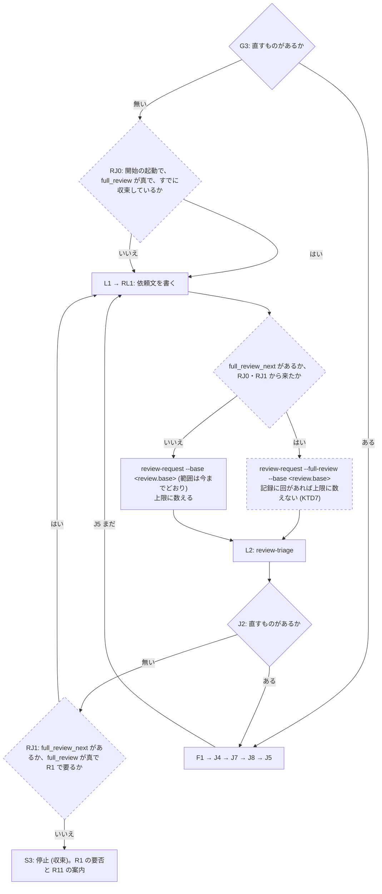

# 収束後の全量レビューの要否と、依頼する手段 (review-request・review-loop) - Plan

要件の出所は GitHub の Issue [akm/claude-plugins#72](https://github.com/akm/claude-plugins/issues/72) の本文と、#71 の作業中に出た問題をまとめたコメント ([#72 のコメント](https://github.com/akm/claude-plugins/issues/72#issuecomment-5862187394))。本文とコメントが未決とした論点は、2026-09-28 の会話で利用者が決めた (Product Contract の Key Decisions)。

この計画で使う語:

- **収束後の全量レビュー**: 増分の回 (前の回の HEAD からの変更だけを見るレビュー) で採択 (トリアージで直すと判断した指摘) が 0 件になった後に、範囲をブランチの全量に広げて行うレビュー。#71 で「最終確認」から言い換えた。
- **全量の回**: 記録 (トリアージの記録 YAML) の回のうち、`scope` が `full` のもの。記録に回が無いときの 1 回目と、収束後の全量レビューの 2 種類がある。
- **周回**: レビュー・トリアージ・修正を止まるまで繰り返す処理。ワーカー (端末で動くスクリプト) にレビューを任せるスキル `review-loop` と、sub-agent でレビューするスキル `review-triage-loop` の 2 つの経路がある。

## Goal Capsule

- **目的**: review-triage で周回を回す人が、増分の回が収束した後に、ブランチの全量のレビューを要るときだけ依頼文で頼める。要るか要らないかは記録から一意に決まり、周回の報告に出る。
- **手段**: 要否の規則を範囲の規則の正本に 1 か所で書き (R1、KTD1)、スキル `review-request` と `review-loop` に引数 `--full-review` と `--base` を足す (R5〜R9)。`review-loop` は、収束のあとに要否を判定するノードを持つ (KTD3)。
- **正本の優先順位**: 製品の振る舞いは Product Contract の R-ID が正本。実装の選び方は Planning Contract の KTD が正本。実装単位 (U-ID) はどちらも書き換えない。
- **止まる条件**: 次のどれかが分かったら、実装を止めて人間に返す。
  - スクリプト `review-triage/scripts/review-loop-worker.sh` か、ディレクトリ `review-triage/tools/triagecheck/` のコードを変えないと、全量の依頼文を処理できない。調査では変更は要らないと判断した (Sources の 7)。
  - 要否の規則 (R1) では、周回が全量の回を上限なく繰り返しうる経路が見つかった。
- **実行の型**: 変えるのは手順書 (Markdown) と `plugin.json` の版だけ。手順書は、Acceptance Examples を文書の上で辿って確かめ、最後に本物の `claude` で通し確認をする (Verification Contract)。通し確認は、始める前に回数・費用・手順を人間に示して許可を得る。文書を変えたら `doc-dag` と `wording-guard` を回す。
- **後始末の所有**: push・PR の作成 (本文に `Closes #72`)・Issue へのコメントは、人間の指示を受けてから行う。コミットは動機ごとに分ける (規範は利用者のコミットルール)。

---

## Product Contract

### Summary

収束後の全量レビューの要否を、「いまの HEAD の内容を全量で見て採択が 0 件だった回が記録にあるか」で決める。`review-request --full-review` は、記録に回があっても全量の依頼文を作る。`review-loop` は、開始時に `--full-review` を付けると、増分の回が収束して要るときに自動で全量の回を行う。すでに収束した記録で始めたときは、最初の回を全量にする。`--resume --full-review` を付けると、次の回を全量にする。全量の起点は `--base` で指定したブランチとの merge-base で、スタックされたブランチ (別の作業ブランチから派生したブランチ) にも使える。収束後の全量の回は周回の上限に数えない。モデルの使い分けの目安に、収束後の全量レビューの位置づけを書き足す。

### Problem Frame

範囲の規則 (ファイル `review-triage/skills/review-triage/references/review-request.md` の「範囲の規則」) は、全量を「最初の 1 回」と「収束後の全量レビュー」に限る。ところが、依頼文を書くスキル `review-request` は、記録に回が 1 つでもあると範囲を必ず増分にし、範囲を選ぶ引数も無い (ファイル `review-triage/skills/review-request/SKILL.md` の手順 2)。周回 `review-loop` は範囲の決め方を `review-request` に任せ、sub-agent の経路 `review-triage-loop` は収束後の全量レビューを周回に含めない (ファイル `review-triage/skills/review-triage-loop/references/review-invocation.md` の「範囲」)。そのため、周回は収束したときに「収束後の全量レビューをまだ行っていない」と報告するが、用意された道具ではそのための依頼文を作れない。#71 の作業では、手順 2 と違う値 (scope `full`、`base` は `main`) を手で入れて依頼文を作った。

要否も決まっていない。#71 のブランチで要否の書き方を 3 回変え、そのたびに直した文に次の指摘が出た (記録の回 4・5・6)。いまの定義 (`review-request.md` の 21 行) は収束を増分の回に限るので、記録に回が無い状態から 1 回目の全量で収束すると、S3 (周回が収束して止まる状態) の案内と食い違う。#71 で試して取り消した書き方は次の 3 つで、それぞれに出た問題がこの計画の制約になる。

- 定義から「増分の回で」を外す: 1 回目の全量で採択 0 件のまま収束しても、修正の無い同じ HEAD をもう一度全量で見させる。終わりの条件も無くなる。
- 要否を、収束した回の scope で決める: 1 回目の全量で収束した後、コミットせずに引数 `--model` を変えて周回を起動し直すと、範囲が空の増分の回で収束して「要る」と誤る。要らない場合に、S3 の「次に回すときの条件の推奨」に何を書くかも決まらない。
- 「採択が 0 件なら、そこで終わる」を足す: 保留 (人間の判断待ち) が残っても終わる。全量の回を上限なく繰り返しうる。

モデルの使い分けの目安 (ファイル `review-triage/skills/review-triage/references/record-schema.md` の「生成サマリの読み方」) は「実害の検出は Opus、収束確認 (0 件に到達させる仕上げ) は Sonnet」の 2 区分で、収束後の全量レビューがどちらに当たるかを書いていない。S3 の報告は、収束後の全量レビューに向くモデルの推奨を求めるので、推奨の理由がエージェントごとに違ってしまう。「仕上げ」は、#71 が避けた「これで終わり」という意味にも読める。

全量の起点も求め方が書かれていない。手順 2 は「分岐元 (既定は `main`)」とだけ書き、スタックされたブランチでは派生元のブランチのコミットまで範囲に入る。記録は回ごとの `base` を持たないので、1 回目の起点を後から読み直すこともできない。

### Key Decisions

- **全量の回で収束したら、収束後の全量レビューは要らない** (session-settled: user-directed — chosen over 収束した回の種類を問わず求める案: 修正の無い同じ内容をもう一度全量で見させることになる)。Governs R1。
- **要否は「いまの HEAD の内容を全量で見て、採択が 0 件だった回があるか」で決める** (session-settled: user-approved — chosen over 収束した回の scope で決める案: `--model` を変えて起動し直すと、範囲が空の増分の回で収束して誤る)。Governs R1。
- **要らないときの推奨は「強いて言えば、別のモデルか effort で行う」** (session-settled: user-directed — chosen over 推奨を書かない案: 推奨は止まった理由を問わず必須 (ファイル `review-triage/skills/review-triage-loop/references/reporting.md` の 6))。Governs R11。
- **収束後の全量レビューで採択が出たら、直して増分の回に戻る** (session-settled: user-directed — chosen over 止めて人間に返す案)。Governs R2。
- **収束後の全量の回は周回の上限に数えず、増分の回の上限の振る舞いは変えない** (session-settled: user-directed — chosen over 全量の回に別の上限を設けて延長できるようにする案: 起動の最初の 1 回を除いて、数えられる増分の回が間に入るので、既存の上限だけで周回は止まる)。Governs R3, R4。
- **引数が無ければ今までどおり。`review-request --full-review` は常に全量** (session-settled: user-directed — chosen over 記録を一時的に退かしてから `review-request` を呼ぶ回避: 回の番号が 1 に戻る)。Governs R5。
- **`review-loop` は、開始時の指定なら収束後に自動で、`--resume` での指定なら次の回を全量にする** (session-settled: user-directed — chosen over 開始時の指定で最初の回を全量にする案)。Governs R7, R8。
- **明示の指定は、要否の規則で要らないときも全量にする** (session-settled: user-approved — chosen over 要らなければ指定を無視する案: 別のモデルで見直す手段になる)。Governs R9。
- **開始時の `--full-review` も、すでに収束した記録で始めたときは明示の指定として扱う** (session-settled: user-directed — chosen over 仕組みは変えずに S3 の報告で手順を案内する案: 「要らない」ときの推奨 (別のモデルで行う) に従って新しい周回を始めても、1 回もレビューせずに止まってしまう)。Governs R7, R9。
- **起点は、引数で指定した派生元のブランチとの merge-base** (session-settled: user-directed — chosen over PR の base ブランチから求める案 (PR を作る前は使えない)・別の Issue に分ける案)。Governs R6。
- **sub-agent の経路 (`review-triage-loop`) には手段を足さない** (session-settled: user-directed — chosen over 両方の経路に足す案)。Governs R12。
- **収束後の全量レビューを、目安の「実害の検出」の側に置く** (session-settled: user-approved — chosen over 「収束の確認」の側に置く案 (全量でしか見つからない欠陥を見落としうる)・区分に置かない案)。Governs R13。
- **Opus で `--full-review` の周回を回すと上限で止まりやすいことを、目安に書く。仕組みは変えない** (session-settled: user-directed — chosen over S3 の推奨を周回の外の 1 回に限る案・全量の回を 1 起動 1 回に限る案 (A3・A4 の決定の見直しになる))。Governs R13。
- **`--base` を省いた周回は、開始時に `origin/HEAD` のブランチ名を解決して条件に書く** (session-settled: user-directed — chosen over 空のまま書いて毎回 `review-request` の既定に任せる案: 開始の報告にブランチ名が出ず、`origin/HEAD` が無ければ回の途中で尋ねることになる)。Governs R6, R7。
- **「仕上げ」を言い換える** (session-settled: user-approved — chosen over 残す案: 「これで終わり」と読める)。Governs R14。

### Requirements

**要否**

- R1. 収束後の全量レビューが要らないのは、記録に次の 3 つをすべて満たす回があるときだけである。要否は記録と git から決まり、報告の文面からは拾わない。
  - `scope` が `full`
  - 採択 (`verdict: adopted`) が 0 件
  - その回の `head` からいまの HEAD までに、記録の置き場の外の変更が無い (KTD2)
- R2. 収束後の全量の回で採択が出たら、直して増分の回に戻る。戻った後に収束したら、R1 で改めて要否を決める。
- R3. 保留は、出た時点で人間に判断を任せる。扱いは今の規則のままにする。
- R4. 収束後の全量の回は、周回の上限 (`max_rounds`) に数えない。記録に回が無いときの 1 回目の全量の回は、今までどおり数える。増分の回の数え方と、上限に達したときの振る舞いは変えない。

**依頼文を作る手段**

- R5. `review-request` は、引数 `--full-review` があれば、記録に回があっても全量の依頼文を作る。無ければ、範囲の種類は今までどおり (記録に回が無ければ全量、あれば増分) にする。全量の起点は R6 に従うので、引数が無くても `main` から `origin/HEAD` が指すブランチとの merge-base に変わる。`origin/HEAD` が無いリポジトリでは、1 回目の全量でも人間に尋ねるようになる。
- R6. `review-request` と `review-loop` は、引数 `--base <ブランチ>` で起点を受ける。
  - 全量の起点は、そのブランチと HEAD の merge-base (共通祖先のコミット) にする。増分の基点は、今までどおり直前の回の `head` にする。
  - 省略時は、`origin/HEAD` が指すブランチとの merge-base にする。決まらなければ人間に尋ねる。
  - 決まった起点 (ブランチ名と SHA) を報告に書く。
  - `review-loop` は、`--base` を省くと、開始時に `origin/HEAD` のブランチ名を解決して周回の条件に書く。解決できなければ、周回を始めずに人間に尋ねる。

**周回 (`review-loop`)**

- R7. 開始時の `--full-review` と `--base` は、周回の条件としてファイル `loop.yaml` に残る。`--full-review` のある周回は、増分の回が収束し、R1 で要るときに、止まらずに全量の回を行う。すでに収束した記録で `--full-review` を付けて始めたときは、R1 に関わらず最初の回を全量にする (R9)。
- R8. `--resume --full-review` は、その起動で次に書く依頼文を全量にする。修正が残っていれば、それを済ませてから全量にする。周回の条件は変えない。
- R9. 明示の指定は、R1 で要らないときも全量にする。明示の指定は次の 3 つである。
  - `review-request --full-review`
  - `review-loop --resume --full-review`
  - すでに収束した記録で `--full-review` を付けて始めた周回の、最初の回
- R10. `review-loop` の停止の報告は、数えた回数と上限に加えて、この起動で行った収束後の全量の回の数を示す。
- R11. S3 の報告は、R1 による要否を書く。
  - 要るときは、行う手段を案内する。手段は `review-loop --resume --full-review` (同じモデル) と、勧めるモデル (R13) で `--full-review` を付けて始める新しい周回である。sub-agent の経路では、`review-request --full-review` で依頼文を作る手段を案内する。
  - 要らないときは、「強いて言えば、別のモデルか effort で行う」と推奨する。手段は、そのモデルで `--full-review` を付けて始める新しい周回 (R9 により最初の回が全量になる) と、`review-request --full-review` である。

**sub-agent の経路**

- R12. `review-triage-loop` の手順と引数は変えない。S3 の報告は、2 つの経路で共通の決定表の行に従うので、R11 の要否の書き方になる。

**モデルの使い分けの目安**

- R13. 目安は、収束後の全量レビューを「実害の検出」の側 (粒度の細かいモデル) に置く。あわせて次の 2 つを書く。
  - `--full-review` の周回は、全量の回で採択が出る限り全量の回を繰り返す (R2)。そのため、最上位モデルで回すと、既存の注意「最上位モデルの全量レビューを収束条件にすると終わらない」のとおり、S3 ではなく上限 (S4) で止まりやすい。最上位モデルを収束後の全量の 1 回だけに使うなら、`review-request --full-review` で周回の外で頼む手もある。
  - 実測は #71 の 1 回だけ (Opus で採択 4 件) なので、暫定の目安である。
- R14. 目安とその写しから「仕上げ」を無くす。

### Acceptance Examples

- AE1. 1 回目の全量で収束する (Covers R1)
  - **Given:** 記録が無いブランチで、`--full-review` を付けて `review-loop` を始める。
  - **When:** 1 回目 (全量) の採択が 0 件になる。
  - **Then:** 全量の回を足さずに S3 で止まる。報告は「要らない」と書き、別のモデルか effort での実施を推奨する。
- AE2. コミットせずにモデルを変えて起動し直す (Covers R1)
  - **Given:** AE1 の後、コミットせずに `--model` を変えて新しい周回を始める。
  - **When:** その周回が範囲の空の増分の回で収束する。
  - **Then:** AE1 の全量の回が 3 つの条件を満たすので、「要らない」のまま。
- AE3. 記録の置き場を追跡内にしたリポジトリ (Covers R1)
  - **Given:** 設定 `record_dir` が git の追跡内で、全量の回の記録がコミットされて HEAD が進んだ。
  - **When:** 要否を判定する。
  - **Then:** その回の `head` から HEAD までの変更は記録の置き場の中だけなので、「要らない」。全量の回が続けて起動されることは無い。
- AE4. 収束後の全量で採択が出る (Covers R2, R4)
  - **Given:** 上限 3 回・`--full-review` の周回で、増分の回 2 が収束した。
  - **When:** 自動の全量の回で採択が 1 件出て、直す。
  - **Then:** 次は増分の回 3 (数える) になる。回 3 が収束したら R1 で要否を決め直し (修正があったので要る)、全量の回を行う。回 3 で採択が出て直したら、上限に達して S4 で止まる。
- AE5. 修正の途中から全量を指定して再開する (Covers R8)
  - **Given:** S2 (人間の選択待ち) で止まった周回に、人間が答えた。
  - **When:** `--resume --full-review` で再開する。
  - **Then:** 残りの修正を済ませてから、次の依頼文を全量で書く。その回は上限に数えない。周回の条件の `full_review` は変わらない。
- AE6. 要らないのに全量を指定する (Covers R9)
  - **Given:** AE1 の状態 (要らない) の周回。
  - **When:** `--resume --full-review` で再開する。
  - **Then:** 同じ HEAD をもう一度全量でレビューする。採択が 0 件なら S3 で止まる。
- AE7. スタックされたブランチ (Covers R6)
  - **Given:** ブランチ `feat/b` が `feat/a` から派生した。
  - **When:** `review-request --full-review --base feat/a` を呼ぶ。
  - **Then:** 依頼文の `base` は `git merge-base feat/a HEAD` の SHA で、`feat/a` のコミットは範囲に入らない。報告に `feat/a` とその SHA が出る。
- AE8. 「要らない」の後に、別のモデルで見直す (Covers R7, R9, R11)
  - **Given:** AE1 の周回が S3 で止まり、「別のモデルか effort で」と推奨された。
  - **When:** `--end` の後、別のモデルで `--full-review` を付けて新しい周回を始める。
  - **Then:** 範囲の空の増分の回を走らせずに、最初の回を全量で行う (上限に数えない)。採択が 0 件なら S3 で止まる。

### Scope Boundaries

- sub-agent の経路 (`review-triage-loop`) の手順・引数は変えない (R12)。変えるのは、2 つの経路で共通の S3 の行と、範囲の説明だけ。
- 設定ファイル (`.claude/akm-claude-plugins/review-triage/config.json`) に `--full-review` と `--base` のキーは足さない。どちらもブランチや周回ごとに変わる値で、前例 (引数 `--dir`・`--stage`) も設定のキーを持たない。
- 記録のスキーマは変えない。回ごとの `base` も足さない。
- ワーカーのスクリプトと、検査のツール `triagecheck` は変えない。

#### Deferred to Follow-Up Work

- sub-agent の経路の起点が `git merge-base <main ブランチ> HEAD` に決め打ちされている (`review-invocation.md` の「範囲」)。スタックされたブランチで範囲が広がる問題は `review-request` と同じなので、別の Issue に記録する。
- 過去の計画 (ファイル `docs/plans/2026-09-26-1338-feat-review-loop-plan.md`) の「最終確認」は、過去の決定の記録なので書き換えない。

### Sources / Research

1. #71 のトリアージの記録 (git に無視されるファイル `tmp/review-triages/docs-rename-final-check-71.yaml`): 要否を 3 回直した経緯 (回 4〜6)。回 3 が、手で作った全量の依頼文で行った収束後の全量レビュー (Opus・採択 4 件)。
2. 過去の計画の KTD13 (`docs/plans/2026-09-26-1338-feat-review-loop-plan.md`): 全量を同じワーカーに 1 回だけ頼む `review-loop --final` を先送りした。今回の名前 `--full-review` は利用者の選択 (KTD11)。
3. 過去の記録 (ファイル `docs/review-triage/feat-review-triage-loop.md` の 115 行、回 3 の指摘 3): 1 回目の全量で収束した場合も全量を促すのは正しい、としていた。今回はこれを改め、R1 で「要らない」とする。
4. 記録の回は `scope`・`head`・`findings[].verdict` を持つ (`record-schema.md`、ファイル `review-triage/tools/triagecheck/record.go` の `runs` の検査)。R1 はスキーマを変えずに判定できる。`scope` の検査は値が `full` か `incremental` かだけなので、回がある記録の `full` も通る。
5. 記録の置き場が追跡内なら、`review-triage` は記録とサマリをコミットする (ファイル `review-triage/skills/review-triage/SKILL.md` の手順 6、`record-schema.md` の「コミット」)。`review-triage-fix` も `plans` の更新を記録のコミットとして積む。KTD2 の根拠。
6. `review-loop` で回を数える場所は 1 か所だけ (ファイル `review-triage/skills/review-loop/references/round.md` の RL1 の手順 a の 7)。R4 はそこに条件を足すだけで済む。
7. ワーカーは依頼文から `head` だけを読み、複製は作業側の `refs/heads/*`・`refs/remotes/*`・`refs/tags/*` を取り込む (`review-loop-worker.sh`)。起点がブランチ名でも SHA でも複製で解決できるので、ワーカーの変更は要らない。

---

## Planning Contract

### Key Technical Decisions

- KTD1. **要否の規則 (R1) の正本は `review-request.md` の「範囲の規則」に置く。** S3 の行 (ファイル `review-triage/skills/review-triage-loop/references/loop-flow.md` の決定表)・`review-loop` の停止の報告・`review-request` の手順は、そこを指すだけにする。
  - `doc-dag` が見つけた巡回 (S3 の行 → `review-invocation.md` の「範囲」 → S3 の行) もここで解く。S3 の行は要否と周回の外で行う理由を `review-request.md` に任せ、`review-invocation.md` の「範囲」への参照を外す。「範囲」は、案内の書き方を S3 に任せる参照だけを残す。
  - いまの 21 行の定義 (収束を増分の回に限る) は、R1 と矛盾しない形に書き直す。
- KTD2. **R1 の「記録の置き場の外の変更が無い」は、`head` と HEAD の差分から、設定の `record_dir` の下のパスを除いて判定する。** `head` は記録の短縮 SHA なので、`git rev-parse` で完全な SHA に直してから比べる。
  - 理由: 置き場が追跡内なら、全量の回を取り込むたびに記録のコミットで HEAD が進む (Sources の 5)。`head` と HEAD の一致で判定すると、全量の回が採択 0 件でも「要る」を返し続ける。収束後の全量の回は上限に数えない (R4) ので、周回が止まらなくなる。
  - 利用者が承認した「いまの HEAD を全量で見て採択が 0 件」の意図 (修正の無い同じ内容を二度見ない) を保ったまま、記録のコミットだけを除く。レビューの対象でない変更だけを除く規則なので、修正のコミットは必ず「変更あり」になる。
  - 置き場が作業ツリーの外や追跡外なら、除く対象は差分に現れない。既定の置き場 (`tmp/review-triages/`) では、判定は `head` と HEAD の比較と同じ結果になる。
- KTD3. **`review-loop` に、J2 の「無い」と S3 の間に判定ノード RJ1 を、G3 の「無い」と L1 の間に判定ノード RJ0 (KTD4) を足す。** RJ1 は、`full_review_next` (KTD5) があるか、周回の条件 `full_review` が真で R1 で要るなら L1 に進み (全量の回)、それ以外は S3 に進む。
  - ノードは `review-loop` の停止の正本 (ファイル `review-triage/skills/review-loop/references/stops.md`) の、差し替えた部分の図と決定表に置く。ID の接頭辞 `R` は、この周回で足したノードの前例 (RG0・RL1・RA1〜RA3) に合わせる。
  - ファイル `review-triage/skills/review-loop/SKILL.md` の「正本の宣言」は、差し替える箇所に「G3 の『無い』の先 (RJ0)」と「J2 の『無い』の先 (RJ1)」を加える。`loop-flow.md` の図 (sub-agent の経路と共通) は変えない (R12)。
  - RJ1 は上限 (J5) を見ない。S3 の枝が上限を見ない理由と同じで、直すものが無い状態で上限として報告すると、要否の案内が報告に入らない。
- KTD4. **判定ノード RJ0: `full_review` が真の周回を、すでに収束した記録で始めたら (開始 `/review-loop` の最初の G3 の「無い」)、最初の回を全量にする。** R1 は見ない (R9 の明示の指定)。「すでに収束した」とは、記録の最後の回の採択が 0 件で、その回の `head` から HEAD までに記録の置き場の外の変更が無いこと (KTD2 と同じ差分の判定)。
  - 理由: S3 の報告は、勧めるモデル (要るとき) や別のモデル (要らないとき) で `--full-review` を付けた新しい周回を案内する (R11)。この判定が無いと、その周回は範囲の空の増分の回を 1 回走らせ (上限に数える)、要らないときは全量の回を行わずに止まる。
  - `--resume` の起動では RJ0 を通らない。再開で全量にするのは `--resume --full-review` (KTD5) である。そうしないと、要らない状態の周回を再開するたびに全量の回が走る。
  - まだ収束していない記録で始めたときは、RJ0 は「いいえ」で L1 (増分) に進む。全量の回は、収束の後に RJ1 が決める。
- KTD5. **`--resume --full-review` の印は、`loop.yaml` の実行時のキー `full_review_next` に書く。** 周回の条件 (`review` の下) には置かない。
  - `--resume` で `true` を書き、L1 で全量の依頼文を書いたら消す。どの停止でも消す。その起動だけに効く指定なので、`--max` と同じく次の起動に持ち越さない。
  - 待機の `description` ではなく `loop.yaml` に置く理由: 再開が F1 から始まると、L1 に着くまでに複数の待機をまたぐことがある。`loop.yaml` は再入の手順が必ず読み直す (ファイル `review-triage/skills/review-loop/references/reentry.md`)。
  - 停止の報告は、印を使わずに止まったこと (「全量の回を行わずに止まった」) を書く。
  - 全量の回 (印・RJ0・RJ1 のどれから来たかを問わない) が RA1 (レビュー不成立) で止まったときは、RA1 の報告の再開の手順に「全量でやり直すには `--resume --full-review` を打つ」と書く。印は依頼文を書いた時点で消えているので、`--resume` だけでは範囲の空の増分の回になる。
- KTD6. **周回の条件のキーは `review.full_review` (真偽値) と `review.base` (ブランチ名) にする。** 開始時に決めて書き、`--resume` では変えない。
  - 0.14.0 で始めた周回の `loop.yaml` にキーが無ければ、`full_review` は偽とし、`base` は `--resume` の開始時に解決して書く (KTD10)。書き方の前例は、ファイル `review-triage/skills/review-loop/references/arguments.md` の「0.13.0 で始めた周回の `loop.yaml` には、この 2 つのキーが無い」。
  - `--resume` で受け付ける引数は `--max` と `--full-review` の 2 つにする。`--full-review` は範囲を 1 回変えるだけで、範囲は記録の回ごとに `scope` として残る。「再開のたびに条件を変えない」規則の理由 (記録の回ごとの違いを読み解けなくなる) と矛盾しない。
- KTD7. **上限に数えないのは、「記録に回がある状態で書いた全量の依頼文」の回だけにする。** `round.md` の RL1 の手順 a の 7 (数える唯一の場所) に条件を足す。
  - この起動で行った収束後の全量の回の数は、待機の `description` に、数えた回数と並べて持つ (`reentry.md` の書式)。報告 (R10) はそこから書く。
- KTD8. **記録の `scope` は、依頼文 (結果 YAML) の `scope` から採る。** いまの `round.md` の「L2 で `review-triage` に渡すもの」は、出所を `review-invocation.md` の表に任せている。その表の `scope` は「周回が決めた範囲」で、「範囲」の節は「全量は記録に回が無いときだけ」と定めるので、字義どおりに読むと収束後の全量の回が `incremental` として記録される。`review-loop` の読み替えに「`scope` は結果 YAML の値」を足す。
- KTD9. **RA3 の確認 (基点が HEAD の祖先か) は、増分の回だけにする。** 全量の基点は merge-base で、常に HEAD の祖先になる。`round.md` の手順 a の 3 の「記録に回があれば」を「増分の回なら」に変える。
- KTD10. **起点の求め方の正本は `review-request` の手順 2 に置く。** `review-loop` は `loop.yaml` の `review.base` を `--base` として渡すだけにする。例外は、`--base` を省いたときのブランチ名の解決で、RG0 で `review-request` の手順 2 と同じ求め方 (`origin/HEAD` が指すブランチ) で解決して書く (Key Decisions)。0.14.0 で始めた周回の `loop.yaml` にキーが無いときも、`--resume` の開始時に同じく解決して書く。省略時の既定 (`origin/HEAD` が指すブランチ) は、`review-invocation.md` の「範囲」と同じ求め方にそろえる。`review-invocation.md` の決め打ちは変えない (Deferred)。
- KTD11. **引数の名前は `--full-review` にする** (session-settled: user-directed — chosen over 過去の計画の仮名 `--final`: 範囲を表す名前で、「これで終わり」と読めない。#71 で「最終確認」を言い換えた理由と同じ)。
- KTD12. **`plugin.json` の版を 0.15.0 に上げる。** 引数が増えるため。ワーカーの互換の境界 (`round.md` の「0.14.0 以降」) は変えない。ワーカーは変えないので、0.14.0 のワーカーのままでも全量の依頼文を処理できる (Sources の 7)。
- KTD13. **全量の依頼文の補足 (`scope_note`) は、1 回目と明示の指定で書き分ける。** 1 回目は今までどおり「ブランチの全量」、`--full-review` の回は「ブランチの全量 (`--full-review` による指定)」とし、起点のブランチ名も添える。レビュアが、増分の外を報告しない規則をこの回に当てはめないようにするため。

### High-Level Technical Design

`review-loop` の周回で、開始時 (G3 の「無い」) と収束 (J2 の「無い」) の先、再開時の印の扱いは次のようになる。点線の枠が、この計画で足すもの。

RJ0 は「はい」でも「いいえ」でも L1 に進み、違いは次の依頼文が全量か増分かだけである。RJ0 を通るのは開始 (`/review-loop`) の起動の最初の G3 だけで、`--resume` の起動では通らない (KTD4)。

RJ1 の入力と結果:

| `full_review_next` (印) | `full_review` (条件) | 記録に R1 の 3 条件を満たす回 | RJ1 の行き先 | S3 の報告 (R11) |
| --- | --- | --- | --- | --- |
| ある | 問わない | 問わない | L1 (全量の回。数えない) | — |
| 無い | 真 | 無い | L1 (全量の回。数えない) | — |
| 無い | 真 | ある | S3 | 要らない。別のモデルか effort での実施を推奨し、その手段を案内 |
| 無い | 偽 | 無い | S3 | 要る。`--resume --full-review` か、勧めるモデルで `--full-review` を付けた新しい周回を案内 |
| 無い | 偽 | ある | S3 | 要らない。別のモデルか effort での実施を推奨し、その手段を案内 |

全量の回が止まる理由 (R4 の根拠): 記録に回がある状態の全量の回に進む経路は、RJ0・印・RJ1 の 3 つである。RJ0 は開始の起動に、印は `--resume` の起動に限られ、どちらも 1 起動に 1 回しか通らない。RJ1 に来るのは、回の採択が 0 件のときだけである。全量の回で採択が出れば、F1 の後は J5 を通って増分の回 (数える) に進む。全量の回で採択が 0 件なら、KTD2 により R1 の 3 条件を満たすので、RJ1 は (印が無ければ) S3 に進む。したがって、収束後の全量の回の数は、この起動で数えた回数 + 1 を越えない。+1 は、RJ0 か印による、数える回より前の全量の回である。

### Sequencing

1. U1 (要否の正本) を先に書く。ほかの単位はすべてここを指す。
2. U2 (`review-request`) は U1 の後。`review-loop` が呼ぶ引数を先に決める。
3. U3 (周回の条件と引数) → U4 (周回の流れ) の順。U4 は U3 のキーを使う。
4. U5 (S3 の共通の行と sub-agent の経路の範囲) は U1 の後ならいつでもよい。U4 と同じ `stops.md` の S3 の段落を触るので、U4 の後にする。
5. U6 (モデルの目安) は独立している。
6. U7 (版と README) を最後にする。

### Risks

| リスク | 対策 |
| --- | --- |
| RJ0・RJ1 の誤判定で、収束後の全量の回が繰り返される (数えないので上限で止まらない) | KTD2 で記録のコミットを除く。High-Level Technical Design の「全量の回が止まる理由」を `review-request.md` の正本に書き、Acceptance Examples の AE3・AE4 を文書の上で辿って確かめる。通し確認のシナリオ B で実際に回す |
| 触る文書が多く、同じ規則が複数の箇所に書かれる | KTD1 で正本を 1 か所にし、ほかは参照にする。`doc-dag` で重複と巡回を確かめる |
| 直した文に次の指摘が出続ける (#71 の回 4〜6) | 要否の書き方は KTD と AE で先に決めてから書く。レビューで同じ箇所への採択が続いたら、周回の関門 (J9) に従って止め、構造を見直す |
| 通し確認の費用 | 始める前に回数・モデル・effort を人間に示して許可を得る |

---

## Implementation Units

### U1. 要否の規則と、収束後の全量レビューの定義を正本に書く

- **Goal:** 範囲の規則の正本に、R1〜R4 と、明示の指定の扱い (R9) を書く。
- **Requirements:** R1, R2, R3, R4, R9 (KTD1, KTD2)
- **Dependencies:** なし
- **Files:**
  - `review-triage/skills/review-triage/references/review-request.md`
- **Approach:**
  1. 「範囲の規則」の 21 行の定義を、収束した回の種類を問わない形に書き直す。R1 の 3 条件で要否を決めることを書く。
  2. 3 条件の 3 つ目の判定の仕方 (差分から `record_dir` の下を除く・短縮 SHA を完全な SHA に直す) を書く (KTD2)。
  3. 採択が出たら増分の回に戻ること (R2) と、保留の扱いが変わらないこと (R3) を書く。
  4. 収束後の全量の回を上限に数えないことと、それでも周回が止まる理由を書く (R4、High-Level Technical Design の「全量の回が止まる理由」)。
  5. 明示の指定は要否に関わらず全量にすること (R9) を書く。
  6. 「全量を繰り返すと、指摘が際限なく出続ける」の規則との関係を書く。収束後の全量の回を繰り返すのは、前の全量の回で採択が出て直したときだけで、回数は周回の上限で抑えられる。粒度の細かいモデルでは上限で止まりやすいこと (R13) は目安の側に書き、ここでは指すだけにする。
- **Patterns to follow:** この文書の既存の書き方 (太字の規則 1 文 + 理由)。#71 で取り消した 3 案の問題 (Problem Frame) に、どの文が答えるかが読み取れるようにする。
- **Test scenarios:** 文書の上で次を辿り、規則から結果が一意に決まることを確かめる。
  - Covers AE1. 記録が 1 回目の全量 (採択 0 件) だけで、HEAD が変わっていない → 要らない。
  - Covers AE2. 1 回目の全量 (採択 0 件) の後に、範囲の空の増分の回 (採択 0 件) がある → 要らない (全量の回が条件を満たす)。
  - Covers AE3. 全量の回の後に、記録の置き場の下だけを変えるコミットがある → 要らない。
  - 全量の回 (採択 0 件) の後に、置き場の外を変えるコミットがある → 要る。
  - 全量の回の採択が 1 件で、直した後の増分の回が採択 0 件 → 要る (修正があるので、全量の回は 3 つ目の条件を満たさない)。
  - 記録に全量の回が無い (0.13.0 より前の記録で、回 1 が増分として記録された、など) → 要る。
  - 全量の回の採択が 0 件で保留が 1 件、人間がその保留を直すと決めてコミットした → 要る。
- **Verification:** 上の 7 つの場合で、正本だけを読んで要否が決まる。#71 で出た 3 つの問題 (Problem Frame) のどれにも当たらない。

### U2. `review-request` に `--full-review` と `--base` を足す

- **Goal:** 記録に回があっても全量の依頼文を作れるようにし、起点を指定できるようにする。
- **Requirements:** R5, R6, R9 (KTD10, KTD13)
- **Dependencies:** U1
- **Files:**
  - `review-triage/skills/review-request/SKILL.md`
- **Approach:**
  1. `description`・様式・引数の表に `--full-review` と `--base <ブランチ>` を足す。`--dir` と同じく、位置引数の前後どちらに置いてもよい。設定のキーは持たない。
  2. 手順 2 の範囲と基点を書き直す。
     - 記録に回が無いか、`--full-review` があれば、scope は `full`。
     - scope が `full` のときの `base` は、`--base` のブランチ (無ければ `origin/HEAD` が指すブランチ) と HEAD の merge-base の SHA。ブランチが解決できないか、`origin/HEAD` が無ければ、生成せずに人間に尋ねる。
     - それ以外は今までどおり `incremental` で、`base` は直前の回の `head`。`--base` は使わない。
  3. 補足の書き分けを手順 2 に書く (KTD13)。
  4. 手順 4 (埋める値) と手順 5 (報告) に、起点のブランチ名と SHA、その出所 (`--base` か既定か) を足す。
  5. 手順 3 (識別子) は変えない。成分に scope は無く、回の番号で区別できる。
- **Patterns to follow:** `--dir` の引数の書き方 (表の行と、位置引数との関係の 1 文)。人間に尋ねる場合の書き方は、手順 1 のモデル名の「未設定なら人間に尋ねる」。
- **Test scenarios:** 文書の上で次を辿る。
  - 記録が無く、引数も無い → `full`、起点は `origin/HEAD` のブランチとの merge-base。
  - 記録に回が 2 つあり、引数が無い → `incremental`、基点は回 2 の `head` (今までどおり)。
  - Covers AE7. 記録に回があり、`--full-review --base feat/a` → `full`、起点は `feat/a` との merge-base の SHA、補足に `--full-review` と `feat/a`。
  - `--base` に存在しないブランチを渡す → 生成せずに報告する。
  - `origin/HEAD` が無いリポジトリで `--base` が無い → 生成せずに人間に尋ねる。
  - 記録が読めない → 今までどおり生成せずに報告する (`--full-review` があっても、回の番号が決まらないため)。
- **Verification:** 手順 2 だけを読めば、どの組み合わせでも scope・`base`・補足が一意に決まる。

### U3. `review-loop` の引数と、周回の条件のキーを足す

- **Goal:** `--full-review` と `--base` を開始時の条件として `loop.yaml` に残し、`--resume` で `--full-review` を受け付ける。
- **Requirements:** R6, R7, R8 (KTD5, KTD6)
- **Dependencies:** U2
- **Files:**
  - `review-triage/skills/review-loop/references/arguments.md`
  - `review-triage/skills/review-loop/references/loop-files.md`
  - `review-triage/skills/review-loop/SKILL.md`
  - `review-triage/skills/review-loop/references/round.md`
- **Approach:**
  1. `arguments.md` の様式と表に 2 つの引数を足す。設定のキーの欄は「無し」とし、前例 (`--stage` の値を `loop.stages` に書く) に合わせる。
  2. `arguments.md` の「`--resume` で受け付けるのは `--max` だけ」を、`--max` と `--full-review` に書き換え、`--full-review` が条件を変えない理由を書く (KTD6)。
  3. 0.14.0 で始めた周回の `loop.yaml` にキーが無い場合の扱い (`full_review` は偽、`base` は `--resume` の開始時に解決して書く) を書く (KTD6, KTD10)。
  4. `loop-files.md` の `loop.yaml` の例と表に、`review.full_review`・`review.base`・`full_review_next` を足す。`full_review_next` は実行時のキーとして、書く時と消す時を書く (KTD5)。
  5. `round.md` の決定表の RG0 に、`--base` を省いたときに `origin/HEAD` のブランチ名を解決して `review.base` に書くことと、解決できなければ始めずに尋ねることを足す (KTD10)。報告に書くもの (全量の条件・起点のブランチ) も足す。
  6. `SKILL.md` の `description` と、手順の「`--resume`」の説明に引数を足す。
- **Patterns to follow:** `arguments.md` の「0.13.0 で始めた周回の `loop.yaml` には、この 2 つのキーが無い」の段落。`loop-files.md` の `state`・`stop_reason` (実行時に書き換えるキー) の書き方。
- **Test scenarios:**
  - `--full-review --base feat/a` で始める → `loop.yaml` に `review.full_review: true`・`review.base: feat/a` があり、開始の報告に両方が出る。
  - 引数なしで始める → `review.full_review: false`、`review.base` は `origin/HEAD` が指すブランチ名 (報告にブランチ名が出る)。
  - `origin/HEAD` が無いリポジトリで `--base` なしで始める → 周回を始めずに人間に尋ねる。
  - `--resume --base feat/a` → 周回を始めずにエラー (`--resume` では受け付けない)。
  - `--resume --full-review` → `full_review_next: true` が書かれ、`review.full_review` は変わらない。
  - 0.14.0 の `loop.yaml` (キーが無い) を `--resume` する → `full_review` は偽とし、`review.base` に解決したブランチ名を書く。エラーにならない。
- **Verification:** `arguments.md`・`loop-files.md`・`round.md` の RG0 の 3 か所で、キーの名前と意味が一致する。

### U4. `review-loop` の周回に、判定 (RJ0・RJ1) と全量の回を足す

- **Goal:** 収束の後に要否を判定し、要れば全量の回を行う。再開時の印で次の回を全量にする。全量の回を上限に数えない。
- **Requirements:** R2, R4, R7, R8, R9, R10, R11 (KTD3, KTD4, KTD5, KTD7, KTD8, KTD9)
- **Dependencies:** U1, U3
- **Files:**
  - `review-triage/skills/review-loop/references/stops.md`
  - `review-triage/skills/review-loop/references/round.md`
  - `review-triage/skills/review-loop/references/reentry.md`
  - `review-triage/skills/review-loop/SKILL.md`
  - `review-triage/skills/review-loop/references/worker.md`
- **Approach:**
  1. `stops.md` の差し替えた部分の図と決定表に、RJ0 (KTD4) と RJ1 (KTD3) を足す。行き先と報告に書くものは High-Level Technical Design の図と表のとおり。要否の規則は U1 の正本を指す。いまの図の、G2 から RL1 への点線の説明も、G3 の「無い」で RJ0 を通るように書き直す。
  2. `SKILL.md` の「正本の宣言」の表で、流用しないものに「G3 の『無い』の先 (RJ0)」と「J2 の『無い』の先 (RJ1)」を加える (KTD3)。
  3. `round.md` の RL1 の手順 a を直す。
     - 3 (RA3 の確認) を増分の回だけにする (KTD9)。
     - 4 (`review-request` の呼び出し) に、`--base <review.base>` を常に渡し、全量の回 (`full_review_next` があるか、RJ0・RJ1 から来た) なら `--full-review` を渡すことを書く。
     - 7 (回数) に、記録に回がある状態で書いた全量の依頼文は数えないことと、`full_review_next` を消すことを書く (KTD5, KTD7)。
  4. `round.md` の「L2 で `review-triage` に渡すもの」に、`scope` は結果 YAML の値を使うことを足す (KTD8)。
  5. `reentry.md` の待機の `description` の書式に、この起動で行った収束後の全量の回の数を足す。`--resume` の開始の手順に `full_review_next` を書くことを足す。
  6. `stops.md` の「停止のときに書き換えるもの」に `full_review_next` を消すことを、「停止の報告に足すもの」の「回数」の行に全量の回の数を足す (R10)。「S3 のとき」の行は、ワーカーに頼まないという文を消し、R11 の案内を U1 の正本に基づいて書く。
  7. `stops.md` の RA1 の行の報告に、全量の回で止まったときは「全量でやり直すには `--resume --full-review` を打つ」と書くことを足す (KTD5)。
  8. `worker.md` の「base がブランチ名 (main など) でも」の理由の文を、base が SHA の場合も含む書き方にする (振る舞いは変えない)。
- **Patterns to follow:** `stops.md` の RA1〜RA3 の図と決定表の書き方。`round.md` の手順 a の番号付きの手順 (太字の条件 + 理由)。
- **Test scenarios:** 文書の上で次を辿る (HTD の図と照らす)。
  - Covers AE1. 記録なし・`--full-review` → 回 1 (全量・数える) で採択 0 → RJ1 → S3 (要らない)。報告は「1 回 / 上限 N 回、収束後の全量 0 回」。
  - Covers AE4. `--full-review`・上限 3 → 回 1 (全量)・回 2 (増分) が収束 → RJ1 → 全量の回 (数えない) で採択 1 → F1 → J5 (2 < 3) → 回 3 (増分) で採択 1 → F1 → J5 (3) → S4。
  - Covers AE5. S2 から `--resume --full-review` → G2 → G3 (ある) → F1 → J8 (無い) → J5 → L1 で全量 (`full_review_next` を消す)。
  - Covers AE6. 要らない状態で `--resume --full-review` → G3 (無い) → `--resume` の起動なので RJ0 を通らずに L1 → 印があるので全量。採択 0 → RJ1 → S3。
  - `--full-review` なしの周回が収束 → RJ1 → S3。報告に「要る」と `--resume --full-review` と新しい周回の案内。
  - Covers AE8. 別のモデルで `--full-review` を付けた新しい周回を、収束済み (要らない状態) の記録で始める → RJ0 (はい) → L1 で全量 (数えない)。範囲の空の増分の回は走らない。採択 0 → RJ1 → S3。
  - まだ収束していない記録 (最後の回の後に修正のコミットがある) で `--full-review` を付けて始める → RJ0 (いいえ) → L1 で増分 (数える) → 収束 → RJ1 → 要る → 全量。
  - 印の無い依頼文が残った周回を `--resume --full-review` で再開し、取り込んだ回が収束する → RJ1 は印を見て L1 → 全量 (印を消す)。
  - 印で書いた全量の回が RA1 で止まる → 報告に `--resume --full-review` でのやり直しが出る。
  - 上限 1・`--full-review`・収束済みの記録で始める → RJ0 の全量 (数えない) で採択 1 → F1 → J5 (0 < 1) → 回 1 (増分・数える) が収束 → RJ1 → 全量で採択 1 → F1 → J5 (1) → S4。全量の回は 2、数えた回は 1 で、「数えた回数 + 1」に収まる。
  - `--resume --full-review` の起動が、全量の回を書く前に S2 で止まる → `full_review_next` が消え、報告に「全量の回を行わずに止まった」。
  - 全量の回の結果を取り込む → 記録の `scope` が `full` になる (KTD8)。
- **Verification:** `stops.md` の図と決定表のノード ID が 1 対 1 で対応する。HTD の図と、`stops.md` と `loop-flow.md` を合わせた図が同じ遷移を表す。

### U5. S3 の共通の行と、sub-agent の経路の「範囲」を直す

- **Goal:** S3 の報告を R1 の要否に基づく形にし、`doc-dag` が見つけた巡回を解く。
- **Requirements:** R11, R12 (KTD1)
- **Dependencies:** U1, U4
- **Files:**
  - `review-triage/skills/review-triage-loop/references/loop-flow.md`
  - `review-triage/skills/review-triage-loop/references/review-invocation.md`
- **Approach:**
  1. `loop-flow.md` の決定表の S3 の行の「収束後の全量レビューをまだ行っていないことを必ず書く」を、R1 による要否と R11 の案内を書く形にする。要否の規則は U1 の正本を指す。経路ごとの案内 (`review-loop` なら `--resume --full-review`、sub-agent の経路なら `review-request --full-review`) は、それぞれの経路の文書に任せる。
  2. S3 の行から `review-invocation.md` の「範囲」への参照を外す (KTD1)。
  3. `review-invocation.md` の「範囲」の「収束後の全量レビューは周回に含めない」の段落を、sub-agent の経路に限った説明にする。`review-loop` は `--full-review` で周回の中で行えることと、そのとき上限に数えないこと (U1 の正本) を 1 文で示す。
  4. 図 (`loop-flow.md` の mermaid) は変えない。
- **Patterns to follow:** 決定表の他の停止の行の「報告に書くもの」の書き方。
- **Test scenarios:**
  - sub-agent の経路で 1 回目の全量で収束 → S3 の報告は「要らない」と推奨 (AE1 と同じ結論)。
  - sub-agent の経路で増分の回が収束 → S3 の報告は「要る」と `review-request --full-review` の案内。
  - `doc-dag` で、S3 の行と「範囲」の間に巡回が無い。
- **Verification:** `doc-dag` の結果で、この 2 つの節の間の巡回が消えている。`review-triage-loop` の `SKILL.md`・`arguments.md`・図に差分が無い。

### U6. モデルの使い分けの目安に、収束後の全量レビューを位置づける

- **Goal:** 目安に R13 を書き、「仕上げ」を無くす。
- **Requirements:** R13, R14
- **Dependencies:** なし
- **Files:**
  - `review-triage/skills/review-triage/references/record-schema.md`
  - `review-triage/skills/review-triage-loop/references/reporting.md`
  - `review-triage/skills/review-triage-loop/SKILL.md`
- **Approach:**
  1. `record-schema.md` の「生成サマリの読み方」の目安の段落を書き直す。
     - 「収束確認 (0 件に到達させる仕上げ)」を「収束の確認 (採択を 0 件まで減らしていく回)」にする。
     - 収束後の全量レビューを「実害の検出」の側に置く文と、`--full-review` の周回を最上位モデルで回すと上限で止まりやすいこと、周回の外の 1 回として頼む手もあること (R13) を足す。
     - 暫定であることと、根拠の実測 (#71 の 1 回) を書く。
  2. `reporting.md` の 6 の括弧書きの写しを、正本の変更に合わせる。2 区分の写しを残すか、参照だけにするかは、`doc-dag` の結果で決める。
  3. `review-triage-loop/SKILL.md` の前提知識の「例: 収束の仕上げだけ別のモデルで回す」を「例: 採択が減ってきた後の周回だけ、別のモデルで回す」にする。
- **Patterns to follow:** 目安の段落の既存の書き方 (観測に基づく傾向として書き、断定しない)。
- **Test scenarios:**
  - `record-schema.md`・`reporting.md`・`SKILL.md` に「仕上げ」が残っていない。
  - 目安の段落だけを読んで、S3 で収束後の全量レビューに勧めるモデルと、その理由が決まる。最上位モデルで `--full-review` の周回を回したときに、どこで止まりやすいかも分かる。
  - 既存の注意 (最上位モデルの全量を収束の条件にすると終わらない) と、新しい文が同じ段落で矛盾なく読める。
- **Verification:** `grep` で「仕上げ」がこの 3 ファイルに無い。

### U7. 版と README を更新する

- **Goal:** 引数が増えたことを版と README に反映する。
- **Requirements:** R5, R6, R7, R8 (KTD12)
- **Dependencies:** U2, U3, U4
- **Files:**
  - `review-triage/.claude-plugin/plugin.json`
  - `review-triage/README.md`
- **Approach:**
  1. `plugin.json` の版を 0.15.0 にする。
  2. README の `review-request` と `review-loop` の行に、`--full-review` と `--base` を足す。引数が無くても全量の起点が `origin/HEAD` のブランチとの merge-base に変わること (R5) も書く。
  3. ワーカーの互換の境界 (`round.md`・`worker.md` の 0.14.0) と、`loop-files.md` の例の `worker_version` は変えない。
- **Patterns to follow:** 0.14.0 に上げたときの変更 (PR #69)。
- **Test expectation:** none -- 版の番号と説明の文だけで、振る舞いは変わらない。ワーカーのテスト (ファイル `review-triage/tests/test_review_loop_worker.py`) は `plugin.json` の版を読むので、Verification Contract のスクリプトのテストで成功を確かめる。
- **Verification:** `plugin.json` の版が 0.15.0。README の 2 つの行が、各スキルの引数の表と一致する。

---

## Verification Contract

| 検査 | コマンド / 手段 | 対象の単位 | 証明するもの |
| --- | --- | --- | --- |
| 文書の上での確認 | 各単位の Test scenarios を、変えた文書だけを読んで辿る | U1〜U6 | AE1〜AE7 の結果が文書から一意に決まる |
| 変えないものの差分 | `git diff --stat main -- review-triage/scripts review-triage/tests review-triage/tools review-triage/skills/review-triage-fix review-triage/skills/review-triage/SKILL.md` | U1〜U7 | 差分が無い |
| 検査のツールのテスト | 設定の `gates` の `go test`。設定の `ASDF_GOLANG_VERSION=1.25.1` はこの環境に無いので、1.25.4 に替えて走らせる (設定は変えない) | U1〜U7 | コードを変えていないことの確認として成功する |
| スクリプトのテスト | `python3 -m unittest discover -s review-triage/tests` | U7 | 版を上げてもワーカーのテストが成功する |
| 文書の構造 | `doc-dag` | U1〜U6 | 要否の規則の正本が 1 か所。S3 の行と「範囲」の巡回が無い |
| 言い回し | `wording-guard` | U1〜U7 | 最後の走査で新しい種類が無い |
| 停止ノードの整合 | `stops.md` の図と決定表の ID を目視で照合 | U4 | 1 対 1 で対応する |
| レビュー | `review-loop` かレビューの依頼文でレビューし、`review-triage` と `review-triage-fix` で直す | U1〜U7 | 収束する (J9 で止まったら構造を見直す) |
| 通し確認 | 作業側の対話セッション 1 つ (ブランチ版のプラグイン) と、ワーカーの端末 1 つ。U7 の後に行う。始める前に回数・モデル・effort・費用を人間に示して許可を得る | U2〜U5 | 下のシナリオ |

通し確認のシナリオ。各シナリオで、依頼文の `scope`・`base`・補足、記録の `scope`、停止の報告の回数と要否の案内を見る。

| # | シナリオ | 期待 | Covers |
| --- | --- | --- | --- |
| A | 記録の無い小さなブランチで、`--full-review` を付けて始める | 回 1 (全量) で採択 0 なら、全量の回を足さずに S3。報告は「要らない」と推奨 | AE1 |
| B | A の後に小さな変更をコミットし、`--end` の後に `--full-review` を付けて新しい周回を始める | RJ0 は「いいえ」で増分の回から始まる。増分の回が収束したら、全量の回に進む。その回は数えられず、記録の `scope` は `full`、`base` は merge-base の SHA | AE4, R7 |
| E | A の周回を `--end` し、別のモデルで `--full-review` を付けて新しい周回を始める | 範囲の空の増分の回を走らせずに、最初の回を全量で行う | AE8 |
| C | A の周回を `--resume --full-review` で再開する | 同じ HEAD で全量の回を行い、S3 に戻る | AE6 |
| D | スタックされたブランチで `review-request --full-review --base <派生元>` を呼ぶ | 依頼文の `base` が派生元との merge-base で、派生元のコミットが範囲に入らない | AE7 |

## Definition of Done

- U1〜U7 がすべて完了し、上の Verification Contract の全項目が成功している。通し確認は、許可を得て行ったか、行わなかったことを PR に書いている。
- `review-triage/scripts`・`review-triage/tests`・`review-triage/tools`・`review-triage-fix`・`review-triage/SKILL.md` に差分が無い。既存の記録 (`tmp/review-triages/`・`docs/review-triage/`) が書き換わっていない。
- 各単位が、動機ごとのコミットになっている (U7 の版の更新は独立したコミット)。計画のコミットは実装と分かれている。
- 通し確認のために作ったブランチ・記録・周回の置き場が、差分に無い。
- #71 で取り消した 3 案の問題 (Problem Frame) のどれにも、正本の文が当たらない。
