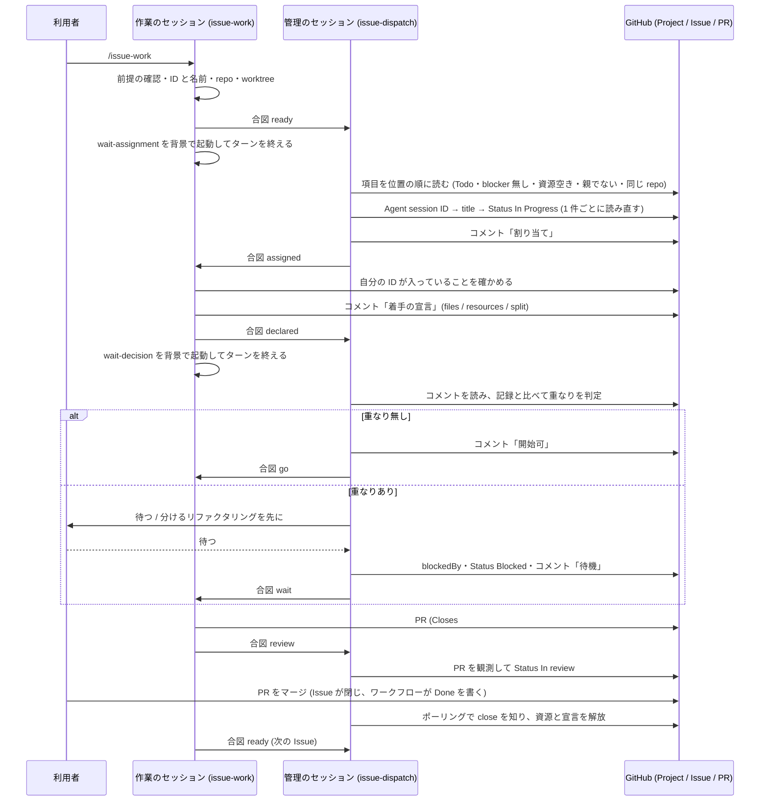
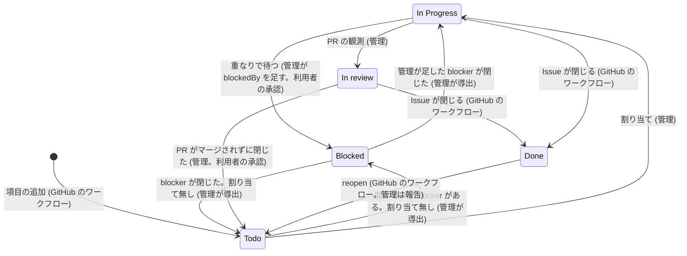
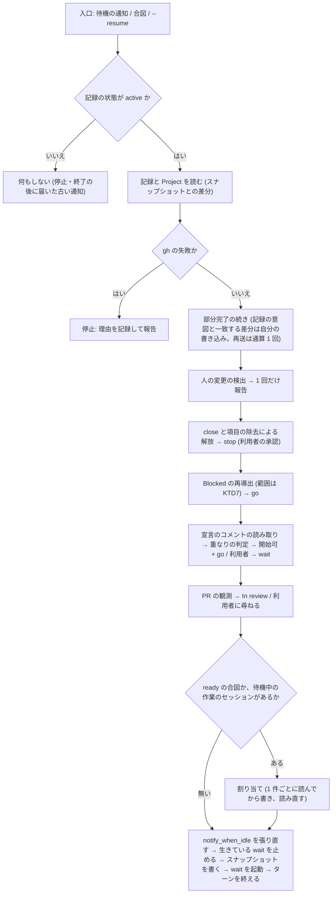

# 複数のセッションで Issue を並行して進める仕組み (issue-dispatch) - Plan

要件の出所は GitHub の Issue [akm/claude-plugins#114](https://github.com/akm/claude-plugins/issues/114) の本文 (「問題」「要望」「これまでに決めたこと」「調べたこと」「決まっていないこと」) と、2026-10-06 の会話で利用者が決めた事項 (Product Contract の Key Decisions)。Issue の「作るものの順番」のうち 1〜3 (仕様の正本・前提条件の検査・管理のセッション) がこの計画の範囲で、4 (Issue のレビュアと整える機能) と 5 (割り振りの最適化) は別の Issue にする。

この計画で使う語:

- **Project**: GitHub Projects (ProjectV2) の 1 つの Project。Issue のキューの正本。1 つの Project に複数のリポジトリ (別の owner も) の Issue を入れる。
- **項目**: Project に入った Issue (GraphQL の `ProjectV2Item`)。
- **管理のセッション**: スキル `issue-dispatch` を実行する Claude Code のセッション。Project 1 つにつき 1 つ。Issue を作業のセッションに割り当て、Project のフィールドと記録を書く。
- **作業のセッション**: スキル `issue-work` を実行する Claude Code のセッション。Issue の作業をする。複数ある。利用者が作る。
- **管理ディレクトリ**: 利用者が管理のセッションを動かすディレクトリ。設定 `.claude/akm-claude-plugins/issue-dispatch/config.json` と記録の置き場を持つ。専用のリポジトリでも、空のディレクトリでもよい。
- **割り当て**: 管理のセッションが項目のフィールド `Agent session ID` に作業のセッションの ID を書くこと。このフィールドが割り当ての正本。
- **着手の宣言 (宣言)**: 作業のセッションが着手の時点で Issue のコメントとして書く、変更予定のファイル・必要な資源・分ける必要の有無。
- **資源**: 同時に 1 つしか使えないもの (検証用の Worker、固定のポートなど)。Issue のラベル `resource:<名前>` で表す。
- **記録**: 管理のセッションが記録の置き場に持つファイル群 (`record.json`・`snapshot.json`・`actions.log`)。GitHub に無いもの (宣言の写し・資源の使用・手順の段階・時刻) を持つ。
- **合図**: セッション間のメッセージ (Claude Code のツール `SendMessage`)。GitHub に対応物を持ち、失われても処理が遅れるだけで食い違わない。
- **再入の手順**: 管理のセッションが、背景の待機の通知・合図・`--resume` のどれで動き出しても入る 1 つの入口。
- **前提条件の検査**: スキル `repo-preflight` が行う、リポジトリ・Project・セッションの検査と、変更の案の提示。

## Goal Capsule

- **目的**: 1 つの Project に集めた Issue を複数の Claude Code のセッションで並行して進めるとき、どの Issue をどのセッションが受け持つか・ほかの Issue の完了を待つか・変更予定のファイルと資源が重ならないかを、利用者が手で判断しなくてよい。進み具合は Project に現れ、利用者は Project を見れば誰が何をしているか分かる。
- **手段**: 新しいプラグイン `issue-dispatch` (スキル 3 つ・フック 1 つ・Python のスクリプト) を足す。GitHub (Project のフィールド・Issue の依存関係とコメント・PR の状態) を正本にし、セッション間のメッセージは合図に限る (KTD1〜KTD3)。
- **優先順位**: 効き目の中心は、様式と取り決めの正本 (U2〜U4)、割り当てと再入の手順 (U9)、決定的な処理をテストできるスクリプトに置くこと (U5・U6)。前提条件の検査 (U7) は仕組みが成り立つ条件を利用者に示すもので、検査の項目は後から足せる。
- **正本の優先順位**: 製品の振る舞いは Product Contract の R-ID が正本。実装の選び方は Planning Contract の KTD が正本。実装単位 (U-ID) はどちらも書き換えない。
- **止まる条件**: U1 の実測で次のどれかが分かったら、設計を変えずに止めて人間に返す。(1) 名前宛てのメッセージが管理のセッションに届かない条件 (保留・破棄) を設定で解消できない。(2) 割り当てのフィールドを書いた直後の読み直しが、自分の書いた値を返さないことがある。(3) Project の組み込みワークフローを無効にしなければ成り立たない。実装の途中で、ほかのプラグインのファイルや `.github/workflows/test.yml` を変えなければ実装できないと分かったら止める (KTD18)。
- **実行の型**: スクリプトとフックは、偽の `gh` と固定の入力で動かすテスト (Python の unittest) を先に書く。手順書 (Markdown) は、検証用の Project と小さなリポジトリ 2 つで、管理のセッション 1 つと作業のセッション 2 つを実際に開いて通し確認する (Verification Contract)。文書を変えたら `doc-dag` と `wording-guard` を回す。
- **後始末の所有**: PR は人間が作る。コミットは動機ごとに分ける (規範は利用者のコミットルール)。Issue #114 へのコメントは人間の指示を受けてから行う。
- **Product Contract の保全**: 要件の出所は Issue #114 と 2026-10-06 の会話。Issue の「これまでに決めたこと」と食い違う点は 3 つで、いずれも会話で利用者が決めた。(1) 宣言と PR の報告を運ぶ手段を、メッセージから Issue のコメントと PR の観測に変えた (KD5)。(2) 管理のセッションは Status の `Done` を書かない (KD7)。(3) 記録の置き場を設定と分け、git が無視する場所にした (KD3・KTD5)。

---

## Product Contract

### Summary

新しいプラグイン `issue-dispatch` を足す。管理のセッションのスキル `issue-dispatch` が GitHub Projects をキューとして Issue を作業のセッションに 1 件ずつ割り当て、作業のセッションのスキル `issue-work` が着手の宣言を Issue のコメントとして書き、スキル `repo-preflight` と PreToolUse のフックが、リポジトリ・Project・セッションの前提条件を検査する。様式と取り決めはスキルの references の文書を正本とし、決定的な処理 (Project の読み書き・依存関係からの `Blocked` の導出・重なりの判定・記録の読み書き・ポーリング) は Python のスクリプトに置いて偽の `gh` でテストする。

### Problem Frame

1 つの目標 (Issue の集まり) を複数の Claude Code のセッションで並行して進めるとき、Issue の割り当て・ほかの Issue の完了を待つかの判断・ファイルの競合の回避・同時に 1 つしか使えない資源の調停を、利用者と割り当て役のセッションが手で行っている。Issue #114 は 2026-10-05〜06 の実例 (13 件の Issue、2 つのセッション) で起きたことを挙げる。依存関係が Issue の文章にしか無く割り当てを人が決めた。完了を待つ順序を覚えておく必要があった。検証用の Worker が 1 つしか無く、別のブランチからのデプロイが前のコードを置き換えた。並行した 3 つの PR が同じ 5 つのファイルを変え、1 つが `main` と競合した。調査を任せた sub-agent がほかのセッションの作業ディレクトリでコマンドを実行し、マージの途中のロックファイルを書き換えた。

GitHub にはこれを支える道具がそろっている。Projects の独自フィールドと並び順、Issue の依存関係 (`blockedBy`)、組み込みワークフロー、`gh` の名前指定のフィールド更新と依存関係の編集である。一方、Claude Code のセッション間のメッセージは、Desktop のセッション ID 宛てだと利用者の最後の入力から 10 通で断られ、名前宛てでも中継の履歴が上限を越えると捨てられ、受け取りの確認が無い (Issue の実測と公式文書)。管理のセッションは利用者の入力がほとんど無いまま背景の通知で動くので、メッセージを主な経路にすると、作業のセッションが 2〜3 あるだけで上限に先に当たりうる。そこで、状態の正本を GitHub に置き、メッセージは「見に行け」という合図に限る。合図が失われても、どちらの側も GitHub を読めば同じ状態に戻れる。

### Key Decisions

- KD1. **範囲は Issue の「作るものの順番」の 1〜3** (session-settled: user-approved — chosen over 1 のみ・1〜2・1〜5 すべて: 1 だけでは振る舞いを確かめる対象が無く、4・5 は 3 の管理のセッションが残す記録が無いと設計を決めにくい)。Governs Scope Boundaries。
- KD2. **プラグインの名前は `issue-dispatch`、スキルは `issue-dispatch` (管理) / `issue-work` (作業) / `repo-preflight` (前提条件の検査)** (session-settled: user-approved — chosen over `session-dispatch`・`issue-queue`: Issue を割り振ることが中心の機能で、PR のレビューは対象にしない)。Governs R18, R26, R33。
- KD3. **Project 全体の設定と記録は、利用者が選ぶ管理ディレクトリに置く** (session-settled: user-approved — chosen over 対象リポジトリの 1 つ・ユーザーの設定 `~/.claude/` の下: Project が複数のリポジトリにまたがるので、どのリポジトリに置くかの規則が別に要り、作業のセッションと作業ツリーを共有する危険もある)。Governs R11, R32。
- KD4. **作業のセッションは利用者が作る** (session-settled: user-approved — chosen over 管理のセッションが `claude --bg` で作る: 端末の `claude --bg` と Desktop の `start_session` は環境で使えるかが変わる。割り当ての手順は、誰がセッションを作ったかに依存しない形にする)。Governs R23, R26。
- KD5. **GitHub を正本にし、メッセージは合図に限る** (session-settled: user-approved — chosen over メッセージで宣言と報告を運ぶ案: メッセージは平文で、上限で断られ、捨てられ、受け取りの確認が無い。GitHub に対応物があれば、失われても遅れるだけで食い違わない)。宣言は Issue のコメント、`In review` は PR の観測から導く。Governs R4, R7, R21, R28。
- KD6. **Issue のコメントの先頭行に、書いたセッションの種類と識別子を置く** (session-settled: user-directed — chosen over 本文だけのコメント: 複数のセッションのコメントが同じ GitHub のユーザー名で書かれるので、どのセッションが書いたかを先頭で見分けられるようにする)。Governs R6。
- KD7. **管理のセッションが書く Status は 4 つに限り、`Done` は書かず、利用者が手で変えた Status は上書きしない** (session-settled: user-approved — chosen over 「Auto-close issue」を無効にして自分で `Done` を書く案: 利用者の既存の Project ではワークフロー「Auto-close issue」が有効で、`Done` を書くと Issue が閉じる)。Governs R2, R22。
- KD8. **ファイルの重なりで待たせるときは、利用者の承認のうえで `blockedBy` を足して `Blocked` を導く** (session-settled: user-approved — chosen over 記録の中だけで待たせる案: GitHub 上で理由が見え、`Blocked` を 1 つの規則で導ける)。Governs R20。
- KD9. **資源の解放は、作業のセッションの明示の報告と、Issue が閉じたときの自動解放の 2 つ** (session-settled: user-approved — chosen over PR を ready にした時点で解放する案: レビューの修正で再デプロイしうる)。Governs R21。
- KD10. **マージ・close・依存の解消は、管理のセッションが一定の間隔で `gh` を実行して知る** (session-settled: user-approved — chosen over 作業のセッションの報告だけに頼る案: PR のマージは人が行い、作業のセッションは気づけない)。Governs R21。
- KD11. **優先順位は Project の並び順 (上が先)。sub-issue を持つ親 Issue は割り当てない** (session-settled: user-approved)。Governs R1, R3, R19。
- KD12. Issue #114 の「これまでに決めたこと」のうち、この計画がそのまま引き継ぐもの (see origin: Issue #114): キューは GitHub Projects で 1 つの Project に複数のリポジトリの Issue を入れる。割り当ては管理のセッションが 1 件ずつ行う (Projects のフィールドの更新に、今の値を条件にした更新が無いため)。独自フィールドは `Agent session ID` (正本) と `Agent session title` (写し)。Status に `In review` を足し、依存で待つ状態は `Blocked` として `blockedBy` から導く。利用者の答えを待つ短い待ちは Status にしない。資源はラベルで表す。ファイルは 4 種類に分けて扱う。Issue を分ける必要は作る時点で見つける (順番 4 の範囲)。作業のセッションは Desktop と端末の両方。宛先は名前で書く。Governs R1, R3, R5, R8, R10, R19。

### Actors

- A1. **利用者** (人間)。Project に Issue を入れ、管理のセッションと作業のセッションを作り、`/issue-dispatch`・`/issue-work`・`/repo-preflight` を打ち、PR をマージし、管理のセッションの問い (承認・判断) に答える。
- A2. **管理のセッション**。Project を読み、割り当てを書き、宣言を読んで重なりを判定し、ポーリングで変化を知り、記録を書き、作業のセッションに合図を送る。
- A3. **作業のセッション** (複数)。自分の作業ツリーで Issue の作業をし、宣言を Issue のコメントとして書き、PR を作り、管理のセッションに合図を送る。
- A4. **GitHub**。Project のフィールドと組み込みワークフロー (`Done` を書く・Issue を閉じる)、Issue の依存関係とコメント、PR の状態を持つ。

### Requirements

**仕様の正本 — Project と Issue の様式**

- R1. **Project の様式を 1 つの文書 (`project-schema.md`) に定める。**
  - 独自フィールド: `Agent session ID` (テキスト。割り当ての正本)・`Agent session title` (テキスト。人が読む写し。管理のセッションが合わせる)。
  - Status の選択肢: `Todo`・`In Progress`・`In review`・`Blocked`・`Done`。`Todo`・`In Progress`・`Done` は Project が最初から持ち、`In review` と `Blocked` はこの仕組みが足す (`In Progress` の綴りは Project のまま使う)。
  - キューの順は項目の位置 (GraphQL の `orderBy: {field: POSITION, direction: ASC}`) で、上が先。ビューの sort と group は見ない。
  - 組み込みワークフロー「Item closed」「Pull request merged」が有効であること。「Auto-close issue」は有効でも無効でもよい (有効なときに成り立つ規則が R2)。
  - 1 つの Project に複数のリポジトリ (別の owner も) の Issue を入れる。(KTD7)
- R2. **管理のセッションが書く Status は `Todo`・`Blocked`・`In Progress`・`In review` の 4 つに限り、`Done` は書かない。** `Done` は組み込みワークフローが書く。利用者が手で変えた Status は上書きせず、1 回だけ報告する (R22)。(KTD7)
- R3. **Issue の様式を定める (`issue-format.md`)。** 依存関係は Issue の blocked by (`blockedBy`)。必要な資源はラベル `resource:<名前>`。sub-issue を持つ親 Issue は割り当ての対象にしない (sub-issue は対象にする)。1 つの PR で閉じる大きさに作り、PR の本文に Issue を閉じる記法 (`Closes #<番号>`) を書く — マージで Issue が閉じ、`Done` と資源の解放がそれに続くため (R21)。作る時点で分ける規則は順番 4 の範囲で、この計画では着手の後に分ける必要が分かったときの扱い (R20) だけを定める。
- R4. **宣言の様式を定める (`issue-format.md`)。** 宣言は作業のセッションが Issue のコメントとして書く。本文は R6 の先頭行と、1 つの JSON のコードブロック。JSON は `files` (要素は `path`・`kind`・`unit`)・`resources` (資源の名前の列)・`split` (分ける必要の有無と理由) を持つ。`kind` は `generated` / `sectioned` / `indivisible` / `splittable` / `unknown` の 5 つ。`path` はリポジトリのルートからの相対パス。`unit` は `kind` が `sectioned` のときだけ必須で、表記はリポジトリの設定が種類ごとに決める (JSON と YAML はトップレベルのキー、Markdown は見出し、Makefile はターゲット名)。宣言は PR が ready になる前なら更新できる (コメント `宣言の更新`)。(KTD2, KTD9)
- R5. **ファイルの 4 種類と、重なりの判定の規則を定める (`issue-format.md`)。** `generated` は判定しない。`sectioned` は (リポジトリ, パス, unit) の完全一致で重なり。`indivisible` と `splittable` は (リポジトリ, パス) の一致で重なり。`indivisible` は分けることを勧めず待つ。`splittable` は分けるリファクタリングを勧める。`unknown` (設定が無いリポジトリ) は利用者が判定する。どれに当たるかはリポジトリの設定 (R32) に書く。レビューでの修正による重なりは判定しない (重なった相手とのマージの衝突は利用者が解消する)。(KTD9)
- R6. **Issue のコメントの先頭行に、書いたセッションの種類と識別子を置く。** 形は `issue-dispatch | <管理のセッション | 作業のセッション> | <セッションの名前> | <セッション ID> | <コメントの種類>`。コメントの種類は、作業のセッションが `着手の宣言`・`宣言の更新`、管理のセッションが `割り当て`・`開始可` (宣言に重なりが無いという判定の結果)・`待機`・`解放`・`引き継ぎ`。導出だけの変更 (`Blocked` ⇄ `Todo`) と `In review` はコメントにせず、記録のログだけに残す。(KTD2)

**仕様の正本 — セッション間の取り決めと記録**

- R7. **メッセージは合図に限り、運ぶ情報はすべて GitHub に対応物を持つ (`messaging.md`)。** 作業 → 管理: `ready` (着手できる)・`declared` (宣言を書いた)・`review` (PR を ready にした)・`renamed` (名前を変えた)・`conflict` (衝突)。管理 → 作業: `assigned` (割り当て)・`go` (進めてよい)・`wait` (待つ。理由を含む)・`stop` (止める。理由は解放・close・項目の除去のいずれか)。先頭行は `issue-dispatch: <種類>`、続く行は `<キー>: <値>`。どの合図が失われても、受け手は GitHub を読めば同じ状態に至る (対応物の表は KTD1)。(KTD1, KTD11)
- R8. **宛先はセッションの名前で書く。** 同じ名前が複数あるときだけ `ListAgents` の短い識別子を添える。Desktop のセッション ID (`local_…`) 宛てとツール `send_message` は使わない。(KTD10)
- R9. **合図が捨てられた知らせ (中継の履歴の上限) を受けたら、利用者に 1 行の入力を求める。** 捨てられた合図を送ったものとして進まない。管理のセッションは、利用者の最後の入力からの送受の数を記録に持ち、報告に書く。(KTD11)
- R10. **止まったことに気づく手段は、期限と待機の知らせの 2 つ。** 管理のセッションは割り当てを送った作業のセッションに `notify_when_idle` を申し込み (12 時間で失効。再入のたびに張り直す)、待機の知らせの後に GitHub 上の進み (宣言・PR) が無ければ報告する。権限の確認で止まった作業のセッションは待機にならないので、期限でしか気づけないことを文書に書く。(KTD6)
- R11. **記録の契約を 1 つの文書 (`records.md`) に定める。** 記録の置き場は `<管理ディレクトリ>/<record_dir>/<owner>-<number>/` で、`record.json` (記録)・`snapshot.json` (ポーリングの基準。再入のターンが待機を起動する直前に書き、待機は読むだけ)・`actions.log` (GitHub への書き込みの追記専用のログ)・`wait.pid` (走っている待機の PID・開始時刻・所有者のセッション ID。待機のスクリプトが書き、終わるときに消す) を置く。書く側は管理のセッション (とそのスクリプト) だけ。相手が読むファイルは一時名に書いてから改名する。失敗時の態度は種類ごとに決める — 設定はデフォルト値で続行して警告、記録は壊れていれば止めて新規に寄せない、スナップショットは壊れていれば作り直して 1 行報告、宣言 (エージェント入力) は形を検査して差し戻す。(KTD5)
- R12. **状態機械を図と決定表で 1 つの文書 (`flow.md`) に定め、散文で言い直さない。** 項目の状態 (`Todo` → `In Progress` → `In review` → `Done` と、`Blocked` との往復)、フィールド × 書く側 × いつ の表、停止ノード、ポーリングで複数の変化が同時に見つかったときの処理の順 (`gh` の失敗 → 部分完了の続き (記録の意図と一致する差分は自分の書き込みとして扱う) → 人の変更の検出 → close と項目の除去による解放 → `Blocked` の再導出 → 宣言の重なり → PR の観測 → 待機中への割り当て)。決定表の条件は記録の段階の印で書き、段階の印がいつ付くかの正本もこの文書。(KTD6, KTD7)
- R13. **行為の線引きを表で定める (`flow.md`)。** 承認なしに行う: フィールド 2 つの書き込み、Status の 4 つ (R2)、定型のコメント (R6)、`notify_when_idle` の申し込み。利用者の承認を要する: 重なりによる `blockedBy` の追加、連絡の取れないセッションからの Issue の回収、マージされずに閉じた PR の Issue の Status の戻し、進行中の Issue が外から閉じられたときの作業の中止の指示、Project とリポジトリの構造の変更 (フィールド・選択肢・ラベル・設定)、ほかのセッションの名前の変更。人間だけが行う: PR のマージ、セッションの作成、Issue の close と reopen、Project からの項目の除去、コメントの削除、人が書いた `blockedBy` の削除、`Done` の設定、ワークフローの有効と無効。取り消し方も同じ表に書く — 割り当ては、フィールドを空にして `Todo` に戻し `解放` のコメント。`blockedBy` は、自分が足したものだけ外す (記録に誰が足したかを持つ)。コメントは削除せず訂正のコメントを足す。

**前提条件の検査**

- R14. **リポジトリの検査と変更の案。** スキル `repo-preflight` は、設定 (R32) の有無と妥当性、固定のポート (開発サーバの設定とスクリプト)、共有のデプロイ先 (`wrangler` の `name` など)、ツールが生成するファイルの候補 (ロックファイル) を調べ、指摘ごとに変更の案 (設定の JSON の雛形・設定ファイルの差分の案・環境変数でポートを変える案) を示す。適用は人間が行い、スキルはファイルを変えない。設定が無いリポジトリでも動き、「設定が無い」を報告する。
- R15. **Project の検査。** フィールド 2 つ・Status の選択肢・ワークフローの有効を確かめる。不足は案を示し、承認を得て作る (フィールドは `gh project field-create`、選択肢は GraphQL の `updateProjectV2Field` で既存の選択肢の id を保ったまま足す)。ワークフローは API で変えられないので UI の手順を案内する。管理のセッションの開始 (R18) と `repo-preflight` の両方から呼べる。
- R16. **セッションの検査。** `crossSessionInbound` の設定 (ユーザー設定が `accept` で、プロジェクトとローカルの設定に `refuse` が無い) を読み、無ければ、管理と作業のセッションの権限モードの組 (権限確認を省くモードかそれ以外か) が同じことを利用者に確かめる。Claude Code の版 (`ListAgents` と `notify_when_idle` が使える 2.1.236 以降) は、確かめられる経路 (Desktop は `get_session`、端末は `claude --version`) で読み、読めなければ「確かめていない」と報告する。作業のセッションは、自分専用の作業ツリー (`git worktree list` に出る worktree で、ほかの作業のセッションが申告していないもの) にいること。プラグインのフックが有効なこと (リポジトリに設定があること)。(KTD12)
- R17. **フック。** PreToolUse (Bash) のフックが、同じリポジトリのほかの worktree の実体パス (と設定 `protected_paths` のパス) を含むコマンドと、そこへ `cd` するコマンドを拒否する。拒否の理由に、代わりの実行の仕方 (自分の作業ツリーで実行する・読むだけなら Read を使う) を書く。設定の無いリポジトリでは何もしない。入力が読めないときは許可側に寄せる。`git worktree` のサブコマンド自体は拒否しない。フックが検出しないもの (相対パス `../`、別の clone、シェルの変数を経たパス) を文書に書く。(KTD13)

**管理のセッション (スキル `issue-dispatch`)**

- R18. **開始。** 設定を読む (無ければ Project の owner と番号を利用者に尋ね、設定の雛形を示す)。管理ディレクトリが git リポジトリなら、記録の置き場が無視されていることを `git check-ignore` で確かめ、無視されていなければ `.gitignore` への追加を案内して止まる (スキルは `.gitignore` を変えない)。Project を検査する (R15)。自分の名前を規約 `issue-dispatch <owner>/<number>` に合わせる (Desktop はツール `set_session_title`、端末は利用者に `/rename` を頼む)。同じ名前のほかのセッションが `ListAgents` にあれば、起動せず報告する (管理の排他)。同期する (全項目の `Blocked` の導出、人の変更の検出、`Agent session ID` が入っているが記録に無い項目の検出)。記録を作るか読む。待機を起動してターンを終える。(KTD4)
- R19. **割り当て。** 候補は、位置の順で、Status が `Todo`、`Agent session ID` が空、開いている blocker が無い、必要な資源 (ラベル) が記録で空いている、親 Issue でない、作業のセッションの `repo` と同じリポジトリの項目。書き込みの順は、記録に意図 (書く予定の ID・title・Status) → `Agent session ID` が空であることを読んで確かめる → `Agent session ID` → 読み直す → `Agent session title` → Status `In Progress` → コメント `割り当て` → 合図 `assigned` → 記録に完了。各手順は冪等 (同じ値を 2 度書いても害がなく、コメントは先頭行で既投稿を検出する)。書く前の読みが空でないか、読み直しが自分の値でなければ、上書きせず報告して候補を選び直す。1 ターンで複数を割り当てるときも 1 件ごとに読む。`ready` を送ったセッションが既に `in_review` 未満の項目を持っていれば新しく割り当てず、その項目の `assigned` を再送する (R24 の上限に数える)。既に待機中なら時刻を変えずに 1 件のまま。候補が無ければ記録に待機中 (時刻) と書き、空いたら送ると伝える。待機中が複数なら時刻の順に渡す。(KTD3)
- R20. **宣言の受け取りと重なりの判定。** 宣言のコメントを読んで形を検査し (誤りは `wait` の理由として差し戻す)、記録に写し、R5 で判定する。重なりが無ければコメント `開始可` を書いて `go`。あれば利用者に、待つ (`blockedBy` を足して `Blocked` にし、コメント `待機`) か、分けるリファクタリングを先に小さな PR で行うかを示して決めてもらい、作業に伝える。宣言の資源が Issue のラベルに無ければ、ラベルを足すことを提案する (承認)。`split` が真なら、進行中の Issue を親にせず、範囲を狭めて残りを同じリポジトリの新しい Issue にする案を利用者に示す (Project への追加は自動追加のワークフローか利用者)。宣言の更新は PR が ready になる前まで受け、同じ判定をする。(KTD8, KTD9)
- R21. **ポーリングと導出。** 間隔は設定 (デフォルト 3 分)。見つける変化と処理: Issue が閉じた → 資源と宣言を解放 (`Done` は GitHub が書く)。`blockedBy` の変化 → `Blocked` を再導出する (範囲と戻り先は KTD7)。管理が足した blocker が閉じた項目は記録に最後に書いた Status (`In Progress`) に戻して `go` を送る。宣言のコメント → R20。PR の観測 → 開いていて draft でなく `closingIssuesReferences` に割り当ての Issue を含む PR があれば `In review` (無ければ作業に本文の追記を求める)。PR がマージされたが Issue が開いている → 閉じるかを利用者に尋ねる。PR がマージされずに閉じた → Status の戻しと割り当ての解除を利用者に尋ねる。進行中の Issue が閉じられた → 作業に止めるよう伝えてよいかを利用者に尋ねる。Issue が reopen された → 報告。`Agent session ID` が人によって空にされた・別の値にされた、項目が Project から除かれた → 割り当ての解除 (資源と宣言の解放) と作業への `stop` を利用者に尋ねる (R13)。項目の追加と並び順の変化 → 次の割り当てから反映。処理の順は R12。(KTD6, KTD7, KTD8)
- R22. **人の変更。** 記録に最後に書いた値を持ち、そこからの差分のうち、記録の意図と一致するもの (自分の部分書き込み。部分完了の続きに回す) と組み込みワークフローの遷移で説明できるものを除いた残りを人の変更として記録に印を付け、1 回だけ報告する。人が `In Progress`・`In review` の項目に足した `blockedBy` は導出せず報告する。上書きせず、記録を Project に合わせる。人が外した `blockedBy` を足し直さない (重なりの内容が変わるまで再提案しない)。手で `Blocked` にした項目は割り当てない。手で `Todo` にした項目も、blocker が開いていれば割り当てない。(KTD7)
- R23. **作業のセッションの監視。** 動き出すたびに `ListAgents` を取り、記録にある名前が無ければ報告して割り当ては保つ (利用者が解除を選べば、フィールドを空にして `Todo` に戻し、コメント `解放`)。合図の宛先が見つからなければ、Desktop のツール `list_sessions` で ID から名前を引き直せれば `Agent session title` を更新して続け、できなければ利用者に尋ねる。待機の知らせの後に宣言も PR も現れなければ報告する (R10)。
- R24. **再入。** 待機の通知・合図・`--resume` の 3 つは同じ入口 (`reentry.md`)。記録の段階の印 (`fields_written`・`notified`・`declared`・`in_review`・`released`) で部分完了を検出する。`Agent session ID` が書かれているが記録に無い項目は、Project とコメント (宣言・`割り当て`) から記録を作り直し、宣言のコメントが無いときだけ作業に宣言の再送を求める。`notified` が無い項目は `assigned` を再送する (作業は同じ Issue なら了解だけ返し、`in_review` 未満の別の Issue を持っていれば `conflict` を送る)。再送は項目ごとに通算 1 回で、超えたら再送せず、作業のセッションの待機 (GitHub の対応物) に任せて 1 回報告する。待機の Bash 呼び出しの `description` に、Project・何を待つか・次に入る手順を書く。通知は人間の入力ではない。`notify_when_idle` の失効を確かめて張り直す。待機はターンの最後にだけ起動し、起動の前に生きている待機 (`wait.pid` の PID。所有者が誰でも) を止め、スナップショットを書く。通知で入ったとき、記録の状態が `active` でなければ (停止・`--end` の後に届いた古い通知) 何もしない。(KTD6)
- R25. **停止と終了。** 止まる条件: `gh` の認証切れ、記録が壊れている、合図が捨てられた知らせ、同じ名前の管理のセッション、割り当ての衝突、宛先の名前が無い、ポーリングのネットワークの失敗が続く。止まるときは記録に理由を書いて報告し、待機を起動し直さない。`--resume` で続ける。`--end` で終える (記録に `ended` を書き、Project のフィールドは消さず、待機を起動し直さない。次の管理のセッションは R18 の同期で引き継ぐ)。

**作業のセッション (スキル `issue-work`)**

- R26. **開始。** 引数 `--manager <名前>` (省けばリポジトリの設定の `project` から規約の名前を導く)。前提を確かめる (R16・R17)。自分の ID (`CLAUDE_CODE_HOST_SESSION_ID` があればそれ、無ければ `CLAUDE_CODE_SESSION_ID`)・名前 (`ListAgents` の 1 行目)・`repo` (`origin` の URL から `owner/repo`)・`worktree` (実体パス) を決め、合図 `ready` を送る。管理の名前が `ListAgents` に無ければ、管理のセッションを起動してから `/issue-work` をやり直すよう利用者に伝えて止まる。合図を送ったら、割り当てを GitHub で確かめる待機 (自分の ID が `Agent session ID` に入った項目を探す) を背景で起動してターンを終える。(KTD10)
- R27. **割り当ての受け取り。** `assigned` を受けたら (または待機が項目を見つけたら)、`gh` でフィールドの値が自分の ID であることを確かめてから着手する。同じ Issue の `assigned` を 2 度受けたら了解だけ返す。合図と待機の通知の両方が届いても着手は 1 回。`in_review` 未満の別の Issue を持っているときに受けたら `conflict` を送る。宣言を書く前と PR を作る前にも、フィールドが自分の ID のままであることを確かめ、違えば止めて管理に `conflict` を送る (`stop` が失われても段の境目で気づく)。ブランチ名の案を使い、既存のブランチと衝突すれば連番を足す。
- R28. **宣言。** Issue を調べ、リポジトリの設定を読んでファイルに種類を付け、R4 の様式でコメントを書き、合図 `declared` を送り、判定の待機 (コメント `開始可` か Status `Blocked` が現れるまで。KTD6) を背景で起動して待つ。`go` を受けるかコメント `開始可` を見つけたら作業を始める。`wait` を受けるか Status が `Blocked` になったら理由を読んで待つ (利用者が判断を変えるか blocker が閉じるまで)。`stop` を受けたら作業を止め、理由を報告する。変更予定が増えたら、PR を ready にする前にコメント `宣言の更新` を書いて `declared` を送る。
- R29. **PR と次の Issue。** 本文に `Closes #<番号>` を書いて PR を作り、ready にしたら合図 `review` を送る (管理は PR の観測で `In review` にするので、合図は観測を早めるだけ)。次の Issue を求めるときは `ready` を送る (R26 と同じ待機を起動する)。
- R30. **作業のセッションがしないこと。** 記録の置き場に書かない。Project のフィールドと Status を書かない。ほかの作業のセッションに合図を送らない。自分で Issue を選んで着手しない。名前を変えない (変わったら `renamed` を送る)。

**同梱のスクリプト・設定・登録**

- R31. **スクリプト。** `gh` の実行は 1 つの関数に閉じる。入出力は JSON。終了コードで結果の種類を分ける。エージェントが組み立てる入力 (宣言・割り当ての引数) は形を検査し、未知のキーと欠けた必須キーは理由付きで差し戻す。テストは偽の `gh` (PATH の先頭に置く) と、実物の `--json` と GraphQL の出力を写した固定データで動き、`python3 -m unittest discover -s issue-dispatch/tests` で実行する。Python 3.11 の標準ライブラリだけを使う。(KTD14)
- R32. **設定。** 管理ディレクトリとリポジトリの同じパス `.claude/akm-claude-plugins/issue-dispatch/config.json`。管理側のキー: `project.owner`・`project.number`・`record_dir`・`poll_minutes`・`wait_minutes`・`manager_name`。リポジトリ側のキー: `project` (owner と番号。`issue-work` が管理の名前を導く)・`files.generated`・`files.sectioned`・`files.indivisible`・`resources`・`protected_paths`・`hooks.guard_other_worktrees`。未設定の扱いを表で定め、設定が無くても動く (尋ねるか、飛ばして報告する)。(KTD15)
- R33. **登録と文書。** ファイル `issue-dispatch/.claude-plugin/plugin.json` (版 0.1.0)、`.claude-plugin/marketplace.json`、ルートの `README.md` (収録プラグインの表・構成・プロジェクト固有の設定の表)、`issue-dispatch/README.md`、`CONCEPTS.md` の用語 (管理のセッション・作業のセッション・割り当て・着手の宣言・資源・合図・記録)、`.github/test-targets.txt` の 1 行。文書はルートの `CLAUDE.md` の規則に従い、`doc-dag` と `wording-guard` を回す。(KTD18)

### Key Flows

- F1. 管理のセッションの開始
  - **起点:** 利用者が管理ディレクトリで `/issue-dispatch` を打つ。
  - **関与:** A1, A2, A4。
  - **手順:** 設定を読む → 記録の置き場の確認 → Project の検査 (不足は承認を得て作る) → 名前の規約と排他 → 同期 → 記録を作るか読む → 待機を起動してターンを終える。
  - **結果:** 管理のセッションが待機中。Project の `Blocked` が依存関係と一致している。
  - **Covers R15, R18, R32.**
- F2. 作業のセッションの開始
  - **起点:** 利用者が作業ツリーで `/issue-work` を打つ。
  - **関与:** A1, A3, A2。
  - **手順:** 前提の確認 → 自分の ID・名前・`repo`・`worktree` を決める → 合図 `ready` → 割り当ての待機を起動してターンを終える。
  - **結果:** 管理のセッションに `ready` が届く。
  - **Covers R16, R17, R26.**
- F3. 割り当て
  - **起点:** 管理のセッションが `ready` を受ける (または待機中の作業のセッションに空きが出る)。
  - **関与:** A2, A3, A4。
  - **手順:** Project を読み直して候補を選ぶ → フィールドと Status を書く → 読み直す → コメント `割り当て` → 合図 `assigned` → 作業のセッションが `gh` で確かめて着手する。
  - **結果:** 項目の `Agent session ID` が作業のセッションの ID、Status が `In Progress`。
  - **Covers R19, R27.**
- F4. 宣言と重なりの判定
  - **起点:** 作業のセッションが Issue を調べ終える。
  - **関与:** A3, A2, A1, A4。
  - **手順:** 宣言のコメント → 合図 `declared` → 管理のセッションが検査と判定 → 重なり無しなら `go`。重なりがあれば利用者に示し、「待つ」なら `blockedBy` を足して `Blocked` とコメント `待機`、合図 `wait`。
  - **結果:** 作業のセッションが作業を始める、または待つ。
  - **Covers R4, R5, R20, R28.**
- F5. PR から次の Issue
  - **起点:** 作業のセッションが PR を ready にする。
  - **関与:** A3, A2, A4。
  - **手順:** PR (`Closes #<番号>`) → ready → 合図 `review` → 管理のセッションが PR を観測して `In review` → 作業のセッションが `ready` を送る (F3 へ)。
  - **結果:** Status が `In review`。作業のセッションは次の Issue を待つ。
  - **Covers R21, R29.**
- F6. ポーリング
  - **起点:** 背景の待機が変化か期限で終わり、通知が届く。
  - **関与:** A2, A4, A3。
  - **手順:** 再入の手順 → 変化を R12 の順で処理 → 待機中の作業のセッションがあれば割り当て (F3) → 待機を起動し直してターンを終える。
  - **結果:** Project と記録が GitHub の現状と一致している。
  - **Covers R12, R21, R22, R23, R24.**
- F7. 待たせた Issue の解除
  - **起点:** ポーリングが blocker の close を見つける。
  - **関与:** A2, A3, A4。
  - **手順:** `Blocked` を再導出 → `Agent session ID` がある項目は `In Progress` に戻す → 合図 `go`。
  - **結果:** 待っていた作業のセッションが作業を始める。
  - **Covers R21.**
- F8. 停止と再開
  - **起点:** R25 の止まる条件に当たる。
  - **関与:** A2, A1。
  - **手順:** 記録に理由を書いて報告 → 利用者が直す・判断する → `--resume` → 再入の手順。
  - **結果:** 待機が続く。
  - **Covers R9, R24, R25.**
- F9. 終了
  - **起点:** 利用者が `/issue-dispatch --end` を打つ。
  - **関与:** A1, A2。
  - **手順:** 記録に `ended` → 報告。Project のフィールドは消さない。
  - **結果:** 次の管理のセッションが F1 の同期で引き継げる。
  - **Covers R25.**
- F10. 前提条件の検査
  - **起点:** 利用者がリポジトリで `/repo-preflight` を打つ。
  - **関与:** A1, A4。
  - **手順:** リポジトリ・Project・セッションの検査 → 報告と変更の案 → 利用者が採否を決める。フックは、設定のあるリポジトリで常に働く。
  - **結果:** 仕組みの前提が満たされているか、何を直せばよいかが分かる。
  - **Covers R14, R15, R16, R17.**
- F11. 外部の変化
  - **起点:** ポーリングが、進行中の Issue の close か reopen、PR のマージ無し close、マージされたが Issue が開いている状態を見つける。
  - **関与:** A2, A1。
  - **手順:** 利用者に尋ねる (閉じるか・Status を戻すか・作業に止めるよう伝えるか) → 答えに従って書く。
  - **結果:** 管理のセッションが Issue の close や `Done` を自分で書くことはない。
  - **Covers R13, R21.**
- F12. 作業のセッションの異常
  - **起点:** 動き出したときの `ListAgents` に記録の名前が無い。宛先が見つからない。`conflict` が届く。
  - **関与:** A2, A1, A3。
  - **手順:** 報告 → 名前の引き直し (Desktop) → 利用者の判断 (保持か解除)。
  - **結果:** 割り当てが放置されない。
  - **Covers R23, R27, R30.**

### Acceptance Examples

- AE1. 2 つの作業のセッションがほぼ同時に `ready` を送る
  - **Covers F3, R19.**
  - **Given:** `Todo` の項目が 3 件。作業のセッション A と B。
  - **When:** A と B が続けて `ready` を送る。
  - **Then:** A と B に別の項目が割り当てられ、各項目の `Agent session ID` は 1 つの値だけ。管理のセッションは 1 件ごとに Project を読み直している (`actions.log` で分かる)。
- AE2. 書いた直後の読み直しで別の ID が入っている
  - **Covers R19, R22.**
  - **Given:** 偽の `gh` が、`Agent session ID` を書いた直後の読み取りで別のセッション ID を返す。
  - **Then:** 上書きせず、衝突として記録と報告に書き、候補を選び直す。その項目への追加の書き込みは無い。
- AE3. 合図 `assigned` が失われても着手できる
  - **Covers R7, R26, R27.**
  - **Given:** 作業のセッション B の受信が `refuse` (通し確認で再現する)。
  - **When:** 管理のセッションが B に割り当てる。
  - **Then:** B の背景の待機が自分の ID の項目を見つけ、B は `gh` で確かめて着手し、宣言の後はコメント `開始可` を見つけて作業を始める。
- AE4. 宣言の重なりで待ち、blocker の close で解除される
  - **Covers F4, F7, R5, R20, R21.**
  - **Given:** A が #9 で `src/app.ts` (`splittable`) を宣言済み。
  - **When:** B が #12 で同じパスを宣言する。
  - **Then:** 管理のセッションは利用者に「待つ / 分けるリファクタリングを先に」を示す。「待つ」なら #12 に blocked by #9 を足し、Status を `Blocked` にし、コメント `待機` を書き、B に `wait` を送る。#9 が閉じると次のポーリングで #12 は `In Progress` に戻り、B に `go` が届く。
- AE5. `Done` は GitHub が書き、資源の解放が続く
  - **Covers R2, R3, R21.**
  - **Given:** #9 の PR の本文に `Closes #9`。#9 がラベル `resource:workers-dev` を持ち、記録で使用中。
  - **When:** 利用者が PR をマージする。
  - **Then:** Issue が閉じ、組み込みワークフローが `Done` を書く。次のポーリングで管理のセッションが資源と宣言を解放し、待機中の作業のセッションに次を割り当てる。`actions.log` に `Done` の書き込みは無い。
- AE6. PR の観測で `In review` になる
  - **Covers R21, R29.**
  - **Given:** #12 の PR が draft。
  - **Then:** `In review` にしない。
  - **When:** PR を ready にする。
  - **Then:** 次のポーリングで `In review`。PR の `closingIssuesReferences` に #12 が無ければ、`In review` にせず、作業のセッションに本文の追記を求める。
- AE7. マージされたが Issue が開いている
  - **Covers F11, R21.**
  - **Then:** 利用者に閉じるかを尋ね、`Done` も close も書かない。
- AE8. 利用者が Status を手で変える
  - **Covers R22.**
  - **Given:** 記録では #12 が `In Progress`。
  - **When:** 利用者が Project の画面で `Todo` にする。
  - **Then:** 次のポーリングで 1 回だけ報告し、上書きしない。記録は `Todo` に合わせる。#12 は `Agent session ID` が残っているので候補にせず、割り当てを解除するかを利用者に尋ねる。
- AE9. 部分完了からの再入
  - **Covers R24.**
  - **Given:** 偽の `gh` で #12 のフィールドは書かれ、記録の意図に `notified` が無い。
  - **When:** 再入する。
  - **Then:** `assigned` を 1 回だけ再送し、コメント `割り当て` は増えない。
- AE10. 記録が壊れている
  - **Covers R11, R25.**
  - **Then:** 止めて知らせ、新規として扱わない。
- AE11. 2 つ目の管理のセッション
  - **Covers R18.**
  - **Given:** 名前 `issue-dispatch akm/3` のセッションが動いている。
  - **When:** 別のセッションで `/issue-dispatch` を打つ。
  - **Then:** `ListAgents` に同じ名前があるので起動せず、報告する。
- AE12. 作業のセッションが消えた
  - **Covers F12, R23.**
  - **Given:** #12 を持つ B を閉じる。
  - **Then:** 次のポーリングで報告し、割り当ては保つ。利用者が解除を選べば、フィールドを空にして `Todo` に戻し、コメント `解放` を書く。
- AE13. 合図が捨てられた知らせ
  - **Covers R9.**
  - **Then:** 捨てられた合図を送ったものとして進まず、利用者に 1 行の入力を求める。
- AE14. `gh` の認証切れ
  - **Covers R25, R31.**
  - **Then:** 待機が終了コード 2 で終わり、再入の手順で止まって `gh auth login` を案内する。記録は変わらない。
- AE15. フックの拒否
  - **Covers R17.**
  - **Given:** 同じリポジトリの worktree `/w/a` と `/w/b`。`/w/a` のリポジトリに設定がある。
  - **When:** `/w/a` のセッションで `pnpm --dir /w/b exec vitest` を実行する。
  - **Then:** 拒否され、理由に自分の作業ツリーで実行することが書かれる。`ls /w/a/src` は許可される。設定の無いリポジトリでは何も出さない。
- AE16. `repo-preflight` の指摘
  - **Covers R14.**
  - **Given:** `vite.config.ts` に `port: 5173`、設定が無い。
  - **Then:** 固定のポートの指摘と環境変数で変える案、設定の雛形が出る。ファイルは変わらない。
- AE17. 設定の無い管理ディレクトリ
  - **Covers R18, R32.**
  - **Then:** Project の owner と番号を尋ね、設定の雛形を示し、答えで続ける。
- AE18. 親 Issue
  - **Covers R3, R19.**
  - **Given:** sub-issue を 2 つ持つ Issue が `Todo` で先頭にある。
  - **Then:** 割り当てず、次の項目を割り当てる。sub-issue は対象になる。
- AE19. 複数のリポジトリ
  - **Covers R19, R26.**
  - **Given:** リポジトリ X と Y の項目が混在。作業のセッション A の `repo` は X。
  - **Then:** A には X の項目だけが割り当てられる。
- AE20. `--end`
  - **Covers F9, R25.**
  - **Then:** 記録に `ended`、フィールドは残り、待機は起動し直されない。
- AE21. Status の選択肢の追加
  - **Covers R15.**
  - **Given:** Status に `In review` と `Blocked` が無い。
  - **Then:** 既存の選択肢の id を保って 2 つ足す案を示し、承認で足す。既存の項目の Status は変わらない。
- AE22. 権限モードの組
  - **Covers R16.**
  - **Given:** ユーザー設定に `crossSessionInbound` が無い。
  - **Then:** 警告と、`accept` の設定か同じ組であることの確認が出る。
- AE23. 合図 `go` が失われる
  - **Covers R7, R20, R28.**
  - **Given:** B の受信が `refuse`。B が宣言を書き `declared` を送った。
  - **Then:** 管理のセッションはコメント `開始可` を書く。B の判定の待機がコメントを見つけ、B は作業を始める。
- AE24. 利用者が `Agent session ID` を空にする
  - **Covers R13, R21, R22.**
  - **Given:** #12 が B に割り当て済みで作業中。
  - **When:** 利用者が Project の画面で `Agent session ID` を空にする。
  - **Then:** 次のポーリングで管理のセッションは、割り当ての解除 (資源と宣言の解放) と B への `stop` を利用者に尋ね、答えに従って書く。自分では値を書き戻さない。
- AE25. 項目を持つセッションからの `ready`
  - **Covers R19, R24.**
  - **Given:** B が #12 を割り当てられたが `assigned` が届かず、B の待機が期限で終わって B が `ready` を送り直す。
  - **Then:** 新しい項目は割り当てず、#12 の `assigned` を 1 回だけ再送する。2 度目以降は再送せず、B の待機に任せて 1 回報告する。

### Success Criteria

- 通し確認の成功の経路で、利用者が行った操作が「Project に Issue を入れる」「セッションを作ってスキルを打つ」「PR をマージする」「承認と判断に答える」の 4 種類だけである。
- どの項目も同時に 2 つのセッションに割り当てられない (AE1・AE2)。
- 管理のセッションを閉じて開き直しても、Project と記録から同じ状態に戻る (AE9)。
- 利用者は Project の Status と `Agent session title` を見るだけで、誰が何をしていて何が待っているかが分かる。
- スクリプトとフックの全経路が偽の `gh` のテストで成功し、CI の対象の一覧と一致する。

### Scope Boundaries

- Issue の順番 4 (Issue のレビュアと整える機能) と 5 (割り振りの最適化) は別の Issue にする (Key Decisions)。この計画の記録 (`actions.log` の時刻) が 5 の材料になる。
- レビューの依頼 (review-triage の `review-loop`・`review-request`) の管理は対象外 (Issue の決定)。
- 作業のセッションの自動作成は対象外 (Key Decisions)。`claude --bg` と Desktop の `start_session` を使わない。
- 別のマシンのセッション (Remote Control) は対象外。同じマシンのセッションだけ。
- `claude -p` で動く作業のセッションは対象外。対話セッションだけを前提にする。
- 管理のセッションは `Done` を書かず、ワークフローの有効と無効を変えない (R2・R13)。
- フックは worktree でない別の clone を検出しない (R17)。
- Desktop 独自のセッション間送信ツール (`send_message`) は使わない (R8)。
- GitHub の REST API は使わない。`gh` の CLI と `gh api graphql` だけ。
- Windows は対象外。

#### Deferred to Follow-Up Work

- 宣言の要約を Project のテキストフィールドに写す (テキストフィールドの長さの上限が文書に無い)。
- 重なりの待機を常に承認する常設の方針 (永続的な設定の変更なので、初版では 1 件ずつ承認する)。
- 連絡の取れない作業のセッションからの Issue の自動の回収 (初版は利用者が判断する)。
- 書く前に案を見せるモード (信頼を段階的に上げる手段。初版は承認を要する行為だけ尋ねる)。
- 資源のラベルの自動付与 (初版は提案と承認)。
- `gh` の失敗の再試行の回数と待ちの長さの調整 (初版の値は R21・KTD6)。

### Dependencies / Assumptions

2026-10-06 に、利用者の環境 (macOS、Claude Desktop app の Code タブのセッション (Claude Code 2.1.288)、端末の `claude` 2.1.283、`gh` 2.100.0) で確かめた事実と、公式文書で確かめた事実。

- `gh` 2.100.0: `gh project item-edit <番号> --owner <owner> --url <Issue の URL> --field "Status" --value "<選択肢名>"` でフィールドを名前で更新できる (1 回に 1 フィールド)。`gh project item-list` に並び順の指定は無く `--limit` のデフォルトは 30。`gh project field-create` は TEXT / SINGLE_SELECT / DATE / NUMBER。`gh issue edit --add-blocked-by <番号または URL>` と `gh issue view --json blockedBy,blocking,parent,projectItems` がある。利用者のトークンのスコープに `project` がある。
- GitHub GraphQL: `updateProjectV2ItemFieldValue` の入力は `projectId`・`itemId`・`fieldId`・`value` だけで、条件付き更新は無い。`ProjectV2.items` は `orderBy: {field: POSITION}` で位置の順に返す (指定しないときの順は文書に無い)。Status の選択肢は `updateProjectV2Field` の `singleSelectOptions` で、既存の選択肢の `id` を含めて渡す (含めないと値が消える)。`ProjectV2.workflows` は読めるが、有効と無効を変える mutation は無い。上限: 項目 50,000、フィールド 50、single select の選択肢 50、blocked by 50、sub-issue 100。レート制限は 1 時間 5,000 点で、項目 100 件の一覧は 1〜3 点。
- 利用者の既存の Project (番号 2) では、ワークフロー「Item closed」「Pull request merged」「Auto-close issue」の 3 つが有効。
- Claude Code: ツール `SendMessage` (入力 `to`・`message`・`notify_when_idle`・`summary`) と `ListAgents` がある。`ListAgents` の 1 行目はこのセッションの名前と短い識別子で、各行は `名前 [識別子] · 種類 (interactive / Remote Control) · 状態 (idle / busy / waiting / offline) · Claude Desktop session などの種別 · 経過時間`。Desktop のセッションの名前はセッションのタイトル。環境変数 `CLAUDE_CODE_SESSION_ID` (UUID)・`CLAUDE_CODE_HOST_SESSION_ID` (Desktop のみ。`local_<UUID>`)・`CLAUDE_CODE_MESSAGING_SOCKET`・`CLAUDE_CODE_MESSAGING_TOKEN` が Bash ツールの環境にある。Desktop のツール `get_session` (`self` で自分の `sessionId`・`title`・`permissionMode` を返す)・`list_sessions`・`set_session_title` がある。
- Claude Code の公式文書 (cross-session-messaging・hooks・sub-agents・agent-view・sessions・plugins): 名前宛ては 1 つのセッションが応答するときは名前だけで届く。受け取る側は送り手ごとに連続送信を抑え、同じ内容の繰り返しを捨て、キューは 50 通まで。`notify_when_idle` は両側が 2.1.236 以降、主会話からだけ、12 時間で失効。権限モードの組 (権限確認を省くモードかそれ以外か) が違うと保留され、Desktop と `-p` では 5 分 (`dialogExpiry`) で捨てられる。`crossSessionInbound: accept` で保留を避けられる。PreToolUse のフックは sub-agent の中のツール呼び出しにも適用され、JSON の `permissionDecision: deny` で拒否でき、入力に `cwd`・`session_id`・`permission_mode`・`agent_id`・`tool_input.command` がある。`${CLAUDE_PLUGIN_ROOT}` は SKILL.md の本文とフックのコマンドで置換され、Bash ツールの環境変数には無い。
- Issue #114 の実測 (2026-10-06): Desktop のセッション ID 宛ては、利用者の最後の入力から 10 通で断られ、`notify_when_idle` を申し込めない。名前宛ては、利用者の入力なしに 30 往復 (60 通) 届き、31 通目が捨てられて送り手に知らせが届いた。中継の履歴は、ほかのセッションからのメッセージで始まったターンごとに長くなる。
- 対話セッションの背景の Bash は 660 秒の待機でも打ち切られず、終了で通知が届く (review-loop の計画の実測)。フォアグラウンドの `sleep` は拒否される。
- Python 3.11 の標準ライブラリに YAML の読み書きは無い。記録と宣言は JSON にする。
- このリポジトリの慣例: 設定は `.claude/akm-claude-plugins/<プラグイン>/config.json`、記録は git が無視する `tmp/` の下、フックの拒否は JSON の `permissionDecision`、外部コマンドのテストは PATH の先頭の偽のコマンド、新しいテストは `.github/test-targets.txt` に 1 行。

### Open Questions

**Deferred to Implementation** (U1 で確かめ、結果を正本の文書の「実測」の節に書く)

- 背景の待機の通知で始まったターンから送った合図は、中継の履歴を引き継がないか。引き継がないなら、管理のセッションは合図を通知で始まるターンで送ると上限に当たりにくい (KTD11 の案 A)。引き継ぐなら、合図の数を減らし、捨てられた知らせで利用者に入力を求める (案 B)。
- `gh project item-list` の出力の順が `POSITION` の順と同じか。同じでも、スクリプトは `gh api graphql` で `orderBy` を明示する (KTD14)。
- Desktop のツール `set_session_title` で変えたタイトルが `ListAgents` の名前に反映されるか。端末の `/rename` で変えた名前との混在。
- `/clear` の後に `CLAUDE_CODE_SESSION_ID` が変わったとき、作業のセッションの ID をどう扱うか。`CLAUDE_CODE_HOST_SESSION_ID` があるセッションでは変わらない見込み。
- `blockedBy` を別の owner のリポジトリの Issue に張れるか (Project が別の owner の Issue を含むとき)。張れなければ、重なりの待機は記録とコメントだけで表し、`Blocked` にできないことを報告する。
- 割り当てのフィールドを書いた直後の読み直しが、自分の書いた値をすぐ返すか (読み取りの遅れ)。
- 通し確認の費用 (セッション 3 つ × 数時間)。始める前に利用者に示す。

### Sources / Research

1. Issue #114 (要件の出所。本文の表「起きたこと」、節「調べたこと」の実測)。
2. 2026-10-06 の会話で利用者が決めた事項 (Key Decisions の `session-settled`)。
3. 複数プロセスの受け渡しの先例: `review-triage/skills/review-loop/references/loop-files.md` (書く側 1 つ・一時名から改名・ファイルの種類ごとの態度・読む側の検査)、`references/reentry.md` (再入の入口 1 つ・`description` の自己記述・通知は人間の入力ではない)、`references/worker.md` (起動時の確認の表・「検出しないもの」の節)、`references/stops.md` (図 + 決定表の停止ノード)。
4. フックの先例: `review-triage/scripts/review-loop-worker/deny_tmp_hook.py` (JSON の `permissionDecision: deny`、理由に代わりの実行の仕方、規則の関数をテストから使う)、`commit-rules-guard/hook-scripts/guard-commit-rules.py` (設定の読み方・想定外は許可側に寄せる)、`wording-guard/scripts/wordingguard/config.py` (有効にしたリポジトリだけで動く)。
5. 蓄積データと設定の先例: `pr-teeth/scripts/prteeth/store.py` (`load_precious`・`Corrupt`・一時ファイルからの `os.replace`)、`review-triage/skills/review-triage/references/project-config.md` (様式・未設定の定義)、`review-triage/skills/review-triage/references/record-schema.md` (記録は追跡外・`git check-ignore`)。
6. テストの先例: `review-triage/tests/fake-claude` と `review-triage/tests/test_review_loop_worker.py` (PATH の先頭の偽のコマンド・環境変数で振る舞いを切り替える)、`session-handoff/tests/test_detect_handoff.py` (`gh` の不在・タイムアウトの経路)、`pr-teeth/tests/test_prteeth.py` (`gh auth token` の差し替え)。
7. 知見: `docs/solutions/architecture-patterns/fail-soft-by-data-class.md`、`docs/solutions/design-patterns/typed-contract-for-agent-input.md`、`docs/solutions/design-patterns/extract-identifiers-in-code-not-llm.md`、`docs/solutions/tooling-decisions/require-explicit-basis-for-relative-paths.md`、`docs/solutions/tooling-decisions/avoid-dual-parser-implementations.md`、`docs/solutions/conventions/plugin-cannot-resolve-its-own-source.md`。過去の記録の実測: `docs/review-triage/feat-review-triage-loop.md` (状態機械を図と決定表に集約するまで同じ場所への指摘が続いた)、`docs/review-triage/fix-triagecheck-explicit-path-must-exist.md` (相対パスの基準)。
8. 登録の慣例: コミット `6ad8055` (wording-guard の追加。marketplace とルートの README を同じコミットに含める)、`59af80a` (session-handoff の README と登録)、`fe79e56` (`.github/test-targets.txt` の追加)。
9. GitHub の公式文書 (2026-10-06 に確認): GraphQL の `projects`・`issues` の参照、`rate-limits-and-query-limits-for-the-graphql-api`、`using-the-built-in-automations`、`adding-items-to-your-project`、`creating-issue-dependencies`、`adding-sub-issues`、変更履歴 2024-04-25 (Auto-close issue)・2025-08-21 (dependencies)・2025-09-11 (REST の Projects と sub-issues)、`gh` の manual (`gh_project_item-edit`・`gh_project_item-list`・`gh_issue_edit`)、cli/cli の PR #13807・#13823・#13057。
10. Claude Code の公式文書 (2026-10-06 に確認): `cross-session-messaging`、`hooks`、`hooks-guide`、`sub-agents`、`agent-view`、`sessions`、`desktop`、`plugins/components`、`plugins/manifest-reference`、`env-vars`、`settings-reference`。文書に無かったこと: ソケットへ直接書くメッセージの様式、`ListAgents` の出力の項目、`CLAUDE_CODE_HOST_SESSION_ID`、テキストフィールドの長さの上限。
11. このセッションで確かめた事実: `gh auth status` (スコープ)、`gh project list`、GraphQL の introspection (`UpdateProjectV2ItemFieldValueInput`・`ProjectV2FieldType`・`UpdateProjectV2FieldInput`・mutation の一覧)、Project 番号 2 の `workflows` と `fields`、`claude --help`、環境変数の一覧、`get_session self` の出力、`ListAgents` の出力。

---

## Planning Contract

### Key Technical Decisions

- KTD1. **GitHub を正本にし、合図はすべて GitHub に対応物を持つ** (session-settled: user-approved — chosen over メッセージで宣言と報告を運ぶ案: メッセージは上限で断られ、捨てられ、受け取りの確認が無い)。対応物の表の正本は `messaging.md` (U3) で、下の表は計画の時点の内容。実装の後は `messaging.md` を読む。

  | 合図 | 向き | GitHub の対応物 | 合図が失われたときの回復 |
  | --- | --- | --- | --- |
  | `ready` | 作業 → 管理 | 無い (セッションの状態) | 作業のセッションの背景の待機が期限で終わり、作業のセッションが `ready` を送り直す |
  | `assigned` | 管理 → 作業 | フィールド `Agent session ID`・Status `In Progress`・コメント `割り当て` | 作業のセッションの待機が自分の ID の項目を見つける |
  | `declared` | 作業 → 管理 | コメント `着手の宣言` / `宣言の更新` | 管理のセッションのポーリングがコメントを読む |
  | `go` | 管理 → 作業 | コメント `開始可` | 作業のセッションの判定の待機がコメントを見つける |
  | `wait` | 管理 → 作業 | `blockedBy`・Status `Blocked`・コメント `待機` | 作業のセッションの判定の待機が Status を読む |
  | `stop` | 管理 → 作業 | フィールドが空・コメント `解放`・Issue の close | 作業のセッションが宣言の前と PR を作る前にフィールドを確かめる |
  | `review` | 作業 → 管理 | PR の状態 (ready・`closingIssuesReferences`) | ポーリングが PR を観測する |
  | `renamed` | 作業 → 管理 | 無い | Desktop の `list_sessions` で ID から名前を引き直す。できなければ利用者に尋ねる |
  | `conflict` | 作業 → 管理 | フィールドの値の食い違い | 管理のセッションの同期が検出する |

  Governs R7, R21, R26〜R29。
- KTD2. **宣言と管理のセッションの書き込みの理由は Issue のコメントに置き、先頭行で書いたセッションを見分ける** (先頭行は session-settled: user-directed — chosen over 本文だけ: 同じ GitHub のユーザー名で書かれる)。コメントは人にも見え、記録を失っても GitHub から復元できる。管理のセッションは投稿の前に、同じ先頭行と同じ種類のコメントが無いことを確かめる (冪等)。R4, R6, R19, R20 を実装する。
- KTD3. **割り当ての書き込みは順序を決め、`Agent session ID` を排他の印として最初に書き、書く前に空であることを読み、書いた後に読み直す。** 順は R19。条件付き更新が無いので、中断されても二重の割り当てだけは起きないよう、排他の印を最初に書く。書く前の読みは、人が `Todo` に戻した割り当て済みの項目 (ID が残る) への上書きを防ぐ — 読み直しだけでは既存の値の上書きを検出できない。読み直しで別の値が入っていれば、自分の書き込みを取り消さず (別の書き手の値を消さない)、報告して候補を選び直す。各手順は冪等にし、記録の段階の印で再入時に続きから行う (R24)。書き込みが失敗したら (`gh` の非 0・タイムアウト)、その手順で中断し、記録に完了を書かず、読み直した状態を報告する。1 ターンで複数の割り当てを行うときも 1 件ごとに読み直す。R19, R24 を実装する。
- KTD4. **管理のセッションの排他は、名前の規約と `ListAgents` で行う** (chosen over 利用者レベルの置き場のロックファイル: 終わったセッションが古いロックを残さず、名前はそのまま作業のセッションの宛先になる)。名前は `issue-dispatch <owner>/<number>` (設定 `manager_name` で変えられる)。開始時に同じ名前が `ListAgents` にあれば起動しない。作業のセッションは `--manager` を省いたとき、リポジトリの設定の `project` からこの名前を導く。Desktop では `set_session_title` で自分の名前を変え、端末では利用者に `/rename` を頼む (スキルはスラッシュコマンドを実行できない)。R18, R26 を実装する。
- KTD5. **記録は JSON で、git が無視する置き場に置き、書く側は管理のセッションだけにする。** Python 3.11 の標準ライブラリに YAML は無く、簡易パーサを自作しない (`avoid-dual-parser-implementations.md`)。置き場は設定 `record_dir` (デフォルト `tmp/issue-dispatch`) の下の `<owner>-<number>/`。設定 (`config.json`) は追跡し、記録は追跡しない (review-triage の記録と同じ)。種類ごとの態度は R11。`record.json` は一時ファイルに書いて `os.replace` で置き換える。`snapshot.json` は Project から導出し直せるキャッシュで、再入のターンが待機を起動する直前に書き (書き手は 1 つ)、待機は読むだけ。壊れていれば作り直す。`actions.log` は追記専用 (1 行 1 JSON: 時刻・種類・対象・前後の値・理由)。R11, R31 を実装する。
- KTD6. **ポーリングは同梱の Python スクリプトを背景で起動し、通知で再入する。** コマンドは `python3 "${CLAUDE_PLUGIN_ROOT}/scripts/issue_dispatch.py" wait --record-dir <置き場> --minutes <分>` の形 (作業のセッションは `wait-assignment --session-id <ID> --minutes <分>`)。終了コードは 0 (変化あり。標準出力の 1 行に種類)、124 (期限)、2 (`gh` の認証切れ)、3 (レート制限の再開を期限内に待てない)、4 (ネットワークの失敗が 3 回続いた)、5 (スナップショットが無い。先に同期が要る)。変化の検出はスナップショットとの差分。レート制限は応答の再開時刻まで期限内なら待って続ける。待機はターンの最後にだけ起動する。起動の前に、生きている待機 (`wait.pid` の PID。所有者が別のセッションでも) を止め、スナップショットを書く。待機のスクリプトは起動時に `wait.pid` (PID・開始時刻・所有者のセッション ID) を書き、終わるときに消し、スナップショットは読むだけ。作業のセッションの待機は 2 つ — `wait-assignment` は、自分の ID が `Agent session ID` に入った項目の Status が `In Progress` になったとき (初回の割り当てと、`Blocked` からの復帰の両方) に 0 で終わる。`wait-decision` は、自分の項目にコメント `開始可` が現れるか Status が `Blocked` になったときに 0 で終わる。フォアグラウンドの `sleep` は拒否されるので必ず背景で起動し、待機を起動したターンではほかのツールを呼ばない。Bash の `description` を自己記述にし、通知・合図・`--resume` を 1 つの入口に入れる (先例 `review-triage/skills/review-loop/references/reentry.md`)。R10, R21, R24 を実装する。
- KTD7. **Status の書き換えと `Blocked` の導出の規則を 1 か所 (`flow.md` の決定表) に置く** (`Done` を書かず人の変更を上書きしないことは session-settled: user-approved — chosen over 「Auto-close issue」を無効にして自分で `Done` を書く案)。候補は Status が `Todo` で、`Agent session ID` が空で、かつ開いている blocker が無いもの (すべてを満たす)。`Blocked` の導出で書き換えるのは、割り当ての無い項目の `Todo` ⇄ `Blocked` (記録に無い項目は初見で記録に載せてから書く) と、管理が自分で足した `blockedBy` による `In Progress` ⇄ `Blocked` だけ。人が `In Progress`・`In review` の項目に足した `blockedBy` は導出せず報告する。戻り先は記録に最後に書いた `Blocked` 以外の Status。Status の書き換えは、記録にある項目にだけ行う。差分のうち組み込みワークフローの遷移 (閉じた → `Done`、reopen → `Todo`、追加 → `Todo`) で説明できないものを人の変更とし、1 回だけ報告する。R1, R2, R21, R22 を実装する。
- KTD8. **`In review` は PR の観測から導き、解放と `Done` の契機は Issue が閉じたこと。** PR が開いていて draft でなく `closingIssuesReferences` に割り当ての Issue を含むときだけ `In review`。マージされたが Issue が開いている・マージされずに閉じた・進行中の Issue が閉じられた、の 3 つは利用者に尋ねる (R13)。資源の解放は作業のセッションの明示の報告 (宣言の更新で資源を外す) と Issue の close の 2 つ (session-settled: user-approved — chosen over PR を ready にした時点の解放)。R20, R21 を実装する。
- KTD9. **重なりの判定は (リポジトリ, パス, unit) の完全一致で、照合はスクリプトに置く。** パスはリポジトリのルート基準に正規化し (`./a`・`a/`・`a//b` を同じに)、絶対パスとルートの外を指すパスは差し戻す。種類ごとの規則は R5。宣言の形の検査は必須キーと未知のキーで行い (`typed-contract-for-agent-input.md`)、照合は LLM に任せない (`extract-identifiers-in-code-not-llm.md`)。unit の表記はリポジトリの設定が種類ごとに決め、作業のセッションがそれを読んで `kind` と `unit` を付ける。設定の無いリポジトリの宣言は `unknown` とし、利用者が判定する。R4, R5, R20 を実装する。
- KTD10. **セッションの識別は ID と名前の両方を作業のセッションが申告し、宛先は名前にする。** ID は `CLAUDE_CODE_HOST_SESSION_ID` があればそれ、無ければ `CLAUDE_CODE_SESSION_ID`。名前は `ListAgents` の 1 行目。`Agent session ID` には ID、`Agent session title` には名前を書く。名前が `ListAgents` に無いときの引き直しは Desktop の `list_sessions` (ID → タイトル) で、端末のセッションは引き直せないので利用者に尋ねる。作業のセッションは名前を変えない (変わったら `renamed`)。R8, R23, R26, R30 を実装する。
- KTD11. **合図の様式は先頭行 `issue-dispatch: <種類>` と `<キー>: <値>` の行にし、数を減らす。** 1 Issue あたり作業 → 管理が 3 通 (`ready`・`declared`・`review`)、管理 → 作業が 2 通 (`assigned`・`go` または `wait`)。`stop` は解放・close・項目の除去のときだけ。中継の履歴の扱いは U1 の実測で決める — 案 A: 背景の待機の通知で始まるターンから送った合図が履歴を引き継がないなら、管理のセッションは合図を通知で始まるターン (再入の手順の最後) でまとめて送る。案 B: 引き継ぐなら、合図が捨てられた知らせで利用者に 1 行の入力を求める (R9) だけにする。どちらでも、合図が失われたときの回復は KTD1 の表に従う。R7, R9 を実装する。
- KTD12. **権限モードの組による保留は、設定 `crossSessionInbound` の確認で避ける。** スクリプトがユーザー設定 (`~/.claude/settings.json`) とプロジェクト・ローカルの設定を読み、`accept` が無ければ警告し、`refuse` があれば止める。権限モードそのものは対話セッションから読む公式の手段が無い (Desktop の `get_session` だけ) ので、同じ組であることは利用者に確かめる。R16 を実装する。
- KTD13. **フックの規則は関数 1 つに閉じ、`git worktree list --porcelain` の実体パスで判定する。** 設定 (`hooks.guard_other_worktrees`。デフォルトは設定があれば有効) の無いリポジトリでは何もしない。コマンドの中に、自分以外の worktree の実体パス (末尾がパスの区切りか空白かコマンドの終わり) が現れるか、`cd` の引数がそのパスなら拒否する。`git worktree` で始まるコマンドは拒否しない。拒否は JSON の `permissionDecision: deny` と、代わりの実行の仕方を書いた理由 (先例 `review-triage/scripts/review-loop-worker/deny_tmp_hook.py`)。入力が読めない・`git` が無い・リポジトリでないときは何も出さず終了コード 0。IO の前に正規表現で `/` を含むコマンドだけに絞る。R17 を実装する。
- KTD14. **スクリプトは 1 つの CLI と 1 つのパッケージにし、`gh` の実行を 1 関数に閉じる。** ファイル `issue-dispatch/scripts/issue_dispatch.py` (入口) とディレクトリ `issue-dispatch/scripts/issue_dispatch/` (`gh.py`・`project.py`・`issues.py`・`declaration.py`・`record.py`・`poll.py`・`preflight.py`・`ids.py`)。サブコマンド: `project check` / `project items` / `project assign` / `project set-status` / `project release` / `comment` / `blocked-by add` / `pr observe` / `declaration parse` / `declaration overlap` / `record ...` / `wait` / `wait-assignment` / `wait-decision` / `preflight repo` / `preflight project` / `preflight session`。入出力は JSON。GraphQL は `gh api graphql` で `orderBy` と `rateLimit { cost remaining resetAt }` を明示する。変更系の呼び出しは 1 秒以上空ける。偽の `gh` は PATH の先頭に置く Python の実行ファイルで、環境変数で振る舞いを切り替え、応答は実物の `--json` と GraphQL の出力を写した固定データ (`issue-dispatch/tests/fixtures/`)。人間向けの表示は解析しない。R31 を実装する。
- KTD15. **設定の様式は `project-config.md` に置き、未設定の扱いを表で定める。** 管理側とリポジトリ側で同じファイル名を使い、キーで役割が分かれる。`project` はどちらにも書ける (管理側は必須、リポジトリ側は `issue-work` の名前の導出に使う)。未設定: `record_dir` は `tmp/issue-dispatch`、`poll_minutes` は 3、`wait_minutes` は 60、`manager_name` は規約の名前、`files.*` は空 (すべて `unknown`)、`resources` は空、`protected_paths` は空、`hooks.guard_other_worktrees` は設定があれば真。整数のキーは空文字列を未設定と読まない。値の誤りはデフォルト値で続行して警告 (設定の態度)。R32 を実装する。
- KTD16. **U1 の実測を最初の実装単位にし、結果で KTD11 の案と文書の「実測」の節を確定する。** 実測は書き込みを伴う (検証用の Project・Issue・セッション) ので、始める前に手順と費用を利用者に示して許可を得る。結果は U2・U3 の文書の「実測」の節に、日付と版を添えて書く。
- KTD17. **通し確認は、利用者のアカウントの検証用 Project と、検証用のリポジトリ 2 つ、管理のセッション 1 つ (Desktop)、作業のセッション 2 つ (Desktop 1 つと端末 1 つ) で行う。** ブランチ版のプラグインは `claude --plugin-dir <リポジトリ>/issue-dispatch` で読み込む (端末)。Desktop のセッションにはインストール済みの版が無いので、ブランチ版を一時的にインストールするか、端末のセッションを管理にする。費用は始める前に利用者に示す。Verification Contract を実装する。
- KTD18. **変えないもの。** ほかのプラグインのディレクトリ、`.github/workflows/test.yml`、`.claude/` の設定。変えるのは新しいディレクトリ `issue-dispatch/` と、登録のためのファイル (`.claude-plugin/marketplace.json`・`README.md`・`CONCEPTS.md`・`.github/test-targets.txt`) だけ。版は 0.1.0 (新しいプラグイン)。

### High-Level Technical Design

1 つの Issue の流れ (F2〜F5)。各手順の様式と条件の正本は R-ID と `flow.md`。



項目の状態と、各遷移の書く側 (R2・R21・KTD7)。



人が `In Progress`・`In review` の項目に足した `blockedBy` は導出せず報告する (KTD7)。

| フィールド | 書く側 | いつ | 読む側 |
| --- | --- | --- | --- |
| `Agent session ID` | 管理 | 割り当て (最初に書く)・解放 (空にする) | 作業 (着手前の確認・待機)、管理 (同期・衝突の検出) |
| `Agent session title` | 管理 | 割り当ての直後・名前の引き直し | 利用者 |
| Status (`Todo`・`Blocked`・`In Progress`・`In review`) | 管理 | KTD7 の決定表 | 利用者、管理 (候補の選択・人の変更の検出) |
| Status (`Done`) | GitHub のワークフロー | Issue が閉じたとき | 管理 (解放の契機は Issue の close) |
| `blockedBy` | 利用者 (本来の依存)・管理 (重なり。承認) | Issue を作るとき・重なりの待機 | 管理 (`Blocked` の導出) |
| Issue のコメント | 作業 (宣言)・管理 (割り当て・開始可・待機・解放・引き継ぎ) | R6 | 管理 (宣言の読み取り)、作業 (開始可の待機)、利用者 |
| ラベル `resource:*` | 利用者 (管理は提案) | Issue を作るとき | 管理 (資源の調停) |
| 記録 (`record.json`・`snapshot.json`・`actions.log`) | 管理 | 再入のたび | 管理 |

管理のセッションの再入の手順 (R24・KTD6)。ノードの条件の正本は `flow.md` の決定表。



### Assumptions

- 作業のセッションは `issue-work` の手順に従い、記録と Project のフィールドを書かない (R30)。フックはこれを保証せず、文書と通し確認で確かめる。
- 利用者は 1 つの Project につき管理のセッションを 1 つだけ開く。2 つ目は名前の規約で検出する (KTD4) が、名前を手で変えた 2 つ目は検出できない。
- PR の本文の `Closes #<番号>` は作業のセッションが書く。利用者が自分で PR を作るときも同じ記法を書くことを文書に書く。

### Sequencing

U1 → U2 → U3 → U4 → U5 → U6 → U7 → U8 → U9 → U10。U1 (実測) を最初に置くのは、KTD11 の案と文書の「実測」の節が結果で決まるため。U2〜U4 (正本の文書) をスクリプトより先にするのは、スクリプトの入出力とテストがその契約を写すため。U5 (記録・宣言・重なり) を U6 (GitHub の読み書き) より先にするのは、`gh` を使わずにテストできるため。U8 (作業のセッション) を U9 (管理のセッション) より先にするのは、宣言の様式とフィールドの確認の手順が管理側の読み取りと対になるため。

### Alternatives Considered

- **メッセージを主な経路にし、GitHub には結果だけを書く** — 文書とスクリプトが少なくて済むが、合図が失われると宣言が失われ、重なりの検出が抜ける。利用者の決定で退けた (Key Decisions)。
- **受け渡しを共有ディレクトリのファイルで行う (review-loop の形)** — 同じマシンのセッションどうしなら確実だが、作業のセッションごとに置き場を知る必要があり、利用者が見る場所 (Project) と記録が分かれる。GitHub を正本にすれば、ファイルの受け渡しは要らない。
- **利用者レベルの置き場に Project 単位のロックを置いて管理のセッションの排他を取る** — 終わったセッションのロックが残り、古さの判定が要る。名前の規約と `ListAgents` なら生きているセッションだけが見える (KTD4)。
- **管理のセッションが `Done` を書き、「Auto-close issue」を無効にする** — ワークフローは API で変えられず、Project ごとに UI の操作が要る。`Done` を GitHub に任せれば、管理のセッションは Issue を閉じる行為に関わらない (KTD7)。
- **宣言を Project のテキストフィールドに書く** — フィールドの長さの上限が文書に無く、更新の履歴が残らない。コメントなら履歴と理由が残る (KTD2)。後で要約を写すことは Deferred。
- **フックが管理のセッションの記録を読んで、ほかのセッションの作業ディレクトリを知る** — 作業のセッションから管理ディレクトリへの経路が要る。`git worktree list` なら同じリポジトリの worktree をどのセッションからでも知れる (KTD13)。別の clone は検出しない (Scope Boundaries)。
- **ポーリングの代わりにセッション内の Monitor ツールやソケットへの書き込みで変化を知る** — Monitor は期限が最長 30 分で張り直しが要り、ソケットへ直接書くメッセージの様式は公式文書に無い。背景の Bash と通知は review-loop で実測済み (KTD6)。

### System-Wide Impact

- **GitHub の書き込みの帰属**: `gh` は利用者のトークンで動くので、GitHub の履歴では管理のセッションの編集と人の編集が区別できない。管理のセッションの書き込みには先頭行で見分けられるコメントか `actions.log` の行を必ず伴わせる (KTD2・KTD5)。
- **Issue のコメントの増加**: 1 Issue あたり宣言 1〜2 件と管理のセッションの 2〜5 件 (`割り当て`・`開始可` は必ず、`待機`・`解放`・`引き継ぎ` は起きたとき)。導出だけの変更はコメントにしない (R6)。
- **ほかのプラグインとの併用**: `review-loop` などレビューの周回は作業のセッションの中で動き、この仕組みは関わらない (Scope Boundaries)。`commit-rules-guard` と `wording-guard` のフックは作業のセッションでそのまま動く。
- **フックの範囲**: `issue-dispatch` のフックは、プラグインを有効にしたすべてのセッションで登録されるが、設定の無いリポジトリでは何もしない (KTD13)。sub-agent の中の Bash にも適用される。
- **CI**: Python のテストのディレクトリが 1 つ増え、`.github/test-targets.txt` に 1 行足す。テストは `gh` も `claude` も呼ばない。
- **設定ファイル**: 既存のプラグインの設定と同じディレクトリに `issue-dispatch/config.json` が増える。

### Risks

| リスク | 対策 |
| --- | --- |
| 中継の履歴の上限で、管理のセッションの合図が捨てられる | U1 で実測し、KTD11 の案を決める。どちらの案でも、合図は失われても GitHub から回復する (KTD1)。捨てられた知らせで利用者に入力を求める (R9) |
| 書いた直後の読み直しが古い値を返し、衝突を見逃す | U1 で確かめる。遅れがあれば、読み直しを数秒後に 1 回繰り返す規則を KTD3 に足す |
| 作業のセッションが手順に従わず Project を書く | フックでは防げない。`issue-work` の「しないこと」(R30) と通し確認。`actions.log` に無い書き込みは同期で人の変更として報告される (R22) |
| ポーリングの間隔 (3 分) の遅れ | 合図で早める (`declared`・`review`)。間隔は設定で変えられる |
| 利用者が Status を手で変え、導出と食い違う | 上書きせず 1 回だけ報告する (KTD7)。報告済みの印を記録に持つ |
| Desktop のツール (`set_session_title`・`list_sessions`・`get_session`) が端末のセッションに無い | 端末では利用者に頼む・尋ねる経路を文書に書く (KTD4・KTD10・KTD12) |
| `gh` のレート制限 | 一覧は 1 回 1〜3 点で、3 分おきでも 1 時間 60 点以内。変更系は 1 秒以上空ける (KTD14)。待機は `rateLimit` を読んで再開時刻まで待つ (KTD6) |
| 通し確認の費用と時間 | シナリオを絞り、始める前に利用者に示す (KTD17) |
| 新しい語が CLAUDE.md の規則に反する言い回しで広がる | `CONCEPTS.md` に定義し、文書を書いたら `wording-guard` を回す (R33) |

---

## Output Structure

新しいディレクトリ `issue-dispatch/` の構成。各単位の **Files** が正本で、この木は全体の形を示す。

```
issue-dispatch/
├── .claude-plugin/plugin.json
├── README.md
├── hooks/hooks.json                       # PreToolUse (Bash) → hook-scripts/guard-other-worktrees.py
├── hook-scripts/guard-other-worktrees.py
├── scripts/
│   ├── issue_dispatch.py                  # CLI の入口 (サブコマンド)
│   └── issue_dispatch/
│       ├── __init__.py
│       ├── gh.py                          # gh の実行 (1 関数)
│       ├── ids.py                         # セッション ID・名前・Issue の参照の正規化
│       ├── project.py                     # 項目の読み取り・フィールドの書き込み・読み直し
│       ├── issues.py                      # blockedBy・コメント・PR の観測
│       ├── declaration.py                 # 宣言の検査・パスの正規化・重なりの判定
│       ├── record.py                      # 記録の読み書き・段階の印・資源の使用
│       ├── poll.py                        # スナップショットの差分・待機
│       └── preflight.py                   # リポジトリ・Project・セッションの検査
├── skills/
│   ├── issue-dispatch/
│   │   ├── SKILL.md
│   │   └── references/
│   │       ├── project-schema.md          # Project の様式 (R1)
│   │       ├── issue-format.md            # Issue・宣言・コメントの様式 (R3〜R6)
│   │       ├── messaging.md               # 合図の取り決め (R7〜R10)
│   │       ├── records.md                 # 記録の契約 (R11)
│   │       ├── flow.md                    # 状態機械・決定表・行為の線引き (R12・R13)
│   │       ├── reentry.md                 # 再入の手順 (R24)
│   │       ├── arguments.md               # 引数 (--resume・--end)
│   │       └── project-config.md          # 設定の様式 (R32)
│   ├── issue-work/
│   │   ├── SKILL.md
│   │   └── references/
│   │       └── declare.md                 # 宣言の書き方 (issue-format.md を参照)
│   └── repo-preflight/
│       ├── SKILL.md
│       └── references/
│           └── checks.md                  # 検査の表 (R14〜R17)
└── tests/
    ├── fake-gh                            # PATH の先頭に置く偽の gh
    ├── fixtures/                          # 実物の gh の出力を写した固定データ
    ├── test_declaration.py
    ├── test_record.py
    ├── test_project.py
    ├── test_poll.py
    ├── test_preflight.py
    └── test_guard_other_worktrees.py
```

---

## Implementation Units

| U-ID | 名前 | 主なファイル | 依存 |
| --- | --- | --- | --- |
| U1 | 前提の実測 | スクラッチパッドの記録 → U2・U3 の「実測」の節 | — |
| U2 | Project・Issue・宣言・コメントの様式の正本 | `issue-dispatch/skills/issue-dispatch/references/project-schema.md`, `issue-format.md` | U1 |
| U3 | 合図の取り決めと記録・設定の契約 | `references/messaging.md`, `records.md`, `project-config.md` | U1, U2 |
| U4 | 状態機械と再入の手順 | `references/flow.md`, `reentry.md` | U2, U3 |
| U5 | 記録・宣言・重なりのスクリプトとテスト | `scripts/issue_dispatch/{record,declaration,ids}.py`, `tests/test_{record,declaration}.py` | U3, U4 |
| U6 | GitHub の読み書きとポーリングのスクリプトとテスト | `scripts/issue_dispatch/{gh,project,issues,poll}.py`, `scripts/issue_dispatch.py`, `tests/fake-gh`, `tests/fixtures/`, `tests/test_{project,poll}.py` | U5 |
| U7 | 前提条件の検査とフック | `scripts/issue_dispatch/preflight.py`, `hooks/hooks.json`, `hook-scripts/guard-other-worktrees.py`, `skills/repo-preflight/`, `tests/test_{preflight,guard_other_worktrees}.py` | U6 |
| U8 | スキル `issue-work` | `skills/issue-work/SKILL.md`, `references/declare.md` | U4, U6 |
| U9 | スキル `issue-dispatch` | `skills/issue-dispatch/SKILL.md`, `references/arguments.md` | U4, U6, U7, U8 |
| U10 | 登録・README・用語・CI の対象 | `.claude-plugin/plugin.json`, `.claude-plugin/marketplace.json`, `README.md`, `issue-dispatch/README.md`, `CONCEPTS.md`, `.github/test-targets.txt` | U5〜U9 |

### U1. 前提の実測

- **Goal:** 設計が依存する未確認の前提 (Open Questions) を、検証用の Project と 2 つのセッションで確かめ、結果を日付と版とともに残す。
- **Requirements:** R7, R9, R19 の前提 (Dependencies / Assumptions, Open Questions)。KTD11, KTD16。
- **Dependencies:** 無し。
- **Files:**
  - スクラッチパッドの記録 (追跡外)。結果は U2・U3 で `project-schema.md` と `messaging.md` の「実測」の節に写す。
- **Approach:**
  1. 始める前に、手順・作るもの (検証用の Project 1 つ・Issue 数件・セッション 2 つ)・費用の目安を利用者に示し、許可を得る。
  2. セッション間の合図: 管理役と作業役を 1 つずつ開き、(a) 名前宛てで往復し、捨てられるまでの通数と知らせの文面を控える。(b) 作業役からの合図で始まったターンで管理役が返した合図と、背景の待機 (短い `sleep` を背景で起動) の通知で始まったターンで返した合図の、中継の履歴の引き継ぎの違いを、同じ往復の数で比べる。(c) `notify_when_idle` を Desktop と端末の両方に申し込み、知らせの文面を控える。(d) 作業役の受信を `refuse` にして合図が届かないことを確かめる (AE3 の前提)。
  3. 名前: Desktop の `set_session_title` で変えた名前が `ListAgents` に反映されるか。端末の `/rename` と同名にしたときの変名の有無。
  4. GitHub: 検証用の Project で、`gh project item-list` の順と GraphQL の `POSITION` の順を比べる。`updateProjectV2Field` で Status に `In review` と `Blocked` を足し、既存の項目の値が残ることを確かめる。`gh project item-edit --field "Agent session ID" --text <値>` を書いた直後に読み直し、値が返るまでの遅れを測る (10 回)。別の owner の Issue に `blockedBy` を張れるか。`closingIssuesReferences` が draft の PR でも返るか。新しい Project のワークフローの有効の初期値 (`workflows` の `enabled`)。
  5. 結果を表 (項目 / 結果 / 日付 / 版) に書く。
- **Patterns to follow:** `docs/plans/2026-09-26-1338-feat-review-loop-plan.md` の Dependencies / Assumptions の実測の書き方 (条件・回数・結果を 1 文ずつ)。
- **Test scenarios:**
  - Test expectation: none -- 実測の単位で、コードは書かない。
- **Verification:** Open Questions の各項目に結果が付き、KTD11 の案 (A か B) が決まっている。検証用の Project と Issue は消さずに通し確認で使う。

### U2. Project・Issue・宣言・コメントの様式の正本

- **Goal:** Project のフィールドと Status と順序、Issue の依存関係とラベル、宣言の JSON、コメントの先頭行の様式が 2 つの文書に揃い、スキルとスクリプトがそれに従う。
- **Requirements:** R1〜R6 (AE4, AE5, AE18, AE21)。KTD2, KTD7, KTD9。
- **Dependencies:** U1。
- **Files:**
  - `issue-dispatch/skills/issue-dispatch/references/project-schema.md` (新設) — 冒頭に「このファイルが Project の様式の正本」の宣言。フィールドの表 (名前 / 型 / 書く側 / 意味)、Status の選択肢の表 (名前 / 書く側 / 意味)、キューの順、組み込みワークフローの前提、複数のリポジトリ、作り方 (`gh project field-create` と GraphQL の `updateProjectV2Field` の手順。既存の選択肢の `id` を保つ理由)、実測の節。
  - `issue-dispatch/skills/issue-dispatch/references/issue-format.md` (新設) — Issue の様式 (依存関係・ラベル・親 Issue・大きさ・PR の `Closes`)、宣言の JSON の様式 (キーの表: キー / 必須 / 型 / 意味。`kind` の 5 つの表: 種類 / 判定 / 重なったときの扱い。`unit` の表記の表: ファイルの種類 / 表記 / 例)、コメントの先頭行の様式と種類の表、「この例は様式を示すもので、そのまま写さない」の注記。
- **Approach:**
  1. 表の列は `review-triage/skills/review-triage/references/record-schema.md` の形 (キー / 必須 / 内容) に合わせる。
  2. 宣言の例は JSON のコードブロック 1 つにし、未知のキーが差し戻されることを書く。
  3. 先頭行の例を、管理と作業の両方で 1 つずつ示す。
  4. 「重なりの判定の規則」は R5 を写し、「レビューでの修正による重なりは判定しない」理由を 1 文で添える。
- **Patterns to follow:** `review-triage/skills/review-loop/references/loop-files.md` (正本の宣言・表・一時名の節の形)、`review-triage/skills/review-triage/references/review-request-template.md` (様式に無いキーを足さない)。
- **Test scenarios:**
  - Test expectation: none -- 文書だけ。U5 のテストが、宣言の検査がこの文書のキーの表と一致することを確かめる。
- **Verification:** `doc-dag` を `issue-dispatch/skills/` に回して、様式が他の文書に複製されていない。U5 の宣言のテストの必須キーと `kind` の一覧がこの文書の表と同じ。

### U3. 合図の取り決めと記録・設定の契約

- **Goal:** 合図の種類と様式、宛先の決め方、捨てられた知らせの扱い、記録の 3 つのファイルの様式と態度、設定のキーと未設定の扱いが 3 つの文書に揃う。
- **Requirements:** R7〜R11, R32 (AE3, AE9, AE10, AE13, AE17, AE22)。KTD1, KTD5, KTD10, KTD11, KTD12, KTD15。
- **Dependencies:** U1, U2。
- **Files:**
  - `issue-dispatch/skills/issue-dispatch/references/messaging.md` (新設) — 合図の表 (種類 / 向き / 先頭行 / 行のキー / GitHub の対応物 / 失われたときの回復。この文書が正本で、計画の KTD1 の表は草稿)、宛先の決め方 (名前・識別子・Desktop の ID 宛てを使わない理由)、捨てられた知らせの扱い、`notify_when_idle` の使い方と失効、権限モードの組と `crossSessionInbound`、U1 の実測の節 (KTD11 の案の決定を含む)。
  - `issue-dispatch/skills/issue-dispatch/references/records.md` (新設) — 記録の置き場、`record.json` のキーの表 (`project`・`manager` (ID・名前・開始・`state`・最後の利用者の入力からの送受の数)・`sessions` (ID → 名前・`repo`・`worktree`・状態・待機中の時刻。所属する項目は `items` の `session_id` だけが持つ)・`items` (項目 → `item_id`・`session_id`・意図 (書く予定の ID・title・Status)・段階の印の時刻 (いつ付くかの正本は `flow.md`)・再送の回数・最後に書いた Status・宣言の写し・資源・自分が足した `blockedBy`・報告済みの印)・`resources` (名前 → 使用中の Issue と時刻)・`notices`)、`snapshot.json` (項目ごとの Status・フィールド・`blockedBy`・close・PR の状態・読んだコメントの id。書き手は再入のターンだけ)、`actions.log` (1 行 1 JSON のキー)、`wait.pid` (PID・開始時刻・所有者)、書く側・一時名と改名・種類ごとの態度の表 (設定 / 記録 / スナップショット / ログ / 宣言)。
  - `issue-dispatch/skills/issue-dispatch/references/project-config.md` (新設) — 様式 (管理側とリポジトリ側の JSON の例)、キーの表 (キー / 側 / 意味 / 未設定のときの扱い)、「未設定」の定義、`files.sectioned` の unit の表記の指定の仕方、`protected_paths`。
- **Approach:**
  1. 記録のキーは、Project から導出できる値 (Issue の URL・タイトル) を持たない。項目のキーは `owner/repo#番号`。
  2. 態度の表は `docs/solutions/architecture-patterns/fail-soft-by-data-class.md` の列 (種類 / 失われるもの / 読めない・壊れているとき) にスナップショット (作り直せるキャッシュ) の行を足す。
  3. 設定の文書は `review-triage/skills/review-triage/references/project-config.md` の形。
- **Patterns to follow:** `review-triage/skills/review-loop/references/loop-files.md`、`review-triage/skills/review-triage/references/project-config.md`。
- **Test scenarios:**
  - Test expectation: none -- 文書だけ。U5・U6 のテストが、スクリプトが書く記録と設定の読み方がこの文書と一致することを確かめる。
- **Verification:** `doc-dag` で重複と巡回が無い。U5 のテストが書き出す `record.json` のキーが表と一致する。

### U4. 状態機械と再入の手順

- **Goal:** 項目の状態遷移、フィールド × 書く側 × いつ の表、ポーリングの処理の順、停止ノード、行為の線引きと取り消し方、再入の手順が 2 つの文書に揃い、散文で言い直されない。
- **Requirements:** R12, R13, R21〜R25 (AE2, AE7, AE8, AE9, AE11, AE12, AE14, AE20)。KTD3, KTD6, KTD7, KTD8。
- **Dependencies:** U2, U3。
- **Files:**
  - `issue-dispatch/skills/issue-dispatch/references/flow.md` (新設) — 状態遷移の図 (High-Level Technical Design の図を正本として置く)、フィールド × 書く側 × いつ の表、割り当ての書き込みの順と冪等性 (KTD3)、ポーリングの処理の順の決定表 (順 / 変化 / 条件 / 行うこと / 承認 / 報告に書くもの。部分完了の続きの行を含み、条件は記録の段階の印で書く。段階の印がいつ付くかの正本)、停止ノードの決定表 (ID / 条件 / 記録に書くもの / 報告に書くもの / 続け方)、行為の線引きの表 (承認不要 / 承認必要 / 人間のみ) と取り消し方の表。
  - `issue-dispatch/skills/issue-dispatch/references/reentry.md` (新設) — 入口 1 つ (通知・合図・`--resume`)、手順 (記録と設定を読む → 記録の状態が `active` でなければ何もしない → 待機の結果を読む → `project items` で Project を読む → `flow.md` の決定表の順に処理 → 割り当て → `notify_when_idle` の張り直し → 生きている待機を止める → スナップショットを書く → 待機の起動 → ターンを終える)、待機の Bash 呼び出しの `description` の文、通知は人間の入力ではないこと、部分完了の表 (段階の印 / Project の状態 / 行うこと。条件は `flow.md` の行 ID を参照し、言い直さない)。
- **Approach:**
  1. 停止ノードの ID は `D1`〜 (dispatch の D) とし、review-loop の `RA` と区別する。
  2. 決定表の「同時に成立したときの順」を表の先頭に書く (R12)。
  3. 再送の規則 (`assigned` は 1 回だけ再送、コメントは先頭行で既投稿を検出) を部分完了の表に書く。
- **Patterns to follow:** `review-triage/skills/review-triage-loop/references/loop-flow.md` (図が正本、決定表が条件と報告、散文はノード ID で参照)、`review-triage/skills/review-loop/references/reentry.md`、`references/stops.md`。
- **Test scenarios:**
  - Test expectation: none -- 文書だけ。U6 のポーリングのテストが、処理の順の決定表のとおりに変化を並べて返すことを確かめる。
- **Verification:** 図のノードと決定表の行が 1:1 (目視)。`doc-dag` で巡回が無い。

### U5. 記録・宣言・重なりのスクリプトとテスト

- **Goal:** 記録の読み書きと段階の印、宣言の検査とパスの正規化、重なりの判定、セッション ID と Issue の参照の正規化が、`gh` を使わずにテストできる Python のモジュールになる。
- **Requirements:** R4, R5, R11, R31 (AE4, AE9, AE10)。KTD5, KTD9, KTD10, KTD14。
- **Dependencies:** U3, U4。
- **Files:**
  - `issue-dispatch/scripts/issue_dispatch/__init__.py`
  - `issue-dispatch/scripts/issue_dispatch/record.py` — 読み込み (無い → 新規、壊れている → 例外)、一時ファイルからの置き換え、項目の段階の印、待機中のセッションの列、資源の使用、報告済みの印、`actions.log` への追記。
  - `issue-dispatch/scripts/issue_dispatch/declaration.py` — 宣言の JSON の検査 (必須キー・未知のキー・`kind`・`unit`)、パスの正規化、重なりの判定 (R5)。
  - `issue-dispatch/scripts/issue_dispatch/ids.py` — セッション ID (`local_` の有無)、Issue の参照 (`owner/repo#番号`・URL) の正規化、コメントの先頭行の生成と解析。
  - `issue-dispatch/tests/test_record.py`、`issue-dispatch/tests/test_declaration.py`
- **Approach:**
  1. 記録の失敗時の態度は `records.md` の表のとおり。壊れた記録は `Corrupt` の例外で止め、新規に寄せない (先例 `pr-teeth/scripts/prteeth/store.py` の `load_precious`)。
  2. 宣言の検査は dataclass で必須キーを位置引数にし、未知のキーをエラーにする (`docs/solutions/design-patterns/typed-contract-for-agent-input.md`)。
  3. パスの正規化は `posixpath.normpath` の後にルートの外 (`..` で始まる) と絶対パスを拒否する。基準はリポジトリのルートで、引数で受ける (`docs/solutions/tooling-decisions/require-explicit-basis-for-relative-paths.md`)。
  4. 重なりの判定は (リポジトリ, パス, unit) の完全一致。`generated` は対象外。
- **Execution note:** テストを先に書く。記録の壊れ方 (JSON でない・キーが欠ける・型違い) と宣言の誤り (キーの誤字・`kind` の誤り・`unit` の欠け) を 1 件ずつ失敗させてから実装する。
- **Patterns to follow:** `pr-teeth/scripts/prteeth/store.py` (`load_precious`・`_save_atomic`)、`review-triage/scripts/review-loop-worker/*.py` (1 ファイル 1 責務、docstring の冒頭に責務と正本の文書)。
- **Test scenarios:**
  - 宣言の JSON に必須キーが揃っていれば受理し、`files` が 0 件でも受理して件数 0 を返す。
  - 未知のキー (`file` の誤字)・欠けた必須キー・5 つ以外の `kind` は、理由と期待する形を含むエラーで拒否する。
  - `kind` が `sectioned` で `unit` が無ければ拒否、`sectioned` 以外で `unit` があれば拒否する。
  - Covers AE4. 同じリポジトリの同じパスを `splittable` で 2 つの宣言が持てば重なり。パスが `./src/app.ts`・`src/app.ts`・`src//app.ts` と違っても同じと判定する。
  - `sectioned` の同じパスで `unit` が同じなら重なり、違えば重なりでない。片方が `indivisible` で同じパスなら重なり。
  - `generated` は同じパスでも重なりでない。別のリポジトリの同じパスは重なりでない。
  - 絶対パスと、ルートの外を指すパス (`../x`) は拒否する。
  - Covers AE10. 記録が JSON として読めない・必須キーが欠ける・`items` が配列になっているときは `Corrupt` で止め、新規として扱わない。記録が無ければ新規として空の記録を返す。
  - 記録の保存は一時ファイルを経て置き換え、保存の途中で失敗しても元の記録が残る。
  - Covers AE9. 段階の印の付け方 — `fields_written` だけの項目は「`notified` が無い」として列挙され、同じ項目に同じ印を 2 度付けても時刻は最初のまま。意図 (ID・title・Status) を持つ項目の Project の値が意図と一致すれば「自分の書き込み」と判定し、再送の回数は項目ごとに数えて 1 を超えると「再送しない」を返す。
  - 待機中のセッションは時刻の順に返る。資源は項目に紐づけて使用中になり、項目の解放で空く。
  - セッション ID の正規化: `local_<UUID>` と `<UUID>` を区別して保持し、別物として比べる。Issue の参照は URL と `owner/repo#番号` を同じ正規形にする。
  - 先頭行の生成と解析が往復で一致し、区切り文字を含む名前でも崩れない。
- **Verification:** `python3 -m unittest discover -s issue-dispatch/tests` が成功する。`record.json` のキーが `records.md` の表と一致する。

### U6. GitHub の読み書きとポーリングのスクリプトとテスト

- **Goal:** Project の項目の読み取り (位置の順・Status・フィールド・`blockedBy`・親の判定・PR の状態)、割り当ての書き込みと読み直し、Status とフィールドの更新、コメントの投稿と既投稿の検出、`blockedBy` の追加、PR の観測、スナップショットの差分による待機が、偽の `gh` でテストできる CLI になる。
- **Requirements:** R1, R2, R19, R21, R24, R25, R31 (AE1, AE2, AE5, AE6, AE7, AE14, AE18, AE19)。KTD3, KTD6, KTD7, KTD8, KTD14。
- **Dependencies:** U5。
- **Files:**
  - `issue-dispatch/scripts/issue_dispatch/gh.py` — `gh` の実行 (1 関数。引数の配列・タイムアウト・終了コード・stderr の末尾を返す)。
  - `issue-dispatch/scripts/issue_dispatch/project.py` — `check` (フィールド・選択肢・ワークフローの報告と、作る手順の案)、`items` (GraphQL で `POSITION` の順、Status・フィールド・`blockedBy` の open/closed・`subIssuesSummary`・`closingIssuesReferences` を持つ PR・リポジトリ。`--write-snapshot` でスナップショットを書く)、`assign` (R19 の順で書き、読み直す)、`set-status`、`release` (フィールドを空にして `Todo`)。
  - `issue-dispatch/scripts/issue_dispatch/issues.py` — コメントの一覧と投稿 (先頭行で既投稿を検出)、`blockedBy` の追加 (`gh issue edit --add-blocked-by <URL>`)、ラベルの確認、PR の観測。
  - `issue-dispatch/scripts/issue_dispatch/poll.py` — スナップショットの読み書きと差分 (処理の順に並べる)、`wait` (間隔・期限・終了コード・`wait.pid`。スナップショットは読むだけ)、`wait-assignment` (自分の項目が `In Progress` になるまで)、`wait-decision` (コメント `開始可` か `Blocked` まで)。
  - `issue-dispatch/scripts/issue_dispatch.py` — サブコマンドの入口。JSON の入出力。
  - `issue-dispatch/tests/fake-gh` — PATH の先頭に置く偽の `gh`。環境変数で振る舞い (正常・認証切れ・レート制限・ネットワーク不通・書き込みの直後に別の値を返す・PR が draft など) を切り替え、受けた引数を記録する。
  - `issue-dispatch/tests/fixtures/` — 実物の `gh` の出力を写した JSON (U1 の検証用 Project から取る)。
  - `issue-dispatch/tests/test_project.py`、`issue-dispatch/tests/test_poll.py`
- **Approach:**
  1. `gh` の呼び出しは `gh.py` の 1 関数だけ。テストは PATH の先頭の偽の `gh` で差し替える (先例 `review-triage/tests/fake-claude`)。
  2. 一覧は `gh api graphql` で `orderBy: {field: POSITION, direction: ASC}` と `rateLimit { cost remaining resetAt }` を明示し、ページを `pageInfo` で辿る。
  3. フィールドの更新は `gh project item-edit --url ... --field ... --text|--value` を使い、1 回に 1 フィールド。書き込みの間は 1 秒以上空ける。
  4. `assign` は記録の意図の書き込みを CLI の外 (スキル) に残し、CLI は書く前の読み・書き込み・読み直しの結果を JSON で返す (空でない・読み直しが違う、のどちらも終了コード 4)。
  5. `wait` は 5 秒おきに期限を見て、`poll_minutes` ごとに一覧を取り、差分があれば種類を標準出力の 1 行に書いて 0 で終わる。スナップショットは書かない。`gh` の失敗は種類で終了コードを分け、レート制限は `resetAt` が期限内なら待つ。
- **Execution note:** 偽の `gh` と固定データを先に作り、一覧の解析から実装する。実物の `gh` は U1 の検証用 Project でだけ使う。
- **Patterns to follow:** `review-triage/tests/fake-claude` (環境変数で振る舞いを切り替え、受けた引数を JSON で追記)、`review-triage/scripts/review-loop-wait.sh` の冒頭 (終了コードと標準出力の 1 行の規約)。
- **Test scenarios:**
  - Covers AE18, AE19. 一覧は固定データの `POSITION` の順を保ち、各項目に Status・フィールド・blocker の開閉・親かどうか・リポジトリ・PR の状態が付く。
  - 候補の絞り込み (位置の順・`Todo`・開いている blocker 無し・資源空き・親でない・同じリポジトリ) が、固定データの 6 件から期待の 2 件を順に返す。
  - Covers AE1. `assign` は `Agent session ID` → `Agent session title` → Status の順に `gh` を呼び、呼び出しの間が 1 秒以上空いている。
  - Covers AE2. `Agent session ID` を書いた直後の読み直しで偽の `gh` が別の値を返すと、終了コード 4 で止まり、title と Status は書かない。書く前の読みで `Agent session ID` が空でなければ、書かずに終了コード 4。
  - 同じ値をもう一度 `assign` しても `gh` の書き込みは呼ばれず、終了コード 0 で「変更なし」を返す (冪等)。
  - コメントの投稿は、同じ先頭行と同じ種類のコメントが既にあれば投稿せず「既投稿」を返す。
  - Covers AE6. PR の観測: draft は `In review` にしない。`closingIssuesReferences` に Issue が無い PR は「本文の追記が要る」を返す。ready で参照がある PR は `In review` を返す。
  - Covers AE7. マージ済みの PR があるのに Issue が開いていれば、種類 `merged_issue_open` を返し、書き込みは無い。
  - Covers AE5. Issue の close を差分として返し、`Done` を書く呼び出しは無い。
  - `blockedBy` の再導出が、割り当ての有無で `In Progress` と `Todo` を分ける (`flow.md` の決定表のとおり)。
  - スナップショットの差分が、処理の順 (人の変更 → close → `blockedBy` → コメント → PR → 項目の追加) に並ぶ。
  - Covers AE14. 偽の `gh` が認証切れを返すと `wait` は終了コード 2。レート制限の `resetAt` が期限内なら待って続け、期限を越えるなら 3。ネットワークの失敗が 3 回続けば 4。
  - スナップショットが無ければ `wait` は 5 で止まり、壊れていれば作り直して差分は「初回」として返す。
  - `wait-assignment` は、自分の ID が `Agent session ID` に入った項目の Status が `In Progress` になると 0 と項目の参照を返し、`Blocked` のままなら返さず、期限で 124。
  - `wait` は起動時に `wait.pid` (PID・開始時刻・所有者) を書き、終わるときに消す。スナップショットは読むだけで書かない (書くのは `project items --write-snapshot`)。
  - `wait-decision` は、自分の項目にコメント `開始可` が現れると 0 と `go`、Status が `Blocked` になると 0 と `wait` を返し、どちらも無ければ期限で 124。
  - 差分の種類に「項目の除去」と「`Agent session ID` が空にされた・別の値にされた」が含まれ、処理の順の位置が決定表のとおり。
  - `check` は、フィールドと選択肢の不足と、ワークフローの無効を列挙し、既存の選択肢の `id` を含めた `updateProjectV2Field` の入力を案として返す。
- **Verification:** `python3 -m unittest discover -s issue-dispatch/tests` が成功する。U1 の検証用 Project で実物の `gh` を使い、`items`・`assign`・`release` が往復で元に戻る。

### U7. 前提条件の検査とフック

- **Goal:** リポジトリ・Project・セッションの検査が報告と変更の案を返し、フックがほかの worktree でのコマンドの実行を拒否し、スキル `repo-preflight` がそれらを呼ぶ手順書になる。
- **Requirements:** R14〜R17 (AE15, AE16, AE21, AE22)。KTD12, KTD13。
- **Dependencies:** U6。
- **Files:**
  - `issue-dispatch/scripts/issue_dispatch/preflight.py` — `repo` (設定の有無と妥当性、固定のポートの候補、デプロイ先の候補、生成ファイルの候補 → 指摘と案)、`project` (U6 の `check` を呼ぶ)、`session` (`crossSessionInbound` の読み取り、`git worktree list` と申告の突き合わせ、フックの設定の有無)。
  - `issue-dispatch/hooks/hooks.json` — `PreToolUse` の `Bash` → `python3 "${CLAUDE_PLUGIN_ROOT}/hook-scripts/guard-other-worktrees.py"`、`timeout` 10。
  - `issue-dispatch/hook-scripts/guard-other-worktrees.py` — 規則の関数 `denies(command, cwd, worktrees, protected)` と理由文。
  - `issue-dispatch/skills/repo-preflight/SKILL.md` — 手順 (3 つの検査を呼ぶ → 指摘ごとに案を示す → 適用は人間)、原則、「このスキルが検出しないもの」。
  - `issue-dispatch/skills/repo-preflight/references/checks.md` — 検査の表 (項目 / 確かめ方 / 通らないときの案)、「フックが検出しないもの」の節。
  - `issue-dispatch/tests/test_preflight.py`、`issue-dispatch/tests/test_guard_other_worktrees.py`
- **Approach:**
  1. 固定のポートの候補は、開発サーバの設定 (`vite.config.*` の `port`、`package.json` の scripts の `--port`、`wrangler.toml` の `[dev] port`、`.env*` の `PORT`) を正規表現で挙げ、判断と案の文面はスキルが書く。
  2. フックは `git worktree list --porcelain` の `worktree` 行を実体パスにし、自分の作業ツリー (`cwd` の実体パスを含む worktree) を除いた一覧と設定の `protected_paths` を拒否の対象にする。コマンドの中のパスはトークンの先頭一致で、続く文字がパスの区切り・空白・引用符・終端のときだけ一致とする。
  3. 設定が無いか `hooks.guard_other_worktrees` が偽なら何もしない。IO の前に、コマンドに `/` が無ければ終わる。
  4. セッションの検査の `crossSessionInbound` は、ユーザー設定とプロジェクト・ローカル設定の JSON を読む。読めなければ「確かめていない」。
- **Execution note:** フックの規則の関数を先にテストで決め、hooks.json からの起動は最後に確かめる。
- **Patterns to follow:** `review-triage/scripts/review-loop-worker/deny_tmp_hook.py`、`commit-rules-guard/hook-scripts/guard-commit-rules.py` (設定の正規化・想定外は許可)、`wording-guard/scripts/wordingguard/config.py` (有効にしたリポジトリだけ)。
- **Test scenarios:**
  - Covers AE15. 2 つの worktree を持つ一時リポジトリで、ほかの worktree の絶対パスを含むコマンド (`pnpm --dir /w/b exec vitest`・`cd /w/b && make`) は deny の JSON と理由を返し、自分の worktree のパスだけのコマンドは何も出さない。
  - パスの接頭辞一致 (`/w/b` と `/w/b2`) は一致としない。シンボリックリンクを経た同じ worktree は実体パスで一致とする。
  - `git worktree list` と `git worktree remove /w/b` は拒否しない。
  - 設定の無いリポジトリ、`hooks.guard_other_worktrees` が偽、リポジトリでない `cwd`、入力が JSON でない、`git` が無い、のどれでも何も出さず終了コード 0。
  - sub-agent の入力 (`agent_id` あり) でも同じ規則で拒否する。
  - Covers AE16. `vite.config.ts` の `port: 5173` と `package.json` の `"dev": "vite --port 5173"` を固定のポートの候補として挙げ、設定の無いリポジトリでは「設定が無い」と雛形を返す。ファイルは変えない。
  - 生成ファイルの候補 (`pnpm-lock.yaml`・`package-lock.json`・`go.sum`) を `files.generated` の案として返し、設定に既にあれば挙げない。
  - Covers AE22. ユーザー設定に `crossSessionInbound: "accept"` があれば通り、無ければ警告、プロジェクト設定に `refuse` があれば失敗を返す。設定ファイルが読めなければ「確かめていない」。
  - Covers AE21. Project の検査は U6 の `check` の結果をそのまま報告に写す。
- **Verification:** テストが成功する。このリポジトリ (設定無し) でフックが何も出さないこと、一時リポジトリに設定を置いて Bash ツールからほかの worktree のパスを含むコマンドを実行すると拒否されることを、ブランチ版のプラグイン (`--plugin-dir`) で確かめる。

### U8. スキル `issue-work`

- **Goal:** 作業のセッションで `/issue-work` を打つと、前提の確認・自分の ID と名前・`ready`・割り当ての確認・宣言・`go` / `wait`・PR・次の Issue の求めが、文書の様式どおりに回る。
- **Requirements:** R26〜R30 (AE3, AE4, AE6, AE19)。KTD1, KTD10, KTD11。
- **Dependencies:** U4, U6。
- **Files:**
  - `issue-dispatch/skills/issue-work/SKILL.md` — frontmatter、導入 (成果物は作業と宣言とPR。割り当てと Status は管理のセッションが書く)、正本の宣言 (様式は `issue-dispatch` の references)、同梱のスクリプト (`${CLAUDE_PLUGIN_ROOT}/scripts/issue_dispatch.py` の `wait-assignment`・`declaration parse`)、前提知識 (合図は失われうる・GitHub が正本・名前を変えない)、引数 (`--manager`)、手順 (開始 → 割り当ての受け取り → 宣言 → `go` / `wait` → 作業 → PR → `review` → `ready`)、原則、「このスキルがしないこと」(R30)。
  - `issue-dispatch/skills/issue-work/references/declare.md` — 宣言の書き方 (リポジトリの設定の読み方、`kind` の付け方、`unit` の決め方、コメントの投稿の手順、更新の手順)。様式は `../../issue-dispatch/references/issue-format.md` を参照して言い直さない。
- **Approach:**
  1. 自分の ID と名前の決め方 (KTD10) を手順の最初に置き、`ListAgents` の 1 行目から名前を読むことを書く。
  2. `ready` を送ったら `wait-assignment` を背景で起動してターンを終える。通知で始まったターンでは `gh` で項目を確かめる。合図 `assigned` で始まったターンでも同じ確認をする (合図を信じない)。
  3. `declared` を送ったら `wait-decision` を背景で起動してターンを終える。通知で始まったターンでは結果 (`go` / `wait`) のとおりに進む。`wait` のときは `wait-assignment` を背景で起動する (自分の項目が `In Progress` に戻ったときに終わる。KTD6)。宣言の前と PR を作る前にフィールドが自分の ID のままであることを確かめる手順を書く (R27)。
  4. 作業の中で sub-agent を使うときの注意 (フックが拒否する範囲と、ほかのセッションの作業ツリーを読まない) を前提知識に書く。
- **Patterns to follow:** `review-triage/skills/review-loop/SKILL.md` (正本の宣言・同梱のスクリプト・前提知識・原則・検出しないもの)、`session-handoff/skills/handoff-write/SKILL.md` (引数の表)。
- **Test scenarios** (通し確認で確かめる。自動テストは無い):
  - Covers AE3, AE23. 受信を `refuse` にした作業のセッションでも、`wait-assignment` が項目を見つけて着手し、`wait-decision` がコメント `開始可` を見つけて作業を始める。
  - Covers AE4. 宣言のコメントが `issue-format.md` の様式で投稿され、`declared` の後に `wait` を受けると作業を始めず、`go` を受けると始める。
  - Covers AE6. PR の本文に `Closes #<番号>` があり、draft のうちは `In review` にならず、ready にすると次のポーリングで `In review` になる。
  - 同じ Issue の `assigned` を 2 度受けても着手は 1 回。別の Issue を持っているときに受けると `conflict` を送る。
  - `--manager` を省いたとき、リポジトリの設定の `project` から規約の名前を導いて送る。設定も引数も無ければ利用者に尋ねる。
  - 管理のセッションが無いときに `/issue-work` を打つと、起動の順を伝えて止まる。
- **Verification:** 通し確認の成功の経路 (シナリオ A) で、作業のセッションの操作が利用者の指示なしに回る。`doc-dag` で `issue-work` の references が `issue-dispatch` の正本を参照するだけで複製していない。

### U9. スキル `issue-dispatch`

- **Goal:** 管理のセッションで `/issue-dispatch` を打つと、開始・割り当て・宣言の判定・ポーリング・人の変更の報告・監視・再入・停止・`--resume`・`--end` が、`flow.md` と `reentry.md` を正本として回る。
- **Requirements:** R18〜R25 (AE1, AE2, AE5, AE7〜AE14, AE17, AE20, AE24, AE25)。KTD3, KTD4, KTD6, KTD7, KTD8, KTD11。
- **Dependencies:** U4, U6, U7, U8。
- **Files:**
  - `issue-dispatch/skills/issue-dispatch/SKILL.md` — frontmatter、導入、正本の宣言 (`flow.md`・`reentry.md`・`records.md`・`messaging.md`)、同梱のスクリプト、前提知識 (GitHub が正本・`Done` は書かない・1 件ずつ・通知は人間の入力ではない・待機を起動したターンではほかのツールを呼ばない・承認を要する行為)、引数、手順 (開始 / 再入 / 停止 / `--end`)、原則、「このスキルが検出しないもの」(作業のセッションが手順に従わない書き込み・別の clone・名前を手で変えた 2 つ目の管理)。
  - `issue-dispatch/skills/issue-dispatch/references/arguments.md` — 様式 (`issue-dispatch [--resume] [--end] [--poll-minutes <分>] [--wait-minutes <分>]`)、引数と設定の対応、優先順位 (引数 > 設定 > デフォルト値)、値の検査。
- **Approach:**
  1. 開始の手順は R18 の順。名前の規約への変更は Desktop では `set_session_title` を自分に使い、端末では利用者に `/rename` を頼んで待つ。
  2. 再入の手順は `reentry.md` を参照するだけにし、SKILL.md に遷移を書かない。
  3. 合図の送り方は KTD11 の案 (U1 の結果) に従う。案 A なら、合図は再入の手順の最後 (待機を起動する直前) にまとめて送る。
  4. 利用者に尋ねる場面 (R13 の承認必要の行為) は blocking question tool (無ければ番号付きの選択肢) で尋ね、答えを記録に書く。
  5. 報告の様式 (開始・停止・`--end`) は、`review-triage/skills/review-triage-loop/references/reporting.md` の「必ず出すもの」の形に倣い、Project の URL・割り当ての一覧・待機中のセッション・保留の承認・最後の利用者の入力からの送受の数を含める。
- **Patterns to follow:** `review-triage/skills/review-loop/SKILL.md`、`review-triage/skills/review-triage-loop/references/arguments.md`、`references/reporting.md`。
- **Test scenarios** (通し確認で確かめる。自動テストは無い):
  - Covers AE1. 作業のセッション 2 つがほぼ同時に `ready` を送ると、別の項目が割り当てられ、`actions.log` に 1 件ごとの読み直しが残る。
  - Covers AE5, AE7. PR のマージで Issue が閉じると、資源が解放され待機中のセッションに次が割り当てられる。`Closes` の無い PR のマージでは利用者に尋ねる。
  - Covers AE8. 利用者が Status を手で変えると 1 回だけ報告され、上書きされない。
  - Covers AE9. 割り当ての途中 (フィールドを書いた後) で管理のセッションを閉じ、`--resume` すると `assigned` が 1 回だけ再送され、コメントは増えない。
  - Covers AE10, AE14. 記録を壊す・`gh auth logout` すると、止まって理由と直し方が報告される。
  - Covers AE11. 2 つ目の管理のセッションは起動しない。
  - Covers AE12. 作業のセッションを閉じると報告され、割り当ては保たれ、利用者が解除を選べばフィールドが空になる。
  - Covers AE13. 合図が捨てられた知らせを受けると、利用者に入力を求め、求めた後に続く。
  - Covers AE17. 設定の無い管理ディレクトリで owner と番号を尋ねて続ける。
  - Covers AE20. `--end` で記録が `ended` になり、フィールドは残り、待機は起動されない。
  - Covers AE24. 利用者が `Agent session ID` を空にすると、解除と `stop` を尋ね、答えに従って書く。
  - Covers AE25. 項目を持つセッションの `ready` には新しく割り当てず、再送は通算 1 回。
  - 待機を起動したターンで、管理のセッションがほかのツールを呼んでいない。
- **Verification:** 通し確認のシナリオ A〜K が期待どおり。`doc-dag` を `issue-dispatch/skills/` に回して重複と巡回が無い。

### U10. 登録・README・用語・CI の対象

- **Goal:** プラグインがマーケットプレイスとルートの README に載り、プラグインの README が使い方と設定と前提を説明し、`CONCEPTS.md` に用語が載り、CI がテストを対象にする。
- **Requirements:** R33。KTD18。
- **Dependencies:** U5〜U9。
- **Files:**
  - `issue-dispatch/.claude-plugin/plugin.json` — `name`・`description`・`version` 0.1.0・`author`・`license`。
  - `.claude-plugin/marketplace.json` — 項目 1 つ (description は `plugin.json` と同文、`source` は git-subdir、`tags`)。
  - `README.md` — 収録プラグインの表に 1 行、「構成」に `issue-dispatch/` の木とテストのコマンド、「プロジェクト固有の設定」の表に 1 行。
  - `issue-dispatch/README.md` — 概要、収録スキルの表 (スキル / 実行する場所 / 説明)、使い方 (管理ディレクトリの準備・Project の準備・作業のセッションの開き方)、フックの説明と限界、プロジェクト固有の設定 (任意)、しないこと、必要なもの (`gh` と `project` スコープ・`python3`・Claude Code 2.1.236 以降)、テスト。
  - `CONCEPTS.md` — 節「Issue の並行作業」に、管理のセッション・作業のセッション・割り当て・着手の宣言・資源・合図・記録の項 (定義 1〜2 段落 + 正本への参照)。
  - `.github/test-targets.txt` — `python issue-dispatch/tests` の 1 行。
- **Approach:**
  1. 登録 (marketplace とルートの README) は機能の追加と同じ動機なので、プラグインの追加のコミットに含める (先例 `6ad8055`)。
  2. `CONCEPTS.md` の各項は「定義 + 『正本は … で、ここでは言い直さない』」の形。
- **Patterns to follow:** `session-handoff/README.md`、`wording-guard/README.md`、`CONCEPTS.md` の「レビューの収束」の項。
- **Test scenarios:**
  - Test expectation: none -- 文書と登録だけ。CI の discover ジョブが一覧と一致することで確かめる。
- **Verification:** `plugin.json` と `marketplace.json` の description が同文。`.github/workflows/test.yml` の discover ジョブが一覧と一致する (ローカルで同じ比較を行う)。`doc-dag` と `wording-guard` を変更した Markdown に回して、重複・巡回・新しい種類の言い回しが無い。

---

## Verification Contract

| 検査 | コマンド / 手段 | 対象の単位 | 証明するもの |
| --- | --- | --- | --- |
| 前提の実測 | U1 の手順 (検証用の Project と 2 つのセッション。始める前に利用者の許可を得る) | U1 | Open Questions の各項目に結果が付き、KTD11 の案が決まる |
| スクリプトとフックのテスト | `python3 -m unittest discover -s issue-dispatch/tests` (偽の `gh` と固定データ。実物の `gh` と `claude` は呼ばない) | U5, U6, U7 | 宣言の検査と重なりの判定、記録の態度、割り当ての順序と衝突、ポーリングの差分と終了コード、検査の指摘、フックの拒否と不干渉 |
| CI の対象の一覧 | `.github/workflows/test.yml` の discover ジョブ (push で走る)。ローカルでは `git ls-files` から同じ比較を行う | U10 | `.github/test-targets.txt` と実際の対象が一致する |
| 実物の `gh` での往復 | U1 の検証用 Project で `items` → `assign` → `release` を 1 往復 | U6 | フィールドと Status が書かれて元に戻り、`actions.log` に記録される |
| 変えないものの差分 | `git diff --stat main -- commit-rules-guard pr-teeth doc-dag mermaid-preview commit-squash review-triage work-log-gh-comment wording-guard session-handoff .github/workflows .claude` | U1〜U10 | 差分が無い (KTD18) |
| 説明文の一致 | `issue-dispatch/.claude-plugin/plugin.json` と `.claude-plugin/marketplace.json` の description の比較 | U10 | 同文 |
| 文書の構造 | スキル `doc-dag` を `issue-dispatch/skills/` と `CONCEPTS.md` に回す | U2〜U4, U8〜U10 | 正本が 1 か所にあり、重複と巡回が無い |
| 言い回し | スキル `wording-guard` を変更した Markdown に回す | U2〜U4, U7〜U10 | 最後の走査で新しい種類が見つからない |
| 決定表の整合 | `flow.md` の図のノードと決定表の行、`messaging.md` の合図の表と KTD1 の表を目視で照合 | U3, U4 | 1:1 (機械検査は無い) |
| 手順書の通し確認 | 管理のセッション 1 つ (Desktop)、作業のセッション 2 つ (Desktop 1 つと端末 1 つ。端末はブランチ版を `--plugin-dir` で読み込む)、検証用の Project、検証用のリポジトリ 2 つ。始める前に回数・費用・手順を利用者に示して許可を得る | U7, U8, U9 | 下のシナリオ |

通し確認のシナリオ (順に行う。各シナリオで、Project のフィールドと Status・Issue のコメントの先頭行・記録 (`record.json`・`actions.log`)・両側の報告・利用者の操作が 4 種類だけだったことを見る):

| # | シナリオ | 期待 | Covers |
| --- | --- | --- | --- |
| A | 成功の経路: 管理を開始 → 作業 2 つを開始 → 2 件の割り当て → 宣言 (重なり無し) → PR → マージ → 次の割り当て | 各項目の `Agent session ID` は 1 つ。`In Progress` → `In review` → `Done` (GitHub)。資源の解放と次の割り当て。利用者の操作は 4 種類だけ | AE1, AE5, AE6 |
| B | 宣言の重なり → 待つ → blocker の close → 解除 | `blockedBy`・`Blocked`・コメント `待機`。close の後に `In Progress` と `go` | AE4 |
| C | 合図が届かない作業のセッション (受信を `refuse`) | `wait-assignment` が項目を見つけて着手し、`wait-decision` がコメント `開始可` を見つけて作業を始める | AE3, AE23 |
| D | 利用者が Status を手で変える / `blockedBy` を手で外す | 1 回だけ報告。上書きしない。足し直さない | AE8 |
| E | 管理の部分完了からの再開 (フィールドを書いた直後に閉じる → `--resume`) | `assigned` の再送は 1 回。コメントは増えない | AE9 |
| F | 2 つ目の管理のセッション | 起動しない | AE11 |
| G | 作業のセッションを閉じる / 名前を変える | 報告。割り当ては保持。Desktop では名前を引き直す | AE12 |
| H | `Closes` の無い PR のマージ / PR のマージ無し close | 利用者に尋ね、`Done` も close も書かない | AE7 |
| I | `gh auth logout` の後のポーリング | 終了コード 2 で止まり、直し方を案内する | AE14 |
| J | 合図の往復で中継の上限に当てる (作業に意図的に往復させる) | 捨てられた知らせで利用者に入力を求め、入力の後に続く | AE13 |
| K | `--end` → 新しい管理のセッションで開始 | 引き継ぎ (`Agent session ID` のある項目が記録に写る) | AE20 |
| L | `repo-preflight` を検証用のリポジトリ (固定のポートあり・設定無し) で実行 | 指摘と案。ファイルは変わらない | AE16 |
| M | フック: 作業のセッションでほかの worktree のパスを含むコマンドを実行 (sub-agent の中からも) | 拒否と理由。自分の作業ツリーのコマンドは通る | AE15 |
| N | 利用者が `Agent session ID` を空にする / 項目を Project から除く | 解除と `stop` を利用者に尋ね、答えに従って書く | AE24 |

## Definition of Done

- U1〜U10 がすべて完了し、上の Verification Contract の全項目が成功している。
- ほかのプラグインのディレクトリ・`.github/workflows/test.yml`・`.claude/` に差分が無い (KTD18)。
- 各単位が動機ごとのコミットになっている。プラグインの追加とその登録 (marketplace・ルートの README) は同じコミット。`CONCEPTS.md` の用語の追加と `.github/test-targets.txt` の追加は、それぞれの動機のコミット。計画のコミットは実装と分かれている。
- 通し確認のために作った検証用の Project・リポジトリ・ブランチは、残すか消すかを利用者が決め、差分には入らない。試行錯誤で残した文面・スクリプト・テストの名残が差分に無い。
- `issue-dispatch/.claude-plugin/plugin.json` の版が 0.1.0 で、README が 3 つのスキルとフックの使い方 (管理ディレクトリと Project の準備、`gh` の `project` スコープ、`crossSessionInbound` の設定) を説明している。
- U1 の実測の結果が、`project-schema.md` と `messaging.md` の「実測」の節に日付と版とともに書かれている。
