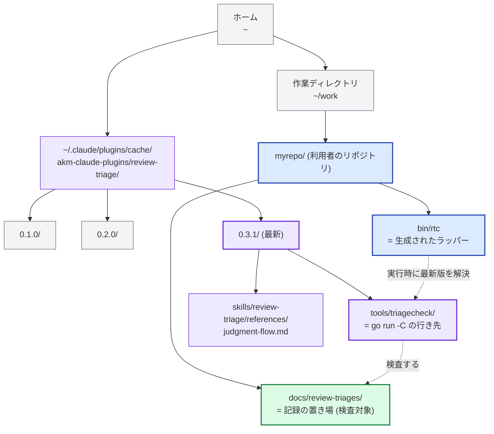
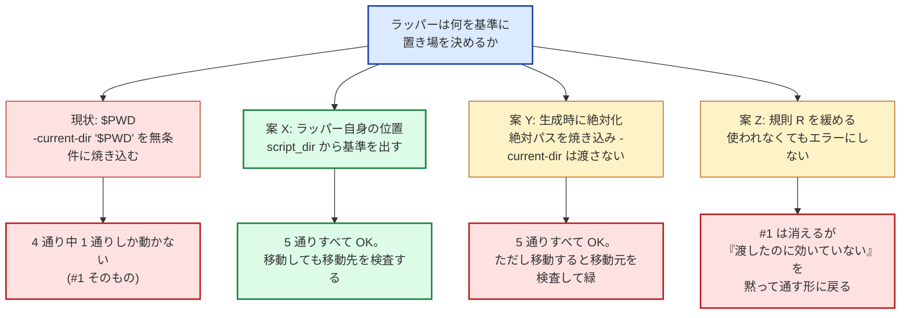

## Context

`triagecheck` は Go で書かれた検査ツールで、Claude Code のプラグイン (`review-triage`) の一部として配布される。バイナリは配らず、常に次の形で起動される。

```
go run -C <プラグインの展開先>/tools/triagecheck .
```

`go run -C` は**子プロセスのカレントディレクトリを指定ディレクトリへ移す**。つまりツールが動き出した時点で、カレントは利用者のリポジトリではなく、プラグインの展開先を指している。ここから「利用者が指定した `-record-dir` の相対パスを、何を基準に解決するか」という問題が生まれる。

### 前提: どこに何があるか

案を読む前に、**プラグインとリポジトリが完全に別の場所にある**ことを押さえておく。これが「基準をどう決めるか」が問題になる理由。



| 役割 | 具体的なパス | 誰が決めるか |
| --- | --- | --- |
| プラグインの展開先 | `~/.claude/plugins/cache/akm-claude-plugins/review-triage/0.3.1/` | Claude Code。**版ごとにディレクトリが増える**ので固定できない |
| ツール本体 | 同上 + `tools/triagecheck/` | ラッパーが実行時に最新版を解決する |
| 判定フローの正本 | 同上 + `skills/.../judgment-flow.md` | 同上 (プラグイン側にある) |
| ラッパー | `~/work/myrepo/bin/rtc` | 利用者が `-install-wrapper` の引数で決める |
| **記録の置き場 (検査対象)** | `~/work/myrepo/docs/review-triages/` | 利用者が `-record-dir` で決める |

**ここが問題の根。** ツールは紫のディレクトリで動くが、検査したいのは緑のディレクトリ。しかも `go run -C` がカレントを紫へ移すので、**ツールから見て緑がどこかは自明でない**。その手がかりとして何を使うか (`$PWD` / 焼き込んだ絶対パス / ラッパー自身の位置) が、3 案の分かれ目になる。

プロセスの内側から取れる値は、どれも基準にならない。

- `os.Getwd()` / `filepath.Abs()` — **プラグインの展開先**を基準に解決してしまう。利用者のリポジトリではない。
- `$PWD` — シェルが更新する慣習にすぎない。`make -C`、cron、CI ランナー、Python の `os.chdir()` + `subprocess` はいずれも `$PWD` を更新しない。

そして `$PWD` に頼った実測の結果が、この学びの出発点になった。**古い `$PWD` を渡した状態でツールを走らせたところ、囮のディレクトリを検査して終了コード 0 を返し、本来の置き場に置いた 3 件の壊れた記録は報告されないまま残った。**

## Guidance

**検査ツールが相対パスの基準を知り得ないなら、推測せず、呼び出し元に明示させる。明示が無ければ黙って動かず、エラーで止まる。**

### 3 つの案を実測で比較した

一時ディレクトリにプラグインキャッシュとリポジトリを模して作り、**5 通りの呼び出し方 + リポジトリの移動**で実際に動かした。



| 呼び出し方 (実測) | 現状 | 案 X | 案 Y |
| --- | --- | --- | --- |
| (a) `cd repo && bin/rtc` | NG<sup>1</sup> | OK | OK |
| (b) 外から `/path/to/repo/bin/rtc` | NG<sup>1</sup> | OK | OK |
| (c) repo のサブディレクトリから | — | OK | OK |
| (d) `make -C` 相当 ($PWD が別) | NG | OK | OK |
| (e) 非シェルの chdir (CI ランナー) | NG | OK | OK |
| **リポジトリを移動 / 再クローン** | — | **OK (移動先を検査)** | **緑だが移動元を検査** |

<sup>1</sup> 絶対パスで生成したラッパーの場合 (= `#1`)。相対で生成すれば (a) だけは通る。

**案 Y を落とした決め手**は移動テストにある。`cp -R repo moved` でリポジトリを複製し、壊れた記録を `moved` の側にだけ置いた。案 Y は終了コード 0 で見逃し、案 X は終了コード 1 で検出した。案 Y の基準は生成時に固定された絶対パスなので、リポジトリが動くと基準だけが元の場所に取り残される。しかも症状は「エラー」ではなく「緑」として現れる。

**案 Z (「`-current-dir` を渡したのに使われなければエラー」という規則を緩める)** も採らなかった。この規則を外すと `#1` は消えるが、「指定したのに黙って効いていない」という状態を通す形に戻る。これは今回の問題そのものと同じ型の壊れ方であり、症状を別の場所に移すだけになる。

### 採った形 (案 X)

**規則の正本は `review-triage/tools/triagecheck/README.md`** (「パスの渡し方」「対象が見つからないとき」「呼び出し用のラッパースクリプトを作る」「ラッパーは自分の位置を基準にする」の各節)。以下はその規則をなぜ採ったかの経緯で、規則そのものは README の側を直す。

- **ラッパーが基準を計算する。** 自分自身の**実体**の位置を求め、`-current-dir` として渡す。ラッパーはリポジトリの中に置かれるので、自分の位置を知っている。推測が要らない。**`dirname "$0"` だけでは足りない** — リンクを解決しないので、リンク経由の起動でリンクの置き場が基準になる (下の「採った形」を参照)。
- **`-record-dir` は script_dir からの相対で焼き込む。** 生成時に `filepath.Rel` で差を取る。基準と対象がともにリポジトリの中にあるので、リポジトリごと動いても関係が保たれる。
- **ツールは `-current-dir` を受け取る。** 相対パスには明示的な基準を要求し、基準が無ければ推測せずエラーにする。
- **パスの規則は経路で分岐する前に 1 か所で当てる。** 検査・生成サマリ・`-install-wrapper` のどの経路も、解決済みの絶対パスを受け取るだけでパスを検査しない。当初は `-install-wrapper` が解決より前で分岐して戻り、「`-record-dir` は絶対パスのみ」という独自の規則を持っていた。生成時のカレントがプラグインの展開先である事情は同じなので、独自の規則ではなく他の経路と同じ `-current-dir` を基準にする形へ寄せた (経緯は下の「経路ごとに規則を書くと収束しない」)。
- **契約テストは生成物を実際に実行する。** 生成したラッパーを **3 つの異なるディレクトリから起動し**、そのいずれからも壊れた記録を検出することを確かめる。

## Why This Matters

検査ツールにとって、**間違った対象を黙って検査して緑を返すことは、一度も走らなかったのと同じ種類の失敗**である。むしろ悪い。走らなければ「走っていない」と気づけるが、緑が返れば「検査済み」という誤った確信が残る。実測ではまさにこれが起きた。3 件の壊れた記録が本来の置き場に存在したまま、ツールは囮のディレクトリを検査して終了コード 0 を返した。

`$PWD` を基準に使う判断は、この失敗を作り込む一手だった。`$PWD` は「シェルが親切に更新してくれる慣習」であって、プロセスのカレントディレクトリの保証ではない。`make -C`・cron・CI ランナー・非シェルの `chdir` はどれも更新しない。そして更新されなかったときに出るのは例外ではなく、**古い値を使った正常終了**である。

案 Y を落とした理由はさらに一般性がある。基準を **生成時 (設定時) に絶対パスで固定する**と、その基準は検査対象から切り離される。リポジトリを移動・再クローンした瞬間に、基準だけが元の場所を指したまま残り、しかもその乖離は緑として現れる。**基準は検査対象と一緒に動くものを選ぶ** — script_dir はリポジトリの中にあるので、リポジトリごと動く。絶対パスは動かない。

`-install-wrapper` の相対パスにも `-current-dir` を要求するのも、`-current-dir` が使われなければエラーにする規則 (案 Z で緩めなかったもの) も、同じ原則の別の適用にすぎない。**知り得ない基準を推測するくらいなら、呼び出し元に言わせるか、うるさく失敗する。**

### 経路ごとに規則を書くと収束しない

この原則を実装に入れたあと、レビューの指摘が同じ型で回を重ねて続いた。パスの規則 (空の値を弾く・相対には基準が要る・実在を要求する・使われないフラグを弾く) と経路 (検査・`-write-summary`・`-install-wrapper`) とフラグの組み合わせが表になり、**修正は毎回その表の 1 マスを埋め、レビューは次の空いたマスを見つけた。** 原因は `-install-wrapper` の経路がパスの解決より前で分岐して戻っていたことで、検査の経路の規則が 1 つも届かず、同じ規則を別の条件で書き直すしかなかった。「`-record-dir` は絶対パスのみ」も「`-judgment-flow ""` は既定を使う」も、その経路だけの特例として増えたものである。

**採った形は、フラグを読んだ直後に明示された各パスへ同じ規則を同じ順で当て、解決済みの絶対パスだけを経路に渡すこと。** 特例は 2 つとも外した — `-current-dir` は生成の経路でも単に基準として使い、「既定の判定フローを使う」は空文字ではなく省略で表す。テストも経路 × フラグ × 入力の 1 枚の表になり、規則を 1 つ無効化するとどの経路のケースも落ちる。

この失敗の型には、このリポジトリ内で既に名前が付いていた。`review-triage` スキルの
[rejection-gates.md](../../../review-triage/skills/review-triage/references/rejection-gates.md) は
**「エラーが出なかった」と「意味のある判定を行った」は別の事実である**と述べ、
[premise-check.md](../../../review-triage/skills/review-triage/references/premise-check.md) は
**「調べたが分からなかった」を「正しい」として扱わない**と述べている。どちらも「診断ツールの偽陰性」を戒めたものである。
**スキルを実装しているツールが、そのスキル自身の規則を破っていた** — これが Issue #31 の本質で、
同 Issue も `rejection-gates.md` を名指ししている。

もう一つ、テストの側にも同型の失敗があった。ラッパーの検証を生成された文字列に対するアサーションだけで行っていたため、**`-current-dir` の行を削除しても全テストが通った**。生成物の契約は「どこから叩いても同じ置き場を検査する」ことであり、これは文字列比較では確かめられない。実際に実行して初めて確かめられる。検査ツールに求めた基準を、そのツールのテストにも適用する必要があった。

## When to Apply

この教訓は `triagecheck` に限らず、次の 2 つの性質を同時に持つツール一般に当てはまる。

- **(a) 何かを検証する** (lint、テスト、スキーマ検査、設定の妥当性確認、セキュリティスキャン)
- **(b) ラッパーや別プロセスから起動され、自身のカレントディレクトリが利用者のカレントディレクトリと一致しない**

(b) を生む具体的な形はいくつもある。

- `go run -C` / `npm --prefix` / `cargo -C` のように、ツール側が cd してから実行するランナー
- `make -C`、cron、CI ランナー、Python の `os.chdir()` + `subprocess` のように、`$PWD` を更新しない親からの起動
- プラグイン・拡張として配布され、本体がリポジトリの外にあるツール

このとき従うべき判断は次の通り。

1. **プロセス内から取れる値 (`os.Getwd()`、`$PWD`) を基準に使わない。** 前者は嘘をつき、後者は嘘をつきうる。
2. **基準は呼び出し元に明示させ、無ければエラーで止める。** 「指定が無ければそれらしい既定で動く」は、検査ツールでは偽の緑を作る。
3. **基準は検査対象と一緒に動くものを選ぶ。** ラッパー自身の位置 (script_dir)、リポジトリのルート (VCS のマーカーから探索) など。設定時に固定した絶対パスは、対象が動いた瞬間に静かに乖離する。**「一緒に動く」は実体で確かめる** — シンボリックリンクは実体と別の場所に置けるので、リンクの位置を基準にすると同じ乖離が起きる。
4. **生成物の契約は生成物を実行して確かめる。** 「どこから叩いても同じ対象を見る」ような性質は、出力文字列のアサーションでは守れない。

逆に、この慎重さが要らない場面もある。基準を取り違えたときに**即座に、大きな音で失敗する**なら (対象が存在せずファイル not found になる、など)、推測に頼る判断もありうる。危険なのは、取り違えても実在する別のディレクトリを検査してしまい、成功として終われる場合である。今回はまさにそれだった。

### 直す順序に注意する

**基準の解決を直す前に「不在をエラーにする」だけを入れると、黙った緑が誤った赤に変わる。**
このブランチの 1 巡目で実際に起きた — 相対パスの誤解決は修正前から存在したが、
不在を握り潰していたので表面化しなかった。不在をエラーにした時点で、
**実在する置き場を「存在しません」と誤報する**形で噴き出した。

厳しくする変更と、解決を正す変更は同時に要る。片方だけでは、
黙って通る欠陥が偽の失敗に置き換わるだけで、正しく検査できるようにはならない。

## Examples

**採らなかった形 (現状: `$PWD` を無条件に焼き込む)**

```bash
exec go run -C "$root/tools/triagecheck" . \
  -current-dir "$PWD" \
  -record-dir docs/review-triages "$@"
```

`$PWD` が古いまま (`make -C` や CI ランナーからの起動) だと、`docs/review-triages` は意図しないディレクトリの下で解決される。そこに何も無ければ「0 件検査して問題なし」として終了コード 0 になる。

**採った形 (案 X: script_dir を基準にする)**

生成されるラッパー。

```bash
# 基準はこのスクリプト自身の位置。$PWD は叩いた場所によって変わるので使わない。
# $0 がリンクである間は辿る。dirname "$0" だけではリンクの置き場が基準になり、
# その隣に別の置き場があるとそちらを検査して緑を返す。
script_src=$0
while [ -L "$script_src" ]; do
  link_dir=$(cd -P "$(dirname "$script_src")" && pwd)
  script_src=$(readlink "$script_src")
  case $script_src in /*) ;; *) script_src=$link_dir/$script_src;; esac
done
script_dir=$(cd -P "$(dirname "$script_src")" && pwd)

plugin_cache=...
root=$(ls -d "$plugin_cache"/*/ 2>/dev/null | sort -V | tail -1)

exec go run -C "$root/tools/triagecheck" . \
  -current-dir "$script_dir" \
  -record-dir "../docs/review-triages" \
  "$@"
```

`-record-dir` の値 (`../docs/review-triages`) は、生成時のカレント基準ではなく **script_dir 基準の相対**として計算して焼き込む。installWrapper は解決済みの絶対パス (出力先と置き場) を受け取り、両者の差を取るだけで、パスの検査や絶対化は持たない (それらは経路の分岐より前の 1 か所で済んでいる)。

```go
// 焼き込む -record-dir を script_dir 基準の相対にする。
scriptDir := filepath.Dir(path)
relRecordDir, err := filepath.Rel(scriptDir, recordDir)
recordDir = filepath.ToSlash(relRecordDir)
```

**規則は経路の分岐より前に 1 か所で当てる**

```go
// パスの規則は、経路 (検査 / -write-summary / -install-wrapper) で分岐する前に
// 1 か所で当てる。経路ごとに書くと、規則を 1 つ足すたびに他の経路へ書き忘れ、
// 同じ入力に経路ごとに違う契約ができる。
in, err := resolveInputs(pathInputs{...})   // 空の値を弾く → 相対を -current-dir で解決 → 使われない基準を弾く
if problems := missingPathProblems(in); len(problems) > 0 { ... }  // 実在の要求も経路を問わず
if in.installWrapper != "" {
    return installWrapper(in.installWrapper, in.recordDir, in.embedJudgmentFlow) // 焼き込むだけ
}
```

**検査の経路でも基準を要求する**

```go
// base が空 (= -current-dir が無い) のに相対を渡されたらエラーにする。
return "", false, fmt.Errorf(
    "%s が相対パスです。基準を -current-dir で指定するか、絶対パスにしてください: %s", flagName, p)
```

**契約テスト: 生成物を実際に走らせる**

```go
// 生成したラッパーを実際に実行して、正しい置き場を検査することを固定する。
// 文字列だけを検査していたため、-current-dir の焼き込みを壊しても全テストが
// 通っていた。生成物の契約 (どこから叩いても同じ置き場を見る) は、実行して
// 初めて確かめられる。
func TestInstallWrapperGeneratesRunnableScript(t *testing.T) {
    // ... プラグインキャッシュと利用者のリポジトリを模した配置を作る ...

    // 叩く場所を変えても正常に通ること。$PWD 基準だとここで割れる。
    // (リポジトリのルート / リポジトリの外 / リポジトリの親)

    // 置き場に壊れた記録を置いたら、叩く場所を変えても検出すること
    // (実行はしているが対象が違う、を捕まえる)。

    // シンボリックリンク経由で起動しても実体の置き場を検査すること。
    // リンクの隣に囮の置き場を実在させたうえで確かめる。
}
```

**正常系は 3 箇所から起動して通ることを見て、壊れた記録の検出は 2 箇所で確かめる。**
さらにリンク経由の起動を別に確かめる — リンクの隣に囮の置き場を置き、実体側の壊れた記録を
検出させる。生成物の契約は「どこから叩いても・シンボリックリンク経由でも同じ置き場を検査する」
ことなので、**実行して初めて確かめられる。**

**契約には範囲がある。** ハードリンク経由の起動はサポートの範囲外で、そのときは弾かれるのではなく
黙って緑を返す。**範囲を書かないと、新しい経路が見つかるたびに契約だけが偽になる** — 実際、
この型は 4 巡続けて別の経路から現れた。どこまでをサポートするかの一覧は正本
(`review-triage/tools/triagecheck/README.md` の「サポートする配置と、しない配置」) が持つので、
ここには複製しない。複製すれば、片方だけ更新される型をまた作り込むことになる。

リンク経由の検査は後から足したものである。最初は `dirname "$0"` で基準を求めており、
リンクを解決しないことを検証していなかった。**基準が検査対象から切り離される経路は
1 つではない** — 絶対パスの焼き込み (移動で切り離れる) を退けた後も、リンク (実体と
別の場所に置ける) で同じ型が残っていた。
