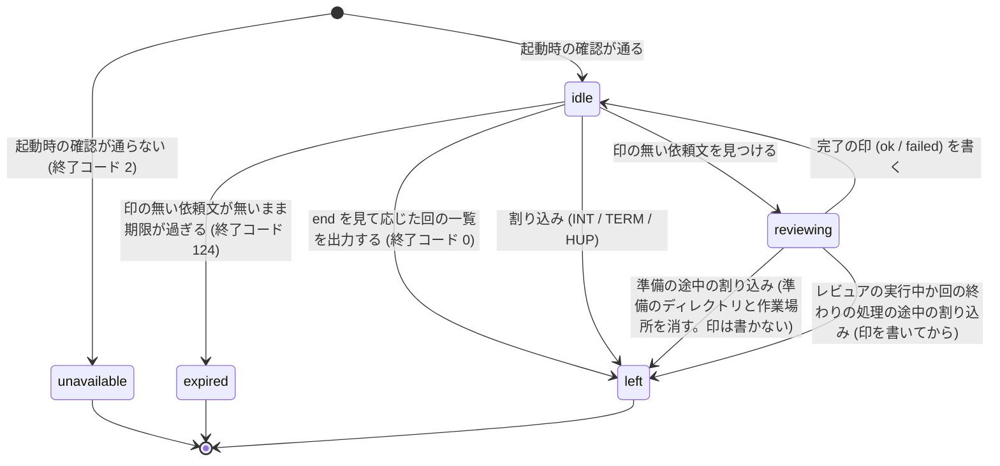

# 周回の置き場のファイル

**このファイルが、周回の置き場 (`<review_loop.dir>/<周回 id>/`。作業側の `review-loop` とワーカーが受け渡しに使うディレクトリ) の中のファイルの契約の正本。** 作業側の [SKILL.md](../SKILL.md)・ワーカーのスクリプト `review-triage/scripts/review-loop-worker.sh`・待機スクリプト `review-triage/scripts/review-loop-wait.sh` はこれに従う。ほかの文書はファイルの名前と役割を参照するだけで、キーや態度を言い直さない。

**2 つのプロセスの受け渡しは、この置き場の中のファイルだけで行う。** 作業側とワーカーは互いのプロセスを知らず、メッセージも送らない。置き場は git に無視されている (作業側が開始時に確かめる) ので、ファイルはコミットされない。ワーカーがレビュアの実行のために回ごとに作る一時ディレクトリ (回の作業場所) は置き場の外にあり、受け渡しには使わない (作業場所の正本は [worker.md](worker.md) の「回の処理」)。

## ファイルの一覧

**どのファイルも書く側が 1 つで、読む側は書き換えない。** 例外は `end` で、作業側 (`--end`) のほかに人間が直接置いてもよい (中身は読まず、有無だけを見る)。**レビュアの実行 (ワーカーが起動する `claude -p` の 1 回) は、置き場のどのファイルも書かない** — 結果は回の作業場所に書き、置き場へはワーカーが確かめてから複写する。そのため結果の書く側もワーカー 1 つになる。レビュアの実行が置き場に書けば、ワーカーは置き場が変わったとして `failed` の印を書く。

| ファイル | 書く側 | いつ書くか | 様式 |
| --- | --- | --- | --- |
| `loop.yaml` | 作業側 | 周回の開始時と、停止・再開・終了のたび | 下の「`loop.yaml`」 |
| `review-request-<識別子>.md` (依頼文) | 作業側 (`review-request --dir`) | 回ごと (RL1 の手順 a) | 雛形 [review-request-template.md](../../review-triage/references/review-request-template.md) |
| `review-<識別子>.yaml` (結果) | ワーカー (レビュアの実行が作業場所に書いた結果を、確かめてから複写する) | レビュアの実行が終わった後、完了の印より前 | 雛形の「出力様式」の節 |
| `<識別子>.log` (ログ) | ワーカー (レビュアの実行の標準出力と標準エラーをそのまま) | レビュアの実行の間 | `claude -p --output-format stream-json --verbose` の出力。読み方の正本は [worker.md](worker.md) の「ログの読み方」 |
| `delivered-<識別子>.yaml` (完了の印) | ワーカー | 回の終わりの処理 (結果の複写と作業場所の削除) の後、またはレビュアの実行を起動せずに失敗と決めた後 | 下の「`delivered-<識別子>.yaml`」 |
| `worker.yaml` | ワーカー | 起動時と、状態が変わるたび。動いている間は 5 秒おきに更新時刻だけを進める | 下の「`worker.yaml`」 |
| `end` | 作業側 (`--end`) か人間 | 周回を終えるとき | 理由を 1 行。中身は読まない |

**識別子は `review-request` が付けるもの (成分の正本は [review-request の SKILL.md](../../review-request/SKILL.md) の手順 3) をそのまま使い、依頼文・結果・ログ・完了の印の名前は識別子から導出する。** どのファイルも、識別子から導出できるファイル名をキーとして持たない — 持つと、名前と中身が食い違ったときにどちらを信じるかを決める規則が要る。

## 一時名と改名

**相手が現れるのを待っているファイル (依頼文・結果・完了の印・`worker.yaml`・`end`・`loop.yaml`) は、同じディレクトリの一時名 (`.` で始まり `.tmp` で終わる名前。例: `.delivered-<識別子>.yaml.tmp`) に書いてから `mv` で改名する。** 同じファイルシステムの中の改名は一度に起きるので、読む側が書きかけを読むことが無い。待機スクリプトとワーカーの探索は、`.` で始まる名前を見ない。

人間が直接置く `end` は一時名を経ない。`end` は中身を読まず有無だけを見るので、書きかけでも扱いは変わらない。

結果は、ワーカーが作業場所から置き場へ複写するときに、この手順で書く。ログは一時名を経ない。ログはワーカーが実行の間ずっと書き足す。

## `loop.yaml`

作業側が周回の条件と状態を書く。`--resume` はこのファイルから周回の条件を復元する (再開のときに何を変えてよいかの正本は [arguments.md](arguments.md) の「様式」)。**条件のキーには、開始時に決めた値 (引数か設定か既定) を書く。** キーの名前は設定 (`config.json` の `loop`・`fix`・`review_loop`) のキー名と揃え、値の意味の正本は [project-config.md](../../review-triage/references/project-config.md) の各節にある — 下の表は対応する設定のキーだけを書く。設定のキーを持たない条件 (`loop.stages`・`review.full_review`・`review.base`) は、引数の値を書き、意味の正本は [arguments.md](arguments.md)。

```yaml
id: "20260926-1400-feat-review-loop-63"
created: "2026-09-26T14:00:00+0900"
repo_dir: "/Users/me/src/repo"
branch: "feat/review-loop-63"
worker:
  model: "opus"
  effort: "xhigh"
  permission_mode: "auto"
  allowed_tools: []
  sandbox_allow_write: ["~/Library/Caches/go-build"]
  sandbox_allowed_domains: []
  idle_minutes: 180
  review_timeout_minutes: 60
review:
  skill: "code-review"
  args: "high"
  full_review: true
  base: "origin/main"
loop:
  max_rounds: 10
  structure_rounds: 3
  threshold: 5
  stages: []
wait:
  wait_minutes: 60
  worker_wait_minutes: 15
  worker_stale_seconds: 30
state: active
stop_reason: ""
rejected: []
full_review_next: false
```

| キー | 必須 | 内容 |
| --- | --- | --- |
| `id` | ◯ | 周回 id。置き場のディレクトリ名と同じ |
| `created` | ◯ | 周回を始めた日時 (ISO 8601。時差つき) |
| `repo_dir` | ◯ | 作業側の作業ツリーのルートの実体パス (`git rev-parse --show-toplevel` を `cd` して `pwd -P` で解決したもの)。ワーカーは起動時に自分の作業ツリーと比べる |
| `branch` | ◯ | 周回を始めたブランチ名 |
| `worker.model` | ◯ | ワーカーのモデルの指定 (`loop.review_model`) |
| `worker.effort` | ◯ | ワーカーの effort (`review_loop.worker_effort`) |
| `worker.permission_mode` | ◯ | `review_loop.permission_mode` |
| `worker.allowed_tools` | ◯ | `review_loop.allowed_tools`。空の列は「ワーカーの既定の一覧を使う」 |
| `worker.sandbox_allow_write` | | `review_loop.sandbox_allow_write`。`--resume` での読み直しと、キーが無いときの扱いの正本は [arguments.md](arguments.md) の「様式」 |
| `worker.sandbox_allowed_domains` | | `review_loop.sandbox_allowed_domains`。扱いは `worker.sandbox_allow_write` と同じ |
| `worker.idle_minutes` | ◯ | `review_loop.worker_idle_minutes` |
| `worker.review_timeout_minutes` | ◯ | `review_loop.review_timeout_minutes` |
| `review.skill` | ◯ | `loop.review_skill` |
| `review.args` | ◯ | `loop.review_args` (空文字列なら既定) |
| `review.full_review` | | 引数 `--full-review` を付けて始めたか (真偽値)。0.14.0 以前に始めた周回には無く、無ければ偽 (扱いの正本は [arguments.md](arguments.md) の「様式」) |
| `review.base` | | 全量の起点を求める派生元のブランチ名 (引数 `--base`。省けば開始時に解決した `origin/HEAD` が指すブランチ)。0.14.0 以前に始めた周回には無く、無ければ `--resume` の開始時に解決して書く |
| `loop.max_rounds` | ◯ | `loop.max_rounds` |
| `loop.structure_rounds` | ◯ | `loop.structure_rounds` |
| `loop.threshold` | ◯ | `fix.threshold_rounds` |
| `loop.stages` | ◯ | 引数 `--stage` の値の列 (引数で指定したものだけ。設定 `fix.stages` は `review-triage-fix` が自分で読む)。無ければ `[]` |
| `wait.wait_minutes` | ◯ | `review_loop.wait_minutes` |
| `wait.worker_wait_minutes` | ◯ | `review_loop.worker_wait_minutes` |
| `wait.worker_stale_seconds` | ◯ | `review_loop.worker_stale_seconds` |
| `state` | ◯ | `active` (周回が進んでいる) / `stopped` (停止ノードで止まり、人間の判断を待つ) / `ended` (終わった) |
| `stop_reason` | ◯ | `stopped` と `ended` のとき、ノード ID (`S2`〜`S6`・`RA1`〜`RA3`) か `end` と、1 行の理由。`active` なら空文字列 |
| `rejected` | ◯ | レビュー不成立 (RA1) と判定した回の識別子の列。再入の手順が、その回の完了の印を取り込まない。無ければ `[]` |
| `full_review_next` | | 実行時のキー (周回の条件ではない)。`--resume --full-review` の印で、真なら次に書く依頼文を全量にする。`--resume` の開始時 ([reentry.md](reentry.md) の「再入の手順」の 1) に `true` を書き、全量の依頼文を書いたら ([round.md](round.md) の RL1 の手順 a の 7) と、どの停止でも ([stops.md](stops.md) の「停止のときに書き換えるもの」) `false` にする。無ければ偽 |

各値の決め方は [arguments.md](arguments.md) が正本。ワーカーが読むのは `repo_dir` だけで、トップレベルの `repo_dir: "<パス>"` の 1 行として読む (値を 1 行に書く)。

## `worker.yaml`

ワーカーが自分の状態を書く。**ファイルの更新時刻 (mtime) が、ワーカーが動いていることの印である。** ワーカーは動いている間、状態に関わらず (レビュアの実行中も) 5 秒おきに `touch -c` で更新時刻を進める。読む側は、更新時刻が停滞の秒数 (`wait.worker_stale_seconds`) より古ければ、状態に関わらず「ワーカーのプロセスが動いていない」と読む。**更新時刻は、コマンド `stat -f %m worker.yaml` (macOS などの BSD) か `stat -c %Y worker.yaml` (GNU) で読み、`date +%s` との差を秒で求める。キー `updated` の値を使わない** — `updated` は状態を最後に書き換えた日時で、待機中のワーカーでは状態が変わらないので、動いていてもすぐに古くなる (通し確認で、`updated` を読んで、動いているワーカーを動いていないと判定した)。

```yaml
state: reviewing
current_request: "20260926-1400-feat-review-loop-63-1-code-review-opus"
workspace: "/private/var/folders/xx/abcd/T/review-loop-20260926-1400-feat-review-loop-63-1a2b3c4d"
pid: 12345
worker_version: "0.14.0"
model: "opus"
effort: "xhigh"
permission_mode: "auto"
sandbox_allow_write: ["/Users/me/Library/Caches/go-build"]
sandbox_allowed_domains: []
cwd: "/Users/me/src/repo"
head: "abc1234"
started: "2026-09-26T14:02:00+0900"
updated: "2026-09-26T14:02:05+0900"
rounds_served: 0
```

| キー | 必須 | 内容 |
| --- | --- | --- |
| `state` | ◯ | 下の「状態」の 5 つのいずれか |
| `current_request` | ◯ | `reviewing` のとき処理中の識別子。それ以外は空文字列 |
| `workspace` | ◯ | `reviewing` のとき、その回の作業場所 (ワーカーが環境変数 `TMPDIR` の下に用意する一時ディレクトリ) のパス。それ以外は空文字列。起動し直したワーカーが、`kill -9` などで消えた前の起動の作業場所を片付けるのに使う (正本は [worker.md](worker.md) の「起動時の確認」の 2)。準備のディレクトリ (複製と写しを作ってから作業場所のパスに改名するディレクトリ) のパスは書かない — 起動し直したワーカーは、名前の形で見つける |
| `pid` | ◯ | ワーカーのプロセス ID |
| `worker_version` | ◯ | ワーカーのバージョン。スクリプトの実体の位置から、プラグインのファイル `review-triage/.claude-plugin/plugin.json` を読んで決める。読めなければ `unknown` |
| `model` | ◯ | ワーカーに渡したモデルの指定 (`--model` の値) |
| `effort` | ◯ | ワーカーに渡した effort (`--effort` の値) |
| `permission_mode` | ◯ | レビュアの実行に渡す権限モード |
| `sandbox_allow_write` | ◯ | サンドボックスの中の Bash に、作業場所のほかに書き込みを許す場所の列 (`--sandbox-allow-write` の値を指定の順に。先頭の `~` はホームに展開したもの)。指定が無ければ `[]` |
| `sandbox_allowed_domains` | ◯ | サンドボックスの中の Bash に接続を許すホストの列 (`--sandbox-allowed-domain` の値を指定の順に)。指定が無ければ `[]`。利用者の設定の `WebFetch(domain:…)` の許可から加わるものは含まない |
| `cwd` | ◯ | ワーカーを起動した作業ツリーのルートの実体パス |
| `head` | ◯ | ワーカーを起動したときの HEAD の短縮 SHA |
| `started` | ◯ | ワーカーを起動した日時 |
| `updated` | ◯ | 状態を最後に書き換えた日時 |
| `rounds_served` | ◯ | この起動で完了の印を書いた回の数 |
| `error` | | `unavailable` のときだけ書く。起動時の確認で通らなかった項目と理由 |

### 状態



`unavailable` / `expired` / `left` になったワーカーは、更新時刻を進めるのをやめて終わる。起動時の確認で「他のワーカーが動いている」と判定したときは、`worker.yaml` に触れずに終わる (判定の条件の正本は [worker.md](worker.md) の「起動時の確認」)。

**`reviewing` から `left` になっても、完了の印があるとは限らない。** 準備の途中 (レビュアの実行を起動する前) に割り込みを受けた回は、印を書かずに終わる。その依頼文は印の無いまま残り、起動し直したワーカーがもう一度処理する (割り込みの扱いの正本は [worker.md](worker.md) の「終わり方」)。

## `delivered-<識別子>.yaml`

ワーカーが回ごとに書く完了の印。**印が現れたことが「ワーカーがこの回を終えた」ことを表し、`status` がその回を使えるかを表す。** 突き合わせ (作業側が印と結果を依頼文と比べること) の順序の正本は [round.md](round.md) の RL1 の手順 c。

**`status` が `ok` の印があれば、置き場に結果が通常のファイルとして在る** (ワーカーがこれを守る手順の正本は [worker.md](worker.md) の「回の処理」の手順 10)。待機スクリプト `review-loop-wait.sh` は `ok` の印を見ても、依頼文と結果が揃うまで返さないので、結果が無いまま `ok` の印が現れると期限まで待ち続ける。`failed` の印では、結果が在るとは限らない (複写できた結果は `failed` の回でも置き場にある)。

```yaml
id: "20260926-1400-feat-review-loop-63-1-code-review-opus"
status: ok
worker_version: "0.14.0"
model:
  specified: "opus"
  effective: "opus-5"
effort: "xhigh"
permission_mode:
  specified: "auto"
  effective: "auto"
skill_called: true
permission_denials:
  count: 0
  tools: []
sandbox_blocked:
  count: 0
  calls: []
head_before: "abc1234"
head_after: "abc1234"
tree_clean_after: true
started: "2026-09-26T14:02:05+0900"
finished: "2026-09-26T14:20:41+0900"
exit_code: 0
log: "20260926-1400-feat-review-loop-63-1-code-review-opus.log"
```

| キー | 必須 | 内容 |
| --- | --- | --- |
| `id` | ◯ | 識別子 |
| `status` | ◯ | `ok` (作業場所の結果を確かめて置き場に複写し、すべて通った) / `failed` (どれかが通らなかった、またはレビュアの実行を起動しなかった。結果を複写できていれば、置き場に結果がある) |
| `worker_version` | ◯ | この印を書いたワーカーのバージョン (`worker.yaml` の `worker_version` と同じ決め方)。読めなければ `unknown` |
| `model.specified` | ◯ | ワーカーに渡したモデルの指定 |
| `model.effective` | ◯ | ログから読んだ実効モデルの名前 (モデル ID から `claude-` を除いた、記録の表記)。読めなければ `unknown` |
| `effort` | ◯ | ワーカーに渡した effort。**実行時の値ではない** — effort はログに記録されないので、ワーカーが確かめられるのは渡した値だけ |
| `permission_mode.specified` | ◯ | レビュアの実行に渡した権限モード (`--permission-mode` の値) |
| `permission_mode.effective` | ◯ | ログから読んだ実効の権限モード。指定と違えば `status` は `failed`。読めなければ `unknown` (それだけでは `failed` にしない)。起動しなかった回も `unknown` |
| `skill_called` | ◯ | レビュアの実行が Skill ツールを呼んだか。`true` / `false`、ログから読めなければ `unknown` |
| `permission_denials.count` | ◯ | 許可されずに拒否されたツールの呼び出しの件数。ログから読めなければ `unknown` |
| `permission_denials.tools` | ◯ | 拒否されたツールの名前の列 (重複を除く)。件数が 0 か `unknown` なら `[]` |
| `sandbox_blocked.count` | ◯ | サンドボックスが止めた確認 (Bash の呼び出しのうち、書き込みか接続を止められたエラーで終わったもの。sub-agent の中の呼び出しを含む) の件数。ログから数えられなければ `unknown`。起動しなかった回も `unknown` |
| `sandbox_blocked.calls` | ◯ | 数えた呼び出しの列。各要素は `command` (Bash に渡したコマンド) と `message` (結果の本文のうち、止められたパスかホストを含む部分) の 2 つのキーを持ち、どちらも文字列 (1 行への直し方と、切り詰める長さの正本は [worker.md](worker.md) の「サンドボックスが止めた確認の数え方」の 3)。件数が 0 か `unknown` なら `[]` |
| `head_before` | ◯ | 依頼文を見つけたときの HEAD の短縮 SHA |
| `head_after` | | レビュアの実行が終わった後の HEAD の短縮 SHA。**起動しなかった回は省く** |
| `tree_clean_after` | | レビュアの実行が終わった後に作業ツリーが clean か。起動しなかった回は省く |
| `started` | ◯ | 依頼文を見つけた日時 |
| `finished` | ◯ | 印を書く直前の日時 |
| `exit_code` | | レビュアの実行の終了コード。起動しなかった回は省く。上限や割り込みで止めたときは止めた後の値 |
| `error` | | `failed` のときだけ書く。通らなかった項目 (複数なら `; ` で区切る)。`ok` のときは省く |
| `log` | | ログのファイル名。起動しなかった回は省く (ログが無いことを示す) |

`sandbox_blocked.calls` が空でないときは、要素ごとに `- ` で始まる行から書く (YAML のブロック形式の列)。

```yaml
sandbox_blocked:
  count: 2
  calls:
    - command: "go test ./..."
      message: "open /Users/me/Library/Caches/go-build/ab/abcd-d: operation not permitted"
    - command: "curl -sS https://example.com/"
      message: "<sandbox_violations> deny network-outbound example.com:443 (host is not on the allow list)"
```

`error` に書く項目の一覧と、それぞれの確かめ方の正本は [worker.md](worker.md) の「回の処理」。ログから読む項目の読み方の正本は同じファイルの「ログの読み方」。

## 読む側の検査

**読む側は、読む前に最低限の検査を行う。** 通らないときの態度は、次の節の「ファイルの種類ごとの態度」で決まる。

| ファイル | 読む側 | 確かめること |
| --- | --- | --- |
| 設定 (`config.json` の `review_loop`) | 作業側 | 値の型と範囲 (条件の正本は [arguments.md](arguments.md) の「値の検査」) |
| `loop.yaml` | 作業側・ワーカー | YAML として読め、必須キーがあり、`state` が 3 つのいずれか。ワーカーは `repo_dir` の行があること |
| 依頼文 | ワーカー | 埋め残しの `{{` が無い。「出力様式」の節 (`## 出力様式` の行) がある。`head: "<SHA>"` の行がある |
| 結果 | ワーカー (作業場所の結果)・作業側 (置き場の結果) | ファイルがある。`findings:` の行 (作業側は YAML の `findings` キー) がある。`run_id` が識別子と一致する。ワーカーは、置き場へ複写する前にファイルの種類・置き場所・大きさも確かめる (正本は [worker.md](worker.md) の「回の処理」) |
| 完了の印 | 作業側 | YAML として読め、必須キーがあり、`id` が識別子と一致し、`status` が 2 つのいずれか |
| `worker.yaml` | 作業側・ワーカー | YAML として読め、必須キーがあり、`state` が 5 つのいずれか |
| `end` | 作業側・ワーカー | 有無だけ |

## ファイルの種類ごとの態度

**「存在しない」と「壊れている」を分ける。** 存在しないのは「まだ書かれていない」で、待つか新規として扱う。壊れているのは失敗で、失われるものの大きさで態度を決める (流儀は `docs/solutions/architecture-patterns/fail-soft-by-data-class.md`)。**書きかけを待ち直しの経路に入れない** — 書く側は一時名から改名するので、読めない状態は書きかけではなく失敗である。

| 種類 | ファイル | 存在しないとき | 壊れているとき |
| --- | --- | --- | --- |
| 設定 | `config.json` の `review_loop` | キーごとの既定値 | 既定値で続行し、警告を報告に書く (失われるのは利用者が書いた数行) |
| 状態 | `loop.yaml` | 周回が無い (開始の前提を満たす) | **止めて知らせる。新規に寄せない** — 新規として扱うと、同じブランチに終わっていない周回が 2 つでき、同じ回番号の依頼文が 2 つできる |
| レビュアの実行が書くファイル | 結果 (レビュアの実行が作業場所に書き、ワーカーが置き場へ複写する) | ワーカーが `failed` の印を書く | ワーカーが `failed` の印を書く (`error` の書き方の正本は [worker.md](worker.md) の「回の処理」) |
| ワーカーが書くファイル | 完了の印・`worker.yaml` | 印はまだ (待つ)。`worker.yaml` はワーカーが未起動 (起動を待ち、期限を過ぎたら RA2) | 作業側は「レビュー不成立」(RA1) として止める |
| 作業側が書くファイル | 依頼文 | ワーカーは待つ | ワーカーが `failed` の印を書き、レビュアの実行を起動しない |

停止ノード (RA1〜RA3) の定義と報告に書くものの正本は [stops.md](stops.md)。
