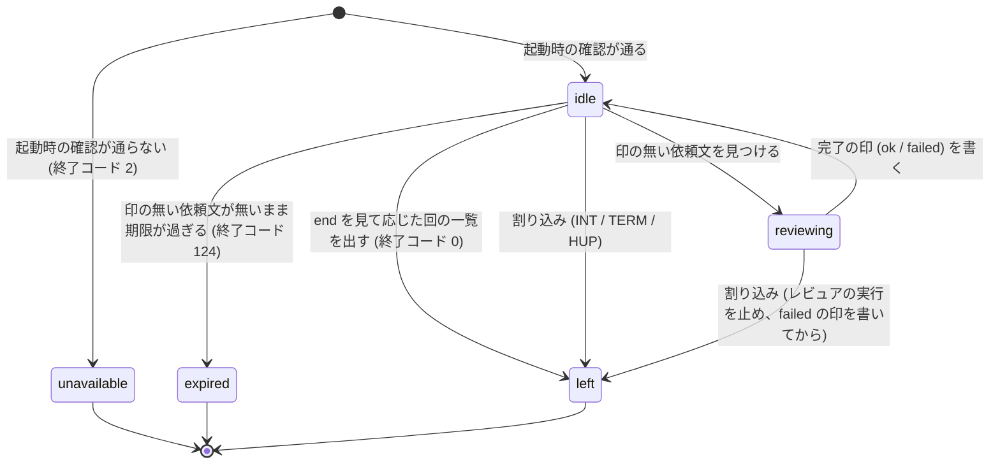

# 周回の置き場のファイル

**このファイルが、周回の置き場 (`<review_loop.dir>/<周回 id>/`。作業側の `review-loop` とワーカーが受け渡しに使うディレクトリ) の中のファイルの契約の正本。** 作業側の [SKILL.md](../SKILL.md)・ワーカーのスクリプト `review-triage/scripts/review-loop-worker.sh`・待機スクリプト `review-triage/scripts/review-loop-wait.sh` はこれに従う。ほかの文書はファイルの名前と役割を参照するだけで、キーや態度を言い直さない。

**2 つのプロセスの受け渡しは、この置き場の中のファイルだけで行う。** 作業側とワーカーは互いのプロセスを知らず、メッセージも送らない。置き場は git に無視されている (作業側が開始時に確かめる) ので、ファイルはコミットされない。

## ファイルの一覧

**どのファイルも書く側が 1 つで、読む側は書き換えない。** 例外は `end` で、作業側 (`--end`) のほかに人間が直接置いてもよい (中身は読まず、有無だけを見る)。

| ファイル | 書く側 | いつ書くか | 様式 |
| --- | --- | --- | --- |
| `loop.yaml` | 作業側 | 周回の開始時と、停止・再開・終了のたび | 下の「`loop.yaml`」 |
| `review-request-<識別子>.md` (依頼文) | 作業側 (`review-request --dir`) | 回ごと (RL1 の手順 a) | 雛形 [review-request-template.md](../../review-triage/references/review-request-template.md) |
| `review-<識別子>.yaml` (結果) | レビュアの実行 (ワーカーが起動する `claude -p` の 1 回) | レビューの後 | 雛形の「出力様式」の節 |
| `<識別子>.log` (ログ) | ワーカー (レビュアの実行の標準出力と標準エラーをそのまま) | レビュアの実行の間 | `claude -p --output-format stream-json --verbose` の出力。読み方の正本は [worker.md](worker.md) の「ログの読み方」 |
| `delivered-<識別子>.yaml` (完了の印) | ワーカー | 結果を確かめた後、またはレビュアの実行を起動せずに失敗と決めた後 | 下の「`delivered-<識別子>.yaml`」 |
| `worker.yaml` | ワーカー | 起動時と、状態が変わるたび。動いている間は 5 秒おきに更新時刻だけを進める | 下の「`worker.yaml`」 |
| `end` | 作業側 (`--end`) か人間 | 周回を終えるとき | 理由を 1 行。中身は読まない |

**識別子は `review-request` が付けるもの (成分の正本は [review-request の SKILL.md](../../review-request/SKILL.md) の手順 3) をそのまま使い、依頼文・結果・ログ・完了の印の名前は識別子から導出する。** どのファイルも、識別子から導出できるファイル名をキーとして持たない — 持つと、名前と中身が食い違ったときにどちらを信じるかを決める規則が要る。

## 一時名と改名

**相手を起こすファイル (依頼文・完了の印・`worker.yaml`・`end`・`loop.yaml`) は、同じディレクトリの一時名 (`.` で始まり `.tmp` で終わる名前。例: `.delivered-<識別子>.yaml.tmp`) に書いてから `mv` で改名する。** 同じファイルシステムの中の改名は一度に起きるので、読む側が書きかけを読むことが無い。待機スクリプトとワーカーの探索は、`.` で始まる名前を見ない。

人間が直接置く `end` は一時名を経ない。`end` は中身を読まず有無だけを見るので、書きかけでも扱いは変わらない。

結果とログは一時名を経ない。結果はレビュアの実行が書き、ワーカーは実行が終わってから読む。ログはワーカーが実行の間ずっと書き足す。

## `loop.yaml`

作業側が周回の条件と状態を書く。**`--resume` はこのファイルだけから周回の条件を復元する** — 引数を毎回指定し直させると、再開のたびに条件が変わりうる。キーの名前は設定 (`config.json` の `loop`・`fix`・`review_loop`) のキー名と揃える。

```yaml
id: "20260926-1400-feat-review-loop-63"
created: "2026-09-26T14:00:00+0900"
repo_dir: "/Users/me/src/repo"
branch: "feat/review-loop-63"
worker:
  model: "opus"
  effort: "xhigh"
  permission_mode: "default"
  allowed_tools: []
  idle_minutes: 180
  review_timeout_minutes: 60
review:
  skill: "code-review"
  args: "high"
loop:
  max_rounds: 10
  structure_rounds: 3
  threshold: 5
  stages: []
wait:
  wait_minutes: 60
  worker_wait_minutes: 15
  worker_stale_seconds: 30
state: active
stop_reason: ""
rejected: []
```

| キー | 必須 | 内容 |
| --- | --- | --- |
| `id` | ◯ | 周回 id。置き場のディレクトリ名と同じ |
| `created` | ◯ | 周回を始めた日時 (ISO 8601。時差つき) |
| `repo_dir` | ◯ | 作業側の作業ツリーのルートの実体パス (`git rev-parse --show-toplevel` を `cd` して `pwd -P` で解決したもの)。ワーカーは起動時に自分の作業ツリーと比べる |
| `branch` | ◯ | 周回を始めたブランチ名 |
| `worker.model` | ◯ | ワーカーに求めるモデルの指定 (人間が `--model` に渡す綴り) |
| `worker.effort` | ◯ | ワーカーに求める effort (`low` / `medium` / `high` / `xhigh` / `max`) |
| `worker.permission_mode` | ◯ | レビュアの実行の権限モード |
| `worker.allowed_tools` | ◯ | レビュアの実行に許すツールの一覧。空の列は「ワーカーの既定の一覧を使う」 |
| `worker.idle_minutes` | ◯ | ワーカーの `--idle-minutes` |
| `worker.review_timeout_minutes` | ◯ | ワーカーの `--review-timeout-minutes` |
| `review.skill` | ◯ | 依頼文でレビュアに呼ばせるレビュースキル |
| `review.args` | ◯ | レビュースキルに渡す effort など (空文字列なら既定) |
| `loop.max_rounds` | ◯ | 上限 (起動ごとに 0 から数える) |
| `loop.structure_rounds` | ◯ | 構造の関門 k |
| `loop.threshold` | ◯ | `review-triage-fix` に渡す回数の閾値 N |
| `loop.stages` | ◯ | `review-triage-fix` に渡す `--stage` の引数の列 (引数で指定したものだけ。設定 `fix.stages` は `review-triage-fix` が自分で読む)。無ければ `[]` |
| `wait.wait_minutes` | ◯ | 完了の印を待つ上限 (分) |
| `wait.worker_wait_minutes` | ◯ | 回 1 で `worker.yaml` の出現を待つ上限 (分) |
| `wait.worker_stale_seconds` | ◯ | `worker.yaml` の更新時刻がこれより古ければ停滞と読む (秒) |
| `state` | ◯ | `active` (周回が進んでいる) / `stopped` (停止ノードで止まり、人間の判断を待つ) / `ended` (終わった) |
| `stop_reason` | ◯ | `stopped` と `ended` のとき、ノード ID (`S2`〜`S6`・`RA1`〜`RA3`) か `end` と、1 行の理由。`active` なら空文字列 |
| `rejected` | ◯ | レビュー不成立 (RA1) と判定した回の識別子の列。再入の手順が、その回の完了の印を取り込まない。無ければ `[]` |

各値の決め方は [arguments.md](arguments.md) が正本。ワーカーが読むのは `repo_dir` だけで、トップレベルの `repo_dir: "<パス>"` の 1 行として読む (値を 1 行に書く)。

## `worker.yaml`

ワーカーが自分の状態を書く。**ファイルの更新時刻 (mtime) が、ワーカーが動いていることの印である。** ワーカーは動いている間、状態に関わらず (レビュアの実行中も) 5 秒おきに `touch -c` で更新時刻を進める。読む側は、更新時刻が停滞の秒数 (`wait.worker_stale_seconds`) より古ければ、状態に関わらず「ワーカーのプロセスが居ない」と読む。キー `updated` は状態を最後に書き換えた日時で、動いていることの印ではない。

```yaml
state: reviewing
current_request: "20260926-1400-feat-review-loop-63-1-code-review-opus"
pid: 12345
model: "opus"
effort: "xhigh"
permission_mode: "default"
cwd: "/Users/me/src/repo"
head: "abc1234"
started: "2026-09-26T14:02:00+0900"
updated: "2026-09-26T14:02:05+0900"
rounds_served: 0
```

| キー | 必須 | 内容 |
| --- | --- | --- |
| `state` | ◯ | 下の「状態」の 5 つのいずれか |
| `current_request` | ◯ | `reviewing` のとき処理中の識別子。それ以外は空文字列 |
| `pid` | ◯ | ワーカーのプロセス ID |
| `model` | ◯ | ワーカーに渡したモデルの指定 (`--model` の値) |
| `effort` | ◯ | ワーカーに渡した effort (`--effort` の値) |
| `permission_mode` | ◯ | レビュアの実行に渡す権限モード |
| `cwd` | ◯ | ワーカーを起動した作業ツリーのルートの実体パス |
| `head` | ◯ | ワーカーを起動したときの HEAD の短縮 SHA |
| `started` | ◯ | ワーカーを起動した日時 |
| `updated` | ◯ | 状態を最後に書き換えた日時 |
| `rounds_served` | ◯ | この起動で完了の印を書いた回の数 |
| `error` | | `unavailable` のときだけ書く。起動時の確認で通らなかった項目と理由 |

### 状態



`unavailable` / `expired` / `left` になったワーカーは、更新時刻を進めるのをやめて終わる。起動時の確認で「動いている他のワーカーが居る」と判定したときは、`worker.yaml` に触れずに終わる (判定の条件の正本は [worker.md](worker.md) の「起動時の確認」)。

## `delivered-<識別子>.yaml`

ワーカーが回ごとに書く完了の印。**印が現れたことが「ワーカーがこの回を終えた」ことを表し、`status` がその回を使えるかを表す。** 突き合わせ (作業側が印と結果を依頼文と比べること) の順序の正本は [round.md](round.md) の RL1 の手順 c。

```yaml
id: "20260926-1400-feat-review-loop-63-1-code-review-opus"
status: ok
model:
  specified: "opus"
  effective: "opus-5"
effort: "xhigh"
skill_called: true
permission_denials:
  count: 0
  tools: []
head_before: "abc1234"
head_after: "abc1234"
tree_clean_after: true
started: "2026-09-26T14:02:05+0900"
finished: "2026-09-26T14:20:41+0900"
exit_code: 0
log: "20260926-1400-feat-review-loop-63-1-code-review-opus.log"
```

| キー | 必須 | 内容 |
| --- | --- | --- |
| `id` | ◯ | 識別子 |
| `status` | ◯ | `ok` (結果を確かめ、すべて通った) / `failed` (どれかが通らなかった、またはレビュアの実行を起動しなかった) |
| `model.specified` | ◯ | ワーカーに渡したモデルの指定 |
| `model.effective` | ◯ | ログから読んだ実効モデルの名前 (モデル ID から `claude-` を除いた、記録の表記)。読めなければ `unknown` |
| `effort` | ◯ | ワーカーに渡した effort。**実行時の値ではない** — effort はログに出ないので、ワーカーが確かめられるのは渡した値だけ |
| `skill_called` | ◯ | レビュアの実行が Skill ツールを呼んだか。`true` / `false`、ログから読めなければ `unknown` |
| `permission_denials.count` | ◯ | 許可されずに拒否されたツールの呼び出しの件数。ログから読めなければ `unknown` |
| `permission_denials.tools` | ◯ | 拒否されたツールの名前の列 (重複を除く)。件数が 0 か `unknown` なら `[]` |
| `head_before` | ◯ | 依頼文を見つけたときの HEAD の短縮 SHA |
| `head_after` | | レビュアの実行が終わった後の HEAD の短縮 SHA。**起動しなかった回は省く** |
| `tree_clean_after` | | レビュアの実行が終わった後に作業ツリーが clean か。起動しなかった回は省く |
| `started` | ◯ | 依頼文を見つけた日時 |
| `finished` | ◯ | 印を書く直前の日時 |
| `exit_code` | | レビュアの実行の終了コード。起動しなかった回は省く。上限や割り込みで止めたときは止めた後の値 |
| `error` | | `failed` のときだけ書く。通らなかった項目 (複数なら `; ` で区切る)。`ok` のときは省く |
| `log` | | ログのファイル名。起動しなかった回は省く (ログが無いことを示す) |

`error` に書く項目の一覧と、それぞれの確かめ方の正本は [worker.md](worker.md) の「回の処理」。`model.effective`・`skill_called`・`permission_denials` の読み方の正本は同じファイルの「ログの読み方」。

## 読む側の検査

**読む側は、読む前に最低限の検査を行う。** 通らないときの態度は、次の節の「ファイルの種類ごとの態度」で決まる。

| ファイル | 読む側 | 確かめること |
| --- | --- | --- |
| 設定 (`config.json` の `review_loop`) | 作業側 | 値の型と範囲 (条件の正本は [arguments.md](arguments.md) の「値の検査」) |
| `loop.yaml` | 作業側・ワーカー | YAML として読め、必須キーがあり、`state` が 3 つのいずれか。ワーカーは `repo_dir` の行があること |
| 依頼文 | ワーカー | 埋め残しの `{{` が無い。「出力様式」の節 (`## 出力様式` の行) がある。`head: "<SHA>"` の行がある |
| 結果 | ワーカー・作業側 | ファイルがある。`findings:` の行 (作業側は YAML の `findings` キー) がある。`run_id` が識別子と一致する |
| 完了の印 | 作業側 | YAML として読め、必須キーがあり、`id` が識別子と一致し、`status` が 2 つのいずれか |
| `worker.yaml` | 作業側・ワーカー | YAML として読め、必須キーがあり、`state` が 5 つのいずれか |
| `end` | 作業側・ワーカー | 有無だけ |

## ファイルの種類ごとの態度

**「存在しない」と「壊れている」を分ける。** 存在しないのは「まだ書かれていない」で、待つか新規として扱う。壊れているのは失敗で、失われるものの大きさで態度を決める (流儀は `docs/solutions/architecture-patterns/fail-soft-by-data-class.md`)。**書きかけを待ち直しの経路に入れない** — 書く側は一時名から改名するので、読めない状態は書きかけではなく失敗である。

| 種類 | ファイル | 存在しないとき | 壊れているとき |
| --- | --- | --- | --- |
| 設定 | `config.json` の `review_loop` | キーごとの既定値 | 既定値で続行し、警告を報告に書く (失われるのは利用者が書いた数行) |
| 状態 | `loop.yaml` | 周回が無い (開始の前提を満たす) | **止めて知らせる。新規に寄せない** — 新規として扱うと、同じブランチに終わっていない周回が 2 つでき、同じ回番号の依頼文が 2 つできる |
| レビュアの実行が書くファイル | 結果 | ワーカーが `failed` (`no result`) の印を書く | ワーカーが `failed` の印を書く (形の誤りを `error` に書く) |
| ワーカーが書くファイル | 完了の印・`worker.yaml` | 印はまだ (待つ)。`worker.yaml` はワーカーが未起動 (回 1 の最初の待機で待ち、期限を過ぎたら RA2) | 作業側は「レビュー不成立」(RA1) として止める。待機スクリプトは `worker.yaml` の `state` が読めなければ `worker invalid` を返す |
| 作業側が書くファイル | 依頼文 | ワーカーは待つ | ワーカーが `failed` (`request malformed`) の印を書き、レビュアの実行を起動しない |

停止ノード (RA1〜RA3) の定義と報告に書くものの正本は [stops.md](stops.md)。
