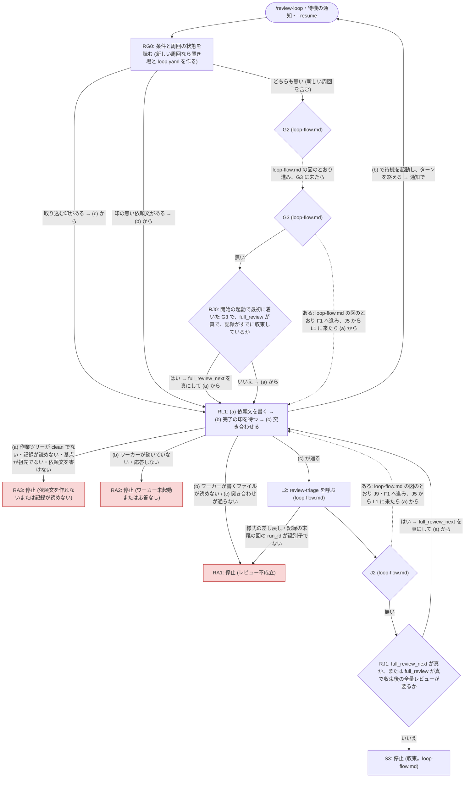

# 差し替えた部分の流れと、追加の停止

**このファイルが、`review-loop` が `review-triage-loop` の周回から差し替えた部分のノードと遷移 (図) と、追加の判定ノード RJ0・RJ1 と停止ノード RA1〜RA3 の条件と報告 (決定表)、どの停止でも書き換えるもの、RA1 から再開する手順の正本。** 差し替えないノードとその遷移は [loop-flow.md](../../review-triage-loop/references/loop-flow.md) の図が正本で、ここでは言い直さない。規律は `loop-flow.md` の冒頭と同じ — 図が遷移の正本、決定表が条件と報告の正本で、散文はノード ID で参照する。

- ID の接頭辞を `R` にするのは、`loop-flow.md` に将来足されるノード (`S7` など) と衝突させないため。
- 図の ID 集合 (RG0・RL1・RJ0・RJ1・RA1・RA2・RA3) と決定表の ID 集合は 1:1。RG0 と RL1 の決定表は [round.md](round.md)、RJ0・RJ1 と RA1〜RA3 の決定表はこのファイルにある。**同梱の `triagecheck` はこのファイルを検査しない** — 人手で照合する。
- 図の `IN` は周回に入る起点 (スキルの起動・待機の通知・`--resume`) を示す印で、ノード ID ではない (決定表の行を持たない)。
- 図の G2・G3・L2・J2・S3 は `loop-flow.md` のノードで、そこから先は `loop-flow.md` の図に従う (F1 から J5 を経て L1 に戻ったら、L1 の代わりに RL1 に入る)。**ただし G3 の「無い」の先と J2 の「無い」の先は、この図に従う** (RJ0・RJ1。収束後の全量の回に進むかを決める)。

## 図

**RJ0 と RJ1 は、「はい」でも「いいえ」でも行き先の違いは次の依頼文の範囲だけで、「はい」なら `loop.yaml` の `full_review_next` を真にしてから RL1 の (a) に入る。** RL1 の (a) は、この印が真なら全量の依頼文を書く ([round.md](round.md) の RL1 の手順 a の 4)。「はい」を印として `loop.yaml` に書くのは、依頼文を書く前に分が変わるのを待つ (手順 a の 5) ときにターンが終わっても、全量にするという判断が失われないようにするため。`--resume --full-review` の印 ([arguments.md](arguments.md) の「様式」) と同じキーを使う。

**RG0 から RL1 と G2 への分岐の中身 (取り込む印・印の無い依頼文の探し方、通知の重複の扱い) の正本は [reentry.md](reentry.md) の「再入の手順」。** 周回の終了 (`--end` と、人間が直接置いた `end`) は停止ではなく周回の外の手順で、図に含めない (正本は [SKILL.md](../SKILL.md) の「終了」)。

## 停止のときに書き換えるもの

**どの停止ノード ([loop-flow.md](../../review-triage-loop/references/loop-flow.md) の S2〜S6 と、下の RA1〜RA3) でも、`loop.yaml` を `state: stopped`・`stop_reason: "<ID>: <1 行の理由>"`・`full_review_next: false` にしてから報告する。** `full_review_next` を偽に戻すのは、起動ごとの指定を次の起動に持ち越さないため。**真のまま止まったら、報告に「全量の回を行わずに止まった」ことと、全量で行うには `--resume --full-review` を打つことを書く。** **ワーカーは止めない** — 待機を続けるので、人間が直して `--resume` すれば、起動し直さずに続けられる (ワーカーが期限切れで終了しておらず、直し方がワーカーの起動し直しを求めていなければ。起動し直すのは、下の「RA1 から再開する手順」の 2 に当たるとき)。

## 決定表 (RJ0・RJ1)

**RJ0 と RJ1 は、収束後の全量の回に進むかを決める。** 要否の規則と、収束後の全量の回を上限に数えなくても周回が止まる理由の正本は [review-request.md](../../review-triage/references/review-request.md) の「収束後の全量レビューと、その要否」— ここでは言い直さない。

| ID | 種類 | 条件 | 報告に書くもの |
| --- | --- | --- | --- |
| RJ0 | 判定 | 次の 3 つがすべて成り立つか。**(1) この起動が開始 (`/review-loop`) で、G2 から最初に G3 の「無い」に着いた** — `--resume` の起動と、同じ起動で 2 度目以降に着いたときは「いいえ」。`--resume` で次の回を全量にするのは `--resume --full-review` の印で、ここを通すと要らない状態の周回を再開するたびに全量の回が走る。**(2) `loop.yaml` の `review.full_review` が真。(3) 記録がすでに収束している** — 記録に回があり、最後の回の採択 (`verdict: adopted`) が 0 件で、その回の `head` から HEAD までに記録の置き場の外の変更が無い (判定の仕方は要否の 2 つ目の条件と同じ)。**要否の規則は見ない** — すでに収束した記録で `--full-review` を付けて始めたのは明示の指定である。これが無いと、S3 の報告が案内する「別のモデルで `--full-review` を付けた新しい周回」は、範囲の空の増分の回を 1 回走らせ (上限に数える)、要らないときは全量の回を行わずに止まる。まだ収束していない記録なら「いいえ」で、全量の回は収束の後に RJ1 が決める | — |
| RJ1 | 判定 | `loop.yaml` の `full_review_next` が真か、または `review.full_review` が真で、要否の規則で収束後の全量レビューが要るか。**上限 (J5) を見ない** — 行き先の全量の回は上限に数えないので、J5 に通しても判定は変わらない。「いいえ」の S3 の報告に書くものは、下の「停止の報告に足すもの」の「S3 のとき」 | — |

## 決定表 (RA1〜RA3)

| ID | 種類 | 条件 | 報告に書くもの |
| --- | --- | --- | --- |
| RA1 | 停止 | レビュー不成立。完了の印が `failed`・突き合わせ ([round.md](round.md) の RL1 の手順 c) が通らない・`review-triage` が結果の様式を差し戻した・`review-triage` の後に記録の末尾の回の `run_id` が識別子でない・ワーカーが書くファイル (`worker.yaml`) が読めない | その回の識別子と、不成立の理由 (印の `error`、または食い違った項目と両方の値)。結果ファイルとログの有無と絶対パス。**止めたもの (拒否の規則・auto モードの判定・安全のための検査・サンドボックス・権限モードの指定の食い違い・実効の権限モードの食い違い・ワーカーのバージョン) があれば、止めたものごとに、下の「RA1 の報告の、止めたものごとの項目」の項目と直し方。** 作業ツリーや置き場に残ったファイル (印の `error` の `tree not clean` と `loop dir modified` の一覧) があれば、その一覧と、片付けるのは人間であること。**`loop.yaml` の `rejected` にその回の識別子を追記する** (`worker.yaml` が読めないときのように、不成立にした回の識別子が無いときは追記しない)。`--resume` で同じ回を新しい依頼文でやり直すことと、そのための手順 (下の「RA1 から再開する手順」のうち、止めたものに要るもの)。**その回が、記録に回がある状態の全量の回 (依頼文の scope が `full`) なら、3 の `--resume` を「全量でやり直すには `--resume --full-review` を打つ」と書く** — `full_review_next` は依頼文を書いた時点で偽に戻っているので、`--resume` だけでは増分の回になる |
| RA2 | 停止 | ワーカー未起動または応答なし。ワーカーが期限までに起動しない・起動時の確認が通らなかった・期限切れで終了した・割り込みなどで終了した・ファイルの更新時刻が止まった (プロセスが無くなった)・待ち直しても印が現れない | 待った識別子と経過時間。`worker.yaml` の `state` と、ファイルの更新時刻の古さ (無ければ「未起動」)、`unavailable` なら `error`。停滞 (`worker stale`) のときは、**残ったレビュアの実行を待たずに、ワーカーを起動し直してよい**こと — 起動し直したワーカーは、前の起動の作業場所の中を cwd にして残ったプロセス (レビュアの実行とその Bash の子) を止め、作業場所を消してから、同じ依頼文をもう一度レビューする (正本は [worker.md](worker.md) の「起動時の確認」の 2)。レビュアの実行は置き場に書かない ([loop-files.md](loop-files.md) の「ファイルの一覧」) ので、残った実行が置き場の結果を書き換えることもない。印の無い依頼文の有無。ワーカーの起動コマンド ([guide-template.md](guide-template.md)) — `error` が「別の worktree」「別の作業ツリー」なら、作業側の作業ツリー (`repo_dir`) で起動し直すことを強調する。**起動し直せば、ワーカーは印の無い依頼文から続けること**と、その後に `--resume` を打つこと |
| RA3 | 停止 | 依頼文を作れないまたは記録が読めない。作業ツリーが clean でない・記録が読めない・増分の基点 (記録の最後の回の `head`) が HEAD の祖先でない・`review-request` が識別子の衝突以外の理由で依頼文を書かなかった | 何を片付ければよいか — 汚れたファイルの一覧、記録のパスと読めない理由、基点の SHA と現在の HEAD、`review-request` が報告した理由。基点が祖先でないときは、周回の間に履歴を書き換えた (reset・rebase・squash) ことが原因であり、どう続けるか (履歴を戻す、記録をどう扱うか) は人間が決めること |

## RA1 の報告の、止めたものごとの項目

**RA1 の回を止めたものが次の表のどれかなら、止めたものごとに表の項目を書き、直し方を添える。** 直し方は、[worker.md](worker.md) の「止められたときの直し方」の表の、同じ止めたものの行の「直し方」を報告に写す (ここでは言い直さない)。1 つの回を複数のものが止めていれば、すべて書く。

| 止めたもの | 報告に書く項目 | 再開の手順 (下の「RA1 から再開する手順」) |
| --- | --- | --- |
| 拒否の規則 | 拒まれた呼び出しごとに、ツール名・入力の要点・拒否の理由・当たった規則の名前 | 3。レビュー対象のブランチの `.claude/settings.json` の規則を直すなら 1 と 3 |
| auto モードの判定 | 拒まれた呼び出しごとに、ツール名・入力の要点・拒否の理由 | 3。許可の一覧を足した起動コマンドを使うなら 2〜4 |
| 安全のための検査 | 同上 | 3 |
| サンドボックス | 止められた呼び出しごとに、コマンドと、止められたパスかホスト (印の `sandbox_blocked.calls` の `command` と `message`)。足す値の候補 | 1〜4 |
| 権限モードの指定の食い違い | 印の `permission_mode.specified` と `loop.yaml` の `worker.permission_mode` | 2〜4 |
| 実効の権限モードの食い違い | 印の `error` にある、期待したモードと実際のモード。印の `model.specified` と `model.effective` | 3 |
| ワーカーのバージョン | 印の `worker_version` (キーが無ければ、無いこと) | 2〜4 |

- **拒否の理由**は、ログの `type` が `user` の行にある、`is_error` が真の `tool_result` の文面をそのまま引く。
- **拒否が、拒否の規則・auto モードの判定・安全のための検査のどれによるものか**は、拒否の理由と、ワーカーに渡した許可と拒否の規則から決める。拒まれた入力が拒否の規則 ([worker.md](worker.md) の「拒否の規則」の表の規則と、利用者の設定・レビュー対象のブランチの `.claude/settings.json` の拒否の規則) に当たれば、拒否の規則。ワーカーに渡した許可の規則 (`Bash(git diff:*)` など) に当たるのに拒まれていれば、安全のための検査。どちらでもなければ、auto モードの判定。ワーカーに渡した許可は、`worker.yaml` の `pid` について `ps -o command= -p <pid>` で起動引数を読んで確かめる (推測しない)。決められなければ、決められないことと拒否の理由を書く。
- **権限モードが `auto` でない周回** (`default` で始めた周回など) では、許可の一覧に無い呼び出しが、判定を経ずに拒否される。その拒否は auto モードの判定の行として扱う。
- **許可の一覧を足した起動コマンド**は、auto モードの判定の拒否を、判定の前に許す規則を足せば直せると見たときに、案として書く (足すかどうかは人間が決める)。その規則を `--allowed-tools` に足したもので、`loop.yaml` の `worker.allowed_tools` が空ならデフォルトの一覧 ([worker.md](worker.md) の「既定の許可の一覧」) も並べる (理由は [worker.md](worker.md) の「起動の仕方」の表の `--allowed-tools` の行)。
- **足す値の候補** (サンドボックス) は、止められたのがパスなら、確認に使ったツールが書く場所 (Go のビルドのキャッシュ `~/Library/Caches/go-build` など) のうち、許してよい最も狭いもの。ホーム・作業側・周回の置き場・環境変数 `TMPDIR` の実体と、それらの祖先、作業側と周回の置き場の下の場所は候補にしない (ワーカーが起動時の確認で止める。[worker.md](worker.md) の「起動時の確認」の 12)。ホストなら、そのホスト。設定では直せないエラー (どれに当たるかは [worker.md](worker.md) の「止められたときの直し方」の表の「サンドボックス」の行) なら候補を書かない。足すかどうかは人間が決める。

## RA1 から再開する手順

**RA1 の報告には、次の手順のうち、止めたものに要るもの (上の表の「再開の手順」) を、番号を付けて書く。** 書き込みを許す場所と接続を許すドメインは、`--resume` のたびに作業側が設定から読み直す (正本は [arguments.md](arguments.md) の「様式」) ので、サンドボックスが止めた周回も、終えずに直して続けられる。

1. **作業ツリーの中の設定を直したら、コミットする。** サンドボックスが止めたときは、[worker.md](worker.md) の「止められたときの直し方」の表の「サンドボックス」の行のとおり、設定に足す (設定のファイルは `.claude/akm-claude-plugins/review-triage/config.json`。キーの正本は [project-config.md](../../review-triage/references/project-config.md) の「`review_loop`」)。**コミットを省かない** — 設定のファイルは git が追跡しているので、コミットしないと作業ツリーが clean でなくなり、`--resume` の後に依頼文を書く前の確認で RA3 になる。
2. **ワーカーを起動し直すなら、動いているワーカーを止める** (ワーカーの端末で Ctrl-C)。起動し直すのは、1 で書き込みを許す場所か接続を許すドメインを足したとき、権限モードの指定の食い違いとワーカーのバージョンのとき、許可の一覧を足した起動コマンドを使うとき。**ワーカーは起動したときの値で動き続ける** — 止めずに `--resume` すると、次の回も前の値でレビューされ、同じものに止められる。
3. **`--resume` を打つ。** 作業側は、書き込みを許す場所と接続を許すドメインを設定から読み直して `loop.yaml` に書き、RA1 の回をやり直す新しい依頼文を書く。ワーカーが動いていなければ、読み直した値で組み立てた起動コマンドを案内して待つ。
4. **3 で案内された起動コマンドでワーカーを起動する** (2 で止めたとき)。停止の報告に書いた起動コマンドは、読み直す前の値で組み立てたものなので使わない。許可の一覧を足すときは、3 で案内された起動コマンドの `--allowed-tools` を、報告に書いた起動コマンドのものに置き換えて使う。

## 停止の報告に足すもの

**停止の報告の全体は [reporting.md](../../review-triage-loop/references/reporting.md) の「必ず出すもの」の 6 項目で、S2〜S6 ごとに足すものは [loop-flow.md](../../review-triage-loop/references/loop-flow.md) の決定表の「報告に書くもの」。** 1 の「止まった理由」には RA1〜RA3 も入る。この周回では、どの停止 (S2〜S6・RA1〜RA3) でも次を足す。

| 項目 | 書くもの |
| --- | --- |
| 周回 | 周回の id と、置き場の絶対パス |
| ワーカー | `worker.yaml` の `state` と、ファイルの更新時刻の古さ (キー `updated` ではない。読み方の正本は [loop-files.md](loop-files.md) の「`worker.yaml`」。無ければ「未起動」)、この起動でワーカーが応じた回の数 (`rounds_served`) |
| 印の無い依頼文 | 有無と、あれば識別子 |
| 再開のしかた | この起動が `--resume` で `active` の周回を再開したものなら、前のセッションが報告せずに終わったこと (開始の報告の正本は [reentry.md](reentry.md) の「`--resume` の開始の報告」) |
| 回数 | この起動で回した回数と上限 (reporting.md の 2)、この起動で行った収束後の全量の回の数 (上限に数えない回。数える場所は [round.md](round.md) の RL1 の手順 a の 7)、周回全体でワーカーが応じた回数 (置き場の完了の印の数)。**reporting.md の 2 と loop-flow.md の S2 の行が「レビューを 1 回も走らせずに止まった (回した回数が 0)」とするのは、この周回では、数えた回数と収束後の全量の回の数がどちらも 0 のときだけと読む** — 数えた回数が 0 でも、収束後の全量の回を行っていれば (RJ0 か `--resume --full-review` による最初の回)、その回がレビューを走らせたので、推移を出す |
| 次にできる操作 | `--resume` (止まった理由を片付けた後)・`--end` (周回を終える)・S2 なら `review-triage-fix` を単独で起動して答えること (答えの渡し先の正本は loop-flow.md の S2 の行) |
| ワーカーの起動コマンド | [guide-template.md](guide-template.md) の形。ワーカーが動いていても書く (端末を閉じた後に起動し直すときに使う) |
| S3 のとき | 収束後の全量レビューの要否 (規則の正本は [review-request.md](../../review-triage/references/review-request.md) の「収束後の全量レビューと、その要否」) と、この周回での行い方。**要るとき**: `--resume --full-review` (同じ条件で次の回を全量にする) と、勧めるモデル ([reporting.md](../../review-triage-loop/references/reporting.md) の 6) で `--full-review` を付けて始める新しい周回 (`--end` の後)。**要らないとき**: 推奨 (正本は、要否と同じ review-request.md の節) に従う手段として、別のモデルか effort で `--full-review` を付けて始める新しい周回 (RJ0 により最初の回が全量になる) と、`review-request --full-review` で依頼文を作る手段を書く。`review.full_review` が真の周回が S3 に来るのは要らないときだけ (要るときは RJ1 が全量の回に進む)。行うかどうかは人間が決める |
