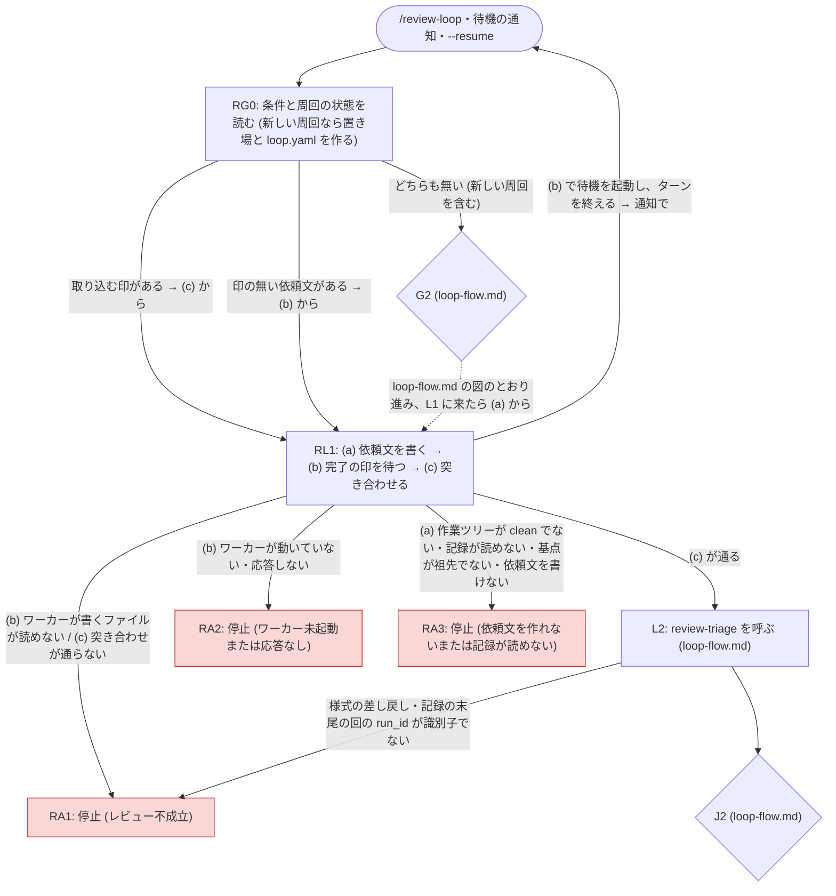

# 差し替えた部分の流れと、追加の停止

**このファイルが、`review-loop` が `review-triage-loop` の周回から差し替えた部分のノードと遷移 (図) と、追加の停止ノード RA1〜RA3 の条件と報告 (決定表)、どの停止でも書き換えるものの正本。** 差し替えないノードとその遷移は [loop-flow.md](../../review-triage-loop/references/loop-flow.md) の図が正本で、ここでは言い直さない。規律は `loop-flow.md` の冒頭と同じ — 図が遷移の正本、決定表が条件と報告の正本で、散文はノード ID で参照する。

- ID の接頭辞を `R` にするのは、`loop-flow.md` に将来足されるノード (`S7` など) と衝突させないため。
- 図の ID 集合 (RG0・RL1・RA1・RA2・RA3) と決定表の ID 集合は 1:1。RG0 と RL1 の決定表は [round.md](round.md)、RA1〜RA3 の決定表はこのファイルにある。**同梱の `triagecheck` はこのファイルを検査しない** — 人手で照合する。
- 図の `IN` は周回に入る起点 (スキルの起動・待機の通知・`--resume`) を示す印で、ノード ID ではない (決定表の行を持たない)。
- 図の G2・L2・J2 は `loop-flow.md` のノードで、そこから先は `loop-flow.md` の図に従う (F1 から J5 を経て L1 に戻ったら、L1 の代わりに RL1 に入る)。

## 図

**RG0 から RL1 と G2 への分岐の中身 (取り込む印・印の無い依頼文の探し方、通知の重複の扱い) の正本は [reentry.md](reentry.md) の「再入の手順」。** 周回の終了 (`--end` と、人間が直接置いた `end`) は停止ではなく周回の外の手順で、図に含めない (正本は [SKILL.md](../SKILL.md) の「終了」)。

## 停止のときに書き換えるもの

**どの停止ノード ([loop-flow.md](../../review-triage-loop/references/loop-flow.md) の S2〜S6 と、下の RA1〜RA3) でも、`loop.yaml` を `state: stopped`・`stop_reason: "<ID>: <1 行の理由>"` にしてから報告する。ワーカーは止めない** — 待機を続けるので、人間が直して `--resume` すれば、起動し直さずに続けられる (ワーカーが期限切れで終了していなければ)。

## 決定表 (RA1〜RA3)

| ID | 種類 | 条件 | 報告に書くもの |
| --- | --- | --- | --- |
| RA1 | 停止 | レビュー不成立。完了の印が `failed`・突き合わせ ([round.md](round.md) の RL1 の手順 c) が通らない・`review-triage` が結果の様式を差し戻した・`review-triage` の後に記録の末尾の回の `run_id` が識別子でない・ワーカーが書くファイル (`worker.yaml`) が読めない | その回の識別子と、不成立の理由 (印の `error`、または食い違った項目と両方の値)。結果ファイルとログの有無と絶対パス。拒まれたツールがあれば、その名前と、`--allowed-tools` に足した起動コマンド。作業ツリーや置き場に残ったファイル (印の `error` の `tree not clean` と `loop dir modified` の一覧) があれば、その一覧と、片付けるのは人間であること。**`loop.yaml` の `rejected` にその回の識別子を追記する** (`worker.yaml` が読めないときのように、不成立にした回の識別子が無いときは追記しない)。`--resume` で同じ回を新しい依頼文でやり直すこと |
| RA2 | 停止 | ワーカー未起動または応答なし。ワーカーが期限までに起動しない・起動時の確認が通らなかった・期限切れで終了した・割り込みなどで終了した・ファイルの更新時刻が止まった (プロセスが無くなった)・待ち直しても印が現れない | 待った識別子と経過時間。`worker.yaml` の `state` と、ファイルの更新時刻の古さ (無ければ「未起動」)、`unavailable` なら `error`。印の無い依頼文の有無。ワーカーの起動コマンド ([guide-template.md](guide-template.md)) — `error` が「別の worktree」「別の作業ツリー」なら、作業側の作業ツリー (`repo_dir`) で起動し直すことを強調する。**起動し直せば、ワーカーは印の無い依頼文から続けること**と、その後に `--resume` を打つこと |
| RA3 | 停止 | 依頼文を作れないまたは記録が読めない。作業ツリーが clean でない・記録が読めない・増分の基点 (記録の最後の回の `head`) が HEAD の祖先でない・`review-request` が識別子の衝突以外の理由で依頼文を書かなかった | 何を片付ければよいか — 汚れたファイルの一覧、記録のパスと読めない理由、基点の SHA と現在の HEAD、`review-request` が報告した理由。基点が祖先でないときは、周回の間に履歴を書き換えた (reset・rebase・squash) ことが原因であり、どう続けるか (履歴を戻す、記録をどう扱うか) は人間が決めること |

## 停止の報告に足すもの

**停止の報告の全体は [reporting.md](../../review-triage-loop/references/reporting.md) の「必ず出すもの」の 6 項目で、S2〜S6 ごとに足すものは [loop-flow.md](../../review-triage-loop/references/loop-flow.md) の決定表の「報告に書くもの」。** 1 の「止まった理由」には RA1〜RA3 も入る。この周回では、どの停止 (S2〜S6・RA1〜RA3) でも次を足す。

| 項目 | 書くもの |
| --- | --- |
| 周回 | 周回の id と、置き場の絶対パス |
| ワーカー | `worker.yaml` の `state` と、ファイルの更新時刻の古さ (キー `updated` ではない。読み方の正本は [loop-files.md](loop-files.md) の「`worker.yaml`」。無ければ「未起動」)、この起動でワーカーが応じた回の数 (`rounds_served`) |
| 印の無い依頼文 | 有無と、あれば識別子 |
| 回数 | この起動で回した回数と上限 (reporting.md の 2)、周回全体でワーカーが応じた回数 (置き場の完了の印の数) |
| 次にできる操作 | `--resume` (止まった理由を片付けた後)・`--end` (周回を終える)・S2 なら `review-triage-fix` を単独で起動して答えること (答えの渡し先の正本は loop-flow.md の S2 の行) |
| ワーカーの起動コマンド | [guide-template.md](guide-template.md) の形。ワーカーが動いていても書く (端末を閉じた後に起動し直すときに使う) |
| S3 のとき | 最終確認の全量をワーカーに頼まないこと (最終確認がまだであることは loop-flow.md の S3 の行のとおり書く)。全量でレビューするかどうか・どこで走らせるかは人間が決める |
