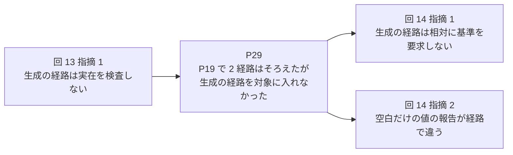

# 俯瞰: 繰り返しを図で確かめて捉え直す

**このファイルが、俯瞰 — `review-triage` が検知した「同じ型の指摘の繰り返し」を、指摘ごとの原因を確かめる前に人間と図で確かめ、捉え直すか否定するかを決める作業 — の正本。** 検知する側の判断は [review-triage の recurrence-detection.md](../../review-triage/references/recurrence-detection.md)、記録に書く形 (`runs[].recurrence` のキーと状態) は [record-schema.md](../../review-triage/references/record-schema.md) の「検知」「根拠」「捉え直し」の表、用語 (修正由来の指摘・捉え直し) は [CONCEPTS.md](../../../../CONCEPTS.md) の「レビューの収束」が正本で、ここでは言い直さない。

俯瞰は 2 段で進める。**先に履歴の連鎖を見せて、繰り返していること自体を人間と確認する。次に構造の軸を見せて、繰り返しを生んでいる形を人間と確認する。** どちらの段も、スキルは問いを出し、人間の答えで図を直す。スキルが先に見立て (繰り返しの源と修正の単位についてのスキルの案) を出さないのは、人間が図を確認していく途中で、指摘の並びからは見えなかった形に気づく余地を残すためである。

## 対象の選び方

**対象は、`recurrence.status: detected` のまま `declined_reason` も `reframe` も無い回 (未処理の検知) のうち、最も古い 1 つ。** 全回の `recurrence` を 1 パスで見て決める。

- **未処理の検知が複数の回にあれば、最も古い回を対象にし、残りの回を報告に書く。** 1 つの俯瞰が済んで記録に書いてから、次の回を同じ手順で扱う。2 つの回を 1 つの図にまとめない — 別の回の検知は別の根拠を持ち、片方だけ否定される場合がある。
- **俯瞰の途中の状態は記録に持たない。** 人間の回答を待つ間にセッションが切れても、記録には `detected` しか残らない。次に読んだときは、途中まで進んだ図を復元せず、第 1 段からやり直す。専用の状態 (`awaiting-human` のようなもの) を足すより、状態の種類を増やさないほうを取る。
- 未処理の検知が無ければ、俯瞰は行わず [SKILL.md](../SKILL.md) の次の手順に進む。

## 第 1 段: 履歴の連鎖

### 図

回ごとの「指摘 → 修正計画 → 次の回の指摘」を辺でつないだ図を出す。**根拠 (`recurrence.evidence`) の 1 件を 1 本の辺にする** — `prior_run` の `prior` (問題の識別子、採択、または捉え直し) から、今回の `finding_id` の指摘へ引く。節点は次のとおりに書く。

| 節点 | 書くもの | 出どころ |
| --- | --- | --- |
| 指摘 | 回の番号・指摘の番号・`summary` の要旨 (1 行) | その回の `findings[]` |
| 修正計画 | `problem_id` と `cause` の要旨 (1 行) | その回の `plans[]` |
| 捉え直し | 回の番号・`reframe.pattern` と `fix_unit` の要旨 (1 行) | その回の `recurrence.reframe` |

根拠が指す回より前の回も、同じ型の指摘と修正計画が続いているなら辺を足してよい。ただし**足した辺には「根拠の外」と分かる印を付ける** — 検知の根拠と、スキルが図を描くときに補った読みを、人間が区別できるようにするため。

### 問い

図に添える問いは 1 つ。**「繰り返していると認めますか。」** 辺の読み (どの修正がどの指摘を生んだか) に誤りがあれば直してもらう。

### 認めないとき

人間が「繰り返しではない」と答えたら、`status: declined` と `declined_reason` (人間の答えを 1〜2 文で) を記録の対象の回に書いて俯瞰を終える。捉え直しは書かない。束ねは従来どおり、指摘ごとの原因で行う ([grouping.md](grouping.md))。**検知と否定の両方が記録に残る** — 誤検知だったことを、後から検知の条件を見直す材料にするため。

## 第 2 段: 構造の軸

第 1 段で人間が繰り返しを認めたら、繰り返しを生んでいる構造を図にする。

### 図

**同じ入力が別々に処理される軸を取り出し、軸の組み合わせを表にして、埋まっているマスと空いているマスを示す。** 軸の例は「規則 × 経路」(同じ規則を、処理の経路ごとに別々に書いている) や「正本 × 複製」(同じ主張を、正本と複製の側で別々に直している)。第 3 の軸 (入力の種類など) が要るときは、表を軸の値ごとに分けて複数出す。

表のマスには、どの回のどの指摘でそのマスが埋まったかを書く。**空いているマスは、まだ指摘されていないが同じ型の指摘が出うる場所である。** それが見えることで、修正の単位を「指摘された 1 マス」から「表そのもの」に変える判断ができる。

表は Markdown の表で書けば足りる。mermaid で描くなら、軸を節点、マスを辺にした図でもよい。

### 問い

図に添える問いは確認だけにとどめる。

- 「この関係は合っていますか。」
- 「違和感のあるところはどこですか。」
- 「この軸の他に、同じ入力が別々に処理されている軸はありますか。」

**「源はここだ」「こう直すべきだ」のような見立ては、この段では出さない** (出す条件は次の節)。人間の答えで図を直し、直した図をもう一度出して、合意するまで繰り返す。

## 見立てを出す条件

**見立ては、人間が出せないときだけ出す。** 次のどちらかに限る。

- 人間が「出せない」「分からない」と答えた。
- 問いが尽きて、確認が進まなくなった (図を直しても人間の答えが変わらず、合意にも否定にも至らない)。

出すときは**「これは見立てです」と明示して**、繰り返しの源 (根本の原因) と修正の単位の案を出す。人間が認めた場合だけ捉え直しにし、記録の `reframe.source` を `skill` にする。人間の確認から出た捉え直しは `source: human`。**見立てを出した後でも、人間が認めなければ捉え直しにしない** — 認められなかった見立ては、その旨を報告に書き、第 2 段の確認に戻るか、人間の判断で俯瞰を終える (`declined`)。

## 記録に書く

合意したら、記録の対象の回に `status: reframed` と `reframe` (`pattern` / `axes` / `root_cause` / `fix_unit` / `source`) を書く。**キーの意味と例の正本は [record-schema.md](../../review-triage/references/record-schema.md) の「捉え直し」の表** — ここには写さない。

**記録に書いてから束ねに進む。** サマリを再生成し、記録とサマリをコミットする (コミットの分け方の正本は [記録 README のコミット節](../../review-triage/references/record-schema.md#コミット))。否定 (`declined`) のときも同じ。修正計画 (`plans`) と同じく、途中で止まっても記録に残っていない合意を作らないためである。

## 束ねへの引き継ぎ

捉え直しがある回では、[SKILL.md](../SKILL.md) の以降の手順を次のとおりに読み替える。

- **原因を確かめて束ねるとき、指摘ごとの原因より `reframe.root_cause` を優先する。** 修正計画の `cause` は捉え直しの原因を指す (基準の正本は [grouping.md](grouping.md) の「捉え直しがあるとき」)。
- **修正の単位は `reframe.fix_unit` にする。** 表の空いているマスを 1 つずつ埋める修正にしない。
- **同じ原因の別の現れは、指摘されていなくても問題に含める。** 表の空いているマスがその候補で、探し方の正本は [investigation.md](investigation.md) の「構造・役割で探す」。
- **捉え直しの型に当たらない採択は、通常どおり指摘ごとの原因で束ねて別の問題にする。** 捉え直しに無理に含めない。

## 図の提示

**図の出し方の方針 (Markdown が判断の材料の正本、HTML は任意の表示形式、`mermaid-preview` は別のプラグインで無ければ図は出せない、図は正本ではない) の正本は [hold-presentation.md](../../review-triage/references/hold-presentation.md)** — 保留の提示と同じ方針で、ここには写さない。俯瞰に固有なのは次の 3 点だけ。

- 第 1 段の連鎖と第 2 段の表は、会話の中に Markdown (mermaid のフェンスと表) で出し、人間が Markdown だけで答えられる形にする。記録には図を残さず、合意した結果 (`recurrence`) だけを書く。
- `mermaid-preview` が入っていない、または実行の途中で失敗した (生成できない・描画されない) ときは、**その段から Markdown の表と箇条書きで同じ内容を出して俯瞰を続け、図が無いことを報告に書く。**
- 報告では「プラグインが入っていない」と「入っているが実行時に失敗した」を区別して書く — 前者は導入で直り、後者は環境 (CDN への到達など) の問題で、次に取る手が違う。

## 実例: 規則 × 経路 × フラグ

17 回の記録 ([fix-triagecheck-explicit-path-must-exist.yaml](../../../../docs/review-triage/fix-triagecheck-explicit-path-must-exist.yaml)) の回 7〜14 で、パスの規則が `triagecheck` の 3 つの経路 (検査 / `-write-summary` / `-install-wrapper`) に別々に書かれていた。検査の経路には回 1〜6 で規則が入り、回 7 以降の採択は、残りの 2 経路のマスを 1 つずつ埋める形で続いた。第 2 段の表として書き直すと次のようになる (マスの中は、そのマスが埋まった回と指摘、束ねた修正計画)。

| 規則 \ 経路 | 検査 | `-write-summary` | `-install-wrapper` |
| --- | --- | --- | --- |
| 空のパスを弾く | 回 6 まで (不可視文字は回 13 の P29 で 3 経路とも) | 回 7 (P19) | 回 9 指摘 2 (P26)、回 10 指摘 1 (P28)、回 11 指摘 1 (P29)、回 14 指摘 2 (P31) — 空文字、空白だけ、不可視文字、報告の文言、と 1 マスがさらに細かく分かれて埋まった |
| 相対パスに基準を要求する | 回 6 まで | 回 7 指摘 1 (P19) | 回 14 指摘 1 (P31) |
| 実在を要求する | 回 6 まで | 回 7 (P19) | 回 13 指摘 1 (P29) |
| 使われない基準を弾く | 回 6 まで | 回 7 (P19) | 回 7 指摘 5 (P19。併用禁止という特例で埋めた) |

回 13 の P29 は「生成の経路を対象に入れなかった」と 1 列を原因に書いたが、修正の単位はまだ「実在の検査」という 1 マスだった。回 14 の P31 で初めて、原因を「経路の分岐より前に規則を当てる場所が無く、規則を 1 つ足すたびに経路ごとの例外処理が要る」と表そのものに置き、修正の単位を「分岐の前で規則を 1 か所で当て、特例を外す」にした。この記録に俯瞰の手順があれば、回 7 の時点で第 2 段の表を出し、この単位に至れたはずである — 記録の回数は実測であって、俯瞰を行う回数の基準ではない。
