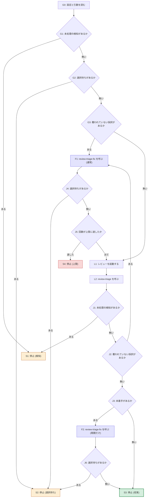

# 周回の流れ

**このファイルが、`review-triage-loop` の周回の状態機械の正本。** 役割の分担は [review-triage の judgment-flow.md](../../review-triage/references/judgment-flow.md) と同じ。

- **図 (mermaid) が、ノードと遷移の正本。** 順序・分岐・優先はここだけが定める — 同時に成立しうる条件の優先は、図の分岐の順序として現れる。散文の「優先の規則」は持たない。
- **決定表が、各ノードの条件 (記録のどこを見るか) と、止まったときに報告に書くものの正本。** 遷移先の列は持たない (行き先は図が正本)。
- **散文 ([SKILL.md](../SKILL.md)・[reporting.md](reporting.md)) はノード ID で参照し、順序・分岐・量化子を言い直さない。** このスキルの最初の試行では、手順・入口の関門・優先の規則・報告・`review-triage-fix` の終了条件がそれぞれ散文で遷移を言い直し、条件を 1 つ足すたびに他との組み合わせが抜けて、全量レビュー 6 回のうち 5 回で同じ領域に指摘が続いた (記録: `docs/review-triage/feat-review-triage-loop.yaml` の回 11〜16)。
- 図のノード ID 集合と決定表の ID 集合は 1:1。**judgment-flow.md と違い、同梱の `triagecheck` はこのファイルを検査しない** — 検査の拡張は別の課題で、それまでは人手で照合する。

## 方針

- **判定の材料は記録 YAML であって、スキルの報告の文面ではない。** 報告は要約なので、`recurrence` や `awaiting-human` の有無を取りこぼしうる。
- **走査はすべて全回 (`runs[]` の全要素) を対象にする。** `review-triage-fix` の手順 1 が全回を 1 パスで見るので、周回が今回の回だけを見ると、過去の回に残ったものを見落として `review-triage-fix` に渡し、そちらで止まる。
- **人間の回答を待つ状態 (検知・選択待ち) は、修正に進ませずに止める。** 入口 (G1・G2) でも周回の途中 (J1・J4・J6) でも同じ。
- **未着手 (`status: pending`) は止まる理由にしない。** `review-triage-fix` が中断した合図なので、再開させる (F2)。

## 図 (ノードと遷移の正本)

**遷移の順序と優先は図だけが定める。** 図の外で言い直さない — 言い直した散文が図と食い違った実例が記録の回 17 にある。

## 決定表 (各ノードの条件と書くものの正本)

| ID | 種類 | 条件・内容 | 報告に書くもの |
| --- | --- | --- | --- |
| G0 | 手順 | 設定 (`config.json` の `loop`) と引数を読んで周回の条件を決める。決め方の正本は [arguments.md](arguments.md)、キーと既定は [project-config.md](../../review-triage/references/project-config.md) の「`loop`」 | 決まった条件 (上限・レビュースキル・そのオプション・実効モデル。`ce-code-review` で指定が空でなければ、効かない旨も) を周回の開始前に出す |
| G1 | 判定 | 全回の `recurrence` に、`status: detected` のまま捉え直しも否定も書かれていない回があるか。記録が無ければ「無い」 | — |
| G2 | 判定 | 全回の `plans` に `status: awaiting-human` の問題があるか。記録が無ければ「無い」 | — |
| G3 | 判定 | J2 と同じ条件。**`review-triage` を単独で走らせた直後 (採択が残り `plans` がまだ無い) はここで「ある」になり、レビューの前に F1 を通る** — 先にレビューを走らせると、`review-triage` が次の回を追記した時点で前の回の被覆の免除 (正本は [record-schema.md](../../review-triage/references/record-schema.md) の `plan_ref` の行) が解け、記録の検査が失敗する | — |
| L1 | 手順 | レビューを起動する。経路・依頼文・範囲・モデルの正本は [review-invocation.md](review-invocation.md) | いま何回目か (この起動で数えた回数) と上限 |
| L2 | 手順 | `review-triage` を呼ぶ。記録への追記・サマリの再生成・コミットはそちらが行う | — |
| J1 | 判定 | G1 と同じ条件。今回の回で `review-triage` が書いた検知を含む | — |
| J2 | 判定 | 全回の `findings` に、`plans` にも `plan_ref` にも覆われていない `verdict: adopted` があるか | — |
| F1 | 手順 | `review-triage-fix` を呼ぶ。修正・検証・コミットはそちらが行う | — |
| J4 | 判定 | G2 と同じ条件。今回の回で `review-triage-fix` が書いた選択待ちを含む | — |
| J5 | 判定 | この起動で回した回数が `max_rounds` に達したか。**起動時に 0 から数える** — 記録の回数 (`runs` の要素数) ではない | — |
| J3 | 判定 | 全回の `plans` に `status: pending` の問題があるか | — |
| F2 | 手順 | `review-triage-fix` を再開だけのために呼ぶ (覆われていない採択は無い)。`review-triage-fix` の側では手順 1 で再開の対象を解決し、手順 2 (俯瞰) を経て手順 8 から続ける — 飛ばす範囲の正本は [review-triage-fix の SKILL.md](../../review-triage-fix/SKILL.md) の手順 1 | — |
| J6 | 判定 | J4 と同じ条件 | — |
| S1 | 停止 | 検知。人間の回答を待つ | `recurrence` の条件と根拠 (形の正本は [recurrence-detection.md](../../review-triage/references/recurrence-detection.md))。俯瞰 (`review-triage-fix` の手順 2) を案内し、**勝手に呼ばない**。この起動でレビューを 1 回も走らせずに止まった (回した回数が 0) ときは回数 0 と書き、推移は出さない |
| S2 | 停止 | 選択待ち。人間の回答を待つ | `status: awaiting-human` の問題と `options` (選択肢とトレードオフ)。**どの回のものかを添える** — 過去の回で返したまま回答が無いものが含まれうる。この起動でレビューを 1 回も走らせずに止まった (回した回数が 0) ときは回数 0 と書き、推移は出さない |
| S3 | 停止 | 収束。直すものが無い。**図のとおり、この枝では上限を見ない** — 直すものが無い状態で上限として報告すると、意味の無い「継続するか」の問いが出て、この行が必須とする最終確認の案内が落ちる | 採択が 0 件になった回。**「欠陥が無い」とは書かない** — そのレビュースキル・そのモデル・その範囲で指摘が出なかった、という事実に留める。保留が残っていれば件数。**最終確認の全量レビューがまだであることを必ず書く** — 周回が担う全量は最初の 1 回だけで、修正後の最終確認は周回の外にある ([review-invocation.md](review-invocation.md) の「範囲」) |
| S4 | 停止 | 上限。収束しなかった | 推移を示したうえで、**継続するか俯瞰に移るかを人間に問う**。減っていれば継続を、減っていなければ俯瞰を先に勧める (同じ型の指摘が続いている可能性が高く、`recurrence` が捉え損ねた状態でありうる)。**勝手に周回を再開しない** |

**F1 と F2 の違いは、`review-triage-fix` に何を対象として渡すかだけ。** どちらも同じスキルを呼ぶ。F2 で呼ばれた側が手順 2 で未処理の検知を見つけることは無い (J1 で止まっている) が、飛ばさない — 単独で起動されたときの経路と同じにするため。
