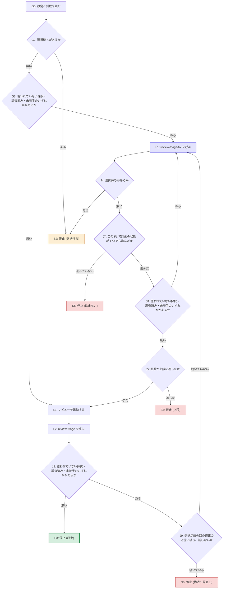

# 周回の流れ

**このファイルが、`review-triage-loop` の周回の状態機械の正本。** 役割の分担は [review-triage の judgment-flow.md](../../review-triage/references/judgment-flow.md) と同じ。

- **図 (mermaid) が、ノードと遷移の正本。** 順序・分岐・優先はここだけが定める — 同時に成立しうる条件の優先は、図の分岐の順序として現れる。散文の「優先の規則」は持たない。
- **決定表が、各ノードの条件 (記録のどこを見るか) と、止まったときに報告に書くものの正本。** 遷移先の列は持たない (行き先は図が正本)。
- **散文 ([SKILL.md](../SKILL.md)・[reporting.md](reporting.md)) はノード ID で参照し、順序・分岐・量化子を言い直さない。** このスキルの最初の試行では、手順・入口の関門・優先の規則・報告・`review-triage-fix` の終了条件がそれぞれ散文で遷移を言い直し、条件を 1 つ足すたびに他との組み合わせが抜けて、全量レビュー 6 回のうち 5 回で同じ領域に指摘が続いた (記録: `docs/review-triage/feat-review-triage-loop.yaml` の回 11〜16)。
- 図のノード ID 集合と決定表の ID 集合は 1:1。**judgment-flow.md と違い、同梱の `triagecheck` はこのファイルを検査しない** — 検査の拡張は別の課題で、それまでは人手で照合する。

## 方針

- **判定の材料は記録 YAML であって、スキルの報告の文面ではない。** 報告は要約なので、`awaiting-human` や `pending` の有無を取りこぼしうる。
- **走査はすべて全回 (`runs[]` の全要素) を対象にする。** `review-triage-fix` の手順 1 が全回を 1 パスで見るので、周回が今回の回だけを見ると、過去の回に残ったものを見落として `review-triage-fix` に渡し、そちらで止まる。
- **人間の回答を待つ状態 (選択待ち) は、修正に進ませずに止める。** 入口 (G2) でも周回の途中 (J4) でも同じ。
- **調査済み (`status: investigated`) と未着手 (`status: pending`) は止まる理由にしない。** どちらも `review-triage-fix` が段 (手順を区切った区分。定義の正本は [その SKILL.md](../../review-triage-fix/SKILL.md) の「手順」の冒頭) の区切りで中断した合図なので、入口 (G3) でも周回の中 (J2) でも、レビューより先に `review-triage-fix` を呼んで片付ける (F1) — 直していない問題が次のレビューで再び指摘されないようにするため。
- **直せないまま回り続けさせない。** `review-triage-fix` を呼んでも計画の状態が 1 つも進まなかったら、上限を待たずに止める (J7 → S5)。同じ記録から同じ呼び出しを繰り返しても、進まなかった理由 (段 3 が直せない・関門が通らない) は周回の側では変わらず、上限まで費用と時間だけが増える。
- **修正が次の指摘を生んでいる形は、上限を待たずに止める。** 採択が前の回の修正の近傍に続き、件数が減らない周回は、局所修正がその近傍に次の不整合を作っている (経緯は [#54](https://github.com/akm/claude-plugins/issues/54))。原因は直し方ではなく構造 (表の軸の取り方・同じ事実の複製) にあることが多く、上限まで回しても収束しない。判定は記録と修正コミットから機械的に行い (J9)、当たれば止めて構造の見直しを人間に問う (S6)。上限 (J5) は費用の関門、こちらは構造の関門で、役割が違う。

## 図 (ノードと遷移の正本)

**遷移の順序と優先は図だけが定める。** 図の外で言い直さない — 言い直した散文が図と食い違った実例が記録の回 17 にある。

## 決定表 (各ノードの条件と書くものの正本)

| ID | 種類 | 条件・内容 | 報告に書くもの |
| --- | --- | --- | --- |
| G0 | 手順 | 設定 (`config.json` の `loop`) と引数を読んで周回の条件を決める。決め方の正本は [arguments.md](arguments.md)、キーと既定は [project-config.md](../../review-triage/references/project-config.md) の「`loop`」 | 決まった条件 (上限・レビュースキル・そのオプション・実効モデル。`ce-code-review` で指定が空でなければ、効かない旨も) と、`review-triage-fix` に渡す回数の閾値 N (設定 `fix.threshold_rounds` と引数 `--threshold` から決めた値。決め方の正本は [review-triage-fix の arguments.md](../../review-triage-fix/references/arguments.md)) と、段ごとの走らせ方 (設定 `fix.stages` と引数 `--stage` から段ごとに決めた、セッション内か sub-agent か。sub-agent なら定義名と段の実効モデル。決め方の正本は [review-triage-fix の stage-subagent.md](../../review-triage-fix/references/stage-subagent.md) の「走らせ方の決定」) を周回の開始前に出す。回 N+1 以降の段 2 は立案者の選択で決まり、ここで出した走らせ方は使われない (その旨も添える) |
| G2 | 判定 | 全回の `plans` に `status: awaiting-human` の問題があるか。記録が無ければ「無い」 | — |
| G3 | 判定 | J2 と同じ条件。**`review-triage` を単独で走らせた直後 (採択が残り `plans` がまだ無い) はここで「ある」になり、レビューの前に F1 を通る** — 先にレビューを走らせると、`review-triage` が次の回を追記した時点で前の回の被覆の免除 (正本は [record-schema.md](../../review-triage/references/record-schema.md) の `plan_ref` の行) が解け、記録の検査が失敗する。**調査済み・未着手が残ったまま周回を起動し直したときも同じ** | — |
| L1 | 手順 | レビューを起動する。経路・依頼文・範囲・モデルの正本は [review-invocation.md](review-invocation.md) | いま何回目か (この起動で数えた回数) と上限 |
| L2 | 手順 | `review-triage` を呼ぶ。記録への追記・サマリの再生成はそちらが行う (記録をコミットするかも、そちらの規範に従う) | — |
| J2 | 判定 | 全回の `findings` に、`plans` にも `plan_ref` にも覆われていない `verdict: adopted` があるか。または、全回の `plans` に `status: investigated` (調査済み・未立案) か `status: pending` (未着手) の問題があるか | — |
| J9 | 判定 | 構造の関門 k (設定 `loop.structure_rounds`、引数 `--structure-rounds`。既定と値の検査の正本は [project-config.md](../../review-triage/references/project-config.md) の「`loop`」と [arguments.md](arguments.md)) が 1 以上のとき、記録の `runs` の末尾から k 回 (この起動より前の回も含める。記録が正本) を見て、次の 2 つがともに成り立つか。**(a) 近傍に続いている**: k 回のすべてで、その回の採択 (`verdict: adopted`) が 1 件以上あり、かつその全件の `file` が、前の回の `plans[]` の `sha` (修正コミット) が変更したファイル (`git diff-tree --no-commit-id --name-only -r <sha>` で列挙。`sha` を持つ問題が無い回は「続いていない」とみなす) に含まれる。**(b) 減っていない**: k 回の最後の回の採択件数が最初の回の採択件数以上。k が 0 なら判定しない (「続いていない」と同じ)。**採択件数は記録から数え、報告の文面から拾わない** (方針の 1 行目)。近傍の判定はファイル単位で、同じ表・同じ節までは見ない — 節の単位で見る精度は道具 ([#56](https://github.com/akm/claude-plugins/issues/56)) が担う | 該当した各回の採択の位置 (`file`・`line`) と、前の回の修正の `sha`・変更したファイル |
| F1 | 手順 | `review-triage-fix` を呼ぶ。修正・検証・コミットはそちらが行う。**周回は、覆われていない採択を直す呼び出しと、調査済み・未着手を再開するだけの呼び出しを区別して渡さない** — 記録の状態から対象 (未覆いの採択・再開する調査済み・未着手) を解決し、再開する問題をどの段から続けるか (調査済みは立案 = 手順 5 から、未着手は修正 = 手順 7 から) を決めることは、`review-triage-fix` の手順 1 が行う。正本は [review-triage-fix の SKILL.md](../../review-triage-fix/SKILL.md) の手順 1。**F1 が返るまで周回は進まない** — `review-triage-fix` が人間に問うて答えを待っている間は、まだ F1 の中である (先に進むと同じ問いが二度出る)。**F1 が返ったら、返り方を問わず図に戻り、記録の状態で J4 と J7 を判定する。** `review-triage-fix` が返した問いや報告はそのまま人間に渡す。**返り方を種類で数え上げない** — 種類を挙げると、挙げ漏れた返り方 (選択待ちを記録に書いて起動を終える、など) の行き先が決まらない。周回の報告をいつ何を出すかは、図に従って到達した停止ノード (S2〜S5) の行と [reporting.md](reporting.md) が定める | — |
| J4 | 判定 | G2 と同じ条件。今回の回で `review-triage-fix` が書いた選択待ちを含む | — |
| J7 | 判定 | 直前の F1 の前後で記録を比べ、**F1 の前に控えた記録で J2 の条件に当たっていた要素のいずれかで、被覆か `status` が変わったか。** 変わっていれば進んだとする。**変化を種類で数え上げない** — 段の組み合わせで進み方が変わる (1 回の F1 が調査済みを修正済みまで進めることもある) ので、列挙すると挙げ漏れた進み方が「進んでいない」に落ちる。**比べる材料は記録 YAML であって、`review-triage-fix` の報告の文面ではない** (方針の 1 行目と同じ理由)。F1 の前に記録を控えておく | — |
| J8 | 判定 | J2 と同じ条件。**F1 が一部だけ進めて返ったときに、残りを片付けてからレビューに進むための判定** — 「ある」なら F1 に戻る。戻る経路は J7 が進捗を見るので、進まなくなった時点で S5 に落ちる | — |
| J5 | 判定 | この起動で回した回数が `max_rounds` に達したか。**起動時に 0 から数える** — 記録の回数 (`runs` の要素数) ではない | — |
| S2 | 停止 | 選択待ち。人間の回答を待つ | `status: awaiting-human` の問題と `options` (選択肢とトレードオフ)。**どの回のものかを添える** — 過去の回で返したまま回答が無いものが含まれうる。この起動でレビューを 1 回も走らせずに止まった (回した回数が 0) ときは回数 0 と書き、推移は出さない。**答えの渡し先も書く** — 答えを受け取って記録に反映するのは `review-triage-fix` (正本は [その SKILL.md](../../review-triage-fix/SKILL.md) の手順 1 の「人間の答えの反映」) なので、答えが決まったら周回ではなく `review-triage-fix` を単独で起動して会話で伝えるよう案内する。周回を起動し直しても、選択待ちが残っている限り入口 (G2) でここに戻る |
| S3 | 停止 | 収束。直すものが無い。**図のとおり、この枝では上限を見ない** — 直すものが無い状態で上限として報告すると、意味の無い「継続するか」の問いが出て、この行が必須とする最終確認の案内が落ちる | 採択が 0 件になった回。**「欠陥が無い」とは書かない** — そのレビュースキル・そのモデル・その範囲で指摘が出なかった、という事実に留める。保留が残っていれば件数。**最終確認の全量レビューがまだであることを必ず書く** — 周回が担う全量は最初の 1 回だけで、修正後の最終確認は周回の外にある ([review-invocation.md](review-invocation.md) の「範囲」) |
| S4 | 停止 | 上限。収束しなかった | 推移を示したうえで、**継続するかを人間に問う**。減っていれば継続を勧める。減っていなければ、上限に達した理由を推移と記録から人間が読み解くよう勧める (スキルが理由を決めつけない)。**勝手に周回を再開しない** |
| S5 | 停止 | 進まない。`review-triage-fix` を呼んでも計画の状態が 1 つも進まなかった | 進まなかった問題 (回と `problem_id`・状態) と、`review-triage-fix` が報告した理由 (どの段で止まったか・関門の結果)。**勝手に再開しない** — 同じ記録から同じ呼び出しを繰り返しても結果は変わらない。人間には、記録と直前の報告を読んで、修正方法を見直すか、その問題を選択待ちにして人間が決めるかを選ぶよう求める |
| S6 | 停止 | 構造の見直し。採択が前の回の修正の近傍に続き、減らない (J9)。**直せない (S5) でも上限 (S4) でもなく、修正が次の指摘を生んでいる**ので、局所修正を続けずに構造を変えるかを人間に問う | J9 で該当した回と採択の位置、前の回の修正の `sha`、推移 (採択件数の回ごとの並び)。**構造を変える案を先に作るか、周回を続けるかを人間に問う** — 案の候補は、表の軸の取り直し (観測値の名前ではなく判断の入力で軸を取る)・同じ事実の複製を正本 1 つに寄せる、など。続けるなら `--structure-rounds` を上げるか `0` で判定を外す指定を求める。**勝手に周回を再開しない。** 構造を変える修正は、この起動の外で人間の指示により行い (修正は記録の問題として段 1〜3 を通す — 方針)、その後の周回は新しい起動として始める (記録の推移は続く) |
