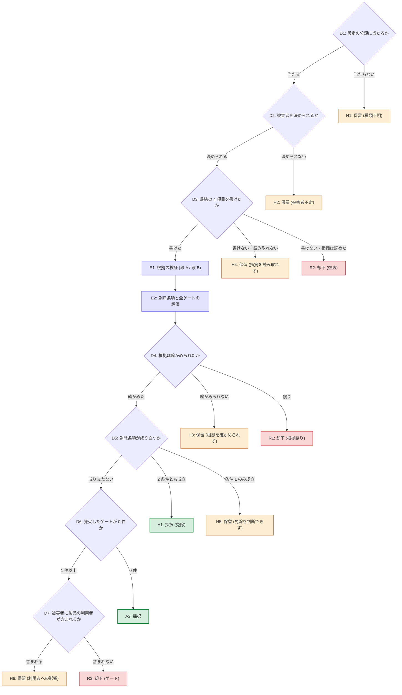

# 判定フロー

**このファイルが判定フローの正本。** 役割の分担 (owning) は次のとおり。

- **図 (mermaid) が、ノードと遷移の正本。** 順序と分岐はここだけが定める。
- **決定表が、各ノードの条件と書くものの正本。** 遷移先の列は持たない (行き先は図が正本)。図と表は同じ事実を二度語らない。
- **散文 (SKILL.md・references) はノード ID で参照し、順序・分岐・量化子を言い直さない。** 1 回目の試行では、散文が状態機械を言い直すたびに量化子がずれ、同種の指摘が続いた。
- 図のノード ID 集合と決定表の ID 集合は 1:1。同梱の `triagecheck` の `judgment-flow` 検査が照合する。

## 方針

- **評価と判定を分ける。** 評価 (E1・E2) の結果はすべて記録に残し、判定は図の分岐だけで決まる。同じ評価結果から違う判定が出ないようにするため。
- **D1〜D3 で決着した指摘には、E1・E2 を行わない。** 空虚な指摘に段 B (sub-agent) やゲート評価のコストを払わないため。ただし D3 の帰結の 4 項目は**全件に書く** — D1・D2 で決着した指摘にも、後から判断を検証する材料として残す。
- **D4 以降で決着した指摘には、E1・E2 の結果がすべて記録に残る。** 判定が D4 (根拠) で決まっても、ゲートの評価結果は捨てない — どのゲートが効いているかは記録の蓄積でしか見えないため。
- **境界上は保留に倒す。** 決められないときの行き先は必ず保留 (H1〜H6)。却下ゲートは仮説であり、誤った却下は気づかれないまま残るため、判断できないまま却下へ流さない。

## 図 (ノードと遷移の正本)

## 決定表 (各ノードの条件と書くものの正本)

| ID | 種類 | 条件・内容 | 記録に書くもの |
| --- | --- | --- | --- |
| D1 | 判定 | 指摘の対象パスが設定 (`.claude/review-triage.yaml`) のいずれかの分類に当たるか。読み込み自体の 3 値 (OK / 対象外 / 読めない) は [config-schema.md](config-schema.md) — 「読めない」は判定を始めない (このノードに入らない) | パスから決まった分類 (`category`) |
| D2 | 判定 | 指摘の内容から被害者が分類の `audience` と同じか違うかを決められるか。上書きは「より要求水準の高い被害者へ」(開発者 → 利用者) の向きにのみ行う ([config-schema.md](config-schema.md) の上書き規則) | 初期値 (`audience_initial`) と最終値 (`audience`) |
| D3 | 判定 | 帰結の 4 項目 — 条件 (どんな状況で起きるか) / 誰に (誰が困るか) / 何が (何が起きるか) / 気づけるか (どの関門が失敗するか・運用中に誰が困って気づくか・気づかない) — を具体的に書けたか。指摘文は「何が悪いか」を書くが、判断に要るのは「何が壊れるか」 — 書き下ろす過程そのものが空虚な指摘をふるいにかける | 帰結の 4 項目 (`consequence`。全件) |
| E1 | 評価 | 段 A (コードとの照合) を行い、段 B (仕様・設計との照合) に当たる指摘にはそれも行う。照合の仕方と 3 値の結果は [premise-check.md](premise-check.md) | 通した段 (`premise_check.stages`) と結果 (`premise_check.result`) |
| E2 | 評価 | 免除条項の 2 条件と、すべての却下ゲートを評価する。早期に打ち切らない。ゲートごとの定義・書くもの・免除条項は [rejection-gates.md](rejection-gates.md) | 発火したゲート (`gates_fired`。すべて) と、各ゲート・免除条項で書かせたもの |
| D4 | 判定 | E1 の結果が verified (確かめられた) か、wrong (誤り) か、unverifiable (確かめられなかった) か | — (E1 の記録を使う) |
| D5 | 判定 | E2 で評価した免除条項の 2 条件がともに成立するか。条件 1 (検出能力の欠落・消失の主張) だけが成立し条件 2 の理由を書けない場合は判断できない扱い | — (E2 の記録を使う) |
| D6 | 判定 | E2 で発火したゲートが 0 件か | — (E2 の記録を使う) |
| D7 | 判定 | 最終の被害者 (D2 の結果) に製品の利用者 (オペレータ / 管理者 / プロバイダ) が含まれるか。複数の被害者がいる場合、1 人でも利用者が含まれれば「含まれる」 | — (D2 の記録を使う) |
| A1 | 決着 | 採択 (免除条項による)。他のゲートに引っかかっていても却下しない | `verdict: adopted`。`verdict_reason` に A1 と免除の根拠 |
| A2 | 決着 | 採択 | `verdict: adopted`。`verdict_reason` に A2 |
| H1 | 決着 | 保留 — どの分類にも当たらず種類不明。`category: unknown` にする | `verdict: held`。`verdict_reason` に H1 とどのパターンを試したか |
| H2 | 決着 | 保留 — 被害者が分類と同じか違うか決められない | `verdict: held`。`verdict_reason` に H2 と決められなかった理由 |
| H3 | 決着 | 保留 — 根拠を確かめられなかった (E1 が unverifiable) | `verdict: held`。`verdict_reason` に H3 と何を調べて分からなかったか |
| H4 | 決着 | 保留 — 指摘の文そのものを読み取れず、帰結を書けない。空虚 (R2) と混同しない — 区別の基準は R2 の行 | `verdict: held`。`verdict_reason` に H4 とどこが読み取れないか |
| H5 | 決着 | 保留 — 免除の条件 1 が成立するのに条件 2 の理由を書けない。検出能力が失われる種類の欠陥は最も見逃してはならないので、判断できないまま先へ流さない | `verdict: held`。`verdict_reason` に H5 と挙げた関門の候補 |
| H6 | 決着 | 保留 — ゲートに引っかかったが、被害者に製品の利用者が含まれる。誤った却下が製品に残るため人間に判断を渡す。提示の形は [hold-presentation.md](hold-presentation.md) | `verdict: held`。`verdict_reason` に H6。発火したゲートと衝突の内容を添える |
| R1 | 決着 | 却下 — 根拠が誤っている (E1 が wrong)。「直す意味がない」ではなく「そもそも成り立たない」 | `verdict: rejected`。`verdict_reason` に R1 と出所・実際の記述 |
| R2 | 決着 | 却下 — 空虚 (帰結を具体的に書けない)。指摘を読めたのに書けない場合に限る。読めたことを示すために「指摘をどう読んだか」を書く — 書けなければ読めていないので H4 | `verdict: rejected`。`verdict_reason` に R2 と指摘をどう読んだか |
| R3 | 決着 | 却下 — ゲートに引っかかり、被害者が開発者・CI だけ。誤って却下しても開発者が調べて対処できる | `verdict: rejected`。`verdict_reason` に R3 と発火したゲート名 (すべて) |
